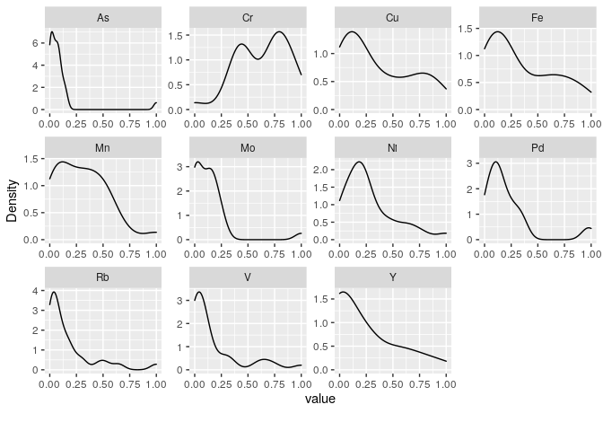
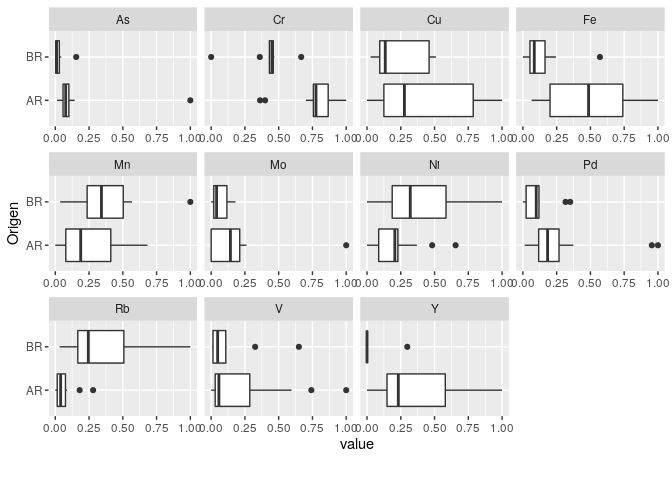
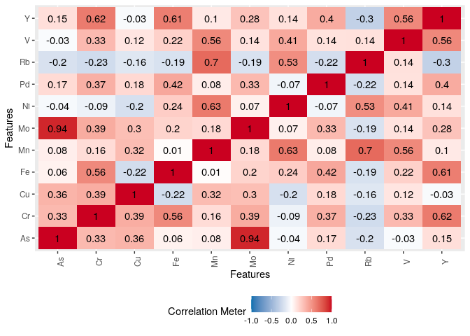
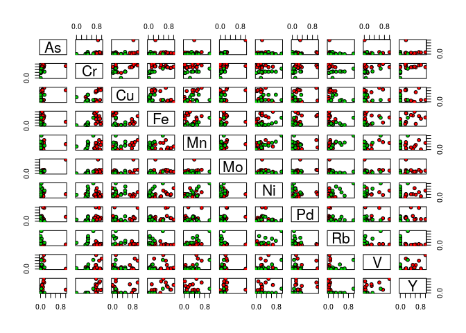
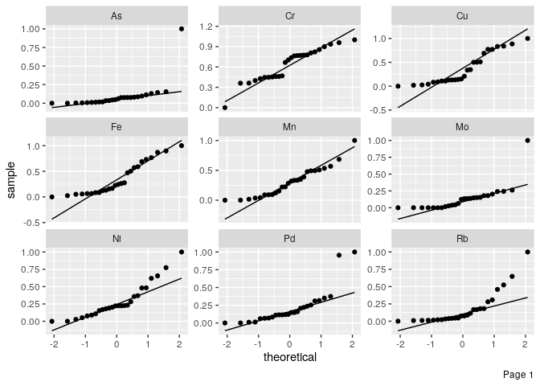
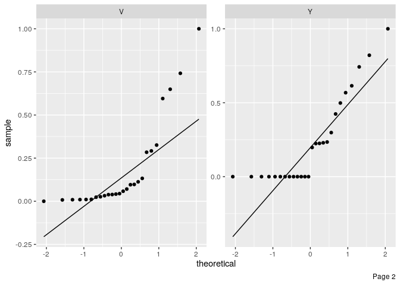
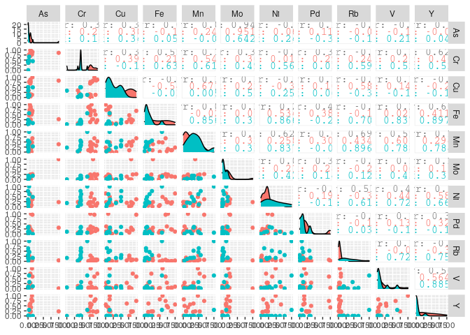
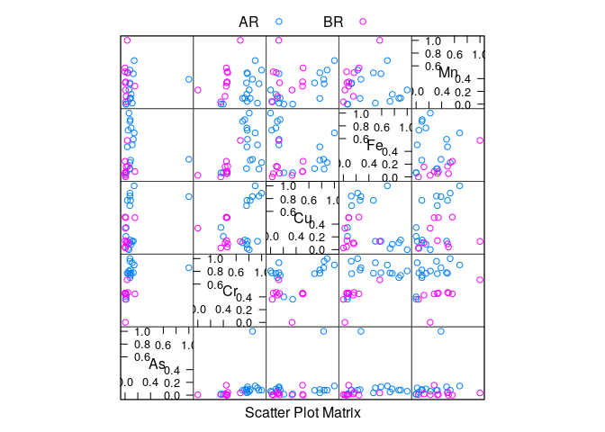
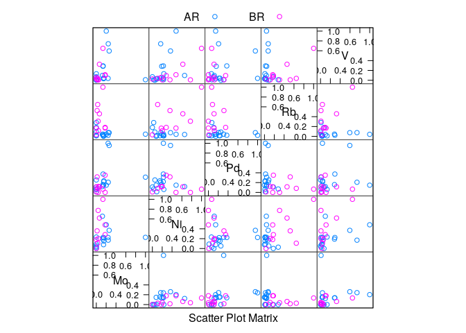

Análisis exploratorio de los datos
================
Ana Laura Diedrichs & Brenda Canizo
10 de setiembre 2019

## Distribución de las variables

### Intro al dataset

El dataset de jugos de uva posee 26 muestras etiquetadas según origen
sea Brasil o Argentina como AR, BR. Las variables, columnas, son
elementos de la tabla períodica, correspondiendo con un análisis
multielemental, representando concentraciones. Las variables son As, Cr,
Cu, Fe, Mn, Mo, Ni, Pd, Rb, V, Y

Un breve resumen introductorio del
    dataset

    ## Warning in kable_pipe(x = structure(c("rows", "columns", "discrete_columns", :
    ## The table should have a header (column names)

|                        |      |
| :--------------------- | ---: |
| rows                   |   26 |
| columns                |   12 |
| discrete\_columns      |    1 |
| continuous\_columns    |   11 |
| all\_missing\_columns  |    0 |
| total\_missing\_values |    0 |
| complete\_rows         |   26 |
| total\_observations    |  312 |
| memory\_usage          | 5880 |

Observamos la distribución de las muestras según el Origen.

| Origen |  n |
| :----- | -: |
| AR     | 16 |
| BR     | 10 |

### Distribución de las concentraciones por Origen

La densidad o distribución de las concentraciones de los elementos del
dataset puede visualizarse a
    continuación

    ## Warning in facet_wrap(facet = ~variable, nrow = 4L, ncol = 4L, scales = "free"):
    ## partial argument match of 'facet' to 'facets'

<!-- -->

Mostramos la distribución según el
    origen:

    ## Warning in facet_wrap(facet = ~variable, nrow = 3L, ncol = 4L, scales =
    ## "free_x"): partial argument match of 'facet' to 'facets'

<!-- -->

Observamos una diferencia muy notable en la mediana de las distribución
de ciertos elementos respecto a su Origen: Fe, Rb, Pd, Y

Podrían ser variables de interés para clasificar por Origen.

## Correlaciones lineales

<!-- -->

Observamos una fuerte correlación lineal positiva entre Mo y As, es
decir, al aumentar la concentración de uno aumenta la de otro.

## Plot de a pares o feature plot

<!-- -->

# Anexo

Info no analizada o plots
    extras

## QQ plot

    ## Warning in facet_wrap(facet = ~variable, nrow = 3L, ncol = 3L, scales =
    ## "free_y"): partial argument match of 'facet' to 'facets'
    
    ## Warning in facet_wrap(facet = ~variable, nrow = 3L, ncol = 3L, scales =
    ## "free_y"): partial argument match of 'facet' to 'facets'

<!-- --><!-- -->
\#\# Pairs plot

    ## Loading required package: ggplot2

    ## Registered S3 method overwritten by 'GGally':
    ##   method from   
    ##   +.gg   ggplot2

    ## 
    ## Attaching package: 'GGally'

    ## The following object is masked _by_ '.GlobalEnv':
    ## 
    ##     range01

<!-- -->

    ## Loading required package: lattice

<!-- -->
<!-- -->
