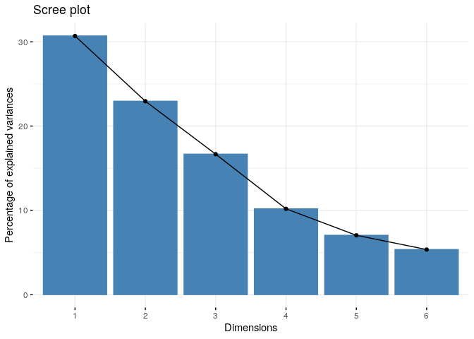
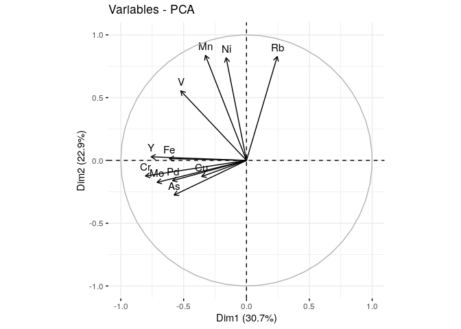
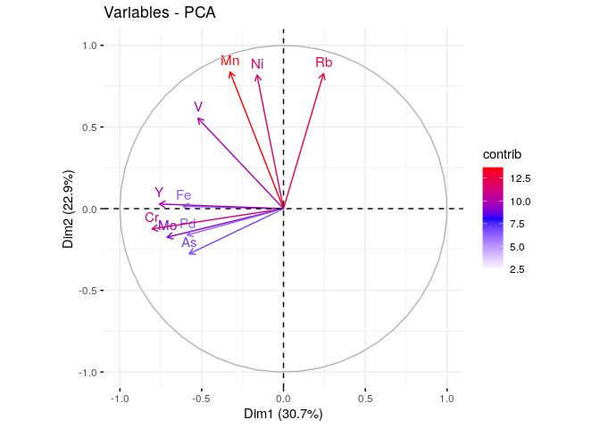
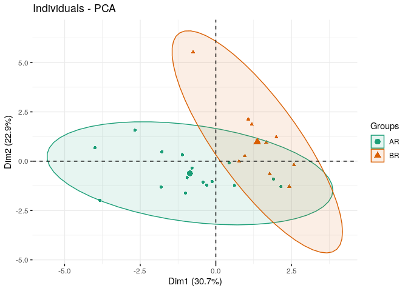
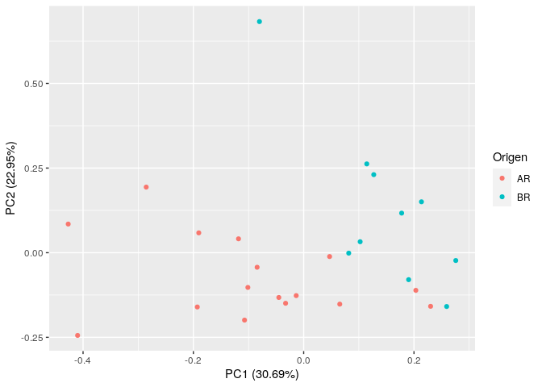
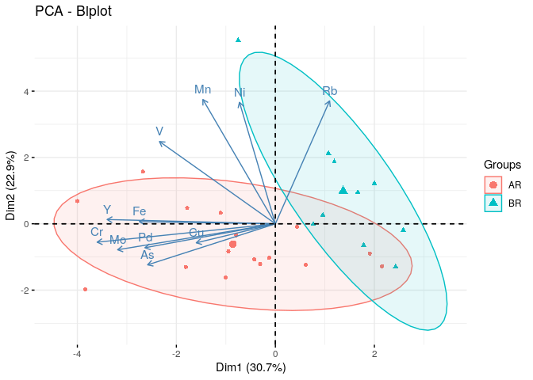
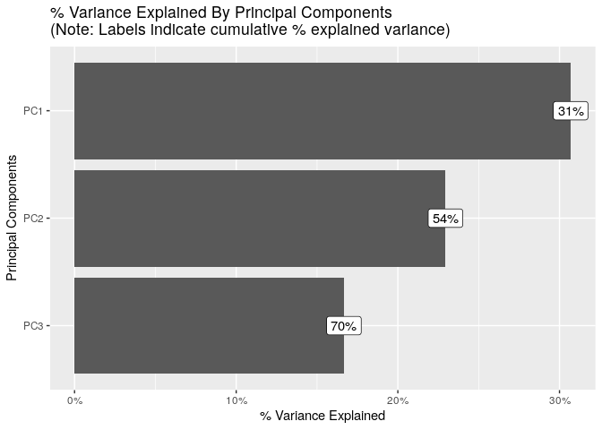
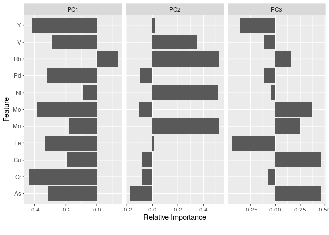

PCA análisis
================
Ana Laura Diedrichs & Brenda Canizo
May 22, 2019

## PCA

``` r
source("../loadData.R")
```

    ## 
    ## Attaching package: 'dplyr'

    ## The following objects are masked from 'package:stats':
    ## 
    ##     filter, lag

    ## The following objects are masked from 'package:base':
    ## 
    ##     intersect, setdiff, setequal, union

``` r
dataset <- load_dataset()
```

``` r
pca.model <- prcomp(dataset[-1],scale. = TRUE)
#' Valores regresados por la funcion prcomp()
names(pca.model)
```

    ## [1] "sdev"     "rotation" "center"   "scale"    "x"

``` r
#' sdev : es la desviación estándar de los componenest principales
#'  (las raíces cuadradas de los eigenvalues (valores propios))
head(pca.model$sdev)
```

    ## [1] 1.8373644 1.5887753 1.3539378 1.0581973 0.8798264 0.7670845

``` r
#' rotación: la matriz de variables "loadings", columnas que son vectores propios (eigenvectors)
head(unclass(pca.model$rotation)[, 1:4])
```

    ##           PC1          PC2         PC3        PC4
    ## As -0.3136126 -0.173842644  0.45836163 -0.3954683
    ## Cr -0.4374922 -0.077977773 -0.07540085  0.2495729
    ## Cu -0.1941217 -0.080583088  0.46148249  0.5738349
    ## Fe -0.3338591  0.009103031 -0.43910956 -0.2412452
    ## Mn -0.1778904  0.526454866  0.24583931  0.1560290
    ## Mo -0.3872320 -0.109955562  0.37158183 -0.3993106

``` r
#' en center y scale se guardan los valores de media y desviación que normalizaron los datos
#' 
print(pca.model$center)
```

    ##         As         Cr         Cu         Fe         Mn         Mo         Ni 
    ## 0.09265494 0.63520496 0.35956724 0.34998404 0.30196483 0.13372991 0.28468516 
    ##         Pd         Rb          V          Y 
    ## 0.21367415 0.17534119 0.18260625 0.23368625

``` r
print(pca.model$scale)
```

    ##        As        Cr        Cu        Fe        Mn        Mo        Ni        Pd 
    ## 0.1906812 0.2419892 0.3259324 0.3154716 0.2461432 0.1971948 0.2497944 0.2489386 
    ##        Rb         V         Y 
    ## 0.2400843 0.2682395 0.3012919

``` r
#' Para ver con detalle coordenadas, coseno cuadrado y contribuciones
get_pca_ind(pca.model)
```

    ## Principal Component Analysis Results for individuals
    ##  ===================================================
    ##   Name       Description                       
    ## 1 "$coord"   "Coordinates for the individuals" 
    ## 2 "$cos2"    "Cos2 for the individuals"        
    ## 3 "$contrib" "contributions of the individuals"

``` r
#' Por ejemplo para acceder al cos2 de los individuos usar ´get_pca_ind(pca.model)$cos2´
#' Eigenvalues y varianza
summary(pca.model)
```

    ## Importance of components:
    ##                           PC1    PC2    PC3    PC4     PC5     PC6    PC7
    ## Standard deviation     1.8374 1.5888 1.3539 1.0582 0.87983 0.76708 0.6142
    ## Proportion of Variance 0.3069 0.2295 0.1666 0.1018 0.07037 0.05349 0.0343
    ## Cumulative Proportion  0.3069 0.5364 0.7030 0.8048 0.87519 0.92869 0.9630
    ##                           PC8     PC9    PC10    PC11
    ## Standard deviation     0.4560 0.35861 0.22453 0.14216
    ## Proportion of Variance 0.0189 0.01169 0.00458 0.00184
    ## Cumulative Proportion  0.9819 0.99358 0.99816 1.00000

``` r
fviz_screeplot(pca.model, ncp=6)
```

<!-- -->

``` r
fviz_pca_var(pca.model)
```

    ## Warning in seq.default(-pi, pi, length = 50): partial argument match of 'length'
    ## to 'length.out'

    ## Warning in seq.default(pi, -pi, length = 50): partial argument match of 'length'
    ## to 'length.out'

<!-- -->

``` r
fviz_pca_var(pca.model, col.var = "contrib", 
             gradient.cols = c("white", "blue", "red"),
             ggtheme = theme_minimal())
```

    ## Warning in seq.default(-pi, pi, length = 50): partial argument match of 'length'
    ## to 'length.out'

    ## Warning in seq.default(pi, -pi, length = 50): partial argument match of 'length'
    ## to 'length.out'

<!-- -->

``` r
fviz_pca_ind(pca.model, label="none", habillage=dataset$Origen,
             addEllipses=TRUE, ellipse.level=0.95, palette = "Dark2")
```

<!-- -->

``` r
autoplot(pca.model,data=dataset,colour = 'Origen')
```

    ## Warning: `select_()` is deprecated as of dplyr 0.7.0.
    ## Please use `select()` instead.
    ## This warning is displayed once every 8 hours.
    ## Call `lifecycle::last_warnings()` to see where this warning was generated.

<!-- -->

``` r
#' ## Biplot de individuos y variables
#' 
fviz_pca_biplot(pca.model, label = "var", habillage=dataset$Origen,
                addEllipses=TRUE, ellipse.level=0.85,
                ggtheme = theme_minimal())
```

<!-- -->

``` r
plot_prcomp(dataset[-1])
```

    ## Warning in facet_wrap(facet = ~variable, nrow = 3L, ncol = 3L, scales =
    ## "free_x"): partial argument match of 'facet' to 'facets'

<!-- --><!-- -->
