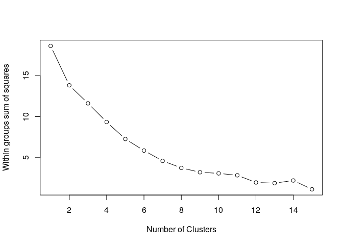
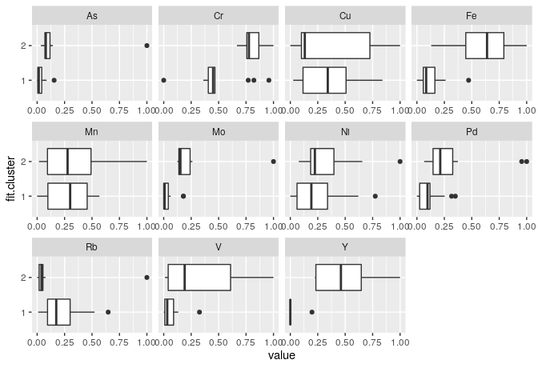
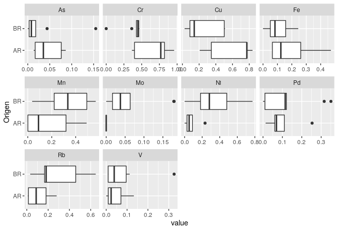
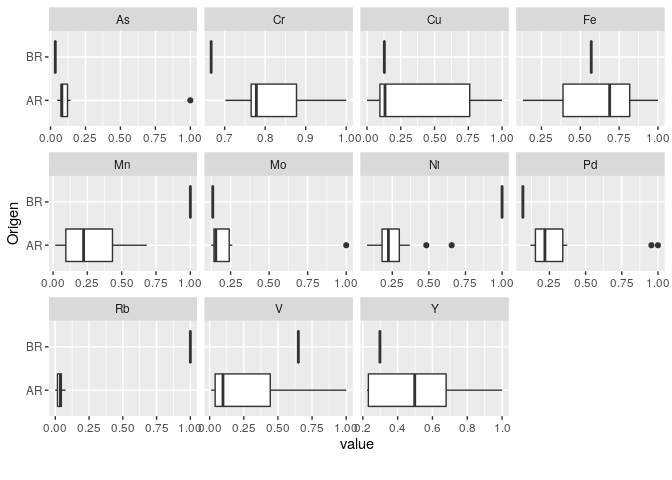
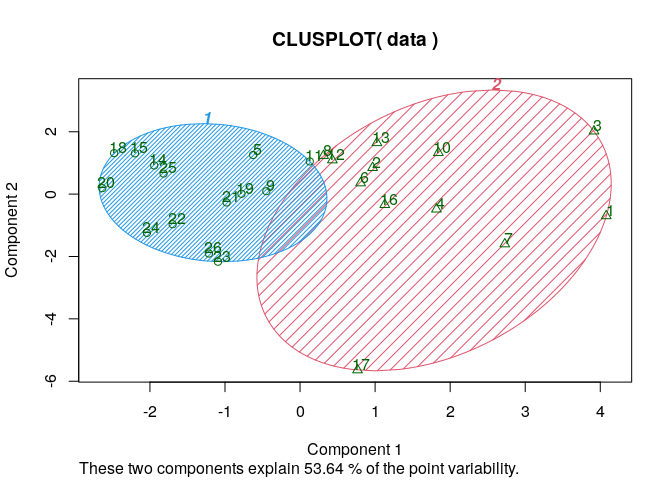
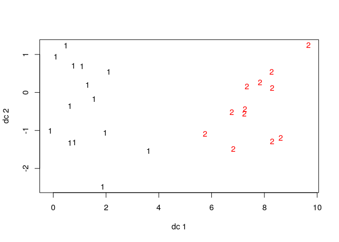
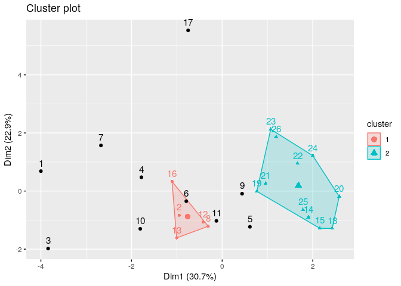

Clustering
================
Ana Laura Diedrichs
24 de julio 2020

# Clustering intro

Vamos a aplicar un enfoque no supervisado sobre los datos mediante
agrupamiento, sin considerar la etiqueta Origen o variable de clase. Sí
usaremos la misma para relacionar y analizar el agrupamiento obtenido.

Primero usaremos k-means. Previo al uso de este algoritmo, los datos no
deben tener valores NULOS o perdidos y son escalados entre 0 y 1.

En el siguiente gráfico muestra como la suma del cuadrado de las
distancias intra-cluster disminuye a medida que se agrega un cluster
(aumenta k) en kmeans. Computamos el WSS para distintos números de
clusteres para k-means para entender como disminuye el total
within-cluster sum of square (WSS) a medida que se incrementan los
clústeres.

<!-- -->

Observamos que de un k=1 a un k=2 disminuye en un tercio el WSS.

## K-means

Nuestra pregunta es, ¿se agrupan “naturalmente” las muestras por su
origen? ¿hay outliers? ¿Hay muestras de Brasil que son parecidas a las
de Argentina, viceversa?

Aplicamos k-means clustering considerando \(k=2\), ya que tenemos sólo
dos etiquetas AR y BR.

    ## K-means clustering with 2 clusters of sizes 14, 12
    ## 
    ## Cluster means:
    ##           As        Cr        Cu        Fe        Mn         Mo        Ni
    ## 1 0.03378502 0.4879126 0.3708015 0.1324382 0.2724105 0.03910001 0.2433967
    ## 2 0.16133652 0.8070460 0.3464606 0.6037875 0.3364449 0.24413145 0.3328550
    ##          Pd        Rb         V          Y
    ## 1 0.1154573 0.2266389 0.0656710 0.01409687
    ## 2 0.3282605 0.1154939 0.3190307 0.48987387
    ## 
    ## Clustering vector:
    ##  [1] 2 2 2 2 1 2 2 2 1 2 1 2 2 1 1 2 2 1 1 1 1 1 1 1 1 1
    ## 
    ## Within cluster sum of squares by cluster:
    ## [1] 4.088003 9.731750
    ##  (between_SS / total_SS =  25.8 %)
    ## 
    ## Available components:
    ## 
    ## [1] "cluster"      "centers"      "totss"        "withinss"     "tot.withinss"
    ## [6] "betweenss"    "size"         "iter"         "ifault"

Valores medios de cada variable en cada
    cluster

    ##   Group.1         As        Cr        Cu        Fe        Mn         Mo
    ## 1       1 0.03378502 0.4879126 0.3708015 0.1324382 0.2724105 0.03910001
    ## 2       2 0.16133652 0.8070460 0.3464606 0.6037875 0.3364449 0.24413145
    ##          Ni        Pd        Rb         V          Y
    ## 1 0.2433967 0.1154573 0.2266389 0.0656710 0.01409687
    ## 2 0.3328550 0.3282605 0.1154939 0.3190307 0.48987387

En la siguiente tabla observamos la distribución de observaciones entre
los dos clústeres, según el origen

    ##    
    ##     AR BR
    ##   1  5  9
    ##   2 11  1

Observamos que para el clúster “2” han sido asignadas la mayoría de las
muestras de Argentina, unas 11 en total y tan solo 1 de Brasil.

### Análisis o visualización de clústers, k=2

Comparamos en la siguiente tabla la agrupación de elementos en sus
clúster 1 o 2 vs su etiqueta Origen

    ##    
    ##     AR BR
    ##   1  5  9
    ##   2 11  1

Observamos que en el clúster 2 la mayoría de las observaciones son de
Argentina, excepto 1 es de Brasil. Considerar esto al analizar los
histogramas.

A continuación mostramos la distribución (histograma) de las muestras
que fueron agrupadas para el clúster 1 y para el
    2.

    ## Warning in facet_wrap(facet = ~variable, nrow = 3L, ncol = 4L, scales =
    ## "free_x"): partial argument match of 'facet' to 'facets'

<!-- -->

De acuerdo al diagrama de cajas de arriba observamos como k-means agrupó
los dos clústeres. El clúster 2, por ejemplo, tiene más concentraciones
en promedio de Y, Pd, Fe, Mo. Recordemos que el clúster 2 la mayoría de
las observaciones o muestras son de Argentina. **¿Qué características
podemos extraer de esto?**

Ahora observaremos la distribución dentro de cada clúster y según su
origen.

*Cluster
    1*

    ## Warning in facet_wrap(facet = ~variable, nrow = 3L, ncol = 4L, scales =
    ## "free_x"): partial argument match of 'facet' to 'facets'

<!-- -->

*Cluster
    2*

    ## Warning in facet_wrap(facet = ~variable, nrow = 3L, ncol = 4L, scales =
    ## "free_x"): partial argument match of 'facet' to 'facets'

<!-- -->

Para graficar las observaciones agrupadas en los clusteres, dado que
tenemos más de dos dimensiones, se nos complica graficar mas bien
visualizar en dos ejes. Usamos la libreria cluster que reduce las
dimensiones y permite graficar los
    clústeres.

    ## Warning in seq.default(-sqrt(yl2), sqrt(yl2), length = n.half): partial argument
    ## match of 'length' to 'length.out'
    
    ## Warning in seq.default(-sqrt(yl2), sqrt(yl2), length = n.half): partial argument
    ## match of 'length' to 'length.out'

    ## Warning in rep(col.p, length = n): partial argument match of 'length' to
    ## 'length.out'

<!-- --><!-- -->

Comparamos estadisticas de cluster con k=2

    ## $n
    ## [1] 26
    ## 
    ## $cluster.number
    ## [1] 2
    ## 
    ## $cluster.size
    ## [1] 14 12
    ## 
    ## $min.cluster.size
    ## [1] 12
    ## 
    ## $noisen
    ## [1] 0
    ## 
    ## $diameter
    ## [1] 1.209488 2.157721
    ## 
    ## $average.distance
    ## [1] 0.759128 1.262852
    ## 
    ## $median.distance
    ## [1] 0.7632249 1.3349199
    ## 
    ## $separation
    ## [1] 0.6032057 0.6032057
    ## 
    ## $average.toother
    ## [1] 1.326817 1.326817
    ## 
    ## $separation.matrix
    ##           [,1]      [,2]
    ## [1,] 0.0000000 0.6032057
    ## [2,] 0.6032057 0.0000000
    ## 
    ## $ave.between.matrix
    ##          [,1]     [,2]
    ## [1,] 0.000000 1.326817
    ## [2,] 1.326817 0.000000
    ## 
    ## $average.between
    ## [1] 1.326817
    ## 
    ## $average.within
    ## [1] 0.9916162
    ## 
    ## $n.between
    ## [1] 168
    ## 
    ## $n.within
    ## [1] 157
    ## 
    ## $max.diameter
    ## [1] 2.157721
    ## 
    ## $min.separation
    ## [1] 0.6032057
    ## 
    ## $within.cluster.ss
    ## [1] 13.81975
    ## 
    ## $clus.avg.silwidths
    ##          1          2 
    ## 0.42580669 0.04358206 
    ## 
    ## $avg.silwidth
    ## [1] 0.2493953
    ## 
    ## $g2
    ## NULL
    ## 
    ## $g3
    ## NULL
    ## 
    ## $pearsongamma
    ## [1] 0.4502835
    ## 
    ## $dunn
    ## [1] 0.2795568
    ## 
    ## $dunn2
    ## [1] 1.050651
    ## 
    ## $entropy
    ## [1] 0.6901857
    ## 
    ## $wb.ratio
    ## [1] 0.7473646
    ## 
    ## $ch
    ## [1] 8.339883
    ## 
    ## $cwidegap
    ## [1] 0.6910277 1.4524109
    ## 
    ## $widestgap
    ## [1] 1.452411
    ## 
    ## $sindex
    ## [1] 0.6032057
    ## 
    ## $corrected.rand
    ## NULL
    ## 
    ## $vi
    ## NULL

## Density-based spatial clustering of applications with noise (DBSCAN )

El comportamiento de DBSCAN es muy sensible al cambio en los valores eps
(radio desde el centro) y MinPts (cantidad de puntos mínima del
    cluster)

    ## Warning in seq.default(along = ap): partial argument match of 'along' to
    ## 'along.with'
    
    ## Warning in seq.default(along = ap): partial argument match of 'along' to
    ## 'along.with'
    
    ## Warning in seq.default(along = ap): partial argument match of 'along' to
    ## 'along.with'
    
    ## Warning in seq.default(along = ap): partial argument match of 'along' to
    ## 'along.with'

    ## Warning in prcomp.default(data, scale = FALSE, center = FALSE): partial argument
    ## match of 'scale' to 'scale.'

<!-- --> Las
observaciones o muestras 1,3,4,7,10, por ejemplo, las toma como outliers
o valores extremos. Notamos que hay varios de ellos para la
configuración eps=0.65 y minPts=5.

En la siguiente tabla se muestra como 0 las observaciones que consideró
outliers vs su clasificación de origen inicial.

    ##    
    ##     AR BR
    ##   0  9  1
    ##   1  5  0
    ##   2  2  9

Las observaciones etiquetadas como cero (0) son los outliers.

## Conclusiones

  - Se observan algunas variables que pueden ser buenas para clasificar
    en origen, dado este dataset como Cr.
  - Son pocas muestras (26) por lo que no nos animamos a realizar
    conclusiones globales
  - Se observa en ambos algoritmos que al menos uno de los grupos
    contiene solo observaciones de Argentina
  - Tanto DBSCAN como kmeans se ven afectados por la variabilidad de las
    mediciones / valores extremos. En k-means el cluster 2 incluyó las
    observaciones que tuvieron más concentración de determinados
    elementos.
  - Ninguno de los grupos es fácilmente identificable, excepto la
    observación peculiar del caso k-means k=2 donde agrupó la mayoría de
    las observaciones de Argentina en uno de los clusters.
