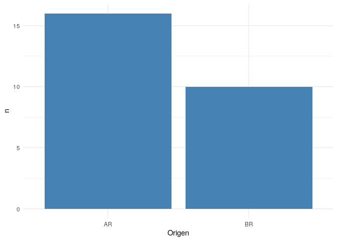
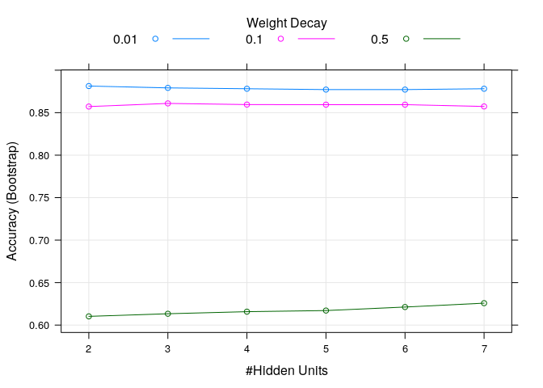
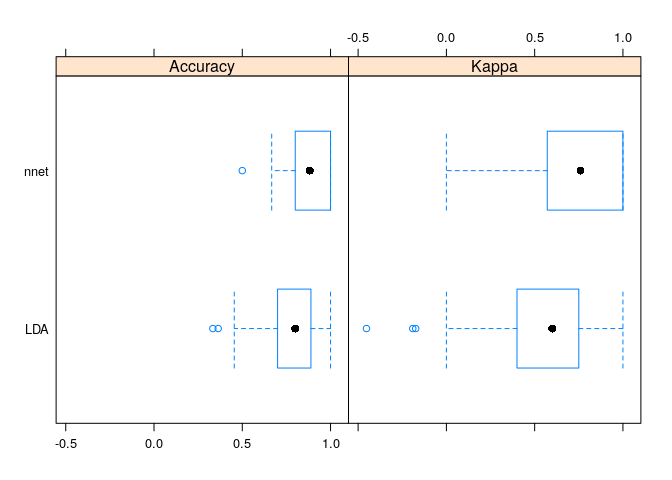
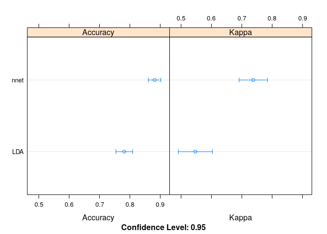
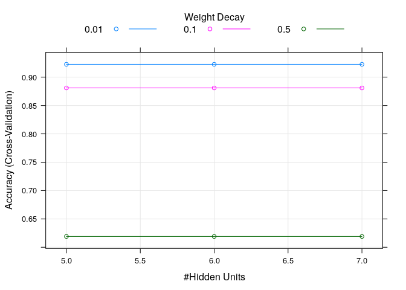
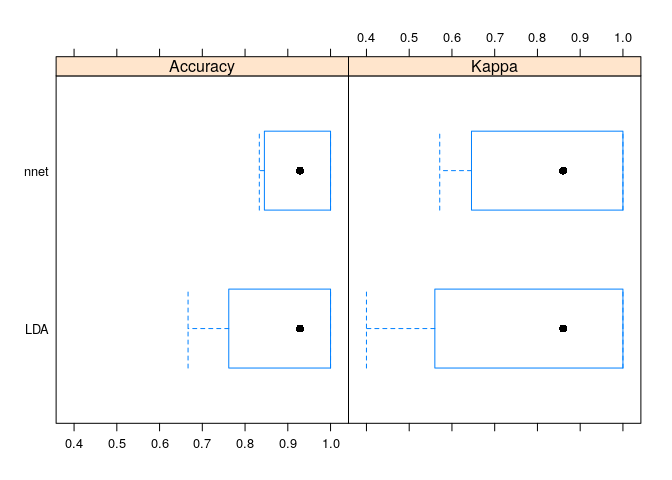
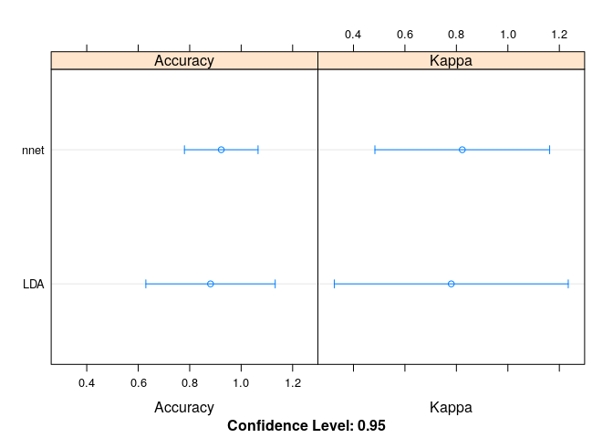
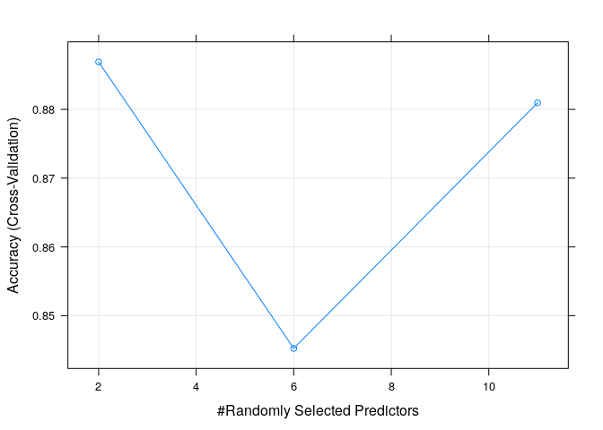
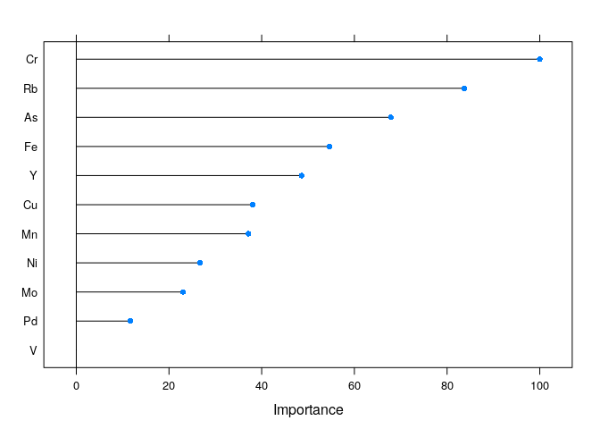

clasificacion
================
Ana Diedrichs
May 22, 2019

# Datos

Este dataset tiene 12 variables en total, contando la variable de clase
llamada Origen. El dataset consta de 26 datapoints o muestras
clasificadas en 2 clases etiquetadas como AR, BR

En el siguiente cuadro y gráfico observamos como se distribuyen las
muestras según su origen. Notamos que el dataset está desbalanceado,
pues no hay la misma cantidad de datapoints para cada
    clase.

    ## `summarise()` ungrouping output (override with `.groups` argument)

| Origen |  n |
| :----- | -: |
| AR     | 16 |
| BR     | 10 |

Tabla que muestra distribución de datapoints por clase

<!-- -->

# Machine learning: experimentos

Dado que son pocas las muestras que tenemos, para realizar nuestro
entrenamiento de los modelos un enfoque de *data split* no sería bueno,
ya que dividir los datos en conjunto de entrenamiento y testeo y
simplemente validar con esto, no nos estaría brindando resultados muy
representativos. Por eso es necesario usar otros enfoques.

Uno de ellos es bootstrapping, también usado cuando se tienen pocas
muestras.

Otro desafío es que no sólo son pocas muestras, sino que el dataset está
desbalanceado, es decir, hay más muestras etiquetadas como argentina que
muestras etiquetadas como Brasil. Por esto procederemos a balancer el
dataset como primer paso a los experimentos.

## SMOTE

Synthetic minority sampling technique (SMOTE): down samples the majority
class and synthesizes new minority instances by interpolating between
existing ones

``` r
library(DMwR)
```

    ## Loading required package: lattice

    ## Loading required package: grid

    ## Registered S3 method overwritten by 'quantmod':
    ##   method            from
    ##   as.zoo.data.frame zoo

``` r
set.seed(9560)
d <- data[-1]
d$Origen <- as.factor(data$Origen)
smote_train <- SMOTE(Origen ~ ., d, perc.over = 50,perc.under = 300,k=8)                         
table(smote_train$Origen) 
```

    ## 
    ## AR BR 
    ## 15 15

``` r
table(data$Origen)
```

    ## 
    ## AR BR 
    ## 16 10

TODO Plot de datos generados por SMOTE TODO

TODO Hacer experimentos con esos datos: smote y sin smote, ver
resultados

TODO Bootstrapping: ver reproducibilidad de los resultados

TODO Bootstrapping, ver este enfoque
<http://www.is.uni-freiburg.de/ressourcen/business-analytics/11_Resampling.pdf>
para mostrar intervalos de confianza

## Bootstrapping

Usamos bootstrapping o muestreo aleatorio con reemplazo (Ver
<https://en.wikipedia.org/wiki/Bootstrapping_(statistics)>) como forma
de entrenamiento.

Los modelos que entrenamos son: LDA (linear discriminant analysis) y
redes neuronales.

### LDA

``` r
library(caret)
```

    ## 
    ## Attaching package: 'caret'

    ## The following object is masked from 'package:purrr':
    ## 
    ##     lift

``` r
x = data[,-1] # quito columna Origen
y = data$Origen

METRIC <- "Accuracy" #
train_control <- trainControl(method="boot", number=100)
SEED <- 1234 # seed semilla para números aleatorios
set.seed(SEED)
model.lda.boot <- train(as.factor(Origen)~., data=data, 
                  trControl=train_control, method="lda",metric=METRIC)
```

    ## Warning in stats::model.frame(form = as.factor(Origen) ~ ., data = data, :
    ## partial argument match of 'form' to 'formula'

    ## Warning in model.frame.default(form = as.factor(Origen) ~ ., data = data, :
    ## partial argument match of 'form' to 'formula'

    ## Warning in seq.default(along = pkg): partial argument match of 'along' to
    ## 'along.with'

    ## Warning in seq.default(along = models$library): partial argument match of
    ## 'along' to 'along.with'

    ## Warning in seq.default(along = data): partial argument match of 'along' to
    ## 'along.with'
    
    ## Warning in seq.default(along = data): partial argument match of 'along' to
    ## 'along.with'
    
    ## Warning in seq.default(along = data): partial argument match of 'along' to
    ## 'along.with'
    
    ## Warning in seq.default(along = data): partial argument match of 'along' to
    ## 'along.with'
    
    ## Warning in seq.default(along = data): partial argument match of 'along' to
    ## 'along.with'
    
    ## Warning in seq.default(along = data): partial argument match of 'along' to
    ## 'along.with'
    
    ## Warning in seq.default(along = data): partial argument match of 'along' to
    ## 'along.with'
    
    ## Warning in seq.default(along = data): partial argument match of 'along' to
    ## 'along.with'
    
    ## Warning in seq.default(along = data): partial argument match of 'along' to
    ## 'along.with'
    
    ## Warning in seq.default(along = data): partial argument match of 'along' to
    ## 'along.with'
    
    ## Warning in seq.default(along = data): partial argument match of 'along' to
    ## 'along.with'
    
    ## Warning in seq.default(along = data): partial argument match of 'along' to
    ## 'along.with'
    
    ## Warning in seq.default(along = data): partial argument match of 'along' to
    ## 'along.with'
    
    ## Warning in seq.default(along = data): partial argument match of 'along' to
    ## 'along.with'
    
    ## Warning in seq.default(along = data): partial argument match of 'along' to
    ## 'along.with'
    
    ## Warning in seq.default(along = data): partial argument match of 'along' to
    ## 'along.with'
    
    ## Warning in seq.default(along = data): partial argument match of 'along' to
    ## 'along.with'
    
    ## Warning in seq.default(along = data): partial argument match of 'along' to
    ## 'along.with'
    
    ## Warning in seq.default(along = data): partial argument match of 'along' to
    ## 'along.with'
    
    ## Warning in seq.default(along = data): partial argument match of 'along' to
    ## 'along.with'
    
    ## Warning in seq.default(along = data): partial argument match of 'along' to
    ## 'along.with'
    
    ## Warning in seq.default(along = data): partial argument match of 'along' to
    ## 'along.with'
    
    ## Warning in seq.default(along = data): partial argument match of 'along' to
    ## 'along.with'
    
    ## Warning in seq.default(along = data): partial argument match of 'along' to
    ## 'along.with'
    
    ## Warning in seq.default(along = data): partial argument match of 'along' to
    ## 'along.with'
    
    ## Warning in seq.default(along = data): partial argument match of 'along' to
    ## 'along.with'
    
    ## Warning in seq.default(along = data): partial argument match of 'along' to
    ## 'along.with'
    
    ## Warning in seq.default(along = data): partial argument match of 'along' to
    ## 'along.with'
    
    ## Warning in seq.default(along = data): partial argument match of 'along' to
    ## 'along.with'
    
    ## Warning in seq.default(along = data): partial argument match of 'along' to
    ## 'along.with'
    
    ## Warning in seq.default(along = data): partial argument match of 'along' to
    ## 'along.with'
    
    ## Warning in seq.default(along = data): partial argument match of 'along' to
    ## 'along.with'
    
    ## Warning in seq.default(along = data): partial argument match of 'along' to
    ## 'along.with'
    
    ## Warning in seq.default(along = data): partial argument match of 'along' to
    ## 'along.with'
    
    ## Warning in seq.default(along = data): partial argument match of 'along' to
    ## 'along.with'
    
    ## Warning in seq.default(along = data): partial argument match of 'along' to
    ## 'along.with'
    
    ## Warning in seq.default(along = data): partial argument match of 'along' to
    ## 'along.with'
    
    ## Warning in seq.default(along = data): partial argument match of 'along' to
    ## 'along.with'
    
    ## Warning in seq.default(along = data): partial argument match of 'along' to
    ## 'along.with'
    
    ## Warning in seq.default(along = data): partial argument match of 'along' to
    ## 'along.with'
    
    ## Warning in seq.default(along = data): partial argument match of 'along' to
    ## 'along.with'
    
    ## Warning in seq.default(along = data): partial argument match of 'along' to
    ## 'along.with'
    
    ## Warning in seq.default(along = data): partial argument match of 'along' to
    ## 'along.with'
    
    ## Warning in seq.default(along = data): partial argument match of 'along' to
    ## 'along.with'
    
    ## Warning in seq.default(along = data): partial argument match of 'along' to
    ## 'along.with'
    
    ## Warning in seq.default(along = data): partial argument match of 'along' to
    ## 'along.with'
    
    ## Warning in seq.default(along = data): partial argument match of 'along' to
    ## 'along.with'
    
    ## Warning in seq.default(along = data): partial argument match of 'along' to
    ## 'along.with'
    
    ## Warning in seq.default(along = data): partial argument match of 'along' to
    ## 'along.with'
    
    ## Warning in seq.default(along = data): partial argument match of 'along' to
    ## 'along.with'
    
    ## Warning in seq.default(along = data): partial argument match of 'along' to
    ## 'along.with'
    
    ## Warning in seq.default(along = data): partial argument match of 'along' to
    ## 'along.with'
    
    ## Warning in seq.default(along = data): partial argument match of 'along' to
    ## 'along.with'
    
    ## Warning in seq.default(along = data): partial argument match of 'along' to
    ## 'along.with'
    
    ## Warning in seq.default(along = data): partial argument match of 'along' to
    ## 'along.with'
    
    ## Warning in seq.default(along = data): partial argument match of 'along' to
    ## 'along.with'
    
    ## Warning in seq.default(along = data): partial argument match of 'along' to
    ## 'along.with'
    
    ## Warning in seq.default(along = data): partial argument match of 'along' to
    ## 'along.with'
    
    ## Warning in seq.default(along = data): partial argument match of 'along' to
    ## 'along.with'
    
    ## Warning in seq.default(along = data): partial argument match of 'along' to
    ## 'along.with'
    
    ## Warning in seq.default(along = data): partial argument match of 'along' to
    ## 'along.with'
    
    ## Warning in seq.default(along = data): partial argument match of 'along' to
    ## 'along.with'
    
    ## Warning in seq.default(along = data): partial argument match of 'along' to
    ## 'along.with'
    
    ## Warning in seq.default(along = data): partial argument match of 'along' to
    ## 'along.with'
    
    ## Warning in seq.default(along = data): partial argument match of 'along' to
    ## 'along.with'
    
    ## Warning in seq.default(along = data): partial argument match of 'along' to
    ## 'along.with'
    
    ## Warning in seq.default(along = data): partial argument match of 'along' to
    ## 'along.with'
    
    ## Warning in seq.default(along = data): partial argument match of 'along' to
    ## 'along.with'
    
    ## Warning in seq.default(along = data): partial argument match of 'along' to
    ## 'along.with'
    
    ## Warning in seq.default(along = data): partial argument match of 'along' to
    ## 'along.with'
    
    ## Warning in seq.default(along = data): partial argument match of 'along' to
    ## 'along.with'
    
    ## Warning in seq.default(along = data): partial argument match of 'along' to
    ## 'along.with'
    
    ## Warning in seq.default(along = data): partial argument match of 'along' to
    ## 'along.with'
    
    ## Warning in seq.default(along = data): partial argument match of 'along' to
    ## 'along.with'
    
    ## Warning in seq.default(along = data): partial argument match of 'along' to
    ## 'along.with'
    
    ## Warning in seq.default(along = data): partial argument match of 'along' to
    ## 'along.with'
    
    ## Warning in seq.default(along = data): partial argument match of 'along' to
    ## 'along.with'
    
    ## Warning in seq.default(along = data): partial argument match of 'along' to
    ## 'along.with'
    
    ## Warning in seq.default(along = data): partial argument match of 'along' to
    ## 'along.with'
    
    ## Warning in seq.default(along = data): partial argument match of 'along' to
    ## 'along.with'
    
    ## Warning in seq.default(along = data): partial argument match of 'along' to
    ## 'along.with'
    
    ## Warning in seq.default(along = data): partial argument match of 'along' to
    ## 'along.with'
    
    ## Warning in seq.default(along = data): partial argument match of 'along' to
    ## 'along.with'
    
    ## Warning in seq.default(along = data): partial argument match of 'along' to
    ## 'along.with'
    
    ## Warning in seq.default(along = data): partial argument match of 'along' to
    ## 'along.with'
    
    ## Warning in seq.default(along = data): partial argument match of 'along' to
    ## 'along.with'
    
    ## Warning in seq.default(along = data): partial argument match of 'along' to
    ## 'along.with'
    
    ## Warning in seq.default(along = data): partial argument match of 'along' to
    ## 'along.with'
    
    ## Warning in seq.default(along = data): partial argument match of 'along' to
    ## 'along.with'
    
    ## Warning in seq.default(along = data): partial argument match of 'along' to
    ## 'along.with'
    
    ## Warning in seq.default(along = data): partial argument match of 'along' to
    ## 'along.with'
    
    ## Warning in seq.default(along = data): partial argument match of 'along' to
    ## 'along.with'
    
    ## Warning in seq.default(along = data): partial argument match of 'along' to
    ## 'along.with'
    
    ## Warning in seq.default(along = data): partial argument match of 'along' to
    ## 'along.with'
    
    ## Warning in seq.default(along = data): partial argument match of 'along' to
    ## 'along.with'
    
    ## Warning in seq.default(along = data): partial argument match of 'along' to
    ## 'along.with'
    
    ## Warning in seq.default(along = data): partial argument match of 'along' to
    ## 'along.with'
    
    ## Warning in seq.default(along = data): partial argument match of 'along' to
    ## 'along.with'
    
    ## Warning in seq.default(along = data): partial argument match of 'along' to
    ## 'along.with'
    
    ## Warning in seq.default(along = data): partial argument match of 'along' to
    ## 'along.with'

    ## Warning in seq.default(along = x): partial argument match of 'along' to
    ## 'along.with'

    ## Warning in seq.default(along = outcome): partial argument match of 'along' to
    ## 'along.with'

    ## Warning in seq.default(along = x): partial argument match of 'along' to
    ## 'along.with'

    ## Warning in seq.default(along = resampleIndex): partial argument match of 'along'
    ## to 'along.with'

    ## Warning in seq.default(along = cells): partial argument match of 'along' to
    ## 'along.with'
    
    ## Warning in seq.default(along = cells): partial argument match of 'along' to
    ## 'along.with'
    
    ## Warning in seq.default(along = cells): partial argument match of 'along' to
    ## 'along.with'
    
    ## Warning in seq.default(along = cells): partial argument match of 'along' to
    ## 'along.with'
    
    ## Warning in seq.default(along = cells): partial argument match of 'along' to
    ## 'along.with'
    
    ## Warning in seq.default(along = cells): partial argument match of 'along' to
    ## 'along.with'
    
    ## Warning in seq.default(along = cells): partial argument match of 'along' to
    ## 'along.with'
    
    ## Warning in seq.default(along = cells): partial argument match of 'along' to
    ## 'along.with'
    
    ## Warning in seq.default(along = cells): partial argument match of 'along' to
    ## 'along.with'
    
    ## Warning in seq.default(along = cells): partial argument match of 'along' to
    ## 'along.with'
    
    ## Warning in seq.default(along = cells): partial argument match of 'along' to
    ## 'along.with'
    
    ## Warning in seq.default(along = cells): partial argument match of 'along' to
    ## 'along.with'
    
    ## Warning in seq.default(along = cells): partial argument match of 'along' to
    ## 'along.with'
    
    ## Warning in seq.default(along = cells): partial argument match of 'along' to
    ## 'along.with'
    
    ## Warning in seq.default(along = cells): partial argument match of 'along' to
    ## 'along.with'
    
    ## Warning in seq.default(along = cells): partial argument match of 'along' to
    ## 'along.with'
    
    ## Warning in seq.default(along = cells): partial argument match of 'along' to
    ## 'along.with'
    
    ## Warning in seq.default(along = cells): partial argument match of 'along' to
    ## 'along.with'
    
    ## Warning in seq.default(along = cells): partial argument match of 'along' to
    ## 'along.with'
    
    ## Warning in seq.default(along = cells): partial argument match of 'along' to
    ## 'along.with'
    
    ## Warning in seq.default(along = cells): partial argument match of 'along' to
    ## 'along.with'
    
    ## Warning in seq.default(along = cells): partial argument match of 'along' to
    ## 'along.with'
    
    ## Warning in seq.default(along = cells): partial argument match of 'along' to
    ## 'along.with'
    
    ## Warning in seq.default(along = cells): partial argument match of 'along' to
    ## 'along.with'
    
    ## Warning in seq.default(along = cells): partial argument match of 'along' to
    ## 'along.with'
    
    ## Warning in seq.default(along = cells): partial argument match of 'along' to
    ## 'along.with'
    
    ## Warning in seq.default(along = cells): partial argument match of 'along' to
    ## 'along.with'
    
    ## Warning in seq.default(along = cells): partial argument match of 'along' to
    ## 'along.with'
    
    ## Warning in seq.default(along = cells): partial argument match of 'along' to
    ## 'along.with'
    
    ## Warning in seq.default(along = cells): partial argument match of 'along' to
    ## 'along.with'
    
    ## Warning in seq.default(along = cells): partial argument match of 'along' to
    ## 'along.with'
    
    ## Warning in seq.default(along = cells): partial argument match of 'along' to
    ## 'along.with'
    
    ## Warning in seq.default(along = cells): partial argument match of 'along' to
    ## 'along.with'
    
    ## Warning in seq.default(along = cells): partial argument match of 'along' to
    ## 'along.with'
    
    ## Warning in seq.default(along = cells): partial argument match of 'along' to
    ## 'along.with'
    
    ## Warning in seq.default(along = cells): partial argument match of 'along' to
    ## 'along.with'
    
    ## Warning in seq.default(along = cells): partial argument match of 'along' to
    ## 'along.with'
    
    ## Warning in seq.default(along = cells): partial argument match of 'along' to
    ## 'along.with'
    
    ## Warning in seq.default(along = cells): partial argument match of 'along' to
    ## 'along.with'
    
    ## Warning in seq.default(along = cells): partial argument match of 'along' to
    ## 'along.with'
    
    ## Warning in seq.default(along = cells): partial argument match of 'along' to
    ## 'along.with'
    
    ## Warning in seq.default(along = cells): partial argument match of 'along' to
    ## 'along.with'
    
    ## Warning in seq.default(along = cells): partial argument match of 'along' to
    ## 'along.with'
    
    ## Warning in seq.default(along = cells): partial argument match of 'along' to
    ## 'along.with'
    
    ## Warning in seq.default(along = cells): partial argument match of 'along' to
    ## 'along.with'
    
    ## Warning in seq.default(along = cells): partial argument match of 'along' to
    ## 'along.with'
    
    ## Warning in seq.default(along = cells): partial argument match of 'along' to
    ## 'along.with'
    
    ## Warning in seq.default(along = cells): partial argument match of 'along' to
    ## 'along.with'
    
    ## Warning in seq.default(along = cells): partial argument match of 'along' to
    ## 'along.with'
    
    ## Warning in seq.default(along = cells): partial argument match of 'along' to
    ## 'along.with'
    
    ## Warning in seq.default(along = cells): partial argument match of 'along' to
    ## 'along.with'
    
    ## Warning in seq.default(along = cells): partial argument match of 'along' to
    ## 'along.with'
    
    ## Warning in seq.default(along = cells): partial argument match of 'along' to
    ## 'along.with'
    
    ## Warning in seq.default(along = cells): partial argument match of 'along' to
    ## 'along.with'
    
    ## Warning in seq.default(along = cells): partial argument match of 'along' to
    ## 'along.with'
    
    ## Warning in seq.default(along = cells): partial argument match of 'along' to
    ## 'along.with'
    
    ## Warning in seq.default(along = cells): partial argument match of 'along' to
    ## 'along.with'
    
    ## Warning in seq.default(along = cells): partial argument match of 'along' to
    ## 'along.with'
    
    ## Warning in seq.default(along = cells): partial argument match of 'along' to
    ## 'along.with'
    
    ## Warning in seq.default(along = cells): partial argument match of 'along' to
    ## 'along.with'
    
    ## Warning in seq.default(along = cells): partial argument match of 'along' to
    ## 'along.with'
    
    ## Warning in seq.default(along = cells): partial argument match of 'along' to
    ## 'along.with'
    
    ## Warning in seq.default(along = cells): partial argument match of 'along' to
    ## 'along.with'
    
    ## Warning in seq.default(along = cells): partial argument match of 'along' to
    ## 'along.with'
    
    ## Warning in seq.default(along = cells): partial argument match of 'along' to
    ## 'along.with'
    
    ## Warning in seq.default(along = cells): partial argument match of 'along' to
    ## 'along.with'
    
    ## Warning in seq.default(along = cells): partial argument match of 'along' to
    ## 'along.with'
    
    ## Warning in seq.default(along = cells): partial argument match of 'along' to
    ## 'along.with'
    
    ## Warning in seq.default(along = cells): partial argument match of 'along' to
    ## 'along.with'
    
    ## Warning in seq.default(along = cells): partial argument match of 'along' to
    ## 'along.with'
    
    ## Warning in seq.default(along = cells): partial argument match of 'along' to
    ## 'along.with'
    
    ## Warning in seq.default(along = cells): partial argument match of 'along' to
    ## 'along.with'
    
    ## Warning in seq.default(along = cells): partial argument match of 'along' to
    ## 'along.with'
    
    ## Warning in seq.default(along = cells): partial argument match of 'along' to
    ## 'along.with'
    
    ## Warning in seq.default(along = cells): partial argument match of 'along' to
    ## 'along.with'
    
    ## Warning in seq.default(along = cells): partial argument match of 'along' to
    ## 'along.with'
    
    ## Warning in seq.default(along = cells): partial argument match of 'along' to
    ## 'along.with'
    
    ## Warning in seq.default(along = cells): partial argument match of 'along' to
    ## 'along.with'
    
    ## Warning in seq.default(along = cells): partial argument match of 'along' to
    ## 'along.with'
    
    ## Warning in seq.default(along = cells): partial argument match of 'along' to
    ## 'along.with'
    
    ## Warning in seq.default(along = cells): partial argument match of 'along' to
    ## 'along.with'
    
    ## Warning in seq.default(along = cells): partial argument match of 'along' to
    ## 'along.with'
    
    ## Warning in seq.default(along = cells): partial argument match of 'along' to
    ## 'along.with'
    
    ## Warning in seq.default(along = cells): partial argument match of 'along' to
    ## 'along.with'
    
    ## Warning in seq.default(along = cells): partial argument match of 'along' to
    ## 'along.with'
    
    ## Warning in seq.default(along = cells): partial argument match of 'along' to
    ## 'along.with'
    
    ## Warning in seq.default(along = cells): partial argument match of 'along' to
    ## 'along.with'
    
    ## Warning in seq.default(along = cells): partial argument match of 'along' to
    ## 'along.with'
    
    ## Warning in seq.default(along = cells): partial argument match of 'along' to
    ## 'along.with'
    
    ## Warning in seq.default(along = cells): partial argument match of 'along' to
    ## 'along.with'
    
    ## Warning in seq.default(along = cells): partial argument match of 'along' to
    ## 'along.with'
    
    ## Warning in seq.default(along = cells): partial argument match of 'along' to
    ## 'along.with'
    
    ## Warning in seq.default(along = cells): partial argument match of 'along' to
    ## 'along.with'
    
    ## Warning in seq.default(along = cells): partial argument match of 'along' to
    ## 'along.with'
    
    ## Warning in seq.default(along = cells): partial argument match of 'along' to
    ## 'along.with'
    
    ## Warning in seq.default(along = cells): partial argument match of 'along' to
    ## 'along.with'
    
    ## Warning in seq.default(along = cells): partial argument match of 'along' to
    ## 'along.with'
    
    ## Warning in seq.default(along = cells): partial argument match of 'along' to
    ## 'along.with'
    
    ## Warning in seq.default(along = cells): partial argument match of 'along' to
    ## 'along.with'
    
    ## Warning in seq.default(along = cells): partial argument match of 'along' to
    ## 'along.with'

    ## Warning: partial match of 'resample' to 'resamples'

    ## Warning in seq.default(along = paramNames): partial argument match of 'along' to
    ## 'along.with'

    ## Warning in seq.default(along = y): partial argument match of 'along' to
    ## 'along.with'

``` r
p <- predict(model.lda.boot$finalModel,x,type="class")
```

Imprimimos información sobre el modelo

``` r
print(model.lda.boot)
```

    ## Linear Discriminant Analysis 
    ## 
    ## 26 samples
    ## 11 predictors
    ##  2 classes: 'AR', 'BR'

    ## Warning: partial match of 'preProc' to 'preProcess'

    ## No pre-processing
    ## Resampling: Bootstrapped (100 reps) 
    ## Summary of sample sizes: 26, 26, 26, 26, 26, 26, ... 
    ## Resampling results:

    ## Warning in seq.default(along = nms): partial argument match of 'along' to
    ## 'along.with'

    ##   Accuracy  Kappa   
    ##   0.781469  0.547021

Los resultados del experimento son:

``` r
model.lda.boot$results
```

    ##   parameter Accuracy    Kappa AccuracySD   KappaSD
    ## 1      none 0.781469 0.547021  0.1394124 0.2824873

Observamos que en promedio con LDA nos brindó un Accuracy de 0.74 y
Kappa de 0.46. Un valor Kappa bajo no es indicador confiable para este
modelo.

### Neural Network

Realizamos el experimento considerando 2, 3, 4, 5, 6, 7 unidades ocultas
o neuronas.

TAmbién se consideran distintos valores de weight decay para entrenar la
red neuronal.

“When training neural networks, it is common to use”weight decay," where
after each update, the weights are multiplied by a factor slightly less
than 1. This prevents the weights from growing too large, and can be
seen as gradient descent on a quadratic regularization term.
"

``` r
my.grid <- expand.grid(.decay = c(0.5, 0.1, 0.01), .size = c(2,3,4,5, 6, 7))
set.seed(SEED)

model.nnet.boot <- train(as.factor(Origen)~., data=data, 
                  trControl=train_control, method="nnet", tuneGrid=my.grid,
                  maxit = 1000, trace = F,metric=METRIC)
```

    ## Warning in stats::model.frame(form = as.factor(Origen) ~ ., data = data, :
    ## partial argument match of 'form' to 'formula'

    ## Warning in model.frame.default(form = as.factor(Origen) ~ ., data = data, :
    ## partial argument match of 'form' to 'formula'

    ## Warning in seq.default(along = pkg): partial argument match of 'along' to
    ## 'along.with'

    ## Warning in seq.default(along = models$library): partial argument match of
    ## 'along' to 'along.with'

    ## Warning in seq.default(along = data): partial argument match of 'along' to
    ## 'along.with'
    
    ## Warning in seq.default(along = data): partial argument match of 'along' to
    ## 'along.with'
    
    ## Warning in seq.default(along = data): partial argument match of 'along' to
    ## 'along.with'
    
    ## Warning in seq.default(along = data): partial argument match of 'along' to
    ## 'along.with'
    
    ## Warning in seq.default(along = data): partial argument match of 'along' to
    ## 'along.with'
    
    ## Warning in seq.default(along = data): partial argument match of 'along' to
    ## 'along.with'
    
    ## Warning in seq.default(along = data): partial argument match of 'along' to
    ## 'along.with'
    
    ## Warning in seq.default(along = data): partial argument match of 'along' to
    ## 'along.with'
    
    ## Warning in seq.default(along = data): partial argument match of 'along' to
    ## 'along.with'
    
    ## Warning in seq.default(along = data): partial argument match of 'along' to
    ## 'along.with'
    
    ## Warning in seq.default(along = data): partial argument match of 'along' to
    ## 'along.with'
    
    ## Warning in seq.default(along = data): partial argument match of 'along' to
    ## 'along.with'
    
    ## Warning in seq.default(along = data): partial argument match of 'along' to
    ## 'along.with'
    
    ## Warning in seq.default(along = data): partial argument match of 'along' to
    ## 'along.with'
    
    ## Warning in seq.default(along = data): partial argument match of 'along' to
    ## 'along.with'
    
    ## Warning in seq.default(along = data): partial argument match of 'along' to
    ## 'along.with'
    
    ## Warning in seq.default(along = data): partial argument match of 'along' to
    ## 'along.with'
    
    ## Warning in seq.default(along = data): partial argument match of 'along' to
    ## 'along.with'
    
    ## Warning in seq.default(along = data): partial argument match of 'along' to
    ## 'along.with'
    
    ## Warning in seq.default(along = data): partial argument match of 'along' to
    ## 'along.with'
    
    ## Warning in seq.default(along = data): partial argument match of 'along' to
    ## 'along.with'
    
    ## Warning in seq.default(along = data): partial argument match of 'along' to
    ## 'along.with'
    
    ## Warning in seq.default(along = data): partial argument match of 'along' to
    ## 'along.with'
    
    ## Warning in seq.default(along = data): partial argument match of 'along' to
    ## 'along.with'
    
    ## Warning in seq.default(along = data): partial argument match of 'along' to
    ## 'along.with'
    
    ## Warning in seq.default(along = data): partial argument match of 'along' to
    ## 'along.with'
    
    ## Warning in seq.default(along = data): partial argument match of 'along' to
    ## 'along.with'
    
    ## Warning in seq.default(along = data): partial argument match of 'along' to
    ## 'along.with'
    
    ## Warning in seq.default(along = data): partial argument match of 'along' to
    ## 'along.with'
    
    ## Warning in seq.default(along = data): partial argument match of 'along' to
    ## 'along.with'
    
    ## Warning in seq.default(along = data): partial argument match of 'along' to
    ## 'along.with'
    
    ## Warning in seq.default(along = data): partial argument match of 'along' to
    ## 'along.with'
    
    ## Warning in seq.default(along = data): partial argument match of 'along' to
    ## 'along.with'
    
    ## Warning in seq.default(along = data): partial argument match of 'along' to
    ## 'along.with'
    
    ## Warning in seq.default(along = data): partial argument match of 'along' to
    ## 'along.with'
    
    ## Warning in seq.default(along = data): partial argument match of 'along' to
    ## 'along.with'
    
    ## Warning in seq.default(along = data): partial argument match of 'along' to
    ## 'along.with'
    
    ## Warning in seq.default(along = data): partial argument match of 'along' to
    ## 'along.with'
    
    ## Warning in seq.default(along = data): partial argument match of 'along' to
    ## 'along.with'
    
    ## Warning in seq.default(along = data): partial argument match of 'along' to
    ## 'along.with'
    
    ## Warning in seq.default(along = data): partial argument match of 'along' to
    ## 'along.with'
    
    ## Warning in seq.default(along = data): partial argument match of 'along' to
    ## 'along.with'
    
    ## Warning in seq.default(along = data): partial argument match of 'along' to
    ## 'along.with'
    
    ## Warning in seq.default(along = data): partial argument match of 'along' to
    ## 'along.with'
    
    ## Warning in seq.default(along = data): partial argument match of 'along' to
    ## 'along.with'
    
    ## Warning in seq.default(along = data): partial argument match of 'along' to
    ## 'along.with'
    
    ## Warning in seq.default(along = data): partial argument match of 'along' to
    ## 'along.with'
    
    ## Warning in seq.default(along = data): partial argument match of 'along' to
    ## 'along.with'
    
    ## Warning in seq.default(along = data): partial argument match of 'along' to
    ## 'along.with'
    
    ## Warning in seq.default(along = data): partial argument match of 'along' to
    ## 'along.with'
    
    ## Warning in seq.default(along = data): partial argument match of 'along' to
    ## 'along.with'
    
    ## Warning in seq.default(along = data): partial argument match of 'along' to
    ## 'along.with'
    
    ## Warning in seq.default(along = data): partial argument match of 'along' to
    ## 'along.with'
    
    ## Warning in seq.default(along = data): partial argument match of 'along' to
    ## 'along.with'
    
    ## Warning in seq.default(along = data): partial argument match of 'along' to
    ## 'along.with'
    
    ## Warning in seq.default(along = data): partial argument match of 'along' to
    ## 'along.with'
    
    ## Warning in seq.default(along = data): partial argument match of 'along' to
    ## 'along.with'
    
    ## Warning in seq.default(along = data): partial argument match of 'along' to
    ## 'along.with'
    
    ## Warning in seq.default(along = data): partial argument match of 'along' to
    ## 'along.with'
    
    ## Warning in seq.default(along = data): partial argument match of 'along' to
    ## 'along.with'
    
    ## Warning in seq.default(along = data): partial argument match of 'along' to
    ## 'along.with'
    
    ## Warning in seq.default(along = data): partial argument match of 'along' to
    ## 'along.with'
    
    ## Warning in seq.default(along = data): partial argument match of 'along' to
    ## 'along.with'
    
    ## Warning in seq.default(along = data): partial argument match of 'along' to
    ## 'along.with'
    
    ## Warning in seq.default(along = data): partial argument match of 'along' to
    ## 'along.with'
    
    ## Warning in seq.default(along = data): partial argument match of 'along' to
    ## 'along.with'
    
    ## Warning in seq.default(along = data): partial argument match of 'along' to
    ## 'along.with'
    
    ## Warning in seq.default(along = data): partial argument match of 'along' to
    ## 'along.with'
    
    ## Warning in seq.default(along = data): partial argument match of 'along' to
    ## 'along.with'
    
    ## Warning in seq.default(along = data): partial argument match of 'along' to
    ## 'along.with'
    
    ## Warning in seq.default(along = data): partial argument match of 'along' to
    ## 'along.with'
    
    ## Warning in seq.default(along = data): partial argument match of 'along' to
    ## 'along.with'
    
    ## Warning in seq.default(along = data): partial argument match of 'along' to
    ## 'along.with'
    
    ## Warning in seq.default(along = data): partial argument match of 'along' to
    ## 'along.with'
    
    ## Warning in seq.default(along = data): partial argument match of 'along' to
    ## 'along.with'
    
    ## Warning in seq.default(along = data): partial argument match of 'along' to
    ## 'along.with'
    
    ## Warning in seq.default(along = data): partial argument match of 'along' to
    ## 'along.with'
    
    ## Warning in seq.default(along = data): partial argument match of 'along' to
    ## 'along.with'
    
    ## Warning in seq.default(along = data): partial argument match of 'along' to
    ## 'along.with'
    
    ## Warning in seq.default(along = data): partial argument match of 'along' to
    ## 'along.with'
    
    ## Warning in seq.default(along = data): partial argument match of 'along' to
    ## 'along.with'
    
    ## Warning in seq.default(along = data): partial argument match of 'along' to
    ## 'along.with'
    
    ## Warning in seq.default(along = data): partial argument match of 'along' to
    ## 'along.with'
    
    ## Warning in seq.default(along = data): partial argument match of 'along' to
    ## 'along.with'
    
    ## Warning in seq.default(along = data): partial argument match of 'along' to
    ## 'along.with'
    
    ## Warning in seq.default(along = data): partial argument match of 'along' to
    ## 'along.with'
    
    ## Warning in seq.default(along = data): partial argument match of 'along' to
    ## 'along.with'
    
    ## Warning in seq.default(along = data): partial argument match of 'along' to
    ## 'along.with'
    
    ## Warning in seq.default(along = data): partial argument match of 'along' to
    ## 'along.with'
    
    ## Warning in seq.default(along = data): partial argument match of 'along' to
    ## 'along.with'
    
    ## Warning in seq.default(along = data): partial argument match of 'along' to
    ## 'along.with'
    
    ## Warning in seq.default(along = data): partial argument match of 'along' to
    ## 'along.with'
    
    ## Warning in seq.default(along = data): partial argument match of 'along' to
    ## 'along.with'
    
    ## Warning in seq.default(along = data): partial argument match of 'along' to
    ## 'along.with'
    
    ## Warning in seq.default(along = data): partial argument match of 'along' to
    ## 'along.with'
    
    ## Warning in seq.default(along = data): partial argument match of 'along' to
    ## 'along.with'
    
    ## Warning in seq.default(along = data): partial argument match of 'along' to
    ## 'along.with'
    
    ## Warning in seq.default(along = data): partial argument match of 'along' to
    ## 'along.with'
    
    ## Warning in seq.default(along = data): partial argument match of 'along' to
    ## 'along.with'
    
    ## Warning in seq.default(along = data): partial argument match of 'along' to
    ## 'along.with'

    ## Warning in seq.default(along = x): partial argument match of 'along' to
    ## 'along.with'

    ## Warning in seq.default(along = outcome): partial argument match of 'along' to
    ## 'along.with'

    ## Warning in seq.default(along = x): partial argument match of 'along' to
    ## 'along.with'

    ## Warning in seq.default(along = resampleIndex): partial argument match of 'along'
    ## to 'along.with'

    ## Warning in model.matrix.default(Terms, m, contrasts = object$contrasts): partial
    ## argument match of 'contrasts' to 'contrasts.arg'

    ## Warning in seq.default(along = cells): partial argument match of 'along' to
    ## 'along.with'

    ## Warning in model.matrix.default(Terms, m, contrasts = object$contrasts): partial
    ## argument match of 'contrasts' to 'contrasts.arg'

    ## Warning in seq.default(along = cells): partial argument match of 'along' to
    ## 'along.with'

    ## Warning in model.matrix.default(Terms, m, contrasts = object$contrasts): partial
    ## argument match of 'contrasts' to 'contrasts.arg'

    ## Warning in seq.default(along = cells): partial argument match of 'along' to
    ## 'along.with'

    ## Warning in model.matrix.default(Terms, m, contrasts = object$contrasts): partial
    ## argument match of 'contrasts' to 'contrasts.arg'

    ## Warning in seq.default(along = cells): partial argument match of 'along' to
    ## 'along.with'

    ## Warning in model.matrix.default(Terms, m, contrasts = object$contrasts): partial
    ## argument match of 'contrasts' to 'contrasts.arg'

    ## Warning in seq.default(along = cells): partial argument match of 'along' to
    ## 'along.with'

    ## Warning in model.matrix.default(Terms, m, contrasts = object$contrasts): partial
    ## argument match of 'contrasts' to 'contrasts.arg'

    ## Warning in seq.default(along = cells): partial argument match of 'along' to
    ## 'along.with'

    ## Warning in model.matrix.default(Terms, m, contrasts = object$contrasts): partial
    ## argument match of 'contrasts' to 'contrasts.arg'

    ## Warning in seq.default(along = cells): partial argument match of 'along' to
    ## 'along.with'

    ## Warning in model.matrix.default(Terms, m, contrasts = object$contrasts): partial
    ## argument match of 'contrasts' to 'contrasts.arg'

    ## Warning in seq.default(along = cells): partial argument match of 'along' to
    ## 'along.with'

    ## Warning in model.matrix.default(Terms, m, contrasts = object$contrasts): partial
    ## argument match of 'contrasts' to 'contrasts.arg'

    ## Warning in seq.default(along = cells): partial argument match of 'along' to
    ## 'along.with'

    ## Warning in model.matrix.default(Terms, m, contrasts = object$contrasts): partial
    ## argument match of 'contrasts' to 'contrasts.arg'

    ## Warning in seq.default(along = cells): partial argument match of 'along' to
    ## 'along.with'

    ## Warning in model.matrix.default(Terms, m, contrasts = object$contrasts): partial
    ## argument match of 'contrasts' to 'contrasts.arg'

    ## Warning in seq.default(along = cells): partial argument match of 'along' to
    ## 'along.with'

    ## Warning in model.matrix.default(Terms, m, contrasts = object$contrasts): partial
    ## argument match of 'contrasts' to 'contrasts.arg'

    ## Warning in seq.default(along = cells): partial argument match of 'along' to
    ## 'along.with'

    ## Warning in model.matrix.default(Terms, m, contrasts = object$contrasts): partial
    ## argument match of 'contrasts' to 'contrasts.arg'

    ## Warning in seq.default(along = cells): partial argument match of 'along' to
    ## 'along.with'

    ## Warning in model.matrix.default(Terms, m, contrasts = object$contrasts): partial
    ## argument match of 'contrasts' to 'contrasts.arg'

    ## Warning in seq.default(along = cells): partial argument match of 'along' to
    ## 'along.with'

    ## Warning in model.matrix.default(Terms, m, contrasts = object$contrasts): partial
    ## argument match of 'contrasts' to 'contrasts.arg'

    ## Warning in seq.default(along = cells): partial argument match of 'along' to
    ## 'along.with'

    ## Warning in model.matrix.default(Terms, m, contrasts = object$contrasts): partial
    ## argument match of 'contrasts' to 'contrasts.arg'

    ## Warning in seq.default(along = cells): partial argument match of 'along' to
    ## 'along.with'

    ## Warning in model.matrix.default(Terms, m, contrasts = object$contrasts): partial
    ## argument match of 'contrasts' to 'contrasts.arg'

    ## Warning in seq.default(along = cells): partial argument match of 'along' to
    ## 'along.with'

    ## Warning in model.matrix.default(Terms, m, contrasts = object$contrasts): partial
    ## argument match of 'contrasts' to 'contrasts.arg'

    ## Warning in seq.default(along = cells): partial argument match of 'along' to
    ## 'along.with'

    ## Warning in model.matrix.default(Terms, m, contrasts = object$contrasts): partial
    ## argument match of 'contrasts' to 'contrasts.arg'

    ## Warning in seq.default(along = cells): partial argument match of 'along' to
    ## 'along.with'

    ## Warning in model.matrix.default(Terms, m, contrasts = object$contrasts): partial
    ## argument match of 'contrasts' to 'contrasts.arg'

    ## Warning in seq.default(along = cells): partial argument match of 'along' to
    ## 'along.with'

    ## Warning in model.matrix.default(Terms, m, contrasts = object$contrasts): partial
    ## argument match of 'contrasts' to 'contrasts.arg'

    ## Warning in seq.default(along = cells): partial argument match of 'along' to
    ## 'along.with'

    ## Warning in model.matrix.default(Terms, m, contrasts = object$contrasts): partial
    ## argument match of 'contrasts' to 'contrasts.arg'

    ## Warning in seq.default(along = cells): partial argument match of 'along' to
    ## 'along.with'

    ## Warning in model.matrix.default(Terms, m, contrasts = object$contrasts): partial
    ## argument match of 'contrasts' to 'contrasts.arg'

    ## Warning in seq.default(along = cells): partial argument match of 'along' to
    ## 'along.with'

    ## Warning in model.matrix.default(Terms, m, contrasts = object$contrasts): partial
    ## argument match of 'contrasts' to 'contrasts.arg'

    ## Warning in seq.default(along = cells): partial argument match of 'along' to
    ## 'along.with'

    ## Warning in model.matrix.default(Terms, m, contrasts = object$contrasts): partial
    ## argument match of 'contrasts' to 'contrasts.arg'

    ## Warning in seq.default(along = cells): partial argument match of 'along' to
    ## 'along.with'

    ## Warning in model.matrix.default(Terms, m, contrasts = object$contrasts): partial
    ## argument match of 'contrasts' to 'contrasts.arg'

    ## Warning in seq.default(along = cells): partial argument match of 'along' to
    ## 'along.with'

    ## Warning in model.matrix.default(Terms, m, contrasts = object$contrasts): partial
    ## argument match of 'contrasts' to 'contrasts.arg'

    ## Warning in seq.default(along = cells): partial argument match of 'along' to
    ## 'along.with'

    ## Warning in model.matrix.default(Terms, m, contrasts = object$contrasts): partial
    ## argument match of 'contrasts' to 'contrasts.arg'

    ## Warning in seq.default(along = cells): partial argument match of 'along' to
    ## 'along.with'

    ## Warning in model.matrix.default(Terms, m, contrasts = object$contrasts): partial
    ## argument match of 'contrasts' to 'contrasts.arg'

    ## Warning in seq.default(along = cells): partial argument match of 'along' to
    ## 'along.with'

    ## Warning in model.matrix.default(Terms, m, contrasts = object$contrasts): partial
    ## argument match of 'contrasts' to 'contrasts.arg'

    ## Warning in seq.default(along = cells): partial argument match of 'along' to
    ## 'along.with'

    ## Warning in model.matrix.default(Terms, m, contrasts = object$contrasts): partial
    ## argument match of 'contrasts' to 'contrasts.arg'

    ## Warning in seq.default(along = cells): partial argument match of 'along' to
    ## 'along.with'

    ## Warning in model.matrix.default(Terms, m, contrasts = object$contrasts): partial
    ## argument match of 'contrasts' to 'contrasts.arg'

    ## Warning in seq.default(along = cells): partial argument match of 'along' to
    ## 'along.with'

    ## Warning in model.matrix.default(Terms, m, contrasts = object$contrasts): partial
    ## argument match of 'contrasts' to 'contrasts.arg'

    ## Warning in seq.default(along = cells): partial argument match of 'along' to
    ## 'along.with'

    ## Warning in model.matrix.default(Terms, m, contrasts = object$contrasts): partial
    ## argument match of 'contrasts' to 'contrasts.arg'

    ## Warning in seq.default(along = cells): partial argument match of 'along' to
    ## 'along.with'

    ## Warning in model.matrix.default(Terms, m, contrasts = object$contrasts): partial
    ## argument match of 'contrasts' to 'contrasts.arg'

    ## Warning in seq.default(along = cells): partial argument match of 'along' to
    ## 'along.with'

    ## Warning in model.matrix.default(Terms, m, contrasts = object$contrasts): partial
    ## argument match of 'contrasts' to 'contrasts.arg'

    ## Warning in seq.default(along = cells): partial argument match of 'along' to
    ## 'along.with'

    ## Warning in model.matrix.default(Terms, m, contrasts = object$contrasts): partial
    ## argument match of 'contrasts' to 'contrasts.arg'

    ## Warning in seq.default(along = cells): partial argument match of 'along' to
    ## 'along.with'

    ## Warning in model.matrix.default(Terms, m, contrasts = object$contrasts): partial
    ## argument match of 'contrasts' to 'contrasts.arg'

    ## Warning in seq.default(along = cells): partial argument match of 'along' to
    ## 'along.with'

    ## Warning in model.matrix.default(Terms, m, contrasts = object$contrasts): partial
    ## argument match of 'contrasts' to 'contrasts.arg'

    ## Warning in seq.default(along = cells): partial argument match of 'along' to
    ## 'along.with'

    ## Warning in model.matrix.default(Terms, m, contrasts = object$contrasts): partial
    ## argument match of 'contrasts' to 'contrasts.arg'

    ## Warning in seq.default(along = cells): partial argument match of 'along' to
    ## 'along.with'

    ## Warning in model.matrix.default(Terms, m, contrasts = object$contrasts): partial
    ## argument match of 'contrasts' to 'contrasts.arg'

    ## Warning in seq.default(along = cells): partial argument match of 'along' to
    ## 'along.with'

    ## Warning in model.matrix.default(Terms, m, contrasts = object$contrasts): partial
    ## argument match of 'contrasts' to 'contrasts.arg'

    ## Warning in seq.default(along = cells): partial argument match of 'along' to
    ## 'along.with'

    ## Warning in model.matrix.default(Terms, m, contrasts = object$contrasts): partial
    ## argument match of 'contrasts' to 'contrasts.arg'

    ## Warning in seq.default(along = cells): partial argument match of 'along' to
    ## 'along.with'

    ## Warning in model.matrix.default(Terms, m, contrasts = object$contrasts): partial
    ## argument match of 'contrasts' to 'contrasts.arg'

    ## Warning in seq.default(along = cells): partial argument match of 'along' to
    ## 'along.with'

    ## Warning in model.matrix.default(Terms, m, contrasts = object$contrasts): partial
    ## argument match of 'contrasts' to 'contrasts.arg'

    ## Warning in seq.default(along = cells): partial argument match of 'along' to
    ## 'along.with'

    ## Warning in model.matrix.default(Terms, m, contrasts = object$contrasts): partial
    ## argument match of 'contrasts' to 'contrasts.arg'

    ## Warning in seq.default(along = cells): partial argument match of 'along' to
    ## 'along.with'

    ## Warning in model.matrix.default(Terms, m, contrasts = object$contrasts): partial
    ## argument match of 'contrasts' to 'contrasts.arg'

    ## Warning in seq.default(along = cells): partial argument match of 'along' to
    ## 'along.with'

    ## Warning in model.matrix.default(Terms, m, contrasts = object$contrasts): partial
    ## argument match of 'contrasts' to 'contrasts.arg'

    ## Warning in seq.default(along = cells): partial argument match of 'along' to
    ## 'along.with'

    ## Warning in model.matrix.default(Terms, m, contrasts = object$contrasts): partial
    ## argument match of 'contrasts' to 'contrasts.arg'

    ## Warning in seq.default(along = cells): partial argument match of 'along' to
    ## 'along.with'

    ## Warning in model.matrix.default(Terms, m, contrasts = object$contrasts): partial
    ## argument match of 'contrasts' to 'contrasts.arg'

    ## Warning in seq.default(along = cells): partial argument match of 'along' to
    ## 'along.with'

    ## Warning in model.matrix.default(Terms, m, contrasts = object$contrasts): partial
    ## argument match of 'contrasts' to 'contrasts.arg'

    ## Warning in seq.default(along = cells): partial argument match of 'along' to
    ## 'along.with'

    ## Warning in model.matrix.default(Terms, m, contrasts = object$contrasts): partial
    ## argument match of 'contrasts' to 'contrasts.arg'

    ## Warning in seq.default(along = cells): partial argument match of 'along' to
    ## 'along.with'

    ## Warning in model.matrix.default(Terms, m, contrasts = object$contrasts): partial
    ## argument match of 'contrasts' to 'contrasts.arg'

    ## Warning in seq.default(along = cells): partial argument match of 'along' to
    ## 'along.with'

    ## Warning in model.matrix.default(Terms, m, contrasts = object$contrasts): partial
    ## argument match of 'contrasts' to 'contrasts.arg'

    ## Warning in seq.default(along = cells): partial argument match of 'along' to
    ## 'along.with'

    ## Warning in model.matrix.default(Terms, m, contrasts = object$contrasts): partial
    ## argument match of 'contrasts' to 'contrasts.arg'

    ## Warning in seq.default(along = cells): partial argument match of 'along' to
    ## 'along.with'

    ## Warning in model.matrix.default(Terms, m, contrasts = object$contrasts): partial
    ## argument match of 'contrasts' to 'contrasts.arg'

    ## Warning in seq.default(along = cells): partial argument match of 'along' to
    ## 'along.with'

    ## Warning in model.matrix.default(Terms, m, contrasts = object$contrasts): partial
    ## argument match of 'contrasts' to 'contrasts.arg'

    ## Warning in seq.default(along = cells): partial argument match of 'along' to
    ## 'along.with'

    ## Warning in model.matrix.default(Terms, m, contrasts = object$contrasts): partial
    ## argument match of 'contrasts' to 'contrasts.arg'

    ## Warning in seq.default(along = cells): partial argument match of 'along' to
    ## 'along.with'

    ## Warning in model.matrix.default(Terms, m, contrasts = object$contrasts): partial
    ## argument match of 'contrasts' to 'contrasts.arg'

    ## Warning in seq.default(along = cells): partial argument match of 'along' to
    ## 'along.with'

    ## Warning in model.matrix.default(Terms, m, contrasts = object$contrasts): partial
    ## argument match of 'contrasts' to 'contrasts.arg'

    ## Warning in seq.default(along = cells): partial argument match of 'along' to
    ## 'along.with'

    ## Warning in model.matrix.default(Terms, m, contrasts = object$contrasts): partial
    ## argument match of 'contrasts' to 'contrasts.arg'

    ## Warning in seq.default(along = cells): partial argument match of 'along' to
    ## 'along.with'

    ## Warning in model.matrix.default(Terms, m, contrasts = object$contrasts): partial
    ## argument match of 'contrasts' to 'contrasts.arg'

    ## Warning in seq.default(along = cells): partial argument match of 'along' to
    ## 'along.with'

    ## Warning in model.matrix.default(Terms, m, contrasts = object$contrasts): partial
    ## argument match of 'contrasts' to 'contrasts.arg'

    ## Warning in seq.default(along = cells): partial argument match of 'along' to
    ## 'along.with'

    ## Warning in model.matrix.default(Terms, m, contrasts = object$contrasts): partial
    ## argument match of 'contrasts' to 'contrasts.arg'

    ## Warning in seq.default(along = cells): partial argument match of 'along' to
    ## 'along.with'

    ## Warning in model.matrix.default(Terms, m, contrasts = object$contrasts): partial
    ## argument match of 'contrasts' to 'contrasts.arg'

    ## Warning in seq.default(along = cells): partial argument match of 'along' to
    ## 'along.with'

    ## Warning in model.matrix.default(Terms, m, contrasts = object$contrasts): partial
    ## argument match of 'contrasts' to 'contrasts.arg'

    ## Warning in seq.default(along = cells): partial argument match of 'along' to
    ## 'along.with'

    ## Warning in model.matrix.default(Terms, m, contrasts = object$contrasts): partial
    ## argument match of 'contrasts' to 'contrasts.arg'

    ## Warning in seq.default(along = cells): partial argument match of 'along' to
    ## 'along.with'

    ## Warning in model.matrix.default(Terms, m, contrasts = object$contrasts): partial
    ## argument match of 'contrasts' to 'contrasts.arg'

    ## Warning in seq.default(along = cells): partial argument match of 'along' to
    ## 'along.with'

    ## Warning in model.matrix.default(Terms, m, contrasts = object$contrasts): partial
    ## argument match of 'contrasts' to 'contrasts.arg'

    ## Warning in seq.default(along = cells): partial argument match of 'along' to
    ## 'along.with'

    ## Warning in model.matrix.default(Terms, m, contrasts = object$contrasts): partial
    ## argument match of 'contrasts' to 'contrasts.arg'

    ## Warning in seq.default(along = cells): partial argument match of 'along' to
    ## 'along.with'

    ## Warning in model.matrix.default(Terms, m, contrasts = object$contrasts): partial
    ## argument match of 'contrasts' to 'contrasts.arg'

    ## Warning in seq.default(along = cells): partial argument match of 'along' to
    ## 'along.with'

    ## Warning in model.matrix.default(Terms, m, contrasts = object$contrasts): partial
    ## argument match of 'contrasts' to 'contrasts.arg'

    ## Warning in seq.default(along = cells): partial argument match of 'along' to
    ## 'along.with'

    ## Warning in model.matrix.default(Terms, m, contrasts = object$contrasts): partial
    ## argument match of 'contrasts' to 'contrasts.arg'

    ## Warning in seq.default(along = cells): partial argument match of 'along' to
    ## 'along.with'

    ## Warning in model.matrix.default(Terms, m, contrasts = object$contrasts): partial
    ## argument match of 'contrasts' to 'contrasts.arg'

    ## Warning in seq.default(along = cells): partial argument match of 'along' to
    ## 'along.with'

    ## Warning in model.matrix.default(Terms, m, contrasts = object$contrasts): partial
    ## argument match of 'contrasts' to 'contrasts.arg'

    ## Warning in seq.default(along = cells): partial argument match of 'along' to
    ## 'along.with'

    ## Warning in model.matrix.default(Terms, m, contrasts = object$contrasts): partial
    ## argument match of 'contrasts' to 'contrasts.arg'

    ## Warning in seq.default(along = cells): partial argument match of 'along' to
    ## 'along.with'

    ## Warning in model.matrix.default(Terms, m, contrasts = object$contrasts): partial
    ## argument match of 'contrasts' to 'contrasts.arg'

    ## Warning in seq.default(along = cells): partial argument match of 'along' to
    ## 'along.with'

    ## Warning in model.matrix.default(Terms, m, contrasts = object$contrasts): partial
    ## argument match of 'contrasts' to 'contrasts.arg'

    ## Warning in seq.default(along = cells): partial argument match of 'along' to
    ## 'along.with'

    ## Warning in model.matrix.default(Terms, m, contrasts = object$contrasts): partial
    ## argument match of 'contrasts' to 'contrasts.arg'

    ## Warning in seq.default(along = cells): partial argument match of 'along' to
    ## 'along.with'

    ## Warning in model.matrix.default(Terms, m, contrasts = object$contrasts): partial
    ## argument match of 'contrasts' to 'contrasts.arg'

    ## Warning in seq.default(along = cells): partial argument match of 'along' to
    ## 'along.with'

    ## Warning in model.matrix.default(Terms, m, contrasts = object$contrasts): partial
    ## argument match of 'contrasts' to 'contrasts.arg'

    ## Warning in seq.default(along = cells): partial argument match of 'along' to
    ## 'along.with'

    ## Warning in model.matrix.default(Terms, m, contrasts = object$contrasts): partial
    ## argument match of 'contrasts' to 'contrasts.arg'

    ## Warning in seq.default(along = cells): partial argument match of 'along' to
    ## 'along.with'

    ## Warning in model.matrix.default(Terms, m, contrasts = object$contrasts): partial
    ## argument match of 'contrasts' to 'contrasts.arg'

    ## Warning in seq.default(along = cells): partial argument match of 'along' to
    ## 'along.with'

    ## Warning in model.matrix.default(Terms, m, contrasts = object$contrasts): partial
    ## argument match of 'contrasts' to 'contrasts.arg'

    ## Warning in seq.default(along = cells): partial argument match of 'along' to
    ## 'along.with'

    ## Warning in model.matrix.default(Terms, m, contrasts = object$contrasts): partial
    ## argument match of 'contrasts' to 'contrasts.arg'

    ## Warning in seq.default(along = cells): partial argument match of 'along' to
    ## 'along.with'

    ## Warning in model.matrix.default(Terms, m, contrasts = object$contrasts): partial
    ## argument match of 'contrasts' to 'contrasts.arg'

    ## Warning in seq.default(along = cells): partial argument match of 'along' to
    ## 'along.with'

    ## Warning in model.matrix.default(Terms, m, contrasts = object$contrasts): partial
    ## argument match of 'contrasts' to 'contrasts.arg'

    ## Warning in seq.default(along = cells): partial argument match of 'along' to
    ## 'along.with'

    ## Warning in model.matrix.default(Terms, m, contrasts = object$contrasts): partial
    ## argument match of 'contrasts' to 'contrasts.arg'

    ## Warning in seq.default(along = cells): partial argument match of 'along' to
    ## 'along.with'

    ## Warning in model.matrix.default(Terms, m, contrasts = object$contrasts): partial
    ## argument match of 'contrasts' to 'contrasts.arg'

    ## Warning in seq.default(along = cells): partial argument match of 'along' to
    ## 'along.with'

    ## Warning in model.matrix.default(Terms, m, contrasts = object$contrasts): partial
    ## argument match of 'contrasts' to 'contrasts.arg'

    ## Warning in seq.default(along = cells): partial argument match of 'along' to
    ## 'along.with'

    ## Warning in model.matrix.default(Terms, m, contrasts = object$contrasts): partial
    ## argument match of 'contrasts' to 'contrasts.arg'

    ## Warning in seq.default(along = cells): partial argument match of 'along' to
    ## 'along.with'

    ## Warning in model.matrix.default(Terms, m, contrasts = object$contrasts): partial
    ## argument match of 'contrasts' to 'contrasts.arg'

    ## Warning in seq.default(along = cells): partial argument match of 'along' to
    ## 'along.with'

    ## Warning in model.matrix.default(Terms, m, contrasts = object$contrasts): partial
    ## argument match of 'contrasts' to 'contrasts.arg'

    ## Warning in seq.default(along = cells): partial argument match of 'along' to
    ## 'along.with'

    ## Warning in model.matrix.default(Terms, m, contrasts = object$contrasts): partial
    ## argument match of 'contrasts' to 'contrasts.arg'

    ## Warning in seq.default(along = cells): partial argument match of 'along' to
    ## 'along.with'

    ## Warning in model.matrix.default(Terms, m, contrasts = object$contrasts): partial
    ## argument match of 'contrasts' to 'contrasts.arg'

    ## Warning in seq.default(along = cells): partial argument match of 'along' to
    ## 'along.with'

    ## Warning in model.matrix.default(Terms, m, contrasts = object$contrasts): partial
    ## argument match of 'contrasts' to 'contrasts.arg'

    ## Warning in seq.default(along = cells): partial argument match of 'along' to
    ## 'along.with'

    ## Warning in model.matrix.default(Terms, m, contrasts = object$contrasts): partial
    ## argument match of 'contrasts' to 'contrasts.arg'

    ## Warning in seq.default(along = cells): partial argument match of 'along' to
    ## 'along.with'

    ## Warning in model.matrix.default(Terms, m, contrasts = object$contrasts): partial
    ## argument match of 'contrasts' to 'contrasts.arg'

    ## Warning in seq.default(along = cells): partial argument match of 'along' to
    ## 'along.with'

    ## Warning in model.matrix.default(Terms, m, contrasts = object$contrasts): partial
    ## argument match of 'contrasts' to 'contrasts.arg'

    ## Warning in seq.default(along = cells): partial argument match of 'along' to
    ## 'along.with'

    ## Warning in model.matrix.default(Terms, m, contrasts = object$contrasts): partial
    ## argument match of 'contrasts' to 'contrasts.arg'

    ## Warning in seq.default(along = cells): partial argument match of 'along' to
    ## 'along.with'

    ## Warning in model.matrix.default(Terms, m, contrasts = object$contrasts): partial
    ## argument match of 'contrasts' to 'contrasts.arg'

    ## Warning in seq.default(along = cells): partial argument match of 'along' to
    ## 'along.with'

    ## Warning in model.matrix.default(Terms, m, contrasts = object$contrasts): partial
    ## argument match of 'contrasts' to 'contrasts.arg'

    ## Warning in seq.default(along = cells): partial argument match of 'along' to
    ## 'along.with'

    ## Warning in model.matrix.default(Terms, m, contrasts = object$contrasts): partial
    ## argument match of 'contrasts' to 'contrasts.arg'

    ## Warning in seq.default(along = cells): partial argument match of 'along' to
    ## 'along.with'

    ## Warning in model.matrix.default(Terms, m, contrasts = object$contrasts): partial
    ## argument match of 'contrasts' to 'contrasts.arg'

    ## Warning in seq.default(along = cells): partial argument match of 'along' to
    ## 'along.with'

    ## Warning in model.matrix.default(Terms, m, contrasts = object$contrasts): partial
    ## argument match of 'contrasts' to 'contrasts.arg'

    ## Warning in seq.default(along = cells): partial argument match of 'along' to
    ## 'along.with'

    ## Warning in model.matrix.default(Terms, m, contrasts = object$contrasts): partial
    ## argument match of 'contrasts' to 'contrasts.arg'

    ## Warning in seq.default(along = cells): partial argument match of 'along' to
    ## 'along.with'

    ## Warning in model.matrix.default(Terms, m, contrasts = object$contrasts): partial
    ## argument match of 'contrasts' to 'contrasts.arg'

    ## Warning in seq.default(along = cells): partial argument match of 'along' to
    ## 'along.with'

    ## Warning in model.matrix.default(Terms, m, contrasts = object$contrasts): partial
    ## argument match of 'contrasts' to 'contrasts.arg'

    ## Warning in seq.default(along = cells): partial argument match of 'along' to
    ## 'along.with'

    ## Warning in model.matrix.default(Terms, m, contrasts = object$contrasts): partial
    ## argument match of 'contrasts' to 'contrasts.arg'

    ## Warning in seq.default(along = cells): partial argument match of 'along' to
    ## 'along.with'

    ## Warning in model.matrix.default(Terms, m, contrasts = object$contrasts): partial
    ## argument match of 'contrasts' to 'contrasts.arg'

    ## Warning in seq.default(along = cells): partial argument match of 'along' to
    ## 'along.with'

    ## Warning in model.matrix.default(Terms, m, contrasts = object$contrasts): partial
    ## argument match of 'contrasts' to 'contrasts.arg'

    ## Warning in seq.default(along = cells): partial argument match of 'along' to
    ## 'along.with'

    ## Warning in model.matrix.default(Terms, m, contrasts = object$contrasts): partial
    ## argument match of 'contrasts' to 'contrasts.arg'

    ## Warning in seq.default(along = cells): partial argument match of 'along' to
    ## 'along.with'

    ## Warning in model.matrix.default(Terms, m, contrasts = object$contrasts): partial
    ## argument match of 'contrasts' to 'contrasts.arg'

    ## Warning in seq.default(along = cells): partial argument match of 'along' to
    ## 'along.with'

    ## Warning in model.matrix.default(Terms, m, contrasts = object$contrasts): partial
    ## argument match of 'contrasts' to 'contrasts.arg'

    ## Warning in seq.default(along = cells): partial argument match of 'along' to
    ## 'along.with'

    ## Warning in model.matrix.default(Terms, m, contrasts = object$contrasts): partial
    ## argument match of 'contrasts' to 'contrasts.arg'

    ## Warning in seq.default(along = cells): partial argument match of 'along' to
    ## 'along.with'

    ## Warning in model.matrix.default(Terms, m, contrasts = object$contrasts): partial
    ## argument match of 'contrasts' to 'contrasts.arg'

    ## Warning in seq.default(along = cells): partial argument match of 'along' to
    ## 'along.with'

    ## Warning in model.matrix.default(Terms, m, contrasts = object$contrasts): partial
    ## argument match of 'contrasts' to 'contrasts.arg'

    ## Warning in seq.default(along = cells): partial argument match of 'along' to
    ## 'along.with'

    ## Warning in model.matrix.default(Terms, m, contrasts = object$contrasts): partial
    ## argument match of 'contrasts' to 'contrasts.arg'

    ## Warning in seq.default(along = cells): partial argument match of 'along' to
    ## 'along.with'

    ## Warning in model.matrix.default(Terms, m, contrasts = object$contrasts): partial
    ## argument match of 'contrasts' to 'contrasts.arg'

    ## Warning in seq.default(along = cells): partial argument match of 'along' to
    ## 'along.with'

    ## Warning in model.matrix.default(Terms, m, contrasts = object$contrasts): partial
    ## argument match of 'contrasts' to 'contrasts.arg'

    ## Warning in seq.default(along = cells): partial argument match of 'along' to
    ## 'along.with'

    ## Warning in model.matrix.default(Terms, m, contrasts = object$contrasts): partial
    ## argument match of 'contrasts' to 'contrasts.arg'

    ## Warning in seq.default(along = cells): partial argument match of 'along' to
    ## 'along.with'

    ## Warning in model.matrix.default(Terms, m, contrasts = object$contrasts): partial
    ## argument match of 'contrasts' to 'contrasts.arg'

    ## Warning in seq.default(along = cells): partial argument match of 'along' to
    ## 'along.with'

    ## Warning in model.matrix.default(Terms, m, contrasts = object$contrasts): partial
    ## argument match of 'contrasts' to 'contrasts.arg'

    ## Warning in seq.default(along = cells): partial argument match of 'along' to
    ## 'along.with'

    ## Warning in model.matrix.default(Terms, m, contrasts = object$contrasts): partial
    ## argument match of 'contrasts' to 'contrasts.arg'

    ## Warning in seq.default(along = cells): partial argument match of 'along' to
    ## 'along.with'

    ## Warning in model.matrix.default(Terms, m, contrasts = object$contrasts): partial
    ## argument match of 'contrasts' to 'contrasts.arg'

    ## Warning in seq.default(along = cells): partial argument match of 'along' to
    ## 'along.with'

    ## Warning in model.matrix.default(Terms, m, contrasts = object$contrasts): partial
    ## argument match of 'contrasts' to 'contrasts.arg'

    ## Warning in seq.default(along = cells): partial argument match of 'along' to
    ## 'along.with'

    ## Warning in model.matrix.default(Terms, m, contrasts = object$contrasts): partial
    ## argument match of 'contrasts' to 'contrasts.arg'

    ## Warning in seq.default(along = cells): partial argument match of 'along' to
    ## 'along.with'

    ## Warning in model.matrix.default(Terms, m, contrasts = object$contrasts): partial
    ## argument match of 'contrasts' to 'contrasts.arg'

    ## Warning in seq.default(along = cells): partial argument match of 'along' to
    ## 'along.with'

    ## Warning in model.matrix.default(Terms, m, contrasts = object$contrasts): partial
    ## argument match of 'contrasts' to 'contrasts.arg'

    ## Warning in seq.default(along = cells): partial argument match of 'along' to
    ## 'along.with'

    ## Warning in model.matrix.default(Terms, m, contrasts = object$contrasts): partial
    ## argument match of 'contrasts' to 'contrasts.arg'

    ## Warning in seq.default(along = cells): partial argument match of 'along' to
    ## 'along.with'

    ## Warning in model.matrix.default(Terms, m, contrasts = object$contrasts): partial
    ## argument match of 'contrasts' to 'contrasts.arg'

    ## Warning in seq.default(along = cells): partial argument match of 'along' to
    ## 'along.with'

    ## Warning in model.matrix.default(Terms, m, contrasts = object$contrasts): partial
    ## argument match of 'contrasts' to 'contrasts.arg'

    ## Warning in seq.default(along = cells): partial argument match of 'along' to
    ## 'along.with'

    ## Warning in model.matrix.default(Terms, m, contrasts = object$contrasts): partial
    ## argument match of 'contrasts' to 'contrasts.arg'

    ## Warning in seq.default(along = cells): partial argument match of 'along' to
    ## 'along.with'

    ## Warning in model.matrix.default(Terms, m, contrasts = object$contrasts): partial
    ## argument match of 'contrasts' to 'contrasts.arg'

    ## Warning in seq.default(along = cells): partial argument match of 'along' to
    ## 'along.with'

    ## Warning in model.matrix.default(Terms, m, contrasts = object$contrasts): partial
    ## argument match of 'contrasts' to 'contrasts.arg'

    ## Warning in seq.default(along = cells): partial argument match of 'along' to
    ## 'along.with'

    ## Warning in model.matrix.default(Terms, m, contrasts = object$contrasts): partial
    ## argument match of 'contrasts' to 'contrasts.arg'

    ## Warning in seq.default(along = cells): partial argument match of 'along' to
    ## 'along.with'

    ## Warning in model.matrix.default(Terms, m, contrasts = object$contrasts): partial
    ## argument match of 'contrasts' to 'contrasts.arg'

    ## Warning in seq.default(along = cells): partial argument match of 'along' to
    ## 'along.with'

    ## Warning in model.matrix.default(Terms, m, contrasts = object$contrasts): partial
    ## argument match of 'contrasts' to 'contrasts.arg'

    ## Warning in seq.default(along = cells): partial argument match of 'along' to
    ## 'along.with'

    ## Warning in model.matrix.default(Terms, m, contrasts = object$contrasts): partial
    ## argument match of 'contrasts' to 'contrasts.arg'

    ## Warning in seq.default(along = cells): partial argument match of 'along' to
    ## 'along.with'

    ## Warning in model.matrix.default(Terms, m, contrasts = object$contrasts): partial
    ## argument match of 'contrasts' to 'contrasts.arg'

    ## Warning in seq.default(along = cells): partial argument match of 'along' to
    ## 'along.with'

    ## Warning in model.matrix.default(Terms, m, contrasts = object$contrasts): partial
    ## argument match of 'contrasts' to 'contrasts.arg'

    ## Warning in seq.default(along = cells): partial argument match of 'along' to
    ## 'along.with'

    ## Warning in model.matrix.default(Terms, m, contrasts = object$contrasts): partial
    ## argument match of 'contrasts' to 'contrasts.arg'

    ## Warning in seq.default(along = cells): partial argument match of 'along' to
    ## 'along.with'

    ## Warning in model.matrix.default(Terms, m, contrasts = object$contrasts): partial
    ## argument match of 'contrasts' to 'contrasts.arg'

    ## Warning in seq.default(along = cells): partial argument match of 'along' to
    ## 'along.with'

    ## Warning in model.matrix.default(Terms, m, contrasts = object$contrasts): partial
    ## argument match of 'contrasts' to 'contrasts.arg'

    ## Warning in seq.default(along = cells): partial argument match of 'along' to
    ## 'along.with'

    ## Warning in model.matrix.default(Terms, m, contrasts = object$contrasts): partial
    ## argument match of 'contrasts' to 'contrasts.arg'

    ## Warning in seq.default(along = cells): partial argument match of 'along' to
    ## 'along.with'

    ## Warning in model.matrix.default(Terms, m, contrasts = object$contrasts): partial
    ## argument match of 'contrasts' to 'contrasts.arg'

    ## Warning in seq.default(along = cells): partial argument match of 'along' to
    ## 'along.with'

    ## Warning in model.matrix.default(Terms, m, contrasts = object$contrasts): partial
    ## argument match of 'contrasts' to 'contrasts.arg'

    ## Warning in seq.default(along = cells): partial argument match of 'along' to
    ## 'along.with'

    ## Warning in model.matrix.default(Terms, m, contrasts = object$contrasts): partial
    ## argument match of 'contrasts' to 'contrasts.arg'

    ## Warning in seq.default(along = cells): partial argument match of 'along' to
    ## 'along.with'

    ## Warning in model.matrix.default(Terms, m, contrasts = object$contrasts): partial
    ## argument match of 'contrasts' to 'contrasts.arg'

    ## Warning in seq.default(along = cells): partial argument match of 'along' to
    ## 'along.with'

    ## Warning in model.matrix.default(Terms, m, contrasts = object$contrasts): partial
    ## argument match of 'contrasts' to 'contrasts.arg'

    ## Warning in seq.default(along = cells): partial argument match of 'along' to
    ## 'along.with'

    ## Warning in model.matrix.default(Terms, m, contrasts = object$contrasts): partial
    ## argument match of 'contrasts' to 'contrasts.arg'

    ## Warning in seq.default(along = cells): partial argument match of 'along' to
    ## 'along.with'

    ## Warning in model.matrix.default(Terms, m, contrasts = object$contrasts): partial
    ## argument match of 'contrasts' to 'contrasts.arg'

    ## Warning in seq.default(along = cells): partial argument match of 'along' to
    ## 'along.with'

    ## Warning in model.matrix.default(Terms, m, contrasts = object$contrasts): partial
    ## argument match of 'contrasts' to 'contrasts.arg'

    ## Warning in seq.default(along = cells): partial argument match of 'along' to
    ## 'along.with'

    ## Warning in model.matrix.default(Terms, m, contrasts = object$contrasts): partial
    ## argument match of 'contrasts' to 'contrasts.arg'

    ## Warning in seq.default(along = cells): partial argument match of 'along' to
    ## 'along.with'

    ## Warning in model.matrix.default(Terms, m, contrasts = object$contrasts): partial
    ## argument match of 'contrasts' to 'contrasts.arg'

    ## Warning in seq.default(along = cells): partial argument match of 'along' to
    ## 'along.with'

    ## Warning in model.matrix.default(Terms, m, contrasts = object$contrasts): partial
    ## argument match of 'contrasts' to 'contrasts.arg'

    ## Warning in seq.default(along = cells): partial argument match of 'along' to
    ## 'along.with'

    ## Warning in model.matrix.default(Terms, m, contrasts = object$contrasts): partial
    ## argument match of 'contrasts' to 'contrasts.arg'

    ## Warning in seq.default(along = cells): partial argument match of 'along' to
    ## 'along.with'

    ## Warning in model.matrix.default(Terms, m, contrasts = object$contrasts): partial
    ## argument match of 'contrasts' to 'contrasts.arg'

    ## Warning in seq.default(along = cells): partial argument match of 'along' to
    ## 'along.with'

    ## Warning in model.matrix.default(Terms, m, contrasts = object$contrasts): partial
    ## argument match of 'contrasts' to 'contrasts.arg'

    ## Warning in seq.default(along = cells): partial argument match of 'along' to
    ## 'along.with'

    ## Warning in model.matrix.default(Terms, m, contrasts = object$contrasts): partial
    ## argument match of 'contrasts' to 'contrasts.arg'

    ## Warning in seq.default(along = cells): partial argument match of 'along' to
    ## 'along.with'

    ## Warning in model.matrix.default(Terms, m, contrasts = object$contrasts): partial
    ## argument match of 'contrasts' to 'contrasts.arg'

    ## Warning in seq.default(along = cells): partial argument match of 'along' to
    ## 'along.with'

    ## Warning in model.matrix.default(Terms, m, contrasts = object$contrasts): partial
    ## argument match of 'contrasts' to 'contrasts.arg'

    ## Warning in seq.default(along = cells): partial argument match of 'along' to
    ## 'along.with'

    ## Warning in model.matrix.default(Terms, m, contrasts = object$contrasts): partial
    ## argument match of 'contrasts' to 'contrasts.arg'

    ## Warning in seq.default(along = cells): partial argument match of 'along' to
    ## 'along.with'

    ## Warning in model.matrix.default(Terms, m, contrasts = object$contrasts): partial
    ## argument match of 'contrasts' to 'contrasts.arg'

    ## Warning in seq.default(along = cells): partial argument match of 'along' to
    ## 'along.with'

    ## Warning in model.matrix.default(Terms, m, contrasts = object$contrasts): partial
    ## argument match of 'contrasts' to 'contrasts.arg'

    ## Warning in seq.default(along = cells): partial argument match of 'along' to
    ## 'along.with'

    ## Warning in model.matrix.default(Terms, m, contrasts = object$contrasts): partial
    ## argument match of 'contrasts' to 'contrasts.arg'

    ## Warning in seq.default(along = cells): partial argument match of 'along' to
    ## 'along.with'

    ## Warning in model.matrix.default(Terms, m, contrasts = object$contrasts): partial
    ## argument match of 'contrasts' to 'contrasts.arg'

    ## Warning in seq.default(along = cells): partial argument match of 'along' to
    ## 'along.with'

    ## Warning in model.matrix.default(Terms, m, contrasts = object$contrasts): partial
    ## argument match of 'contrasts' to 'contrasts.arg'

    ## Warning in seq.default(along = cells): partial argument match of 'along' to
    ## 'along.with'

    ## Warning in model.matrix.default(Terms, m, contrasts = object$contrasts): partial
    ## argument match of 'contrasts' to 'contrasts.arg'

    ## Warning in seq.default(along = cells): partial argument match of 'along' to
    ## 'along.with'

    ## Warning in model.matrix.default(Terms, m, contrasts = object$contrasts): partial
    ## argument match of 'contrasts' to 'contrasts.arg'

    ## Warning in seq.default(along = cells): partial argument match of 'along' to
    ## 'along.with'

    ## Warning in model.matrix.default(Terms, m, contrasts = object$contrasts): partial
    ## argument match of 'contrasts' to 'contrasts.arg'

    ## Warning in seq.default(along = cells): partial argument match of 'along' to
    ## 'along.with'

    ## Warning in model.matrix.default(Terms, m, contrasts = object$contrasts): partial
    ## argument match of 'contrasts' to 'contrasts.arg'

    ## Warning in seq.default(along = cells): partial argument match of 'along' to
    ## 'along.with'

    ## Warning in model.matrix.default(Terms, m, contrasts = object$contrasts): partial
    ## argument match of 'contrasts' to 'contrasts.arg'

    ## Warning in seq.default(along = cells): partial argument match of 'along' to
    ## 'along.with'

    ## Warning in model.matrix.default(Terms, m, contrasts = object$contrasts): partial
    ## argument match of 'contrasts' to 'contrasts.arg'

    ## Warning in seq.default(along = cells): partial argument match of 'along' to
    ## 'along.with'

    ## Warning in model.matrix.default(Terms, m, contrasts = object$contrasts): partial
    ## argument match of 'contrasts' to 'contrasts.arg'

    ## Warning in seq.default(along = cells): partial argument match of 'along' to
    ## 'along.with'

    ## Warning in model.matrix.default(Terms, m, contrasts = object$contrasts): partial
    ## argument match of 'contrasts' to 'contrasts.arg'

    ## Warning in seq.default(along = cells): partial argument match of 'along' to
    ## 'along.with'

    ## Warning in model.matrix.default(Terms, m, contrasts = object$contrasts): partial
    ## argument match of 'contrasts' to 'contrasts.arg'

    ## Warning in seq.default(along = cells): partial argument match of 'along' to
    ## 'along.with'

    ## Warning in model.matrix.default(Terms, m, contrasts = object$contrasts): partial
    ## argument match of 'contrasts' to 'contrasts.arg'

    ## Warning in seq.default(along = cells): partial argument match of 'along' to
    ## 'along.with'

    ## Warning in model.matrix.default(Terms, m, contrasts = object$contrasts): partial
    ## argument match of 'contrasts' to 'contrasts.arg'

    ## Warning in seq.default(along = cells): partial argument match of 'along' to
    ## 'along.with'

    ## Warning in model.matrix.default(Terms, m, contrasts = object$contrasts): partial
    ## argument match of 'contrasts' to 'contrasts.arg'

    ## Warning in seq.default(along = cells): partial argument match of 'along' to
    ## 'along.with'

    ## Warning in model.matrix.default(Terms, m, contrasts = object$contrasts): partial
    ## argument match of 'contrasts' to 'contrasts.arg'

    ## Warning in seq.default(along = cells): partial argument match of 'along' to
    ## 'along.with'

    ## Warning in model.matrix.default(Terms, m, contrasts = object$contrasts): partial
    ## argument match of 'contrasts' to 'contrasts.arg'

    ## Warning in seq.default(along = cells): partial argument match of 'along' to
    ## 'along.with'

    ## Warning in model.matrix.default(Terms, m, contrasts = object$contrasts): partial
    ## argument match of 'contrasts' to 'contrasts.arg'

    ## Warning in seq.default(along = cells): partial argument match of 'along' to
    ## 'along.with'

    ## Warning in model.matrix.default(Terms, m, contrasts = object$contrasts): partial
    ## argument match of 'contrasts' to 'contrasts.arg'

    ## Warning in seq.default(along = cells): partial argument match of 'along' to
    ## 'along.with'

    ## Warning in model.matrix.default(Terms, m, contrasts = object$contrasts): partial
    ## argument match of 'contrasts' to 'contrasts.arg'

    ## Warning in seq.default(along = cells): partial argument match of 'along' to
    ## 'along.with'

    ## Warning in model.matrix.default(Terms, m, contrasts = object$contrasts): partial
    ## argument match of 'contrasts' to 'contrasts.arg'

    ## Warning in seq.default(along = cells): partial argument match of 'along' to
    ## 'along.with'

    ## Warning in model.matrix.default(Terms, m, contrasts = object$contrasts): partial
    ## argument match of 'contrasts' to 'contrasts.arg'

    ## Warning in seq.default(along = cells): partial argument match of 'along' to
    ## 'along.with'

    ## Warning in model.matrix.default(Terms, m, contrasts = object$contrasts): partial
    ## argument match of 'contrasts' to 'contrasts.arg'

    ## Warning in seq.default(along = cells): partial argument match of 'along' to
    ## 'along.with'

    ## Warning in model.matrix.default(Terms, m, contrasts = object$contrasts): partial
    ## argument match of 'contrasts' to 'contrasts.arg'

    ## Warning in seq.default(along = cells): partial argument match of 'along' to
    ## 'along.with'

    ## Warning in model.matrix.default(Terms, m, contrasts = object$contrasts): partial
    ## argument match of 'contrasts' to 'contrasts.arg'

    ## Warning in seq.default(along = cells): partial argument match of 'along' to
    ## 'along.with'

    ## Warning in model.matrix.default(Terms, m, contrasts = object$contrasts): partial
    ## argument match of 'contrasts' to 'contrasts.arg'

    ## Warning in seq.default(along = cells): partial argument match of 'along' to
    ## 'along.with'

    ## Warning in model.matrix.default(Terms, m, contrasts = object$contrasts): partial
    ## argument match of 'contrasts' to 'contrasts.arg'

    ## Warning in seq.default(along = cells): partial argument match of 'along' to
    ## 'along.with'

    ## Warning in model.matrix.default(Terms, m, contrasts = object$contrasts): partial
    ## argument match of 'contrasts' to 'contrasts.arg'

    ## Warning in seq.default(along = cells): partial argument match of 'along' to
    ## 'along.with'

    ## Warning in model.matrix.default(Terms, m, contrasts = object$contrasts): partial
    ## argument match of 'contrasts' to 'contrasts.arg'

    ## Warning in seq.default(along = cells): partial argument match of 'along' to
    ## 'along.with'

    ## Warning in model.matrix.default(Terms, m, contrasts = object$contrasts): partial
    ## argument match of 'contrasts' to 'contrasts.arg'

    ## Warning in seq.default(along = cells): partial argument match of 'along' to
    ## 'along.with'

    ## Warning in model.matrix.default(Terms, m, contrasts = object$contrasts): partial
    ## argument match of 'contrasts' to 'contrasts.arg'

    ## Warning in seq.default(along = cells): partial argument match of 'along' to
    ## 'along.with'

    ## Warning in model.matrix.default(Terms, m, contrasts = object$contrasts): partial
    ## argument match of 'contrasts' to 'contrasts.arg'

    ## Warning in seq.default(along = cells): partial argument match of 'along' to
    ## 'along.with'

    ## Warning in model.matrix.default(Terms, m, contrasts = object$contrasts): partial
    ## argument match of 'contrasts' to 'contrasts.arg'

    ## Warning in seq.default(along = cells): partial argument match of 'along' to
    ## 'along.with'

    ## Warning in model.matrix.default(Terms, m, contrasts = object$contrasts): partial
    ## argument match of 'contrasts' to 'contrasts.arg'

    ## Warning in seq.default(along = cells): partial argument match of 'along' to
    ## 'along.with'

    ## Warning in model.matrix.default(Terms, m, contrasts = object$contrasts): partial
    ## argument match of 'contrasts' to 'contrasts.arg'

    ## Warning in seq.default(along = cells): partial argument match of 'along' to
    ## 'along.with'

    ## Warning in model.matrix.default(Terms, m, contrasts = object$contrasts): partial
    ## argument match of 'contrasts' to 'contrasts.arg'

    ## Warning in seq.default(along = cells): partial argument match of 'along' to
    ## 'along.with'

    ## Warning in model.matrix.default(Terms, m, contrasts = object$contrasts): partial
    ## argument match of 'contrasts' to 'contrasts.arg'

    ## Warning in seq.default(along = cells): partial argument match of 'along' to
    ## 'along.with'

    ## Warning in model.matrix.default(Terms, m, contrasts = object$contrasts): partial
    ## argument match of 'contrasts' to 'contrasts.arg'

    ## Warning in seq.default(along = cells): partial argument match of 'along' to
    ## 'along.with'

    ## Warning in model.matrix.default(Terms, m, contrasts = object$contrasts): partial
    ## argument match of 'contrasts' to 'contrasts.arg'

    ## Warning in seq.default(along = cells): partial argument match of 'along' to
    ## 'along.with'

    ## Warning in model.matrix.default(Terms, m, contrasts = object$contrasts): partial
    ## argument match of 'contrasts' to 'contrasts.arg'

    ## Warning in seq.default(along = cells): partial argument match of 'along' to
    ## 'along.with'

    ## Warning in model.matrix.default(Terms, m, contrasts = object$contrasts): partial
    ## argument match of 'contrasts' to 'contrasts.arg'

    ## Warning in seq.default(along = cells): partial argument match of 'along' to
    ## 'along.with'

    ## Warning in model.matrix.default(Terms, m, contrasts = object$contrasts): partial
    ## argument match of 'contrasts' to 'contrasts.arg'

    ## Warning in seq.default(along = cells): partial argument match of 'along' to
    ## 'along.with'

    ## Warning in model.matrix.default(Terms, m, contrasts = object$contrasts): partial
    ## argument match of 'contrasts' to 'contrasts.arg'

    ## Warning in seq.default(along = cells): partial argument match of 'along' to
    ## 'along.with'

    ## Warning in model.matrix.default(Terms, m, contrasts = object$contrasts): partial
    ## argument match of 'contrasts' to 'contrasts.arg'

    ## Warning in seq.default(along = cells): partial argument match of 'along' to
    ## 'along.with'

    ## Warning in model.matrix.default(Terms, m, contrasts = object$contrasts): partial
    ## argument match of 'contrasts' to 'contrasts.arg'

    ## Warning in seq.default(along = cells): partial argument match of 'along' to
    ## 'along.with'

    ## Warning in model.matrix.default(Terms, m, contrasts = object$contrasts): partial
    ## argument match of 'contrasts' to 'contrasts.arg'

    ## Warning in seq.default(along = cells): partial argument match of 'along' to
    ## 'along.with'

    ## Warning in model.matrix.default(Terms, m, contrasts = object$contrasts): partial
    ## argument match of 'contrasts' to 'contrasts.arg'

    ## Warning in seq.default(along = cells): partial argument match of 'along' to
    ## 'along.with'

    ## Warning in model.matrix.default(Terms, m, contrasts = object$contrasts): partial
    ## argument match of 'contrasts' to 'contrasts.arg'

    ## Warning in seq.default(along = cells): partial argument match of 'along' to
    ## 'along.with'

    ## Warning in model.matrix.default(Terms, m, contrasts = object$contrasts): partial
    ## argument match of 'contrasts' to 'contrasts.arg'

    ## Warning in seq.default(along = cells): partial argument match of 'along' to
    ## 'along.with'

    ## Warning in model.matrix.default(Terms, m, contrasts = object$contrasts): partial
    ## argument match of 'contrasts' to 'contrasts.arg'

    ## Warning in seq.default(along = cells): partial argument match of 'along' to
    ## 'along.with'

    ## Warning in model.matrix.default(Terms, m, contrasts = object$contrasts): partial
    ## argument match of 'contrasts' to 'contrasts.arg'

    ## Warning in seq.default(along = cells): partial argument match of 'along' to
    ## 'along.with'

    ## Warning in model.matrix.default(Terms, m, contrasts = object$contrasts): partial
    ## argument match of 'contrasts' to 'contrasts.arg'

    ## Warning in seq.default(along = cells): partial argument match of 'along' to
    ## 'along.with'

    ## Warning in model.matrix.default(Terms, m, contrasts = object$contrasts): partial
    ## argument match of 'contrasts' to 'contrasts.arg'

    ## Warning in seq.default(along = cells): partial argument match of 'along' to
    ## 'along.with'

    ## Warning in model.matrix.default(Terms, m, contrasts = object$contrasts): partial
    ## argument match of 'contrasts' to 'contrasts.arg'

    ## Warning in seq.default(along = cells): partial argument match of 'along' to
    ## 'along.with'

    ## Warning in model.matrix.default(Terms, m, contrasts = object$contrasts): partial
    ## argument match of 'contrasts' to 'contrasts.arg'

    ## Warning in seq.default(along = cells): partial argument match of 'along' to
    ## 'along.with'

    ## Warning in model.matrix.default(Terms, m, contrasts = object$contrasts): partial
    ## argument match of 'contrasts' to 'contrasts.arg'

    ## Warning in seq.default(along = cells): partial argument match of 'along' to
    ## 'along.with'

    ## Warning in model.matrix.default(Terms, m, contrasts = object$contrasts): partial
    ## argument match of 'contrasts' to 'contrasts.arg'

    ## Warning in seq.default(along = cells): partial argument match of 'along' to
    ## 'along.with'

    ## Warning in model.matrix.default(Terms, m, contrasts = object$contrasts): partial
    ## argument match of 'contrasts' to 'contrasts.arg'

    ## Warning in seq.default(along = cells): partial argument match of 'along' to
    ## 'along.with'

    ## Warning in model.matrix.default(Terms, m, contrasts = object$contrasts): partial
    ## argument match of 'contrasts' to 'contrasts.arg'

    ## Warning in seq.default(along = cells): partial argument match of 'along' to
    ## 'along.with'

    ## Warning in model.matrix.default(Terms, m, contrasts = object$contrasts): partial
    ## argument match of 'contrasts' to 'contrasts.arg'

    ## Warning in seq.default(along = cells): partial argument match of 'along' to
    ## 'along.with'

    ## Warning in model.matrix.default(Terms, m, contrasts = object$contrasts): partial
    ## argument match of 'contrasts' to 'contrasts.arg'

    ## Warning in seq.default(along = cells): partial argument match of 'along' to
    ## 'along.with'

    ## Warning in model.matrix.default(Terms, m, contrasts = object$contrasts): partial
    ## argument match of 'contrasts' to 'contrasts.arg'

    ## Warning in seq.default(along = cells): partial argument match of 'along' to
    ## 'along.with'

    ## Warning in model.matrix.default(Terms, m, contrasts = object$contrasts): partial
    ## argument match of 'contrasts' to 'contrasts.arg'

    ## Warning in seq.default(along = cells): partial argument match of 'along' to
    ## 'along.with'

    ## Warning in model.matrix.default(Terms, m, contrasts = object$contrasts): partial
    ## argument match of 'contrasts' to 'contrasts.arg'

    ## Warning in seq.default(along = cells): partial argument match of 'along' to
    ## 'along.with'

    ## Warning in model.matrix.default(Terms, m, contrasts = object$contrasts): partial
    ## argument match of 'contrasts' to 'contrasts.arg'

    ## Warning in seq.default(along = cells): partial argument match of 'along' to
    ## 'along.with'

    ## Warning in model.matrix.default(Terms, m, contrasts = object$contrasts): partial
    ## argument match of 'contrasts' to 'contrasts.arg'

    ## Warning in seq.default(along = cells): partial argument match of 'along' to
    ## 'along.with'

    ## Warning in model.matrix.default(Terms, m, contrasts = object$contrasts): partial
    ## argument match of 'contrasts' to 'contrasts.arg'

    ## Warning in seq.default(along = cells): partial argument match of 'along' to
    ## 'along.with'

    ## Warning in model.matrix.default(Terms, m, contrasts = object$contrasts): partial
    ## argument match of 'contrasts' to 'contrasts.arg'

    ## Warning in seq.default(along = cells): partial argument match of 'along' to
    ## 'along.with'

    ## Warning in model.matrix.default(Terms, m, contrasts = object$contrasts): partial
    ## argument match of 'contrasts' to 'contrasts.arg'

    ## Warning in seq.default(along = cells): partial argument match of 'along' to
    ## 'along.with'

    ## Warning in model.matrix.default(Terms, m, contrasts = object$contrasts): partial
    ## argument match of 'contrasts' to 'contrasts.arg'

    ## Warning in seq.default(along = cells): partial argument match of 'along' to
    ## 'along.with'

    ## Warning in model.matrix.default(Terms, m, contrasts = object$contrasts): partial
    ## argument match of 'contrasts' to 'contrasts.arg'

    ## Warning in seq.default(along = cells): partial argument match of 'along' to
    ## 'along.with'

    ## Warning in model.matrix.default(Terms, m, contrasts = object$contrasts): partial
    ## argument match of 'contrasts' to 'contrasts.arg'

    ## Warning in seq.default(along = cells): partial argument match of 'along' to
    ## 'along.with'

    ## Warning in model.matrix.default(Terms, m, contrasts = object$contrasts): partial
    ## argument match of 'contrasts' to 'contrasts.arg'

    ## Warning in seq.default(along = cells): partial argument match of 'along' to
    ## 'along.with'

    ## Warning in model.matrix.default(Terms, m, contrasts = object$contrasts): partial
    ## argument match of 'contrasts' to 'contrasts.arg'

    ## Warning in seq.default(along = cells): partial argument match of 'along' to
    ## 'along.with'

    ## Warning in model.matrix.default(Terms, m, contrasts = object$contrasts): partial
    ## argument match of 'contrasts' to 'contrasts.arg'

    ## Warning in seq.default(along = cells): partial argument match of 'along' to
    ## 'along.with'

    ## Warning in model.matrix.default(Terms, m, contrasts = object$contrasts): partial
    ## argument match of 'contrasts' to 'contrasts.arg'

    ## Warning in seq.default(along = cells): partial argument match of 'along' to
    ## 'along.with'

    ## Warning in model.matrix.default(Terms, m, contrasts = object$contrasts): partial
    ## argument match of 'contrasts' to 'contrasts.arg'

    ## Warning in seq.default(along = cells): partial argument match of 'along' to
    ## 'along.with'

    ## Warning in model.matrix.default(Terms, m, contrasts = object$contrasts): partial
    ## argument match of 'contrasts' to 'contrasts.arg'

    ## Warning in seq.default(along = cells): partial argument match of 'along' to
    ## 'along.with'

    ## Warning in model.matrix.default(Terms, m, contrasts = object$contrasts): partial
    ## argument match of 'contrasts' to 'contrasts.arg'

    ## Warning in seq.default(along = cells): partial argument match of 'along' to
    ## 'along.with'

    ## Warning in model.matrix.default(Terms, m, contrasts = object$contrasts): partial
    ## argument match of 'contrasts' to 'contrasts.arg'

    ## Warning in seq.default(along = cells): partial argument match of 'along' to
    ## 'along.with'

    ## Warning in model.matrix.default(Terms, m, contrasts = object$contrasts): partial
    ## argument match of 'contrasts' to 'contrasts.arg'

    ## Warning in seq.default(along = cells): partial argument match of 'along' to
    ## 'along.with'

    ## Warning in model.matrix.default(Terms, m, contrasts = object$contrasts): partial
    ## argument match of 'contrasts' to 'contrasts.arg'

    ## Warning in seq.default(along = cells): partial argument match of 'along' to
    ## 'along.with'

    ## Warning in model.matrix.default(Terms, m, contrasts = object$contrasts): partial
    ## argument match of 'contrasts' to 'contrasts.arg'

    ## Warning in seq.default(along = cells): partial argument match of 'along' to
    ## 'along.with'

    ## Warning in model.matrix.default(Terms, m, contrasts = object$contrasts): partial
    ## argument match of 'contrasts' to 'contrasts.arg'

    ## Warning in seq.default(along = cells): partial argument match of 'along' to
    ## 'along.with'

    ## Warning in model.matrix.default(Terms, m, contrasts = object$contrasts): partial
    ## argument match of 'contrasts' to 'contrasts.arg'

    ## Warning in seq.default(along = cells): partial argument match of 'along' to
    ## 'along.with'

    ## Warning in model.matrix.default(Terms, m, contrasts = object$contrasts): partial
    ## argument match of 'contrasts' to 'contrasts.arg'

    ## Warning in seq.default(along = cells): partial argument match of 'along' to
    ## 'along.with'

    ## Warning in model.matrix.default(Terms, m, contrasts = object$contrasts): partial
    ## argument match of 'contrasts' to 'contrasts.arg'

    ## Warning in seq.default(along = cells): partial argument match of 'along' to
    ## 'along.with'

    ## Warning in model.matrix.default(Terms, m, contrasts = object$contrasts): partial
    ## argument match of 'contrasts' to 'contrasts.arg'

    ## Warning in seq.default(along = cells): partial argument match of 'along' to
    ## 'along.with'

    ## Warning in model.matrix.default(Terms, m, contrasts = object$contrasts): partial
    ## argument match of 'contrasts' to 'contrasts.arg'

    ## Warning in seq.default(along = cells): partial argument match of 'along' to
    ## 'along.with'

    ## Warning in model.matrix.default(Terms, m, contrasts = object$contrasts): partial
    ## argument match of 'contrasts' to 'contrasts.arg'

    ## Warning in seq.default(along = cells): partial argument match of 'along' to
    ## 'along.with'

    ## Warning in model.matrix.default(Terms, m, contrasts = object$contrasts): partial
    ## argument match of 'contrasts' to 'contrasts.arg'

    ## Warning in seq.default(along = cells): partial argument match of 'along' to
    ## 'along.with'

    ## Warning in model.matrix.default(Terms, m, contrasts = object$contrasts): partial
    ## argument match of 'contrasts' to 'contrasts.arg'

    ## Warning in seq.default(along = cells): partial argument match of 'along' to
    ## 'along.with'

    ## Warning in model.matrix.default(Terms, m, contrasts = object$contrasts): partial
    ## argument match of 'contrasts' to 'contrasts.arg'

    ## Warning in seq.default(along = cells): partial argument match of 'along' to
    ## 'along.with'

    ## Warning in model.matrix.default(Terms, m, contrasts = object$contrasts): partial
    ## argument match of 'contrasts' to 'contrasts.arg'

    ## Warning in seq.default(along = cells): partial argument match of 'along' to
    ## 'along.with'

    ## Warning in model.matrix.default(Terms, m, contrasts = object$contrasts): partial
    ## argument match of 'contrasts' to 'contrasts.arg'

    ## Warning in seq.default(along = cells): partial argument match of 'along' to
    ## 'along.with'

    ## Warning in model.matrix.default(Terms, m, contrasts = object$contrasts): partial
    ## argument match of 'contrasts' to 'contrasts.arg'

    ## Warning in seq.default(along = cells): partial argument match of 'along' to
    ## 'along.with'

    ## Warning in model.matrix.default(Terms, m, contrasts = object$contrasts): partial
    ## argument match of 'contrasts' to 'contrasts.arg'

    ## Warning in seq.default(along = cells): partial argument match of 'along' to
    ## 'along.with'

    ## Warning in model.matrix.default(Terms, m, contrasts = object$contrasts): partial
    ## argument match of 'contrasts' to 'contrasts.arg'

    ## Warning in seq.default(along = cells): partial argument match of 'along' to
    ## 'along.with'

    ## Warning in model.matrix.default(Terms, m, contrasts = object$contrasts): partial
    ## argument match of 'contrasts' to 'contrasts.arg'

    ## Warning in seq.default(along = cells): partial argument match of 'along' to
    ## 'along.with'

    ## Warning in model.matrix.default(Terms, m, contrasts = object$contrasts): partial
    ## argument match of 'contrasts' to 'contrasts.arg'

    ## Warning in seq.default(along = cells): partial argument match of 'along' to
    ## 'along.with'

    ## Warning in model.matrix.default(Terms, m, contrasts = object$contrasts): partial
    ## argument match of 'contrasts' to 'contrasts.arg'

    ## Warning in seq.default(along = cells): partial argument match of 'along' to
    ## 'along.with'

    ## Warning in model.matrix.default(Terms, m, contrasts = object$contrasts): partial
    ## argument match of 'contrasts' to 'contrasts.arg'

    ## Warning in seq.default(along = cells): partial argument match of 'along' to
    ## 'along.with'

    ## Warning in model.matrix.default(Terms, m, contrasts = object$contrasts): partial
    ## argument match of 'contrasts' to 'contrasts.arg'

    ## Warning in seq.default(along = cells): partial argument match of 'along' to
    ## 'along.with'

    ## Warning in model.matrix.default(Terms, m, contrasts = object$contrasts): partial
    ## argument match of 'contrasts' to 'contrasts.arg'

    ## Warning in seq.default(along = cells): partial argument match of 'along' to
    ## 'along.with'

    ## Warning in model.matrix.default(Terms, m, contrasts = object$contrasts): partial
    ## argument match of 'contrasts' to 'contrasts.arg'

    ## Warning in seq.default(along = cells): partial argument match of 'along' to
    ## 'along.with'

    ## Warning in model.matrix.default(Terms, m, contrasts = object$contrasts): partial
    ## argument match of 'contrasts' to 'contrasts.arg'

    ## Warning in seq.default(along = cells): partial argument match of 'along' to
    ## 'along.with'

    ## Warning in model.matrix.default(Terms, m, contrasts = object$contrasts): partial
    ## argument match of 'contrasts' to 'contrasts.arg'

    ## Warning in seq.default(along = cells): partial argument match of 'along' to
    ## 'along.with'

    ## Warning in model.matrix.default(Terms, m, contrasts = object$contrasts): partial
    ## argument match of 'contrasts' to 'contrasts.arg'

    ## Warning in seq.default(along = cells): partial argument match of 'along' to
    ## 'along.with'

    ## Warning in model.matrix.default(Terms, m, contrasts = object$contrasts): partial
    ## argument match of 'contrasts' to 'contrasts.arg'

    ## Warning in seq.default(along = cells): partial argument match of 'along' to
    ## 'along.with'

    ## Warning in model.matrix.default(Terms, m, contrasts = object$contrasts): partial
    ## argument match of 'contrasts' to 'contrasts.arg'

    ## Warning in seq.default(along = cells): partial argument match of 'along' to
    ## 'along.with'

    ## Warning in model.matrix.default(Terms, m, contrasts = object$contrasts): partial
    ## argument match of 'contrasts' to 'contrasts.arg'

    ## Warning in seq.default(along = cells): partial argument match of 'along' to
    ## 'along.with'

    ## Warning in model.matrix.default(Terms, m, contrasts = object$contrasts): partial
    ## argument match of 'contrasts' to 'contrasts.arg'

    ## Warning in seq.default(along = cells): partial argument match of 'along' to
    ## 'along.with'

    ## Warning in model.matrix.default(Terms, m, contrasts = object$contrasts): partial
    ## argument match of 'contrasts' to 'contrasts.arg'

    ## Warning in seq.default(along = cells): partial argument match of 'along' to
    ## 'along.with'

    ## Warning in model.matrix.default(Terms, m, contrasts = object$contrasts): partial
    ## argument match of 'contrasts' to 'contrasts.arg'

    ## Warning in seq.default(along = cells): partial argument match of 'along' to
    ## 'along.with'

    ## Warning in model.matrix.default(Terms, m, contrasts = object$contrasts): partial
    ## argument match of 'contrasts' to 'contrasts.arg'

    ## Warning in seq.default(along = cells): partial argument match of 'along' to
    ## 'along.with'

    ## Warning in model.matrix.default(Terms, m, contrasts = object$contrasts): partial
    ## argument match of 'contrasts' to 'contrasts.arg'

    ## Warning in seq.default(along = cells): partial argument match of 'along' to
    ## 'along.with'

    ## Warning in model.matrix.default(Terms, m, contrasts = object$contrasts): partial
    ## argument match of 'contrasts' to 'contrasts.arg'

    ## Warning in seq.default(along = cells): partial argument match of 'along' to
    ## 'along.with'

    ## Warning in model.matrix.default(Terms, m, contrasts = object$contrasts): partial
    ## argument match of 'contrasts' to 'contrasts.arg'

    ## Warning in seq.default(along = cells): partial argument match of 'along' to
    ## 'along.with'

    ## Warning in model.matrix.default(Terms, m, contrasts = object$contrasts): partial
    ## argument match of 'contrasts' to 'contrasts.arg'

    ## Warning in seq.default(along = cells): partial argument match of 'along' to
    ## 'along.with'

    ## Warning in model.matrix.default(Terms, m, contrasts = object$contrasts): partial
    ## argument match of 'contrasts' to 'contrasts.arg'

    ## Warning in seq.default(along = cells): partial argument match of 'along' to
    ## 'along.with'

    ## Warning in model.matrix.default(Terms, m, contrasts = object$contrasts): partial
    ## argument match of 'contrasts' to 'contrasts.arg'

    ## Warning in seq.default(along = cells): partial argument match of 'along' to
    ## 'along.with'

    ## Warning in model.matrix.default(Terms, m, contrasts = object$contrasts): partial
    ## argument match of 'contrasts' to 'contrasts.arg'

    ## Warning in seq.default(along = cells): partial argument match of 'along' to
    ## 'along.with'

    ## Warning in model.matrix.default(Terms, m, contrasts = object$contrasts): partial
    ## argument match of 'contrasts' to 'contrasts.arg'

    ## Warning in seq.default(along = cells): partial argument match of 'along' to
    ## 'along.with'

    ## Warning in model.matrix.default(Terms, m, contrasts = object$contrasts): partial
    ## argument match of 'contrasts' to 'contrasts.arg'

    ## Warning in seq.default(along = cells): partial argument match of 'along' to
    ## 'along.with'

    ## Warning in model.matrix.default(Terms, m, contrasts = object$contrasts): partial
    ## argument match of 'contrasts' to 'contrasts.arg'

    ## Warning in seq.default(along = cells): partial argument match of 'along' to
    ## 'along.with'

    ## Warning in model.matrix.default(Terms, m, contrasts = object$contrasts): partial
    ## argument match of 'contrasts' to 'contrasts.arg'

    ## Warning in seq.default(along = cells): partial argument match of 'along' to
    ## 'along.with'

    ## Warning in model.matrix.default(Terms, m, contrasts = object$contrasts): partial
    ## argument match of 'contrasts' to 'contrasts.arg'

    ## Warning in seq.default(along = cells): partial argument match of 'along' to
    ## 'along.with'

    ## Warning in model.matrix.default(Terms, m, contrasts = object$contrasts): partial
    ## argument match of 'contrasts' to 'contrasts.arg'

    ## Warning in seq.default(along = cells): partial argument match of 'along' to
    ## 'along.with'

    ## Warning in model.matrix.default(Terms, m, contrasts = object$contrasts): partial
    ## argument match of 'contrasts' to 'contrasts.arg'

    ## Warning in seq.default(along = cells): partial argument match of 'along' to
    ## 'along.with'

    ## Warning in model.matrix.default(Terms, m, contrasts = object$contrasts): partial
    ## argument match of 'contrasts' to 'contrasts.arg'

    ## Warning in seq.default(along = cells): partial argument match of 'along' to
    ## 'along.with'

    ## Warning in model.matrix.default(Terms, m, contrasts = object$contrasts): partial
    ## argument match of 'contrasts' to 'contrasts.arg'

    ## Warning in seq.default(along = cells): partial argument match of 'along' to
    ## 'along.with'

    ## Warning in model.matrix.default(Terms, m, contrasts = object$contrasts): partial
    ## argument match of 'contrasts' to 'contrasts.arg'

    ## Warning in seq.default(along = cells): partial argument match of 'along' to
    ## 'along.with'

    ## Warning in model.matrix.default(Terms, m, contrasts = object$contrasts): partial
    ## argument match of 'contrasts' to 'contrasts.arg'

    ## Warning in seq.default(along = cells): partial argument match of 'along' to
    ## 'along.with'

    ## Warning in model.matrix.default(Terms, m, contrasts = object$contrasts): partial
    ## argument match of 'contrasts' to 'contrasts.arg'

    ## Warning in seq.default(along = cells): partial argument match of 'along' to
    ## 'along.with'

    ## Warning in model.matrix.default(Terms, m, contrasts = object$contrasts): partial
    ## argument match of 'contrasts' to 'contrasts.arg'

    ## Warning in seq.default(along = cells): partial argument match of 'along' to
    ## 'along.with'

    ## Warning in model.matrix.default(Terms, m, contrasts = object$contrasts): partial
    ## argument match of 'contrasts' to 'contrasts.arg'

    ## Warning in seq.default(along = cells): partial argument match of 'along' to
    ## 'along.with'

    ## Warning in model.matrix.default(Terms, m, contrasts = object$contrasts): partial
    ## argument match of 'contrasts' to 'contrasts.arg'

    ## Warning in seq.default(along = cells): partial argument match of 'along' to
    ## 'along.with'

    ## Warning in model.matrix.default(Terms, m, contrasts = object$contrasts): partial
    ## argument match of 'contrasts' to 'contrasts.arg'

    ## Warning in seq.default(along = cells): partial argument match of 'along' to
    ## 'along.with'

    ## Warning in model.matrix.default(Terms, m, contrasts = object$contrasts): partial
    ## argument match of 'contrasts' to 'contrasts.arg'

    ## Warning in seq.default(along = cells): partial argument match of 'along' to
    ## 'along.with'

    ## Warning in model.matrix.default(Terms, m, contrasts = object$contrasts): partial
    ## argument match of 'contrasts' to 'contrasts.arg'

    ## Warning in seq.default(along = cells): partial argument match of 'along' to
    ## 'along.with'

    ## Warning in model.matrix.default(Terms, m, contrasts = object$contrasts): partial
    ## argument match of 'contrasts' to 'contrasts.arg'

    ## Warning in seq.default(along = cells): partial argument match of 'along' to
    ## 'along.with'

    ## Warning in model.matrix.default(Terms, m, contrasts = object$contrasts): partial
    ## argument match of 'contrasts' to 'contrasts.arg'

    ## Warning in seq.default(along = cells): partial argument match of 'along' to
    ## 'along.with'

    ## Warning in model.matrix.default(Terms, m, contrasts = object$contrasts): partial
    ## argument match of 'contrasts' to 'contrasts.arg'

    ## Warning in seq.default(along = cells): partial argument match of 'along' to
    ## 'along.with'

    ## Warning in model.matrix.default(Terms, m, contrasts = object$contrasts): partial
    ## argument match of 'contrasts' to 'contrasts.arg'

    ## Warning in seq.default(along = cells): partial argument match of 'along' to
    ## 'along.with'

    ## Warning in model.matrix.default(Terms, m, contrasts = object$contrasts): partial
    ## argument match of 'contrasts' to 'contrasts.arg'

    ## Warning in seq.default(along = cells): partial argument match of 'along' to
    ## 'along.with'

    ## Warning in model.matrix.default(Terms, m, contrasts = object$contrasts): partial
    ## argument match of 'contrasts' to 'contrasts.arg'

    ## Warning in seq.default(along = cells): partial argument match of 'along' to
    ## 'along.with'

    ## Warning in model.matrix.default(Terms, m, contrasts = object$contrasts): partial
    ## argument match of 'contrasts' to 'contrasts.arg'

    ## Warning in seq.default(along = cells): partial argument match of 'along' to
    ## 'along.with'

    ## Warning in model.matrix.default(Terms, m, contrasts = object$contrasts): partial
    ## argument match of 'contrasts' to 'contrasts.arg'

    ## Warning in seq.default(along = cells): partial argument match of 'along' to
    ## 'along.with'

    ## Warning in model.matrix.default(Terms, m, contrasts = object$contrasts): partial
    ## argument match of 'contrasts' to 'contrasts.arg'

    ## Warning in seq.default(along = cells): partial argument match of 'along' to
    ## 'along.with'

    ## Warning in model.matrix.default(Terms, m, contrasts = object$contrasts): partial
    ## argument match of 'contrasts' to 'contrasts.arg'

    ## Warning in seq.default(along = cells): partial argument match of 'along' to
    ## 'along.with'

    ## Warning in model.matrix.default(Terms, m, contrasts = object$contrasts): partial
    ## argument match of 'contrasts' to 'contrasts.arg'

    ## Warning in seq.default(along = cells): partial argument match of 'along' to
    ## 'along.with'

    ## Warning in model.matrix.default(Terms, m, contrasts = object$contrasts): partial
    ## argument match of 'contrasts' to 'contrasts.arg'

    ## Warning in seq.default(along = cells): partial argument match of 'along' to
    ## 'along.with'

    ## Warning in model.matrix.default(Terms, m, contrasts = object$contrasts): partial
    ## argument match of 'contrasts' to 'contrasts.arg'

    ## Warning in seq.default(along = cells): partial argument match of 'along' to
    ## 'along.with'

    ## Warning in model.matrix.default(Terms, m, contrasts = object$contrasts): partial
    ## argument match of 'contrasts' to 'contrasts.arg'

    ## Warning in seq.default(along = cells): partial argument match of 'along' to
    ## 'along.with'

    ## Warning in model.matrix.default(Terms, m, contrasts = object$contrasts): partial
    ## argument match of 'contrasts' to 'contrasts.arg'

    ## Warning in seq.default(along = cells): partial argument match of 'along' to
    ## 'along.with'

    ## Warning in model.matrix.default(Terms, m, contrasts = object$contrasts): partial
    ## argument match of 'contrasts' to 'contrasts.arg'

    ## Warning in seq.default(along = cells): partial argument match of 'along' to
    ## 'along.with'

    ## Warning in model.matrix.default(Terms, m, contrasts = object$contrasts): partial
    ## argument match of 'contrasts' to 'contrasts.arg'

    ## Warning in seq.default(along = cells): partial argument match of 'along' to
    ## 'along.with'

    ## Warning in model.matrix.default(Terms, m, contrasts = object$contrasts): partial
    ## argument match of 'contrasts' to 'contrasts.arg'

    ## Warning in seq.default(along = cells): partial argument match of 'along' to
    ## 'along.with'

    ## Warning in model.matrix.default(Terms, m, contrasts = object$contrasts): partial
    ## argument match of 'contrasts' to 'contrasts.arg'

    ## Warning in seq.default(along = cells): partial argument match of 'along' to
    ## 'along.with'

    ## Warning in model.matrix.default(Terms, m, contrasts = object$contrasts): partial
    ## argument match of 'contrasts' to 'contrasts.arg'

    ## Warning in seq.default(along = cells): partial argument match of 'along' to
    ## 'along.with'

    ## Warning in model.matrix.default(Terms, m, contrasts = object$contrasts): partial
    ## argument match of 'contrasts' to 'contrasts.arg'

    ## Warning in seq.default(along = cells): partial argument match of 'along' to
    ## 'along.with'

    ## Warning in model.matrix.default(Terms, m, contrasts = object$contrasts): partial
    ## argument match of 'contrasts' to 'contrasts.arg'

    ## Warning in seq.default(along = cells): partial argument match of 'along' to
    ## 'along.with'

    ## Warning in model.matrix.default(Terms, m, contrasts = object$contrasts): partial
    ## argument match of 'contrasts' to 'contrasts.arg'

    ## Warning in seq.default(along = cells): partial argument match of 'along' to
    ## 'along.with'

    ## Warning in model.matrix.default(Terms, m, contrasts = object$contrasts): partial
    ## argument match of 'contrasts' to 'contrasts.arg'

    ## Warning in seq.default(along = cells): partial argument match of 'along' to
    ## 'along.with'

    ## Warning in model.matrix.default(Terms, m, contrasts = object$contrasts): partial
    ## argument match of 'contrasts' to 'contrasts.arg'

    ## Warning in seq.default(along = cells): partial argument match of 'along' to
    ## 'along.with'

    ## Warning in model.matrix.default(Terms, m, contrasts = object$contrasts): partial
    ## argument match of 'contrasts' to 'contrasts.arg'

    ## Warning in seq.default(along = cells): partial argument match of 'along' to
    ## 'along.with'

    ## Warning in model.matrix.default(Terms, m, contrasts = object$contrasts): partial
    ## argument match of 'contrasts' to 'contrasts.arg'

    ## Warning in seq.default(along = cells): partial argument match of 'along' to
    ## 'along.with'

    ## Warning in model.matrix.default(Terms, m, contrasts = object$contrasts): partial
    ## argument match of 'contrasts' to 'contrasts.arg'

    ## Warning in seq.default(along = cells): partial argument match of 'along' to
    ## 'along.with'

    ## Warning in model.matrix.default(Terms, m, contrasts = object$contrasts): partial
    ## argument match of 'contrasts' to 'contrasts.arg'

    ## Warning in seq.default(along = cells): partial argument match of 'along' to
    ## 'along.with'

    ## Warning in model.matrix.default(Terms, m, contrasts = object$contrasts): partial
    ## argument match of 'contrasts' to 'contrasts.arg'

    ## Warning in seq.default(along = cells): partial argument match of 'along' to
    ## 'along.with'

    ## Warning in model.matrix.default(Terms, m, contrasts = object$contrasts): partial
    ## argument match of 'contrasts' to 'contrasts.arg'

    ## Warning in seq.default(along = cells): partial argument match of 'along' to
    ## 'along.with'

    ## Warning in model.matrix.default(Terms, m, contrasts = object$contrasts): partial
    ## argument match of 'contrasts' to 'contrasts.arg'

    ## Warning in seq.default(along = cells): partial argument match of 'along' to
    ## 'along.with'

    ## Warning in model.matrix.default(Terms, m, contrasts = object$contrasts): partial
    ## argument match of 'contrasts' to 'contrasts.arg'

    ## Warning in seq.default(along = cells): partial argument match of 'along' to
    ## 'along.with'

    ## Warning in model.matrix.default(Terms, m, contrasts = object$contrasts): partial
    ## argument match of 'contrasts' to 'contrasts.arg'

    ## Warning in seq.default(along = cells): partial argument match of 'along' to
    ## 'along.with'

    ## Warning in model.matrix.default(Terms, m, contrasts = object$contrasts): partial
    ## argument match of 'contrasts' to 'contrasts.arg'

    ## Warning in seq.default(along = cells): partial argument match of 'along' to
    ## 'along.with'

    ## Warning in model.matrix.default(Terms, m, contrasts = object$contrasts): partial
    ## argument match of 'contrasts' to 'contrasts.arg'

    ## Warning in seq.default(along = cells): partial argument match of 'along' to
    ## 'along.with'

    ## Warning in model.matrix.default(Terms, m, contrasts = object$contrasts): partial
    ## argument match of 'contrasts' to 'contrasts.arg'

    ## Warning in seq.default(along = cells): partial argument match of 'along' to
    ## 'along.with'

    ## Warning in model.matrix.default(Terms, m, contrasts = object$contrasts): partial
    ## argument match of 'contrasts' to 'contrasts.arg'

    ## Warning in seq.default(along = cells): partial argument match of 'along' to
    ## 'along.with'

    ## Warning in model.matrix.default(Terms, m, contrasts = object$contrasts): partial
    ## argument match of 'contrasts' to 'contrasts.arg'

    ## Warning in seq.default(along = cells): partial argument match of 'along' to
    ## 'along.with'

    ## Warning in model.matrix.default(Terms, m, contrasts = object$contrasts): partial
    ## argument match of 'contrasts' to 'contrasts.arg'

    ## Warning in seq.default(along = cells): partial argument match of 'along' to
    ## 'along.with'

    ## Warning in model.matrix.default(Terms, m, contrasts = object$contrasts): partial
    ## argument match of 'contrasts' to 'contrasts.arg'

    ## Warning in seq.default(along = cells): partial argument match of 'along' to
    ## 'along.with'

    ## Warning in model.matrix.default(Terms, m, contrasts = object$contrasts): partial
    ## argument match of 'contrasts' to 'contrasts.arg'

    ## Warning in seq.default(along = cells): partial argument match of 'along' to
    ## 'along.with'

    ## Warning in model.matrix.default(Terms, m, contrasts = object$contrasts): partial
    ## argument match of 'contrasts' to 'contrasts.arg'

    ## Warning in seq.default(along = cells): partial argument match of 'along' to
    ## 'along.with'

    ## Warning in model.matrix.default(Terms, m, contrasts = object$contrasts): partial
    ## argument match of 'contrasts' to 'contrasts.arg'

    ## Warning in seq.default(along = cells): partial argument match of 'along' to
    ## 'along.with'

    ## Warning in model.matrix.default(Terms, m, contrasts = object$contrasts): partial
    ## argument match of 'contrasts' to 'contrasts.arg'

    ## Warning in seq.default(along = cells): partial argument match of 'along' to
    ## 'along.with'

    ## Warning in model.matrix.default(Terms, m, contrasts = object$contrasts): partial
    ## argument match of 'contrasts' to 'contrasts.arg'

    ## Warning in seq.default(along = cells): partial argument match of 'along' to
    ## 'along.with'

    ## Warning in model.matrix.default(Terms, m, contrasts = object$contrasts): partial
    ## argument match of 'contrasts' to 'contrasts.arg'

    ## Warning in seq.default(along = cells): partial argument match of 'along' to
    ## 'along.with'

    ## Warning in model.matrix.default(Terms, m, contrasts = object$contrasts): partial
    ## argument match of 'contrasts' to 'contrasts.arg'

    ## Warning in seq.default(along = cells): partial argument match of 'along' to
    ## 'along.with'

    ## Warning in model.matrix.default(Terms, m, contrasts = object$contrasts): partial
    ## argument match of 'contrasts' to 'contrasts.arg'

    ## Warning in seq.default(along = cells): partial argument match of 'along' to
    ## 'along.with'

    ## Warning in model.matrix.default(Terms, m, contrasts = object$contrasts): partial
    ## argument match of 'contrasts' to 'contrasts.arg'

    ## Warning in seq.default(along = cells): partial argument match of 'along' to
    ## 'along.with'

    ## Warning in model.matrix.default(Terms, m, contrasts = object$contrasts): partial
    ## argument match of 'contrasts' to 'contrasts.arg'

    ## Warning in seq.default(along = cells): partial argument match of 'along' to
    ## 'along.with'

    ## Warning in model.matrix.default(Terms, m, contrasts = object$contrasts): partial
    ## argument match of 'contrasts' to 'contrasts.arg'

    ## Warning in seq.default(along = cells): partial argument match of 'along' to
    ## 'along.with'

    ## Warning in model.matrix.default(Terms, m, contrasts = object$contrasts): partial
    ## argument match of 'contrasts' to 'contrasts.arg'

    ## Warning in seq.default(along = cells): partial argument match of 'along' to
    ## 'along.with'

    ## Warning in model.matrix.default(Terms, m, contrasts = object$contrasts): partial
    ## argument match of 'contrasts' to 'contrasts.arg'

    ## Warning in seq.default(along = cells): partial argument match of 'along' to
    ## 'along.with'

    ## Warning in model.matrix.default(Terms, m, contrasts = object$contrasts): partial
    ## argument match of 'contrasts' to 'contrasts.arg'

    ## Warning in seq.default(along = cells): partial argument match of 'along' to
    ## 'along.with'

    ## Warning in model.matrix.default(Terms, m, contrasts = object$contrasts): partial
    ## argument match of 'contrasts' to 'contrasts.arg'

    ## Warning in seq.default(along = cells): partial argument match of 'along' to
    ## 'along.with'

    ## Warning in model.matrix.default(Terms, m, contrasts = object$contrasts): partial
    ## argument match of 'contrasts' to 'contrasts.arg'

    ## Warning in seq.default(along = cells): partial argument match of 'along' to
    ## 'along.with'

    ## Warning in model.matrix.default(Terms, m, contrasts = object$contrasts): partial
    ## argument match of 'contrasts' to 'contrasts.arg'

    ## Warning in seq.default(along = cells): partial argument match of 'along' to
    ## 'along.with'

    ## Warning in model.matrix.default(Terms, m, contrasts = object$contrasts): partial
    ## argument match of 'contrasts' to 'contrasts.arg'

    ## Warning in seq.default(along = cells): partial argument match of 'along' to
    ## 'along.with'

    ## Warning in model.matrix.default(Terms, m, contrasts = object$contrasts): partial
    ## argument match of 'contrasts' to 'contrasts.arg'

    ## Warning in seq.default(along = cells): partial argument match of 'along' to
    ## 'along.with'

    ## Warning in model.matrix.default(Terms, m, contrasts = object$contrasts): partial
    ## argument match of 'contrasts' to 'contrasts.arg'

    ## Warning in seq.default(along = cells): partial argument match of 'along' to
    ## 'along.with'

    ## Warning in model.matrix.default(Terms, m, contrasts = object$contrasts): partial
    ## argument match of 'contrasts' to 'contrasts.arg'

    ## Warning in seq.default(along = cells): partial argument match of 'along' to
    ## 'along.with'

    ## Warning in model.matrix.default(Terms, m, contrasts = object$contrasts): partial
    ## argument match of 'contrasts' to 'contrasts.arg'

    ## Warning in seq.default(along = cells): partial argument match of 'along' to
    ## 'along.with'

    ## Warning in model.matrix.default(Terms, m, contrasts = object$contrasts): partial
    ## argument match of 'contrasts' to 'contrasts.arg'

    ## Warning in seq.default(along = cells): partial argument match of 'along' to
    ## 'along.with'

    ## Warning in model.matrix.default(Terms, m, contrasts = object$contrasts): partial
    ## argument match of 'contrasts' to 'contrasts.arg'

    ## Warning in seq.default(along = cells): partial argument match of 'along' to
    ## 'along.with'

    ## Warning in model.matrix.default(Terms, m, contrasts = object$contrasts): partial
    ## argument match of 'contrasts' to 'contrasts.arg'

    ## Warning in seq.default(along = cells): partial argument match of 'along' to
    ## 'along.with'

    ## Warning in model.matrix.default(Terms, m, contrasts = object$contrasts): partial
    ## argument match of 'contrasts' to 'contrasts.arg'

    ## Warning in seq.default(along = cells): partial argument match of 'along' to
    ## 'along.with'

    ## Warning in model.matrix.default(Terms, m, contrasts = object$contrasts): partial
    ## argument match of 'contrasts' to 'contrasts.arg'

    ## Warning in seq.default(along = cells): partial argument match of 'along' to
    ## 'along.with'

    ## Warning in model.matrix.default(Terms, m, contrasts = object$contrasts): partial
    ## argument match of 'contrasts' to 'contrasts.arg'

    ## Warning in seq.default(along = cells): partial argument match of 'along' to
    ## 'along.with'

    ## Warning in model.matrix.default(Terms, m, contrasts = object$contrasts): partial
    ## argument match of 'contrasts' to 'contrasts.arg'

    ## Warning in seq.default(along = cells): partial argument match of 'along' to
    ## 'along.with'

    ## Warning in model.matrix.default(Terms, m, contrasts = object$contrasts): partial
    ## argument match of 'contrasts' to 'contrasts.arg'

    ## Warning in seq.default(along = cells): partial argument match of 'along' to
    ## 'along.with'

    ## Warning in model.matrix.default(Terms, m, contrasts = object$contrasts): partial
    ## argument match of 'contrasts' to 'contrasts.arg'

    ## Warning in seq.default(along = cells): partial argument match of 'along' to
    ## 'along.with'

    ## Warning in model.matrix.default(Terms, m, contrasts = object$contrasts): partial
    ## argument match of 'contrasts' to 'contrasts.arg'

    ## Warning in seq.default(along = cells): partial argument match of 'along' to
    ## 'along.with'

    ## Warning in model.matrix.default(Terms, m, contrasts = object$contrasts): partial
    ## argument match of 'contrasts' to 'contrasts.arg'

    ## Warning in seq.default(along = cells): partial argument match of 'along' to
    ## 'along.with'

    ## Warning in model.matrix.default(Terms, m, contrasts = object$contrasts): partial
    ## argument match of 'contrasts' to 'contrasts.arg'

    ## Warning in seq.default(along = cells): partial argument match of 'along' to
    ## 'along.with'

    ## Warning in model.matrix.default(Terms, m, contrasts = object$contrasts): partial
    ## argument match of 'contrasts' to 'contrasts.arg'

    ## Warning in seq.default(along = cells): partial argument match of 'along' to
    ## 'along.with'

    ## Warning in model.matrix.default(Terms, m, contrasts = object$contrasts): partial
    ## argument match of 'contrasts' to 'contrasts.arg'

    ## Warning in seq.default(along = cells): partial argument match of 'along' to
    ## 'along.with'

    ## Warning in model.matrix.default(Terms, m, contrasts = object$contrasts): partial
    ## argument match of 'contrasts' to 'contrasts.arg'

    ## Warning in seq.default(along = cells): partial argument match of 'along' to
    ## 'along.with'

    ## Warning in model.matrix.default(Terms, m, contrasts = object$contrasts): partial
    ## argument match of 'contrasts' to 'contrasts.arg'

    ## Warning in seq.default(along = cells): partial argument match of 'along' to
    ## 'along.with'

    ## Warning in model.matrix.default(Terms, m, contrasts = object$contrasts): partial
    ## argument match of 'contrasts' to 'contrasts.arg'

    ## Warning in seq.default(along = cells): partial argument match of 'along' to
    ## 'along.with'

    ## Warning in model.matrix.default(Terms, m, contrasts = object$contrasts): partial
    ## argument match of 'contrasts' to 'contrasts.arg'

    ## Warning in seq.default(along = cells): partial argument match of 'along' to
    ## 'along.with'

    ## Warning in model.matrix.default(Terms, m, contrasts = object$contrasts): partial
    ## argument match of 'contrasts' to 'contrasts.arg'

    ## Warning in seq.default(along = cells): partial argument match of 'along' to
    ## 'along.with'

    ## Warning in model.matrix.default(Terms, m, contrasts = object$contrasts): partial
    ## argument match of 'contrasts' to 'contrasts.arg'

    ## Warning in seq.default(along = cells): partial argument match of 'along' to
    ## 'along.with'

    ## Warning in model.matrix.default(Terms, m, contrasts = object$contrasts): partial
    ## argument match of 'contrasts' to 'contrasts.arg'

    ## Warning in seq.default(along = cells): partial argument match of 'along' to
    ## 'along.with'

    ## Warning in model.matrix.default(Terms, m, contrasts = object$contrasts): partial
    ## argument match of 'contrasts' to 'contrasts.arg'

    ## Warning in seq.default(along = cells): partial argument match of 'along' to
    ## 'along.with'

    ## Warning in model.matrix.default(Terms, m, contrasts = object$contrasts): partial
    ## argument match of 'contrasts' to 'contrasts.arg'

    ## Warning in seq.default(along = cells): partial argument match of 'along' to
    ## 'along.with'

    ## Warning in model.matrix.default(Terms, m, contrasts = object$contrasts): partial
    ## argument match of 'contrasts' to 'contrasts.arg'

    ## Warning in seq.default(along = cells): partial argument match of 'along' to
    ## 'along.with'

    ## Warning in model.matrix.default(Terms, m, contrasts = object$contrasts): partial
    ## argument match of 'contrasts' to 'contrasts.arg'

    ## Warning in seq.default(along = cells): partial argument match of 'along' to
    ## 'along.with'

    ## Warning in model.matrix.default(Terms, m, contrasts = object$contrasts): partial
    ## argument match of 'contrasts' to 'contrasts.arg'

    ## Warning in seq.default(along = cells): partial argument match of 'along' to
    ## 'along.with'

    ## Warning in model.matrix.default(Terms, m, contrasts = object$contrasts): partial
    ## argument match of 'contrasts' to 'contrasts.arg'

    ## Warning in seq.default(along = cells): partial argument match of 'along' to
    ## 'along.with'

    ## Warning in model.matrix.default(Terms, m, contrasts = object$contrasts): partial
    ## argument match of 'contrasts' to 'contrasts.arg'

    ## Warning in seq.default(along = cells): partial argument match of 'along' to
    ## 'along.with'

    ## Warning in model.matrix.default(Terms, m, contrasts = object$contrasts): partial
    ## argument match of 'contrasts' to 'contrasts.arg'

    ## Warning in seq.default(along = cells): partial argument match of 'along' to
    ## 'along.with'

    ## Warning in model.matrix.default(Terms, m, contrasts = object$contrasts): partial
    ## argument match of 'contrasts' to 'contrasts.arg'

    ## Warning in seq.default(along = cells): partial argument match of 'along' to
    ## 'along.with'

    ## Warning in model.matrix.default(Terms, m, contrasts = object$contrasts): partial
    ## argument match of 'contrasts' to 'contrasts.arg'

    ## Warning in seq.default(along = cells): partial argument match of 'along' to
    ## 'along.with'

    ## Warning in model.matrix.default(Terms, m, contrasts = object$contrasts): partial
    ## argument match of 'contrasts' to 'contrasts.arg'

    ## Warning in seq.default(along = cells): partial argument match of 'along' to
    ## 'along.with'

    ## Warning in model.matrix.default(Terms, m, contrasts = object$contrasts): partial
    ## argument match of 'contrasts' to 'contrasts.arg'

    ## Warning in seq.default(along = cells): partial argument match of 'along' to
    ## 'along.with'

    ## Warning in model.matrix.default(Terms, m, contrasts = object$contrasts): partial
    ## argument match of 'contrasts' to 'contrasts.arg'

    ## Warning in seq.default(along = cells): partial argument match of 'along' to
    ## 'along.with'

    ## Warning in model.matrix.default(Terms, m, contrasts = object$contrasts): partial
    ## argument match of 'contrasts' to 'contrasts.arg'

    ## Warning in seq.default(along = cells): partial argument match of 'along' to
    ## 'along.with'

    ## Warning in model.matrix.default(Terms, m, contrasts = object$contrasts): partial
    ## argument match of 'contrasts' to 'contrasts.arg'

    ## Warning in seq.default(along = cells): partial argument match of 'along' to
    ## 'along.with'

    ## Warning in model.matrix.default(Terms, m, contrasts = object$contrasts): partial
    ## argument match of 'contrasts' to 'contrasts.arg'

    ## Warning in seq.default(along = cells): partial argument match of 'along' to
    ## 'along.with'

    ## Warning in model.matrix.default(Terms, m, contrasts = object$contrasts): partial
    ## argument match of 'contrasts' to 'contrasts.arg'

    ## Warning in seq.default(along = cells): partial argument match of 'along' to
    ## 'along.with'

    ## Warning in model.matrix.default(Terms, m, contrasts = object$contrasts): partial
    ## argument match of 'contrasts' to 'contrasts.arg'

    ## Warning in seq.default(along = cells): partial argument match of 'along' to
    ## 'along.with'

    ## Warning in model.matrix.default(Terms, m, contrasts = object$contrasts): partial
    ## argument match of 'contrasts' to 'contrasts.arg'

    ## Warning in seq.default(along = cells): partial argument match of 'along' to
    ## 'along.with'

    ## Warning in model.matrix.default(Terms, m, contrasts = object$contrasts): partial
    ## argument match of 'contrasts' to 'contrasts.arg'

    ## Warning in seq.default(along = cells): partial argument match of 'along' to
    ## 'along.with'

    ## Warning in model.matrix.default(Terms, m, contrasts = object$contrasts): partial
    ## argument match of 'contrasts' to 'contrasts.arg'

    ## Warning in seq.default(along = cells): partial argument match of 'along' to
    ## 'along.with'

    ## Warning in model.matrix.default(Terms, m, contrasts = object$contrasts): partial
    ## argument match of 'contrasts' to 'contrasts.arg'

    ## Warning in seq.default(along = cells): partial argument match of 'along' to
    ## 'along.with'

    ## Warning in model.matrix.default(Terms, m, contrasts = object$contrasts): partial
    ## argument match of 'contrasts' to 'contrasts.arg'

    ## Warning in seq.default(along = cells): partial argument match of 'along' to
    ## 'along.with'

    ## Warning in model.matrix.default(Terms, m, contrasts = object$contrasts): partial
    ## argument match of 'contrasts' to 'contrasts.arg'

    ## Warning in seq.default(along = cells): partial argument match of 'along' to
    ## 'along.with'

    ## Warning in model.matrix.default(Terms, m, contrasts = object$contrasts): partial
    ## argument match of 'contrasts' to 'contrasts.arg'

    ## Warning in seq.default(along = cells): partial argument match of 'along' to
    ## 'along.with'

    ## Warning in model.matrix.default(Terms, m, contrasts = object$contrasts): partial
    ## argument match of 'contrasts' to 'contrasts.arg'

    ## Warning in seq.default(along = cells): partial argument match of 'along' to
    ## 'along.with'

    ## Warning in model.matrix.default(Terms, m, contrasts = object$contrasts): partial
    ## argument match of 'contrasts' to 'contrasts.arg'

    ## Warning in seq.default(along = cells): partial argument match of 'along' to
    ## 'along.with'

    ## Warning in model.matrix.default(Terms, m, contrasts = object$contrasts): partial
    ## argument match of 'contrasts' to 'contrasts.arg'

    ## Warning in seq.default(along = cells): partial argument match of 'along' to
    ## 'along.with'

    ## Warning in model.matrix.default(Terms, m, contrasts = object$contrasts): partial
    ## argument match of 'contrasts' to 'contrasts.arg'

    ## Warning in seq.default(along = cells): partial argument match of 'along' to
    ## 'along.with'

    ## Warning in model.matrix.default(Terms, m, contrasts = object$contrasts): partial
    ## argument match of 'contrasts' to 'contrasts.arg'

    ## Warning in seq.default(along = cells): partial argument match of 'along' to
    ## 'along.with'

    ## Warning in model.matrix.default(Terms, m, contrasts = object$contrasts): partial
    ## argument match of 'contrasts' to 'contrasts.arg'

    ## Warning in seq.default(along = cells): partial argument match of 'along' to
    ## 'along.with'

    ## Warning in model.matrix.default(Terms, m, contrasts = object$contrasts): partial
    ## argument match of 'contrasts' to 'contrasts.arg'

    ## Warning in seq.default(along = cells): partial argument match of 'along' to
    ## 'along.with'

    ## Warning in model.matrix.default(Terms, m, contrasts = object$contrasts): partial
    ## argument match of 'contrasts' to 'contrasts.arg'

    ## Warning in seq.default(along = cells): partial argument match of 'along' to
    ## 'along.with'

    ## Warning in model.matrix.default(Terms, m, contrasts = object$contrasts): partial
    ## argument match of 'contrasts' to 'contrasts.arg'

    ## Warning in seq.default(along = cells): partial argument match of 'along' to
    ## 'along.with'

    ## Warning in model.matrix.default(Terms, m, contrasts = object$contrasts): partial
    ## argument match of 'contrasts' to 'contrasts.arg'

    ## Warning in seq.default(along = cells): partial argument match of 'along' to
    ## 'along.with'

    ## Warning in model.matrix.default(Terms, m, contrasts = object$contrasts): partial
    ## argument match of 'contrasts' to 'contrasts.arg'

    ## Warning in seq.default(along = cells): partial argument match of 'along' to
    ## 'along.with'

    ## Warning in model.matrix.default(Terms, m, contrasts = object$contrasts): partial
    ## argument match of 'contrasts' to 'contrasts.arg'

    ## Warning in seq.default(along = cells): partial argument match of 'along' to
    ## 'along.with'

    ## Warning in model.matrix.default(Terms, m, contrasts = object$contrasts): partial
    ## argument match of 'contrasts' to 'contrasts.arg'

    ## Warning in seq.default(along = cells): partial argument match of 'along' to
    ## 'along.with'

    ## Warning in model.matrix.default(Terms, m, contrasts = object$contrasts): partial
    ## argument match of 'contrasts' to 'contrasts.arg'

    ## Warning in seq.default(along = cells): partial argument match of 'along' to
    ## 'along.with'

    ## Warning in model.matrix.default(Terms, m, contrasts = object$contrasts): partial
    ## argument match of 'contrasts' to 'contrasts.arg'

    ## Warning in seq.default(along = cells): partial argument match of 'along' to
    ## 'along.with'

    ## Warning in model.matrix.default(Terms, m, contrasts = object$contrasts): partial
    ## argument match of 'contrasts' to 'contrasts.arg'

    ## Warning in seq.default(along = cells): partial argument match of 'along' to
    ## 'along.with'

    ## Warning in model.matrix.default(Terms, m, contrasts = object$contrasts): partial
    ## argument match of 'contrasts' to 'contrasts.arg'

    ## Warning in seq.default(along = cells): partial argument match of 'along' to
    ## 'along.with'

    ## Warning in model.matrix.default(Terms, m, contrasts = object$contrasts): partial
    ## argument match of 'contrasts' to 'contrasts.arg'

    ## Warning in seq.default(along = cells): partial argument match of 'along' to
    ## 'along.with'

    ## Warning in model.matrix.default(Terms, m, contrasts = object$contrasts): partial
    ## argument match of 'contrasts' to 'contrasts.arg'

    ## Warning in seq.default(along = cells): partial argument match of 'along' to
    ## 'along.with'

    ## Warning in model.matrix.default(Terms, m, contrasts = object$contrasts): partial
    ## argument match of 'contrasts' to 'contrasts.arg'

    ## Warning in seq.default(along = cells): partial argument match of 'along' to
    ## 'along.with'

    ## Warning in model.matrix.default(Terms, m, contrasts = object$contrasts): partial
    ## argument match of 'contrasts' to 'contrasts.arg'

    ## Warning in seq.default(along = cells): partial argument match of 'along' to
    ## 'along.with'

    ## Warning in model.matrix.default(Terms, m, contrasts = object$contrasts): partial
    ## argument match of 'contrasts' to 'contrasts.arg'

    ## Warning in seq.default(along = cells): partial argument match of 'along' to
    ## 'along.with'

    ## Warning in model.matrix.default(Terms, m, contrasts = object$contrasts): partial
    ## argument match of 'contrasts' to 'contrasts.arg'

    ## Warning in seq.default(along = cells): partial argument match of 'along' to
    ## 'along.with'

    ## Warning in model.matrix.default(Terms, m, contrasts = object$contrasts): partial
    ## argument match of 'contrasts' to 'contrasts.arg'

    ## Warning in seq.default(along = cells): partial argument match of 'along' to
    ## 'along.with'

    ## Warning in model.matrix.default(Terms, m, contrasts = object$contrasts): partial
    ## argument match of 'contrasts' to 'contrasts.arg'

    ## Warning in seq.default(along = cells): partial argument match of 'along' to
    ## 'along.with'

    ## Warning in model.matrix.default(Terms, m, contrasts = object$contrasts): partial
    ## argument match of 'contrasts' to 'contrasts.arg'

    ## Warning in seq.default(along = cells): partial argument match of 'along' to
    ## 'along.with'

    ## Warning in model.matrix.default(Terms, m, contrasts = object$contrasts): partial
    ## argument match of 'contrasts' to 'contrasts.arg'

    ## Warning in seq.default(along = cells): partial argument match of 'along' to
    ## 'along.with'

    ## Warning in model.matrix.default(Terms, m, contrasts = object$contrasts): partial
    ## argument match of 'contrasts' to 'contrasts.arg'

    ## Warning in seq.default(along = cells): partial argument match of 'along' to
    ## 'along.with'

    ## Warning in model.matrix.default(Terms, m, contrasts = object$contrasts): partial
    ## argument match of 'contrasts' to 'contrasts.arg'

    ## Warning in seq.default(along = cells): partial argument match of 'along' to
    ## 'along.with'

    ## Warning in model.matrix.default(Terms, m, contrasts = object$contrasts): partial
    ## argument match of 'contrasts' to 'contrasts.arg'

    ## Warning in seq.default(along = cells): partial argument match of 'along' to
    ## 'along.with'

    ## Warning in model.matrix.default(Terms, m, contrasts = object$contrasts): partial
    ## argument match of 'contrasts' to 'contrasts.arg'

    ## Warning in seq.default(along = cells): partial argument match of 'along' to
    ## 'along.with'

    ## Warning in model.matrix.default(Terms, m, contrasts = object$contrasts): partial
    ## argument match of 'contrasts' to 'contrasts.arg'

    ## Warning in seq.default(along = cells): partial argument match of 'along' to
    ## 'along.with'

    ## Warning in model.matrix.default(Terms, m, contrasts = object$contrasts): partial
    ## argument match of 'contrasts' to 'contrasts.arg'

    ## Warning in seq.default(along = cells): partial argument match of 'along' to
    ## 'along.with'

    ## Warning in model.matrix.default(Terms, m, contrasts = object$contrasts): partial
    ## argument match of 'contrasts' to 'contrasts.arg'

    ## Warning in seq.default(along = cells): partial argument match of 'along' to
    ## 'along.with'

    ## Warning in model.matrix.default(Terms, m, contrasts = object$contrasts): partial
    ## argument match of 'contrasts' to 'contrasts.arg'

    ## Warning in seq.default(along = cells): partial argument match of 'along' to
    ## 'along.with'

    ## Warning in model.matrix.default(Terms, m, contrasts = object$contrasts): partial
    ## argument match of 'contrasts' to 'contrasts.arg'

    ## Warning in seq.default(along = cells): partial argument match of 'along' to
    ## 'along.with'

    ## Warning in model.matrix.default(Terms, m, contrasts = object$contrasts): partial
    ## argument match of 'contrasts' to 'contrasts.arg'

    ## Warning in seq.default(along = cells): partial argument match of 'along' to
    ## 'along.with'

    ## Warning in model.matrix.default(Terms, m, contrasts = object$contrasts): partial
    ## argument match of 'contrasts' to 'contrasts.arg'

    ## Warning in seq.default(along = cells): partial argument match of 'along' to
    ## 'along.with'

    ## Warning in model.matrix.default(Terms, m, contrasts = object$contrasts): partial
    ## argument match of 'contrasts' to 'contrasts.arg'

    ## Warning in seq.default(along = cells): partial argument match of 'along' to
    ## 'along.with'

    ## Warning in model.matrix.default(Terms, m, contrasts = object$contrasts): partial
    ## argument match of 'contrasts' to 'contrasts.arg'

    ## Warning in seq.default(along = cells): partial argument match of 'along' to
    ## 'along.with'

    ## Warning in model.matrix.default(Terms, m, contrasts = object$contrasts): partial
    ## argument match of 'contrasts' to 'contrasts.arg'

    ## Warning in seq.default(along = cells): partial argument match of 'along' to
    ## 'along.with'

    ## Warning in model.matrix.default(Terms, m, contrasts = object$contrasts): partial
    ## argument match of 'contrasts' to 'contrasts.arg'

    ## Warning in seq.default(along = cells): partial argument match of 'along' to
    ## 'along.with'

    ## Warning in model.matrix.default(Terms, m, contrasts = object$contrasts): partial
    ## argument match of 'contrasts' to 'contrasts.arg'

    ## Warning in seq.default(along = cells): partial argument match of 'along' to
    ## 'along.with'

    ## Warning in model.matrix.default(Terms, m, contrasts = object$contrasts): partial
    ## argument match of 'contrasts' to 'contrasts.arg'

    ## Warning in seq.default(along = cells): partial argument match of 'along' to
    ## 'along.with'

    ## Warning in model.matrix.default(Terms, m, contrasts = object$contrasts): partial
    ## argument match of 'contrasts' to 'contrasts.arg'

    ## Warning in seq.default(along = cells): partial argument match of 'along' to
    ## 'along.with'

    ## Warning in model.matrix.default(Terms, m, contrasts = object$contrasts): partial
    ## argument match of 'contrasts' to 'contrasts.arg'

    ## Warning in seq.default(along = cells): partial argument match of 'along' to
    ## 'along.with'

    ## Warning in model.matrix.default(Terms, m, contrasts = object$contrasts): partial
    ## argument match of 'contrasts' to 'contrasts.arg'

    ## Warning in seq.default(along = cells): partial argument match of 'along' to
    ## 'along.with'

    ## Warning in model.matrix.default(Terms, m, contrasts = object$contrasts): partial
    ## argument match of 'contrasts' to 'contrasts.arg'

    ## Warning in seq.default(along = cells): partial argument match of 'along' to
    ## 'along.with'

    ## Warning in model.matrix.default(Terms, m, contrasts = object$contrasts): partial
    ## argument match of 'contrasts' to 'contrasts.arg'

    ## Warning in seq.default(along = cells): partial argument match of 'along' to
    ## 'along.with'

    ## Warning in model.matrix.default(Terms, m, contrasts = object$contrasts): partial
    ## argument match of 'contrasts' to 'contrasts.arg'

    ## Warning in seq.default(along = cells): partial argument match of 'along' to
    ## 'along.with'

    ## Warning in model.matrix.default(Terms, m, contrasts = object$contrasts): partial
    ## argument match of 'contrasts' to 'contrasts.arg'

    ## Warning in seq.default(along = cells): partial argument match of 'along' to
    ## 'along.with'

    ## Warning in model.matrix.default(Terms, m, contrasts = object$contrasts): partial
    ## argument match of 'contrasts' to 'contrasts.arg'

    ## Warning in seq.default(along = cells): partial argument match of 'along' to
    ## 'along.with'

    ## Warning in model.matrix.default(Terms, m, contrasts = object$contrasts): partial
    ## argument match of 'contrasts' to 'contrasts.arg'

    ## Warning in seq.default(along = cells): partial argument match of 'along' to
    ## 'along.with'

    ## Warning in model.matrix.default(Terms, m, contrasts = object$contrasts): partial
    ## argument match of 'contrasts' to 'contrasts.arg'

    ## Warning in seq.default(along = cells): partial argument match of 'along' to
    ## 'along.with'

    ## Warning in model.matrix.default(Terms, m, contrasts = object$contrasts): partial
    ## argument match of 'contrasts' to 'contrasts.arg'

    ## Warning in seq.default(along = cells): partial argument match of 'along' to
    ## 'along.with'

    ## Warning in model.matrix.default(Terms, m, contrasts = object$contrasts): partial
    ## argument match of 'contrasts' to 'contrasts.arg'

    ## Warning in seq.default(along = cells): partial argument match of 'along' to
    ## 'along.with'

    ## Warning in model.matrix.default(Terms, m, contrasts = object$contrasts): partial
    ## argument match of 'contrasts' to 'contrasts.arg'

    ## Warning in seq.default(along = cells): partial argument match of 'along' to
    ## 'along.with'

    ## Warning in model.matrix.default(Terms, m, contrasts = object$contrasts): partial
    ## argument match of 'contrasts' to 'contrasts.arg'

    ## Warning in seq.default(along = cells): partial argument match of 'along' to
    ## 'along.with'

    ## Warning in model.matrix.default(Terms, m, contrasts = object$contrasts): partial
    ## argument match of 'contrasts' to 'contrasts.arg'

    ## Warning in seq.default(along = cells): partial argument match of 'along' to
    ## 'along.with'

    ## Warning in model.matrix.default(Terms, m, contrasts = object$contrasts): partial
    ## argument match of 'contrasts' to 'contrasts.arg'

    ## Warning in seq.default(along = cells): partial argument match of 'along' to
    ## 'along.with'

    ## Warning in model.matrix.default(Terms, m, contrasts = object$contrasts): partial
    ## argument match of 'contrasts' to 'contrasts.arg'

    ## Warning in seq.default(along = cells): partial argument match of 'along' to
    ## 'along.with'

    ## Warning in model.matrix.default(Terms, m, contrasts = object$contrasts): partial
    ## argument match of 'contrasts' to 'contrasts.arg'

    ## Warning in seq.default(along = cells): partial argument match of 'along' to
    ## 'along.with'

    ## Warning in model.matrix.default(Terms, m, contrasts = object$contrasts): partial
    ## argument match of 'contrasts' to 'contrasts.arg'

    ## Warning in seq.default(along = cells): partial argument match of 'along' to
    ## 'along.with'

    ## Warning in model.matrix.default(Terms, m, contrasts = object$contrasts): partial
    ## argument match of 'contrasts' to 'contrasts.arg'

    ## Warning in seq.default(along = cells): partial argument match of 'along' to
    ## 'along.with'

    ## Warning in model.matrix.default(Terms, m, contrasts = object$contrasts): partial
    ## argument match of 'contrasts' to 'contrasts.arg'

    ## Warning in seq.default(along = cells): partial argument match of 'along' to
    ## 'along.with'

    ## Warning in model.matrix.default(Terms, m, contrasts = object$contrasts): partial
    ## argument match of 'contrasts' to 'contrasts.arg'

    ## Warning in seq.default(along = cells): partial argument match of 'along' to
    ## 'along.with'

    ## Warning in model.matrix.default(Terms, m, contrasts = object$contrasts): partial
    ## argument match of 'contrasts' to 'contrasts.arg'

    ## Warning in seq.default(along = cells): partial argument match of 'along' to
    ## 'along.with'

    ## Warning in model.matrix.default(Terms, m, contrasts = object$contrasts): partial
    ## argument match of 'contrasts' to 'contrasts.arg'

    ## Warning in seq.default(along = cells): partial argument match of 'along' to
    ## 'along.with'

    ## Warning in model.matrix.default(Terms, m, contrasts = object$contrasts): partial
    ## argument match of 'contrasts' to 'contrasts.arg'

    ## Warning in seq.default(along = cells): partial argument match of 'along' to
    ## 'along.with'

    ## Warning in model.matrix.default(Terms, m, contrasts = object$contrasts): partial
    ## argument match of 'contrasts' to 'contrasts.arg'

    ## Warning in seq.default(along = cells): partial argument match of 'along' to
    ## 'along.with'

    ## Warning in model.matrix.default(Terms, m, contrasts = object$contrasts): partial
    ## argument match of 'contrasts' to 'contrasts.arg'

    ## Warning in seq.default(along = cells): partial argument match of 'along' to
    ## 'along.with'

    ## Warning in model.matrix.default(Terms, m, contrasts = object$contrasts): partial
    ## argument match of 'contrasts' to 'contrasts.arg'

    ## Warning in seq.default(along = cells): partial argument match of 'along' to
    ## 'along.with'

    ## Warning in model.matrix.default(Terms, m, contrasts = object$contrasts): partial
    ## argument match of 'contrasts' to 'contrasts.arg'

    ## Warning in seq.default(along = cells): partial argument match of 'along' to
    ## 'along.with'

    ## Warning in model.matrix.default(Terms, m, contrasts = object$contrasts): partial
    ## argument match of 'contrasts' to 'contrasts.arg'

    ## Warning in seq.default(along = cells): partial argument match of 'along' to
    ## 'along.with'

    ## Warning in model.matrix.default(Terms, m, contrasts = object$contrasts): partial
    ## argument match of 'contrasts' to 'contrasts.arg'

    ## Warning in seq.default(along = cells): partial argument match of 'along' to
    ## 'along.with'

    ## Warning in model.matrix.default(Terms, m, contrasts = object$contrasts): partial
    ## argument match of 'contrasts' to 'contrasts.arg'

    ## Warning in seq.default(along = cells): partial argument match of 'along' to
    ## 'along.with'

    ## Warning in model.matrix.default(Terms, m, contrasts = object$contrasts): partial
    ## argument match of 'contrasts' to 'contrasts.arg'

    ## Warning in seq.default(along = cells): partial argument match of 'along' to
    ## 'along.with'

    ## Warning in model.matrix.default(Terms, m, contrasts = object$contrasts): partial
    ## argument match of 'contrasts' to 'contrasts.arg'

    ## Warning in seq.default(along = cells): partial argument match of 'along' to
    ## 'along.with'

    ## Warning in model.matrix.default(Terms, m, contrasts = object$contrasts): partial
    ## argument match of 'contrasts' to 'contrasts.arg'

    ## Warning in seq.default(along = cells): partial argument match of 'along' to
    ## 'along.with'

    ## Warning in model.matrix.default(Terms, m, contrasts = object$contrasts): partial
    ## argument match of 'contrasts' to 'contrasts.arg'

    ## Warning in seq.default(along = cells): partial argument match of 'along' to
    ## 'along.with'

    ## Warning in model.matrix.default(Terms, m, contrasts = object$contrasts): partial
    ## argument match of 'contrasts' to 'contrasts.arg'

    ## Warning in seq.default(along = cells): partial argument match of 'along' to
    ## 'along.with'

    ## Warning in model.matrix.default(Terms, m, contrasts = object$contrasts): partial
    ## argument match of 'contrasts' to 'contrasts.arg'

    ## Warning in seq.default(along = cells): partial argument match of 'along' to
    ## 'along.with'

    ## Warning in model.matrix.default(Terms, m, contrasts = object$contrasts): partial
    ## argument match of 'contrasts' to 'contrasts.arg'

    ## Warning in seq.default(along = cells): partial argument match of 'along' to
    ## 'along.with'

    ## Warning in model.matrix.default(Terms, m, contrasts = object$contrasts): partial
    ## argument match of 'contrasts' to 'contrasts.arg'

    ## Warning in seq.default(along = cells): partial argument match of 'along' to
    ## 'along.with'

    ## Warning in model.matrix.default(Terms, m, contrasts = object$contrasts): partial
    ## argument match of 'contrasts' to 'contrasts.arg'

    ## Warning in seq.default(along = cells): partial argument match of 'along' to
    ## 'along.with'

    ## Warning in model.matrix.default(Terms, m, contrasts = object$contrasts): partial
    ## argument match of 'contrasts' to 'contrasts.arg'

    ## Warning in seq.default(along = cells): partial argument match of 'along' to
    ## 'along.with'

    ## Warning in model.matrix.default(Terms, m, contrasts = object$contrasts): partial
    ## argument match of 'contrasts' to 'contrasts.arg'

    ## Warning in seq.default(along = cells): partial argument match of 'along' to
    ## 'along.with'

    ## Warning in model.matrix.default(Terms, m, contrasts = object$contrasts): partial
    ## argument match of 'contrasts' to 'contrasts.arg'

    ## Warning in seq.default(along = cells): partial argument match of 'along' to
    ## 'along.with'

    ## Warning in model.matrix.default(Terms, m, contrasts = object$contrasts): partial
    ## argument match of 'contrasts' to 'contrasts.arg'

    ## Warning in seq.default(along = cells): partial argument match of 'along' to
    ## 'along.with'

    ## Warning in model.matrix.default(Terms, m, contrasts = object$contrasts): partial
    ## argument match of 'contrasts' to 'contrasts.arg'

    ## Warning in seq.default(along = cells): partial argument match of 'along' to
    ## 'along.with'

    ## Warning in model.matrix.default(Terms, m, contrasts = object$contrasts): partial
    ## argument match of 'contrasts' to 'contrasts.arg'

    ## Warning in seq.default(along = cells): partial argument match of 'along' to
    ## 'along.with'

    ## Warning in model.matrix.default(Terms, m, contrasts = object$contrasts): partial
    ## argument match of 'contrasts' to 'contrasts.arg'

    ## Warning in seq.default(along = cells): partial argument match of 'along' to
    ## 'along.with'

    ## Warning in model.matrix.default(Terms, m, contrasts = object$contrasts): partial
    ## argument match of 'contrasts' to 'contrasts.arg'

    ## Warning in seq.default(along = cells): partial argument match of 'along' to
    ## 'along.with'

    ## Warning in model.matrix.default(Terms, m, contrasts = object$contrasts): partial
    ## argument match of 'contrasts' to 'contrasts.arg'

    ## Warning in seq.default(along = cells): partial argument match of 'along' to
    ## 'along.with'

    ## Warning in model.matrix.default(Terms, m, contrasts = object$contrasts): partial
    ## argument match of 'contrasts' to 'contrasts.arg'

    ## Warning in seq.default(along = cells): partial argument match of 'along' to
    ## 'along.with'

    ## Warning in model.matrix.default(Terms, m, contrasts = object$contrasts): partial
    ## argument match of 'contrasts' to 'contrasts.arg'

    ## Warning in seq.default(along = cells): partial argument match of 'along' to
    ## 'along.with'

    ## Warning in model.matrix.default(Terms, m, contrasts = object$contrasts): partial
    ## argument match of 'contrasts' to 'contrasts.arg'

    ## Warning in seq.default(along = cells): partial argument match of 'along' to
    ## 'along.with'

    ## Warning in model.matrix.default(Terms, m, contrasts = object$contrasts): partial
    ## argument match of 'contrasts' to 'contrasts.arg'

    ## Warning in seq.default(along = cells): partial argument match of 'along' to
    ## 'along.with'

    ## Warning in model.matrix.default(Terms, m, contrasts = object$contrasts): partial
    ## argument match of 'contrasts' to 'contrasts.arg'

    ## Warning in seq.default(along = cells): partial argument match of 'along' to
    ## 'along.with'

    ## Warning in model.matrix.default(Terms, m, contrasts = object$contrasts): partial
    ## argument match of 'contrasts' to 'contrasts.arg'

    ## Warning in seq.default(along = cells): partial argument match of 'along' to
    ## 'along.with'

    ## Warning in model.matrix.default(Terms, m, contrasts = object$contrasts): partial
    ## argument match of 'contrasts' to 'contrasts.arg'

    ## Warning in seq.default(along = cells): partial argument match of 'along' to
    ## 'along.with'

    ## Warning in model.matrix.default(Terms, m, contrasts = object$contrasts): partial
    ## argument match of 'contrasts' to 'contrasts.arg'

    ## Warning in seq.default(along = cells): partial argument match of 'along' to
    ## 'along.with'

    ## Warning in model.matrix.default(Terms, m, contrasts = object$contrasts): partial
    ## argument match of 'contrasts' to 'contrasts.arg'

    ## Warning in seq.default(along = cells): partial argument match of 'along' to
    ## 'along.with'

    ## Warning in model.matrix.default(Terms, m, contrasts = object$contrasts): partial
    ## argument match of 'contrasts' to 'contrasts.arg'

    ## Warning in seq.default(along = cells): partial argument match of 'along' to
    ## 'along.with'

    ## Warning in model.matrix.default(Terms, m, contrasts = object$contrasts): partial
    ## argument match of 'contrasts' to 'contrasts.arg'

    ## Warning in seq.default(along = cells): partial argument match of 'along' to
    ## 'along.with'

    ## Warning in model.matrix.default(Terms, m, contrasts = object$contrasts): partial
    ## argument match of 'contrasts' to 'contrasts.arg'

    ## Warning in seq.default(along = cells): partial argument match of 'along' to
    ## 'along.with'

    ## Warning in model.matrix.default(Terms, m, contrasts = object$contrasts): partial
    ## argument match of 'contrasts' to 'contrasts.arg'

    ## Warning in seq.default(along = cells): partial argument match of 'along' to
    ## 'along.with'

    ## Warning in model.matrix.default(Terms, m, contrasts = object$contrasts): partial
    ## argument match of 'contrasts' to 'contrasts.arg'

    ## Warning in seq.default(along = cells): partial argument match of 'along' to
    ## 'along.with'

    ## Warning in model.matrix.default(Terms, m, contrasts = object$contrasts): partial
    ## argument match of 'contrasts' to 'contrasts.arg'

    ## Warning in seq.default(along = cells): partial argument match of 'along' to
    ## 'along.with'

    ## Warning in model.matrix.default(Terms, m, contrasts = object$contrasts): partial
    ## argument match of 'contrasts' to 'contrasts.arg'

    ## Warning in seq.default(along = cells): partial argument match of 'along' to
    ## 'along.with'

    ## Warning in model.matrix.default(Terms, m, contrasts = object$contrasts): partial
    ## argument match of 'contrasts' to 'contrasts.arg'

    ## Warning in seq.default(along = cells): partial argument match of 'along' to
    ## 'along.with'

    ## Warning in model.matrix.default(Terms, m, contrasts = object$contrasts): partial
    ## argument match of 'contrasts' to 'contrasts.arg'

    ## Warning in seq.default(along = cells): partial argument match of 'along' to
    ## 'along.with'

    ## Warning in model.matrix.default(Terms, m, contrasts = object$contrasts): partial
    ## argument match of 'contrasts' to 'contrasts.arg'

    ## Warning in seq.default(along = cells): partial argument match of 'along' to
    ## 'along.with'

    ## Warning in model.matrix.default(Terms, m, contrasts = object$contrasts): partial
    ## argument match of 'contrasts' to 'contrasts.arg'

    ## Warning in seq.default(along = cells): partial argument match of 'along' to
    ## 'along.with'

    ## Warning in model.matrix.default(Terms, m, contrasts = object$contrasts): partial
    ## argument match of 'contrasts' to 'contrasts.arg'

    ## Warning in seq.default(along = cells): partial argument match of 'along' to
    ## 'along.with'

    ## Warning in model.matrix.default(Terms, m, contrasts = object$contrasts): partial
    ## argument match of 'contrasts' to 'contrasts.arg'

    ## Warning in seq.default(along = cells): partial argument match of 'along' to
    ## 'along.with'

    ## Warning in model.matrix.default(Terms, m, contrasts = object$contrasts): partial
    ## argument match of 'contrasts' to 'contrasts.arg'

    ## Warning in seq.default(along = cells): partial argument match of 'along' to
    ## 'along.with'

    ## Warning in model.matrix.default(Terms, m, contrasts = object$contrasts): partial
    ## argument match of 'contrasts' to 'contrasts.arg'

    ## Warning in seq.default(along = cells): partial argument match of 'along' to
    ## 'along.with'

    ## Warning in model.matrix.default(Terms, m, contrasts = object$contrasts): partial
    ## argument match of 'contrasts' to 'contrasts.arg'

    ## Warning in seq.default(along = cells): partial argument match of 'along' to
    ## 'along.with'

    ## Warning in model.matrix.default(Terms, m, contrasts = object$contrasts): partial
    ## argument match of 'contrasts' to 'contrasts.arg'

    ## Warning in seq.default(along = cells): partial argument match of 'along' to
    ## 'along.with'

    ## Warning in model.matrix.default(Terms, m, contrasts = object$contrasts): partial
    ## argument match of 'contrasts' to 'contrasts.arg'

    ## Warning in seq.default(along = cells): partial argument match of 'along' to
    ## 'along.with'

    ## Warning in model.matrix.default(Terms, m, contrasts = object$contrasts): partial
    ## argument match of 'contrasts' to 'contrasts.arg'

    ## Warning in seq.default(along = cells): partial argument match of 'along' to
    ## 'along.with'

    ## Warning in model.matrix.default(Terms, m, contrasts = object$contrasts): partial
    ## argument match of 'contrasts' to 'contrasts.arg'

    ## Warning in seq.default(along = cells): partial argument match of 'along' to
    ## 'along.with'

    ## Warning in model.matrix.default(Terms, m, contrasts = object$contrasts): partial
    ## argument match of 'contrasts' to 'contrasts.arg'

    ## Warning in seq.default(along = cells): partial argument match of 'along' to
    ## 'along.with'

    ## Warning in model.matrix.default(Terms, m, contrasts = object$contrasts): partial
    ## argument match of 'contrasts' to 'contrasts.arg'

    ## Warning in seq.default(along = cells): partial argument match of 'along' to
    ## 'along.with'

    ## Warning in model.matrix.default(Terms, m, contrasts = object$contrasts): partial
    ## argument match of 'contrasts' to 'contrasts.arg'

    ## Warning in seq.default(along = cells): partial argument match of 'along' to
    ## 'along.with'

    ## Warning in model.matrix.default(Terms, m, contrasts = object$contrasts): partial
    ## argument match of 'contrasts' to 'contrasts.arg'

    ## Warning in seq.default(along = cells): partial argument match of 'along' to
    ## 'along.with'

    ## Warning in model.matrix.default(Terms, m, contrasts = object$contrasts): partial
    ## argument match of 'contrasts' to 'contrasts.arg'

    ## Warning in seq.default(along = cells): partial argument match of 'along' to
    ## 'along.with'

    ## Warning in model.matrix.default(Terms, m, contrasts = object$contrasts): partial
    ## argument match of 'contrasts' to 'contrasts.arg'

    ## Warning in seq.default(along = cells): partial argument match of 'along' to
    ## 'along.with'

    ## Warning in model.matrix.default(Terms, m, contrasts = object$contrasts): partial
    ## argument match of 'contrasts' to 'contrasts.arg'

    ## Warning in seq.default(along = cells): partial argument match of 'along' to
    ## 'along.with'

    ## Warning in model.matrix.default(Terms, m, contrasts = object$contrasts): partial
    ## argument match of 'contrasts' to 'contrasts.arg'

    ## Warning in seq.default(along = cells): partial argument match of 'along' to
    ## 'along.with'

    ## Warning in model.matrix.default(Terms, m, contrasts = object$contrasts): partial
    ## argument match of 'contrasts' to 'contrasts.arg'

    ## Warning in seq.default(along = cells): partial argument match of 'along' to
    ## 'along.with'

    ## Warning in model.matrix.default(Terms, m, contrasts = object$contrasts): partial
    ## argument match of 'contrasts' to 'contrasts.arg'

    ## Warning in seq.default(along = cells): partial argument match of 'along' to
    ## 'along.with'

    ## Warning in model.matrix.default(Terms, m, contrasts = object$contrasts): partial
    ## argument match of 'contrasts' to 'contrasts.arg'

    ## Warning in seq.default(along = cells): partial argument match of 'along' to
    ## 'along.with'

    ## Warning in model.matrix.default(Terms, m, contrasts = object$contrasts): partial
    ## argument match of 'contrasts' to 'contrasts.arg'

    ## Warning in seq.default(along = cells): partial argument match of 'along' to
    ## 'along.with'

    ## Warning in model.matrix.default(Terms, m, contrasts = object$contrasts): partial
    ## argument match of 'contrasts' to 'contrasts.arg'

    ## Warning in seq.default(along = cells): partial argument match of 'along' to
    ## 'along.with'

    ## Warning in model.matrix.default(Terms, m, contrasts = object$contrasts): partial
    ## argument match of 'contrasts' to 'contrasts.arg'

    ## Warning in seq.default(along = cells): partial argument match of 'along' to
    ## 'along.with'

    ## Warning in model.matrix.default(Terms, m, contrasts = object$contrasts): partial
    ## argument match of 'contrasts' to 'contrasts.arg'

    ## Warning in seq.default(along = cells): partial argument match of 'along' to
    ## 'along.with'

    ## Warning in model.matrix.default(Terms, m, contrasts = object$contrasts): partial
    ## argument match of 'contrasts' to 'contrasts.arg'

    ## Warning in seq.default(along = cells): partial argument match of 'along' to
    ## 'along.with'

    ## Warning in model.matrix.default(Terms, m, contrasts = object$contrasts): partial
    ## argument match of 'contrasts' to 'contrasts.arg'

    ## Warning in seq.default(along = cells): partial argument match of 'along' to
    ## 'along.with'

    ## Warning in model.matrix.default(Terms, m, contrasts = object$contrasts): partial
    ## argument match of 'contrasts' to 'contrasts.arg'

    ## Warning in seq.default(along = cells): partial argument match of 'along' to
    ## 'along.with'

    ## Warning in model.matrix.default(Terms, m, contrasts = object$contrasts): partial
    ## argument match of 'contrasts' to 'contrasts.arg'

    ## Warning in seq.default(along = cells): partial argument match of 'along' to
    ## 'along.with'

    ## Warning in model.matrix.default(Terms, m, contrasts = object$contrasts): partial
    ## argument match of 'contrasts' to 'contrasts.arg'

    ## Warning in seq.default(along = cells): partial argument match of 'along' to
    ## 'along.with'

    ## Warning in model.matrix.default(Terms, m, contrasts = object$contrasts): partial
    ## argument match of 'contrasts' to 'contrasts.arg'

    ## Warning in seq.default(along = cells): partial argument match of 'along' to
    ## 'along.with'

    ## Warning in model.matrix.default(Terms, m, contrasts = object$contrasts): partial
    ## argument match of 'contrasts' to 'contrasts.arg'

    ## Warning in seq.default(along = cells): partial argument match of 'along' to
    ## 'along.with'

    ## Warning in model.matrix.default(Terms, m, contrasts = object$contrasts): partial
    ## argument match of 'contrasts' to 'contrasts.arg'

    ## Warning in seq.default(along = cells): partial argument match of 'along' to
    ## 'along.with'

    ## Warning in model.matrix.default(Terms, m, contrasts = object$contrasts): partial
    ## argument match of 'contrasts' to 'contrasts.arg'

    ## Warning in seq.default(along = cells): partial argument match of 'along' to
    ## 'along.with'

    ## Warning in model.matrix.default(Terms, m, contrasts = object$contrasts): partial
    ## argument match of 'contrasts' to 'contrasts.arg'

    ## Warning in seq.default(along = cells): partial argument match of 'along' to
    ## 'along.with'

    ## Warning in model.matrix.default(Terms, m, contrasts = object$contrasts): partial
    ## argument match of 'contrasts' to 'contrasts.arg'

    ## Warning in seq.default(along = cells): partial argument match of 'along' to
    ## 'along.with'

    ## Warning in model.matrix.default(Terms, m, contrasts = object$contrasts): partial
    ## argument match of 'contrasts' to 'contrasts.arg'

    ## Warning in seq.default(along = cells): partial argument match of 'along' to
    ## 'along.with'

    ## Warning in model.matrix.default(Terms, m, contrasts = object$contrasts): partial
    ## argument match of 'contrasts' to 'contrasts.arg'

    ## Warning in seq.default(along = cells): partial argument match of 'along' to
    ## 'along.with'

    ## Warning in model.matrix.default(Terms, m, contrasts = object$contrasts): partial
    ## argument match of 'contrasts' to 'contrasts.arg'

    ## Warning in seq.default(along = cells): partial argument match of 'along' to
    ## 'along.with'

    ## Warning in model.matrix.default(Terms, m, contrasts = object$contrasts): partial
    ## argument match of 'contrasts' to 'contrasts.arg'

    ## Warning in seq.default(along = cells): partial argument match of 'along' to
    ## 'along.with'

    ## Warning in model.matrix.default(Terms, m, contrasts = object$contrasts): partial
    ## argument match of 'contrasts' to 'contrasts.arg'

    ## Warning in seq.default(along = cells): partial argument match of 'along' to
    ## 'along.with'

    ## Warning in model.matrix.default(Terms, m, contrasts = object$contrasts): partial
    ## argument match of 'contrasts' to 'contrasts.arg'

    ## Warning in seq.default(along = cells): partial argument match of 'along' to
    ## 'along.with'

    ## Warning in model.matrix.default(Terms, m, contrasts = object$contrasts): partial
    ## argument match of 'contrasts' to 'contrasts.arg'

    ## Warning in seq.default(along = cells): partial argument match of 'along' to
    ## 'along.with'

    ## Warning in model.matrix.default(Terms, m, contrasts = object$contrasts): partial
    ## argument match of 'contrasts' to 'contrasts.arg'

    ## Warning in seq.default(along = cells): partial argument match of 'along' to
    ## 'along.with'

    ## Warning in model.matrix.default(Terms, m, contrasts = object$contrasts): partial
    ## argument match of 'contrasts' to 'contrasts.arg'

    ## Warning in seq.default(along = cells): partial argument match of 'along' to
    ## 'along.with'

    ## Warning in model.matrix.default(Terms, m, contrasts = object$contrasts): partial
    ## argument match of 'contrasts' to 'contrasts.arg'

    ## Warning in seq.default(along = cells): partial argument match of 'along' to
    ## 'along.with'

    ## Warning in model.matrix.default(Terms, m, contrasts = object$contrasts): partial
    ## argument match of 'contrasts' to 'contrasts.arg'

    ## Warning in seq.default(along = cells): partial argument match of 'along' to
    ## 'along.with'

    ## Warning in model.matrix.default(Terms, m, contrasts = object$contrasts): partial
    ## argument match of 'contrasts' to 'contrasts.arg'

    ## Warning in seq.default(along = cells): partial argument match of 'along' to
    ## 'along.with'

    ## Warning in model.matrix.default(Terms, m, contrasts = object$contrasts): partial
    ## argument match of 'contrasts' to 'contrasts.arg'

    ## Warning in seq.default(along = cells): partial argument match of 'along' to
    ## 'along.with'

    ## Warning in model.matrix.default(Terms, m, contrasts = object$contrasts): partial
    ## argument match of 'contrasts' to 'contrasts.arg'

    ## Warning in seq.default(along = cells): partial argument match of 'along' to
    ## 'along.with'

    ## Warning in model.matrix.default(Terms, m, contrasts = object$contrasts): partial
    ## argument match of 'contrasts' to 'contrasts.arg'

    ## Warning in seq.default(along = cells): partial argument match of 'along' to
    ## 'along.with'

    ## Warning in model.matrix.default(Terms, m, contrasts = object$contrasts): partial
    ## argument match of 'contrasts' to 'contrasts.arg'

    ## Warning in seq.default(along = cells): partial argument match of 'along' to
    ## 'along.with'

    ## Warning in model.matrix.default(Terms, m, contrasts = object$contrasts): partial
    ## argument match of 'contrasts' to 'contrasts.arg'

    ## Warning in seq.default(along = cells): partial argument match of 'along' to
    ## 'along.with'

    ## Warning in model.matrix.default(Terms, m, contrasts = object$contrasts): partial
    ## argument match of 'contrasts' to 'contrasts.arg'

    ## Warning in seq.default(along = cells): partial argument match of 'along' to
    ## 'along.with'

    ## Warning in model.matrix.default(Terms, m, contrasts = object$contrasts): partial
    ## argument match of 'contrasts' to 'contrasts.arg'

    ## Warning in seq.default(along = cells): partial argument match of 'along' to
    ## 'along.with'

    ## Warning in model.matrix.default(Terms, m, contrasts = object$contrasts): partial
    ## argument match of 'contrasts' to 'contrasts.arg'

    ## Warning in seq.default(along = cells): partial argument match of 'along' to
    ## 'along.with'

    ## Warning in model.matrix.default(Terms, m, contrasts = object$contrasts): partial
    ## argument match of 'contrasts' to 'contrasts.arg'

    ## Warning in seq.default(along = cells): partial argument match of 'along' to
    ## 'along.with'

    ## Warning in model.matrix.default(Terms, m, contrasts = object$contrasts): partial
    ## argument match of 'contrasts' to 'contrasts.arg'

    ## Warning in seq.default(along = cells): partial argument match of 'along' to
    ## 'along.with'

    ## Warning in model.matrix.default(Terms, m, contrasts = object$contrasts): partial
    ## argument match of 'contrasts' to 'contrasts.arg'

    ## Warning in seq.default(along = cells): partial argument match of 'along' to
    ## 'along.with'

    ## Warning in model.matrix.default(Terms, m, contrasts = object$contrasts): partial
    ## argument match of 'contrasts' to 'contrasts.arg'

    ## Warning in seq.default(along = cells): partial argument match of 'along' to
    ## 'along.with'

    ## Warning in model.matrix.default(Terms, m, contrasts = object$contrasts): partial
    ## argument match of 'contrasts' to 'contrasts.arg'

    ## Warning in seq.default(along = cells): partial argument match of 'along' to
    ## 'along.with'

    ## Warning in model.matrix.default(Terms, m, contrasts = object$contrasts): partial
    ## argument match of 'contrasts' to 'contrasts.arg'

    ## Warning in seq.default(along = cells): partial argument match of 'along' to
    ## 'along.with'

    ## Warning in model.matrix.default(Terms, m, contrasts = object$contrasts): partial
    ## argument match of 'contrasts' to 'contrasts.arg'

    ## Warning in seq.default(along = cells): partial argument match of 'along' to
    ## 'along.with'

    ## Warning in model.matrix.default(Terms, m, contrasts = object$contrasts): partial
    ## argument match of 'contrasts' to 'contrasts.arg'

    ## Warning in seq.default(along = cells): partial argument match of 'along' to
    ## 'along.with'

    ## Warning in model.matrix.default(Terms, m, contrasts = object$contrasts): partial
    ## argument match of 'contrasts' to 'contrasts.arg'

    ## Warning in seq.default(along = cells): partial argument match of 'along' to
    ## 'along.with'

    ## Warning in model.matrix.default(Terms, m, contrasts = object$contrasts): partial
    ## argument match of 'contrasts' to 'contrasts.arg'

    ## Warning in seq.default(along = cells): partial argument match of 'along' to
    ## 'along.with'

    ## Warning in model.matrix.default(Terms, m, contrasts = object$contrasts): partial
    ## argument match of 'contrasts' to 'contrasts.arg'

    ## Warning in seq.default(along = cells): partial argument match of 'along' to
    ## 'along.with'

    ## Warning in model.matrix.default(Terms, m, contrasts = object$contrasts): partial
    ## argument match of 'contrasts' to 'contrasts.arg'

    ## Warning in seq.default(along = cells): partial argument match of 'along' to
    ## 'along.with'

    ## Warning in model.matrix.default(Terms, m, contrasts = object$contrasts): partial
    ## argument match of 'contrasts' to 'contrasts.arg'

    ## Warning in seq.default(along = cells): partial argument match of 'along' to
    ## 'along.with'

    ## Warning in model.matrix.default(Terms, m, contrasts = object$contrasts): partial
    ## argument match of 'contrasts' to 'contrasts.arg'

    ## Warning in seq.default(along = cells): partial argument match of 'along' to
    ## 'along.with'

    ## Warning in model.matrix.default(Terms, m, contrasts = object$contrasts): partial
    ## argument match of 'contrasts' to 'contrasts.arg'

    ## Warning in seq.default(along = cells): partial argument match of 'along' to
    ## 'along.with'

    ## Warning in model.matrix.default(Terms, m, contrasts = object$contrasts): partial
    ## argument match of 'contrasts' to 'contrasts.arg'

    ## Warning in seq.default(along = cells): partial argument match of 'along' to
    ## 'along.with'

    ## Warning in model.matrix.default(Terms, m, contrasts = object$contrasts): partial
    ## argument match of 'contrasts' to 'contrasts.arg'

    ## Warning in seq.default(along = cells): partial argument match of 'along' to
    ## 'along.with'

    ## Warning in model.matrix.default(Terms, m, contrasts = object$contrasts): partial
    ## argument match of 'contrasts' to 'contrasts.arg'

    ## Warning in seq.default(along = cells): partial argument match of 'along' to
    ## 'along.with'

    ## Warning in model.matrix.default(Terms, m, contrasts = object$contrasts): partial
    ## argument match of 'contrasts' to 'contrasts.arg'

    ## Warning in seq.default(along = cells): partial argument match of 'along' to
    ## 'along.with'

    ## Warning in model.matrix.default(Terms, m, contrasts = object$contrasts): partial
    ## argument match of 'contrasts' to 'contrasts.arg'

    ## Warning in seq.default(along = cells): partial argument match of 'along' to
    ## 'along.with'

    ## Warning in model.matrix.default(Terms, m, contrasts = object$contrasts): partial
    ## argument match of 'contrasts' to 'contrasts.arg'

    ## Warning in seq.default(along = cells): partial argument match of 'along' to
    ## 'along.with'

    ## Warning in model.matrix.default(Terms, m, contrasts = object$contrasts): partial
    ## argument match of 'contrasts' to 'contrasts.arg'

    ## Warning in seq.default(along = cells): partial argument match of 'along' to
    ## 'along.with'

    ## Warning in model.matrix.default(Terms, m, contrasts = object$contrasts): partial
    ## argument match of 'contrasts' to 'contrasts.arg'

    ## Warning in seq.default(along = cells): partial argument match of 'along' to
    ## 'along.with'

    ## Warning in model.matrix.default(Terms, m, contrasts = object$contrasts): partial
    ## argument match of 'contrasts' to 'contrasts.arg'

    ## Warning in seq.default(along = cells): partial argument match of 'along' to
    ## 'along.with'

    ## Warning in model.matrix.default(Terms, m, contrasts = object$contrasts): partial
    ## argument match of 'contrasts' to 'contrasts.arg'

    ## Warning in seq.default(along = cells): partial argument match of 'along' to
    ## 'along.with'

    ## Warning in model.matrix.default(Terms, m, contrasts = object$contrasts): partial
    ## argument match of 'contrasts' to 'contrasts.arg'

    ## Warning in seq.default(along = cells): partial argument match of 'along' to
    ## 'along.with'

    ## Warning in model.matrix.default(Terms, m, contrasts = object$contrasts): partial
    ## argument match of 'contrasts' to 'contrasts.arg'

    ## Warning in seq.default(along = cells): partial argument match of 'along' to
    ## 'along.with'

    ## Warning in model.matrix.default(Terms, m, contrasts = object$contrasts): partial
    ## argument match of 'contrasts' to 'contrasts.arg'

    ## Warning in seq.default(along = cells): partial argument match of 'along' to
    ## 'along.with'

    ## Warning in model.matrix.default(Terms, m, contrasts = object$contrasts): partial
    ## argument match of 'contrasts' to 'contrasts.arg'

    ## Warning in seq.default(along = cells): partial argument match of 'along' to
    ## 'along.with'

    ## Warning in model.matrix.default(Terms, m, contrasts = object$contrasts): partial
    ## argument match of 'contrasts' to 'contrasts.arg'

    ## Warning in seq.default(along = cells): partial argument match of 'along' to
    ## 'along.with'

    ## Warning in model.matrix.default(Terms, m, contrasts = object$contrasts): partial
    ## argument match of 'contrasts' to 'contrasts.arg'

    ## Warning in seq.default(along = cells): partial argument match of 'along' to
    ## 'along.with'

    ## Warning in model.matrix.default(Terms, m, contrasts = object$contrasts): partial
    ## argument match of 'contrasts' to 'contrasts.arg'

    ## Warning in seq.default(along = cells): partial argument match of 'along' to
    ## 'along.with'

    ## Warning in model.matrix.default(Terms, m, contrasts = object$contrasts): partial
    ## argument match of 'contrasts' to 'contrasts.arg'

    ## Warning in seq.default(along = cells): partial argument match of 'along' to
    ## 'along.with'

    ## Warning in model.matrix.default(Terms, m, contrasts = object$contrasts): partial
    ## argument match of 'contrasts' to 'contrasts.arg'

    ## Warning in seq.default(along = cells): partial argument match of 'along' to
    ## 'along.with'

    ## Warning in model.matrix.default(Terms, m, contrasts = object$contrasts): partial
    ## argument match of 'contrasts' to 'contrasts.arg'

    ## Warning in seq.default(along = cells): partial argument match of 'along' to
    ## 'along.with'

    ## Warning in model.matrix.default(Terms, m, contrasts = object$contrasts): partial
    ## argument match of 'contrasts' to 'contrasts.arg'

    ## Warning in seq.default(along = cells): partial argument match of 'along' to
    ## 'along.with'

    ## Warning in model.matrix.default(Terms, m, contrasts = object$contrasts): partial
    ## argument match of 'contrasts' to 'contrasts.arg'

    ## Warning in seq.default(along = cells): partial argument match of 'along' to
    ## 'along.with'

    ## Warning in model.matrix.default(Terms, m, contrasts = object$contrasts): partial
    ## argument match of 'contrasts' to 'contrasts.arg'

    ## Warning in seq.default(along = cells): partial argument match of 'along' to
    ## 'along.with'

    ## Warning in model.matrix.default(Terms, m, contrasts = object$contrasts): partial
    ## argument match of 'contrasts' to 'contrasts.arg'

    ## Warning in seq.default(along = cells): partial argument match of 'along' to
    ## 'along.with'

    ## Warning in model.matrix.default(Terms, m, contrasts = object$contrasts): partial
    ## argument match of 'contrasts' to 'contrasts.arg'

    ## Warning in seq.default(along = cells): partial argument match of 'along' to
    ## 'along.with'

    ## Warning in model.matrix.default(Terms, m, contrasts = object$contrasts): partial
    ## argument match of 'contrasts' to 'contrasts.arg'

    ## Warning in seq.default(along = cells): partial argument match of 'along' to
    ## 'along.with'

    ## Warning in model.matrix.default(Terms, m, contrasts = object$contrasts): partial
    ## argument match of 'contrasts' to 'contrasts.arg'

    ## Warning in seq.default(along = cells): partial argument match of 'along' to
    ## 'along.with'

    ## Warning in model.matrix.default(Terms, m, contrasts = object$contrasts): partial
    ## argument match of 'contrasts' to 'contrasts.arg'

    ## Warning in seq.default(along = cells): partial argument match of 'along' to
    ## 'along.with'

    ## Warning in model.matrix.default(Terms, m, contrasts = object$contrasts): partial
    ## argument match of 'contrasts' to 'contrasts.arg'

    ## Warning in seq.default(along = cells): partial argument match of 'along' to
    ## 'along.with'

    ## Warning in model.matrix.default(Terms, m, contrasts = object$contrasts): partial
    ## argument match of 'contrasts' to 'contrasts.arg'

    ## Warning in seq.default(along = cells): partial argument match of 'along' to
    ## 'along.with'

    ## Warning in model.matrix.default(Terms, m, contrasts = object$contrasts): partial
    ## argument match of 'contrasts' to 'contrasts.arg'

    ## Warning in seq.default(along = cells): partial argument match of 'along' to
    ## 'along.with'

    ## Warning in model.matrix.default(Terms, m, contrasts = object$contrasts): partial
    ## argument match of 'contrasts' to 'contrasts.arg'

    ## Warning in seq.default(along = cells): partial argument match of 'along' to
    ## 'along.with'

    ## Warning in model.matrix.default(Terms, m, contrasts = object$contrasts): partial
    ## argument match of 'contrasts' to 'contrasts.arg'

    ## Warning in seq.default(along = cells): partial argument match of 'along' to
    ## 'along.with'

    ## Warning in model.matrix.default(Terms, m, contrasts = object$contrasts): partial
    ## argument match of 'contrasts' to 'contrasts.arg'

    ## Warning in seq.default(along = cells): partial argument match of 'along' to
    ## 'along.with'

    ## Warning in model.matrix.default(Terms, m, contrasts = object$contrasts): partial
    ## argument match of 'contrasts' to 'contrasts.arg'

    ## Warning in seq.default(along = cells): partial argument match of 'along' to
    ## 'along.with'

    ## Warning in model.matrix.default(Terms, m, contrasts = object$contrasts): partial
    ## argument match of 'contrasts' to 'contrasts.arg'

    ## Warning in seq.default(along = cells): partial argument match of 'along' to
    ## 'along.with'

    ## Warning in model.matrix.default(Terms, m, contrasts = object$contrasts): partial
    ## argument match of 'contrasts' to 'contrasts.arg'

    ## Warning in seq.default(along = cells): partial argument match of 'along' to
    ## 'along.with'

    ## Warning in model.matrix.default(Terms, m, contrasts = object$contrasts): partial
    ## argument match of 'contrasts' to 'contrasts.arg'

    ## Warning in seq.default(along = cells): partial argument match of 'along' to
    ## 'along.with'

    ## Warning in model.matrix.default(Terms, m, contrasts = object$contrasts): partial
    ## argument match of 'contrasts' to 'contrasts.arg'

    ## Warning in seq.default(along = cells): partial argument match of 'along' to
    ## 'along.with'

    ## Warning in model.matrix.default(Terms, m, contrasts = object$contrasts): partial
    ## argument match of 'contrasts' to 'contrasts.arg'

    ## Warning in seq.default(along = cells): partial argument match of 'along' to
    ## 'along.with'

    ## Warning in model.matrix.default(Terms, m, contrasts = object$contrasts): partial
    ## argument match of 'contrasts' to 'contrasts.arg'

    ## Warning in seq.default(along = cells): partial argument match of 'along' to
    ## 'along.with'

    ## Warning in model.matrix.default(Terms, m, contrasts = object$contrasts): partial
    ## argument match of 'contrasts' to 'contrasts.arg'

    ## Warning in seq.default(along = cells): partial argument match of 'along' to
    ## 'along.with'

    ## Warning in model.matrix.default(Terms, m, contrasts = object$contrasts): partial
    ## argument match of 'contrasts' to 'contrasts.arg'

    ## Warning in seq.default(along = cells): partial argument match of 'along' to
    ## 'along.with'

    ## Warning in model.matrix.default(Terms, m, contrasts = object$contrasts): partial
    ## argument match of 'contrasts' to 'contrasts.arg'

    ## Warning in seq.default(along = cells): partial argument match of 'along' to
    ## 'along.with'

    ## Warning in model.matrix.default(Terms, m, contrasts = object$contrasts): partial
    ## argument match of 'contrasts' to 'contrasts.arg'

    ## Warning in seq.default(along = cells): partial argument match of 'along' to
    ## 'along.with'

    ## Warning in model.matrix.default(Terms, m, contrasts = object$contrasts): partial
    ## argument match of 'contrasts' to 'contrasts.arg'

    ## Warning in seq.default(along = cells): partial argument match of 'along' to
    ## 'along.with'

    ## Warning in model.matrix.default(Terms, m, contrasts = object$contrasts): partial
    ## argument match of 'contrasts' to 'contrasts.arg'

    ## Warning in seq.default(along = cells): partial argument match of 'along' to
    ## 'along.with'

    ## Warning in model.matrix.default(Terms, m, contrasts = object$contrasts): partial
    ## argument match of 'contrasts' to 'contrasts.arg'

    ## Warning in seq.default(along = cells): partial argument match of 'along' to
    ## 'along.with'

    ## Warning in model.matrix.default(Terms, m, contrasts = object$contrasts): partial
    ## argument match of 'contrasts' to 'contrasts.arg'

    ## Warning in seq.default(along = cells): partial argument match of 'along' to
    ## 'along.with'

    ## Warning in model.matrix.default(Terms, m, contrasts = object$contrasts): partial
    ## argument match of 'contrasts' to 'contrasts.arg'

    ## Warning in seq.default(along = cells): partial argument match of 'along' to
    ## 'along.with'

    ## Warning in model.matrix.default(Terms, m, contrasts = object$contrasts): partial
    ## argument match of 'contrasts' to 'contrasts.arg'

    ## Warning in seq.default(along = cells): partial argument match of 'along' to
    ## 'along.with'

    ## Warning in model.matrix.default(Terms, m, contrasts = object$contrasts): partial
    ## argument match of 'contrasts' to 'contrasts.arg'

    ## Warning in seq.default(along = cells): partial argument match of 'along' to
    ## 'along.with'

    ## Warning in model.matrix.default(Terms, m, contrasts = object$contrasts): partial
    ## argument match of 'contrasts' to 'contrasts.arg'

    ## Warning in seq.default(along = cells): partial argument match of 'along' to
    ## 'along.with'

    ## Warning in model.matrix.default(Terms, m, contrasts = object$contrasts): partial
    ## argument match of 'contrasts' to 'contrasts.arg'

    ## Warning in seq.default(along = cells): partial argument match of 'along' to
    ## 'along.with'

    ## Warning in model.matrix.default(Terms, m, contrasts = object$contrasts): partial
    ## argument match of 'contrasts' to 'contrasts.arg'

    ## Warning in seq.default(along = cells): partial argument match of 'along' to
    ## 'along.with'

    ## Warning in model.matrix.default(Terms, m, contrasts = object$contrasts): partial
    ## argument match of 'contrasts' to 'contrasts.arg'

    ## Warning in seq.default(along = cells): partial argument match of 'along' to
    ## 'along.with'

    ## Warning in model.matrix.default(Terms, m, contrasts = object$contrasts): partial
    ## argument match of 'contrasts' to 'contrasts.arg'

    ## Warning in seq.default(along = cells): partial argument match of 'along' to
    ## 'along.with'

    ## Warning in model.matrix.default(Terms, m, contrasts = object$contrasts): partial
    ## argument match of 'contrasts' to 'contrasts.arg'

    ## Warning in seq.default(along = cells): partial argument match of 'along' to
    ## 'along.with'

    ## Warning in model.matrix.default(Terms, m, contrasts = object$contrasts): partial
    ## argument match of 'contrasts' to 'contrasts.arg'

    ## Warning in seq.default(along = cells): partial argument match of 'along' to
    ## 'along.with'

    ## Warning in model.matrix.default(Terms, m, contrasts = object$contrasts): partial
    ## argument match of 'contrasts' to 'contrasts.arg'

    ## Warning in seq.default(along = cells): partial argument match of 'along' to
    ## 'along.with'

    ## Warning in model.matrix.default(Terms, m, contrasts = object$contrasts): partial
    ## argument match of 'contrasts' to 'contrasts.arg'

    ## Warning in seq.default(along = cells): partial argument match of 'along' to
    ## 'along.with'

    ## Warning in model.matrix.default(Terms, m, contrasts = object$contrasts): partial
    ## argument match of 'contrasts' to 'contrasts.arg'

    ## Warning in seq.default(along = cells): partial argument match of 'along' to
    ## 'along.with'

    ## Warning in model.matrix.default(Terms, m, contrasts = object$contrasts): partial
    ## argument match of 'contrasts' to 'contrasts.arg'

    ## Warning in seq.default(along = cells): partial argument match of 'along' to
    ## 'along.with'

    ## Warning in model.matrix.default(Terms, m, contrasts = object$contrasts): partial
    ## argument match of 'contrasts' to 'contrasts.arg'

    ## Warning in seq.default(along = cells): partial argument match of 'along' to
    ## 'along.with'

    ## Warning in model.matrix.default(Terms, m, contrasts = object$contrasts): partial
    ## argument match of 'contrasts' to 'contrasts.arg'

    ## Warning in seq.default(along = cells): partial argument match of 'along' to
    ## 'along.with'

    ## Warning in model.matrix.default(Terms, m, contrasts = object$contrasts): partial
    ## argument match of 'contrasts' to 'contrasts.arg'

    ## Warning in seq.default(along = cells): partial argument match of 'along' to
    ## 'along.with'

    ## Warning in model.matrix.default(Terms, m, contrasts = object$contrasts): partial
    ## argument match of 'contrasts' to 'contrasts.arg'

    ## Warning in seq.default(along = cells): partial argument match of 'along' to
    ## 'along.with'

    ## Warning in model.matrix.default(Terms, m, contrasts = object$contrasts): partial
    ## argument match of 'contrasts' to 'contrasts.arg'

    ## Warning in seq.default(along = cells): partial argument match of 'along' to
    ## 'along.with'

    ## Warning in model.matrix.default(Terms, m, contrasts = object$contrasts): partial
    ## argument match of 'contrasts' to 'contrasts.arg'

    ## Warning in seq.default(along = cells): partial argument match of 'along' to
    ## 'along.with'

    ## Warning in model.matrix.default(Terms, m, contrasts = object$contrasts): partial
    ## argument match of 'contrasts' to 'contrasts.arg'

    ## Warning in seq.default(along = cells): partial argument match of 'along' to
    ## 'along.with'

    ## Warning in model.matrix.default(Terms, m, contrasts = object$contrasts): partial
    ## argument match of 'contrasts' to 'contrasts.arg'

    ## Warning in seq.default(along = cells): partial argument match of 'along' to
    ## 'along.with'

    ## Warning in model.matrix.default(Terms, m, contrasts = object$contrasts): partial
    ## argument match of 'contrasts' to 'contrasts.arg'

    ## Warning in seq.default(along = cells): partial argument match of 'along' to
    ## 'along.with'

    ## Warning in model.matrix.default(Terms, m, contrasts = object$contrasts): partial
    ## argument match of 'contrasts' to 'contrasts.arg'

    ## Warning in seq.default(along = cells): partial argument match of 'along' to
    ## 'along.with'

    ## Warning in model.matrix.default(Terms, m, contrasts = object$contrasts): partial
    ## argument match of 'contrasts' to 'contrasts.arg'

    ## Warning in seq.default(along = cells): partial argument match of 'along' to
    ## 'along.with'

    ## Warning in model.matrix.default(Terms, m, contrasts = object$contrasts): partial
    ## argument match of 'contrasts' to 'contrasts.arg'

    ## Warning in seq.default(along = cells): partial argument match of 'along' to
    ## 'along.with'

    ## Warning in model.matrix.default(Terms, m, contrasts = object$contrasts): partial
    ## argument match of 'contrasts' to 'contrasts.arg'

    ## Warning in seq.default(along = cells): partial argument match of 'along' to
    ## 'along.with'

    ## Warning in model.matrix.default(Terms, m, contrasts = object$contrasts): partial
    ## argument match of 'contrasts' to 'contrasts.arg'

    ## Warning in seq.default(along = cells): partial argument match of 'along' to
    ## 'along.with'

    ## Warning in model.matrix.default(Terms, m, contrasts = object$contrasts): partial
    ## argument match of 'contrasts' to 'contrasts.arg'

    ## Warning in seq.default(along = cells): partial argument match of 'along' to
    ## 'along.with'

    ## Warning in model.matrix.default(Terms, m, contrasts = object$contrasts): partial
    ## argument match of 'contrasts' to 'contrasts.arg'

    ## Warning in seq.default(along = cells): partial argument match of 'along' to
    ## 'along.with'

    ## Warning in model.matrix.default(Terms, m, contrasts = object$contrasts): partial
    ## argument match of 'contrasts' to 'contrasts.arg'

    ## Warning in seq.default(along = cells): partial argument match of 'along' to
    ## 'along.with'

    ## Warning in model.matrix.default(Terms, m, contrasts = object$contrasts): partial
    ## argument match of 'contrasts' to 'contrasts.arg'

    ## Warning in seq.default(along = cells): partial argument match of 'along' to
    ## 'along.with'

    ## Warning in model.matrix.default(Terms, m, contrasts = object$contrasts): partial
    ## argument match of 'contrasts' to 'contrasts.arg'

    ## Warning in seq.default(along = cells): partial argument match of 'along' to
    ## 'along.with'

    ## Warning in model.matrix.default(Terms, m, contrasts = object$contrasts): partial
    ## argument match of 'contrasts' to 'contrasts.arg'

    ## Warning in seq.default(along = cells): partial argument match of 'along' to
    ## 'along.with'

    ## Warning in model.matrix.default(Terms, m, contrasts = object$contrasts): partial
    ## argument match of 'contrasts' to 'contrasts.arg'

    ## Warning in seq.default(along = cells): partial argument match of 'along' to
    ## 'along.with'

    ## Warning in model.matrix.default(Terms, m, contrasts = object$contrasts): partial
    ## argument match of 'contrasts' to 'contrasts.arg'

    ## Warning in seq.default(along = cells): partial argument match of 'along' to
    ## 'along.with'

    ## Warning in model.matrix.default(Terms, m, contrasts = object$contrasts): partial
    ## argument match of 'contrasts' to 'contrasts.arg'

    ## Warning in seq.default(along = cells): partial argument match of 'along' to
    ## 'along.with'

    ## Warning in model.matrix.default(Terms, m, contrasts = object$contrasts): partial
    ## argument match of 'contrasts' to 'contrasts.arg'

    ## Warning in seq.default(along = cells): partial argument match of 'along' to
    ## 'along.with'

    ## Warning in model.matrix.default(Terms, m, contrasts = object$contrasts): partial
    ## argument match of 'contrasts' to 'contrasts.arg'

    ## Warning in seq.default(along = cells): partial argument match of 'along' to
    ## 'along.with'

    ## Warning in model.matrix.default(Terms, m, contrasts = object$contrasts): partial
    ## argument match of 'contrasts' to 'contrasts.arg'

    ## Warning in seq.default(along = cells): partial argument match of 'along' to
    ## 'along.with'

    ## Warning in model.matrix.default(Terms, m, contrasts = object$contrasts): partial
    ## argument match of 'contrasts' to 'contrasts.arg'

    ## Warning in seq.default(along = cells): partial argument match of 'along' to
    ## 'along.with'

    ## Warning in model.matrix.default(Terms, m, contrasts = object$contrasts): partial
    ## argument match of 'contrasts' to 'contrasts.arg'

    ## Warning in seq.default(along = cells): partial argument match of 'along' to
    ## 'along.with'

    ## Warning in model.matrix.default(Terms, m, contrasts = object$contrasts): partial
    ## argument match of 'contrasts' to 'contrasts.arg'

    ## Warning in seq.default(along = cells): partial argument match of 'along' to
    ## 'along.with'

    ## Warning in model.matrix.default(Terms, m, contrasts = object$contrasts): partial
    ## argument match of 'contrasts' to 'contrasts.arg'

    ## Warning in seq.default(along = cells): partial argument match of 'along' to
    ## 'along.with'

    ## Warning in model.matrix.default(Terms, m, contrasts = object$contrasts): partial
    ## argument match of 'contrasts' to 'contrasts.arg'

    ## Warning in seq.default(along = cells): partial argument match of 'along' to
    ## 'along.with'

    ## Warning in model.matrix.default(Terms, m, contrasts = object$contrasts): partial
    ## argument match of 'contrasts' to 'contrasts.arg'

    ## Warning in seq.default(along = cells): partial argument match of 'along' to
    ## 'along.with'

    ## Warning in model.matrix.default(Terms, m, contrasts = object$contrasts): partial
    ## argument match of 'contrasts' to 'contrasts.arg'

    ## Warning in seq.default(along = cells): partial argument match of 'along' to
    ## 'along.with'

    ## Warning in model.matrix.default(Terms, m, contrasts = object$contrasts): partial
    ## argument match of 'contrasts' to 'contrasts.arg'

    ## Warning in seq.default(along = cells): partial argument match of 'along' to
    ## 'along.with'

    ## Warning in model.matrix.default(Terms, m, contrasts = object$contrasts): partial
    ## argument match of 'contrasts' to 'contrasts.arg'

    ## Warning in seq.default(along = cells): partial argument match of 'along' to
    ## 'along.with'

    ## Warning in model.matrix.default(Terms, m, contrasts = object$contrasts): partial
    ## argument match of 'contrasts' to 'contrasts.arg'

    ## Warning in seq.default(along = cells): partial argument match of 'along' to
    ## 'along.with'

    ## Warning in model.matrix.default(Terms, m, contrasts = object$contrasts): partial
    ## argument match of 'contrasts' to 'contrasts.arg'

    ## Warning in seq.default(along = cells): partial argument match of 'along' to
    ## 'along.with'

    ## Warning in model.matrix.default(Terms, m, contrasts = object$contrasts): partial
    ## argument match of 'contrasts' to 'contrasts.arg'

    ## Warning in seq.default(along = cells): partial argument match of 'along' to
    ## 'along.with'

    ## Warning in model.matrix.default(Terms, m, contrasts = object$contrasts): partial
    ## argument match of 'contrasts' to 'contrasts.arg'

    ## Warning in seq.default(along = cells): partial argument match of 'along' to
    ## 'along.with'

    ## Warning in model.matrix.default(Terms, m, contrasts = object$contrasts): partial
    ## argument match of 'contrasts' to 'contrasts.arg'

    ## Warning in seq.default(along = cells): partial argument match of 'along' to
    ## 'along.with'

    ## Warning in model.matrix.default(Terms, m, contrasts = object$contrasts): partial
    ## argument match of 'contrasts' to 'contrasts.arg'

    ## Warning in seq.default(along = cells): partial argument match of 'along' to
    ## 'along.with'

    ## Warning in model.matrix.default(Terms, m, contrasts = object$contrasts): partial
    ## argument match of 'contrasts' to 'contrasts.arg'

    ## Warning in seq.default(along = cells): partial argument match of 'along' to
    ## 'along.with'

    ## Warning in model.matrix.default(Terms, m, contrasts = object$contrasts): partial
    ## argument match of 'contrasts' to 'contrasts.arg'

    ## Warning in seq.default(along = cells): partial argument match of 'along' to
    ## 'along.with'

    ## Warning in model.matrix.default(Terms, m, contrasts = object$contrasts): partial
    ## argument match of 'contrasts' to 'contrasts.arg'

    ## Warning in seq.default(along = cells): partial argument match of 'along' to
    ## 'along.with'

    ## Warning in model.matrix.default(Terms, m, contrasts = object$contrasts): partial
    ## argument match of 'contrasts' to 'contrasts.arg'

    ## Warning in seq.default(along = cells): partial argument match of 'along' to
    ## 'along.with'

    ## Warning in model.matrix.default(Terms, m, contrasts = object$contrasts): partial
    ## argument match of 'contrasts' to 'contrasts.arg'

    ## Warning in seq.default(along = cells): partial argument match of 'along' to
    ## 'along.with'

    ## Warning in model.matrix.default(Terms, m, contrasts = object$contrasts): partial
    ## argument match of 'contrasts' to 'contrasts.arg'

    ## Warning in seq.default(along = cells): partial argument match of 'along' to
    ## 'along.with'

    ## Warning in model.matrix.default(Terms, m, contrasts = object$contrasts): partial
    ## argument match of 'contrasts' to 'contrasts.arg'

    ## Warning in seq.default(along = cells): partial argument match of 'along' to
    ## 'along.with'

    ## Warning in model.matrix.default(Terms, m, contrasts = object$contrasts): partial
    ## argument match of 'contrasts' to 'contrasts.arg'

    ## Warning in seq.default(along = cells): partial argument match of 'along' to
    ## 'along.with'

    ## Warning in model.matrix.default(Terms, m, contrasts = object$contrasts): partial
    ## argument match of 'contrasts' to 'contrasts.arg'

    ## Warning in seq.default(along = cells): partial argument match of 'along' to
    ## 'along.with'

    ## Warning in model.matrix.default(Terms, m, contrasts = object$contrasts): partial
    ## argument match of 'contrasts' to 'contrasts.arg'

    ## Warning in seq.default(along = cells): partial argument match of 'along' to
    ## 'along.with'

    ## Warning in model.matrix.default(Terms, m, contrasts = object$contrasts): partial
    ## argument match of 'contrasts' to 'contrasts.arg'

    ## Warning in seq.default(along = cells): partial argument match of 'along' to
    ## 'along.with'

    ## Warning in model.matrix.default(Terms, m, contrasts = object$contrasts): partial
    ## argument match of 'contrasts' to 'contrasts.arg'

    ## Warning in seq.default(along = cells): partial argument match of 'along' to
    ## 'along.with'

    ## Warning in model.matrix.default(Terms, m, contrasts = object$contrasts): partial
    ## argument match of 'contrasts' to 'contrasts.arg'

    ## Warning in seq.default(along = cells): partial argument match of 'along' to
    ## 'along.with'

    ## Warning in model.matrix.default(Terms, m, contrasts = object$contrasts): partial
    ## argument match of 'contrasts' to 'contrasts.arg'

    ## Warning in seq.default(along = cells): partial argument match of 'along' to
    ## 'along.with'

    ## Warning in model.matrix.default(Terms, m, contrasts = object$contrasts): partial
    ## argument match of 'contrasts' to 'contrasts.arg'

    ## Warning in seq.default(along = cells): partial argument match of 'along' to
    ## 'along.with'

    ## Warning in model.matrix.default(Terms, m, contrasts = object$contrasts): partial
    ## argument match of 'contrasts' to 'contrasts.arg'

    ## Warning in seq.default(along = cells): partial argument match of 'along' to
    ## 'along.with'

    ## Warning in model.matrix.default(Terms, m, contrasts = object$contrasts): partial
    ## argument match of 'contrasts' to 'contrasts.arg'

    ## Warning in seq.default(along = cells): partial argument match of 'along' to
    ## 'along.with'

    ## Warning in model.matrix.default(Terms, m, contrasts = object$contrasts): partial
    ## argument match of 'contrasts' to 'contrasts.arg'

    ## Warning in seq.default(along = cells): partial argument match of 'along' to
    ## 'along.with'

    ## Warning in model.matrix.default(Terms, m, contrasts = object$contrasts): partial
    ## argument match of 'contrasts' to 'contrasts.arg'

    ## Warning in seq.default(along = cells): partial argument match of 'along' to
    ## 'along.with'

    ## Warning in model.matrix.default(Terms, m, contrasts = object$contrasts): partial
    ## argument match of 'contrasts' to 'contrasts.arg'

    ## Warning in seq.default(along = cells): partial argument match of 'along' to
    ## 'along.with'

    ## Warning in model.matrix.default(Terms, m, contrasts = object$contrasts): partial
    ## argument match of 'contrasts' to 'contrasts.arg'

    ## Warning in seq.default(along = cells): partial argument match of 'along' to
    ## 'along.with'

    ## Warning in model.matrix.default(Terms, m, contrasts = object$contrasts): partial
    ## argument match of 'contrasts' to 'contrasts.arg'

    ## Warning in seq.default(along = cells): partial argument match of 'along' to
    ## 'along.with'

    ## Warning in model.matrix.default(Terms, m, contrasts = object$contrasts): partial
    ## argument match of 'contrasts' to 'contrasts.arg'

    ## Warning in seq.default(along = cells): partial argument match of 'along' to
    ## 'along.with'

    ## Warning in model.matrix.default(Terms, m, contrasts = object$contrasts): partial
    ## argument match of 'contrasts' to 'contrasts.arg'

    ## Warning in seq.default(along = cells): partial argument match of 'along' to
    ## 'along.with'

    ## Warning in model.matrix.default(Terms, m, contrasts = object$contrasts): partial
    ## argument match of 'contrasts' to 'contrasts.arg'

    ## Warning in seq.default(along = cells): partial argument match of 'along' to
    ## 'along.with'

    ## Warning in model.matrix.default(Terms, m, contrasts = object$contrasts): partial
    ## argument match of 'contrasts' to 'contrasts.arg'

    ## Warning in seq.default(along = cells): partial argument match of 'along' to
    ## 'along.with'

    ## Warning in model.matrix.default(Terms, m, contrasts = object$contrasts): partial
    ## argument match of 'contrasts' to 'contrasts.arg'

    ## Warning in seq.default(along = cells): partial argument match of 'along' to
    ## 'along.with'

    ## Warning in model.matrix.default(Terms, m, contrasts = object$contrasts): partial
    ## argument match of 'contrasts' to 'contrasts.arg'

    ## Warning in seq.default(along = cells): partial argument match of 'along' to
    ## 'along.with'

    ## Warning in model.matrix.default(Terms, m, contrasts = object$contrasts): partial
    ## argument match of 'contrasts' to 'contrasts.arg'

    ## Warning in seq.default(along = cells): partial argument match of 'along' to
    ## 'along.with'

    ## Warning in model.matrix.default(Terms, m, contrasts = object$contrasts): partial
    ## argument match of 'contrasts' to 'contrasts.arg'

    ## Warning in seq.default(along = cells): partial argument match of 'along' to
    ## 'along.with'

    ## Warning in model.matrix.default(Terms, m, contrasts = object$contrasts): partial
    ## argument match of 'contrasts' to 'contrasts.arg'

    ## Warning in seq.default(along = cells): partial argument match of 'along' to
    ## 'along.with'

    ## Warning in model.matrix.default(Terms, m, contrasts = object$contrasts): partial
    ## argument match of 'contrasts' to 'contrasts.arg'

    ## Warning in seq.default(along = cells): partial argument match of 'along' to
    ## 'along.with'

    ## Warning in model.matrix.default(Terms, m, contrasts = object$contrasts): partial
    ## argument match of 'contrasts' to 'contrasts.arg'

    ## Warning in seq.default(along = cells): partial argument match of 'along' to
    ## 'along.with'

    ## Warning in model.matrix.default(Terms, m, contrasts = object$contrasts): partial
    ## argument match of 'contrasts' to 'contrasts.arg'

    ## Warning in seq.default(along = cells): partial argument match of 'along' to
    ## 'along.with'

    ## Warning in model.matrix.default(Terms, m, contrasts = object$contrasts): partial
    ## argument match of 'contrasts' to 'contrasts.arg'

    ## Warning in seq.default(along = cells): partial argument match of 'along' to
    ## 'along.with'

    ## Warning in model.matrix.default(Terms, m, contrasts = object$contrasts): partial
    ## argument match of 'contrasts' to 'contrasts.arg'

    ## Warning in seq.default(along = cells): partial argument match of 'along' to
    ## 'along.with'

    ## Warning in model.matrix.default(Terms, m, contrasts = object$contrasts): partial
    ## argument match of 'contrasts' to 'contrasts.arg'

    ## Warning in seq.default(along = cells): partial argument match of 'along' to
    ## 'along.with'

    ## Warning in model.matrix.default(Terms, m, contrasts = object$contrasts): partial
    ## argument match of 'contrasts' to 'contrasts.arg'

    ## Warning in seq.default(along = cells): partial argument match of 'along' to
    ## 'along.with'

    ## Warning in model.matrix.default(Terms, m, contrasts = object$contrasts): partial
    ## argument match of 'contrasts' to 'contrasts.arg'

    ## Warning in seq.default(along = cells): partial argument match of 'along' to
    ## 'along.with'

    ## Warning in model.matrix.default(Terms, m, contrasts = object$contrasts): partial
    ## argument match of 'contrasts' to 'contrasts.arg'

    ## Warning in seq.default(along = cells): partial argument match of 'along' to
    ## 'along.with'

    ## Warning in model.matrix.default(Terms, m, contrasts = object$contrasts): partial
    ## argument match of 'contrasts' to 'contrasts.arg'

    ## Warning in seq.default(along = cells): partial argument match of 'along' to
    ## 'along.with'

    ## Warning in model.matrix.default(Terms, m, contrasts = object$contrasts): partial
    ## argument match of 'contrasts' to 'contrasts.arg'

    ## Warning in seq.default(along = cells): partial argument match of 'along' to
    ## 'along.with'

    ## Warning in model.matrix.default(Terms, m, contrasts = object$contrasts): partial
    ## argument match of 'contrasts' to 'contrasts.arg'

    ## Warning in seq.default(along = cells): partial argument match of 'along' to
    ## 'along.with'

    ## Warning in model.matrix.default(Terms, m, contrasts = object$contrasts): partial
    ## argument match of 'contrasts' to 'contrasts.arg'

    ## Warning in seq.default(along = cells): partial argument match of 'along' to
    ## 'along.with'

    ## Warning in model.matrix.default(Terms, m, contrasts = object$contrasts): partial
    ## argument match of 'contrasts' to 'contrasts.arg'

    ## Warning in seq.default(along = cells): partial argument match of 'along' to
    ## 'along.with'

    ## Warning in model.matrix.default(Terms, m, contrasts = object$contrasts): partial
    ## argument match of 'contrasts' to 'contrasts.arg'

    ## Warning in seq.default(along = cells): partial argument match of 'along' to
    ## 'along.with'

    ## Warning in model.matrix.default(Terms, m, contrasts = object$contrasts): partial
    ## argument match of 'contrasts' to 'contrasts.arg'

    ## Warning in seq.default(along = cells): partial argument match of 'along' to
    ## 'along.with'

    ## Warning in model.matrix.default(Terms, m, contrasts = object$contrasts): partial
    ## argument match of 'contrasts' to 'contrasts.arg'

    ## Warning in seq.default(along = cells): partial argument match of 'along' to
    ## 'along.with'

    ## Warning in model.matrix.default(Terms, m, contrasts = object$contrasts): partial
    ## argument match of 'contrasts' to 'contrasts.arg'

    ## Warning in seq.default(along = cells): partial argument match of 'along' to
    ## 'along.with'

    ## Warning in model.matrix.default(Terms, m, contrasts = object$contrasts): partial
    ## argument match of 'contrasts' to 'contrasts.arg'

    ## Warning in seq.default(along = cells): partial argument match of 'along' to
    ## 'along.with'

    ## Warning in model.matrix.default(Terms, m, contrasts = object$contrasts): partial
    ## argument match of 'contrasts' to 'contrasts.arg'

    ## Warning in seq.default(along = cells): partial argument match of 'along' to
    ## 'along.with'

    ## Warning in model.matrix.default(Terms, m, contrasts = object$contrasts): partial
    ## argument match of 'contrasts' to 'contrasts.arg'

    ## Warning in seq.default(along = cells): partial argument match of 'along' to
    ## 'along.with'

    ## Warning in model.matrix.default(Terms, m, contrasts = object$contrasts): partial
    ## argument match of 'contrasts' to 'contrasts.arg'

    ## Warning in seq.default(along = cells): partial argument match of 'along' to
    ## 'along.with'

    ## Warning in model.matrix.default(Terms, m, contrasts = object$contrasts): partial
    ## argument match of 'contrasts' to 'contrasts.arg'

    ## Warning in seq.default(along = cells): partial argument match of 'along' to
    ## 'along.with'

    ## Warning in model.matrix.default(Terms, m, contrasts = object$contrasts): partial
    ## argument match of 'contrasts' to 'contrasts.arg'

    ## Warning in seq.default(along = cells): partial argument match of 'along' to
    ## 'along.with'

    ## Warning in model.matrix.default(Terms, m, contrasts = object$contrasts): partial
    ## argument match of 'contrasts' to 'contrasts.arg'

    ## Warning in seq.default(along = cells): partial argument match of 'along' to
    ## 'along.with'

    ## Warning in model.matrix.default(Terms, m, contrasts = object$contrasts): partial
    ## argument match of 'contrasts' to 'contrasts.arg'

    ## Warning in seq.default(along = cells): partial argument match of 'along' to
    ## 'along.with'

    ## Warning in model.matrix.default(Terms, m, contrasts = object$contrasts): partial
    ## argument match of 'contrasts' to 'contrasts.arg'

    ## Warning in seq.default(along = cells): partial argument match of 'along' to
    ## 'along.with'

    ## Warning in model.matrix.default(Terms, m, contrasts = object$contrasts): partial
    ## argument match of 'contrasts' to 'contrasts.arg'

    ## Warning in seq.default(along = cells): partial argument match of 'along' to
    ## 'along.with'

    ## Warning in model.matrix.default(Terms, m, contrasts = object$contrasts): partial
    ## argument match of 'contrasts' to 'contrasts.arg'

    ## Warning in seq.default(along = cells): partial argument match of 'along' to
    ## 'along.with'

    ## Warning in model.matrix.default(Terms, m, contrasts = object$contrasts): partial
    ## argument match of 'contrasts' to 'contrasts.arg'

    ## Warning in seq.default(along = cells): partial argument match of 'along' to
    ## 'along.with'

    ## Warning in model.matrix.default(Terms, m, contrasts = object$contrasts): partial
    ## argument match of 'contrasts' to 'contrasts.arg'

    ## Warning in seq.default(along = cells): partial argument match of 'along' to
    ## 'along.with'

    ## Warning in model.matrix.default(Terms, m, contrasts = object$contrasts): partial
    ## argument match of 'contrasts' to 'contrasts.arg'

    ## Warning in seq.default(along = cells): partial argument match of 'along' to
    ## 'along.with'

    ## Warning in model.matrix.default(Terms, m, contrasts = object$contrasts): partial
    ## argument match of 'contrasts' to 'contrasts.arg'

    ## Warning in seq.default(along = cells): partial argument match of 'along' to
    ## 'along.with'

    ## Warning in model.matrix.default(Terms, m, contrasts = object$contrasts): partial
    ## argument match of 'contrasts' to 'contrasts.arg'

    ## Warning in seq.default(along = cells): partial argument match of 'along' to
    ## 'along.with'

    ## Warning in model.matrix.default(Terms, m, contrasts = object$contrasts): partial
    ## argument match of 'contrasts' to 'contrasts.arg'

    ## Warning in seq.default(along = cells): partial argument match of 'along' to
    ## 'along.with'

    ## Warning in model.matrix.default(Terms, m, contrasts = object$contrasts): partial
    ## argument match of 'contrasts' to 'contrasts.arg'

    ## Warning in seq.default(along = cells): partial argument match of 'along' to
    ## 'along.with'

    ## Warning in model.matrix.default(Terms, m, contrasts = object$contrasts): partial
    ## argument match of 'contrasts' to 'contrasts.arg'

    ## Warning in seq.default(along = cells): partial argument match of 'along' to
    ## 'along.with'

    ## Warning in model.matrix.default(Terms, m, contrasts = object$contrasts): partial
    ## argument match of 'contrasts' to 'contrasts.arg'

    ## Warning in seq.default(along = cells): partial argument match of 'along' to
    ## 'along.with'

    ## Warning in model.matrix.default(Terms, m, contrasts = object$contrasts): partial
    ## argument match of 'contrasts' to 'contrasts.arg'

    ## Warning in seq.default(along = cells): partial argument match of 'along' to
    ## 'along.with'

    ## Warning in model.matrix.default(Terms, m, contrasts = object$contrasts): partial
    ## argument match of 'contrasts' to 'contrasts.arg'

    ## Warning in seq.default(along = cells): partial argument match of 'along' to
    ## 'along.with'

    ## Warning in model.matrix.default(Terms, m, contrasts = object$contrasts): partial
    ## argument match of 'contrasts' to 'contrasts.arg'

    ## Warning in seq.default(along = cells): partial argument match of 'along' to
    ## 'along.with'

    ## Warning in model.matrix.default(Terms, m, contrasts = object$contrasts): partial
    ## argument match of 'contrasts' to 'contrasts.arg'

    ## Warning in seq.default(along = cells): partial argument match of 'along' to
    ## 'along.with'

    ## Warning in model.matrix.default(Terms, m, contrasts = object$contrasts): partial
    ## argument match of 'contrasts' to 'contrasts.arg'

    ## Warning in seq.default(along = cells): partial argument match of 'along' to
    ## 'along.with'

    ## Warning in model.matrix.default(Terms, m, contrasts = object$contrasts): partial
    ## argument match of 'contrasts' to 'contrasts.arg'

    ## Warning in seq.default(along = cells): partial argument match of 'along' to
    ## 'along.with'

    ## Warning in model.matrix.default(Terms, m, contrasts = object$contrasts): partial
    ## argument match of 'contrasts' to 'contrasts.arg'

    ## Warning in seq.default(along = cells): partial argument match of 'along' to
    ## 'along.with'

    ## Warning in model.matrix.default(Terms, m, contrasts = object$contrasts): partial
    ## argument match of 'contrasts' to 'contrasts.arg'

    ## Warning in seq.default(along = cells): partial argument match of 'along' to
    ## 'along.with'

    ## Warning in model.matrix.default(Terms, m, contrasts = object$contrasts): partial
    ## argument match of 'contrasts' to 'contrasts.arg'

    ## Warning in seq.default(along = cells): partial argument match of 'along' to
    ## 'along.with'

    ## Warning in model.matrix.default(Terms, m, contrasts = object$contrasts): partial
    ## argument match of 'contrasts' to 'contrasts.arg'

    ## Warning in seq.default(along = cells): partial argument match of 'along' to
    ## 'along.with'

    ## Warning in model.matrix.default(Terms, m, contrasts = object$contrasts): partial
    ## argument match of 'contrasts' to 'contrasts.arg'

    ## Warning in seq.default(along = cells): partial argument match of 'along' to
    ## 'along.with'

    ## Warning in model.matrix.default(Terms, m, contrasts = object$contrasts): partial
    ## argument match of 'contrasts' to 'contrasts.arg'

    ## Warning in seq.default(along = cells): partial argument match of 'along' to
    ## 'along.with'

    ## Warning in model.matrix.default(Terms, m, contrasts = object$contrasts): partial
    ## argument match of 'contrasts' to 'contrasts.arg'

    ## Warning in seq.default(along = cells): partial argument match of 'along' to
    ## 'along.with'

    ## Warning in model.matrix.default(Terms, m, contrasts = object$contrasts): partial
    ## argument match of 'contrasts' to 'contrasts.arg'

    ## Warning in seq.default(along = cells): partial argument match of 'along' to
    ## 'along.with'

    ## Warning in model.matrix.default(Terms, m, contrasts = object$contrasts): partial
    ## argument match of 'contrasts' to 'contrasts.arg'

    ## Warning in seq.default(along = cells): partial argument match of 'along' to
    ## 'along.with'

    ## Warning in model.matrix.default(Terms, m, contrasts = object$contrasts): partial
    ## argument match of 'contrasts' to 'contrasts.arg'

    ## Warning in seq.default(along = cells): partial argument match of 'along' to
    ## 'along.with'

    ## Warning in model.matrix.default(Terms, m, contrasts = object$contrasts): partial
    ## argument match of 'contrasts' to 'contrasts.arg'

    ## Warning in seq.default(along = cells): partial argument match of 'along' to
    ## 'along.with'

    ## Warning in model.matrix.default(Terms, m, contrasts = object$contrasts): partial
    ## argument match of 'contrasts' to 'contrasts.arg'

    ## Warning in seq.default(along = cells): partial argument match of 'along' to
    ## 'along.with'

    ## Warning in model.matrix.default(Terms, m, contrasts = object$contrasts): partial
    ## argument match of 'contrasts' to 'contrasts.arg'

    ## Warning in seq.default(along = cells): partial argument match of 'along' to
    ## 'along.with'

    ## Warning in model.matrix.default(Terms, m, contrasts = object$contrasts): partial
    ## argument match of 'contrasts' to 'contrasts.arg'

    ## Warning in seq.default(along = cells): partial argument match of 'along' to
    ## 'along.with'

    ## Warning in model.matrix.default(Terms, m, contrasts = object$contrasts): partial
    ## argument match of 'contrasts' to 'contrasts.arg'

    ## Warning in seq.default(along = cells): partial argument match of 'along' to
    ## 'along.with'

    ## Warning in model.matrix.default(Terms, m, contrasts = object$contrasts): partial
    ## argument match of 'contrasts' to 'contrasts.arg'

    ## Warning in seq.default(along = cells): partial argument match of 'along' to
    ## 'along.with'

    ## Warning in model.matrix.default(Terms, m, contrasts = object$contrasts): partial
    ## argument match of 'contrasts' to 'contrasts.arg'

    ## Warning in seq.default(along = cells): partial argument match of 'along' to
    ## 'along.with'

    ## Warning in model.matrix.default(Terms, m, contrasts = object$contrasts): partial
    ## argument match of 'contrasts' to 'contrasts.arg'

    ## Warning in seq.default(along = cells): partial argument match of 'along' to
    ## 'along.with'

    ## Warning in model.matrix.default(Terms, m, contrasts = object$contrasts): partial
    ## argument match of 'contrasts' to 'contrasts.arg'

    ## Warning in seq.default(along = cells): partial argument match of 'along' to
    ## 'along.with'

    ## Warning in model.matrix.default(Terms, m, contrasts = object$contrasts): partial
    ## argument match of 'contrasts' to 'contrasts.arg'

    ## Warning in seq.default(along = cells): partial argument match of 'along' to
    ## 'along.with'

    ## Warning in model.matrix.default(Terms, m, contrasts = object$contrasts): partial
    ## argument match of 'contrasts' to 'contrasts.arg'

    ## Warning in seq.default(along = cells): partial argument match of 'along' to
    ## 'along.with'

    ## Warning in model.matrix.default(Terms, m, contrasts = object$contrasts): partial
    ## argument match of 'contrasts' to 'contrasts.arg'

    ## Warning in seq.default(along = cells): partial argument match of 'along' to
    ## 'along.with'

    ## Warning in model.matrix.default(Terms, m, contrasts = object$contrasts): partial
    ## argument match of 'contrasts' to 'contrasts.arg'

    ## Warning in seq.default(along = cells): partial argument match of 'along' to
    ## 'along.with'

    ## Warning in model.matrix.default(Terms, m, contrasts = object$contrasts): partial
    ## argument match of 'contrasts' to 'contrasts.arg'

    ## Warning in seq.default(along = cells): partial argument match of 'along' to
    ## 'along.with'

    ## Warning in model.matrix.default(Terms, m, contrasts = object$contrasts): partial
    ## argument match of 'contrasts' to 'contrasts.arg'

    ## Warning in seq.default(along = cells): partial argument match of 'along' to
    ## 'along.with'

    ## Warning in model.matrix.default(Terms, m, contrasts = object$contrasts): partial
    ## argument match of 'contrasts' to 'contrasts.arg'

    ## Warning in seq.default(along = cells): partial argument match of 'along' to
    ## 'along.with'

    ## Warning in model.matrix.default(Terms, m, contrasts = object$contrasts): partial
    ## argument match of 'contrasts' to 'contrasts.arg'

    ## Warning in seq.default(along = cells): partial argument match of 'along' to
    ## 'along.with'

    ## Warning in model.matrix.default(Terms, m, contrasts = object$contrasts): partial
    ## argument match of 'contrasts' to 'contrasts.arg'

    ## Warning in seq.default(along = cells): partial argument match of 'along' to
    ## 'along.with'

    ## Warning in model.matrix.default(Terms, m, contrasts = object$contrasts): partial
    ## argument match of 'contrasts' to 'contrasts.arg'

    ## Warning in seq.default(along = cells): partial argument match of 'along' to
    ## 'along.with'

    ## Warning in model.matrix.default(Terms, m, contrasts = object$contrasts): partial
    ## argument match of 'contrasts' to 'contrasts.arg'

    ## Warning in seq.default(along = cells): partial argument match of 'along' to
    ## 'along.with'

    ## Warning in model.matrix.default(Terms, m, contrasts = object$contrasts): partial
    ## argument match of 'contrasts' to 'contrasts.arg'

    ## Warning in seq.default(along = cells): partial argument match of 'along' to
    ## 'along.with'

    ## Warning in model.matrix.default(Terms, m, contrasts = object$contrasts): partial
    ## argument match of 'contrasts' to 'contrasts.arg'

    ## Warning in seq.default(along = cells): partial argument match of 'along' to
    ## 'along.with'

    ## Warning in model.matrix.default(Terms, m, contrasts = object$contrasts): partial
    ## argument match of 'contrasts' to 'contrasts.arg'

    ## Warning in seq.default(along = cells): partial argument match of 'along' to
    ## 'along.with'

    ## Warning in model.matrix.default(Terms, m, contrasts = object$contrasts): partial
    ## argument match of 'contrasts' to 'contrasts.arg'

    ## Warning in seq.default(along = cells): partial argument match of 'along' to
    ## 'along.with'

    ## Warning in model.matrix.default(Terms, m, contrasts = object$contrasts): partial
    ## argument match of 'contrasts' to 'contrasts.arg'

    ## Warning in seq.default(along = cells): partial argument match of 'along' to
    ## 'along.with'

    ## Warning in model.matrix.default(Terms, m, contrasts = object$contrasts): partial
    ## argument match of 'contrasts' to 'contrasts.arg'

    ## Warning in seq.default(along = cells): partial argument match of 'along' to
    ## 'along.with'

    ## Warning in model.matrix.default(Terms, m, contrasts = object$contrasts): partial
    ## argument match of 'contrasts' to 'contrasts.arg'

    ## Warning in seq.default(along = cells): partial argument match of 'along' to
    ## 'along.with'

    ## Warning in model.matrix.default(Terms, m, contrasts = object$contrasts): partial
    ## argument match of 'contrasts' to 'contrasts.arg'

    ## Warning in seq.default(along = cells): partial argument match of 'along' to
    ## 'along.with'

    ## Warning in model.matrix.default(Terms, m, contrasts = object$contrasts): partial
    ## argument match of 'contrasts' to 'contrasts.arg'

    ## Warning in seq.default(along = cells): partial argument match of 'along' to
    ## 'along.with'

    ## Warning in model.matrix.default(Terms, m, contrasts = object$contrasts): partial
    ## argument match of 'contrasts' to 'contrasts.arg'

    ## Warning in seq.default(along = cells): partial argument match of 'along' to
    ## 'along.with'

    ## Warning in model.matrix.default(Terms, m, contrasts = object$contrasts): partial
    ## argument match of 'contrasts' to 'contrasts.arg'

    ## Warning in seq.default(along = cells): partial argument match of 'along' to
    ## 'along.with'

    ## Warning in model.matrix.default(Terms, m, contrasts = object$contrasts): partial
    ## argument match of 'contrasts' to 'contrasts.arg'

    ## Warning in seq.default(along = cells): partial argument match of 'along' to
    ## 'along.with'

    ## Warning in model.matrix.default(Terms, m, contrasts = object$contrasts): partial
    ## argument match of 'contrasts' to 'contrasts.arg'

    ## Warning in seq.default(along = cells): partial argument match of 'along' to
    ## 'along.with'

    ## Warning in model.matrix.default(Terms, m, contrasts = object$contrasts): partial
    ## argument match of 'contrasts' to 'contrasts.arg'

    ## Warning in seq.default(along = cells): partial argument match of 'along' to
    ## 'along.with'

    ## Warning in model.matrix.default(Terms, m, contrasts = object$contrasts): partial
    ## argument match of 'contrasts' to 'contrasts.arg'

    ## Warning in seq.default(along = cells): partial argument match of 'along' to
    ## 'along.with'

    ## Warning in model.matrix.default(Terms, m, contrasts = object$contrasts): partial
    ## argument match of 'contrasts' to 'contrasts.arg'

    ## Warning in seq.default(along = cells): partial argument match of 'along' to
    ## 'along.with'

    ## Warning in model.matrix.default(Terms, m, contrasts = object$contrasts): partial
    ## argument match of 'contrasts' to 'contrasts.arg'

    ## Warning in seq.default(along = cells): partial argument match of 'along' to
    ## 'along.with'

    ## Warning in model.matrix.default(Terms, m, contrasts = object$contrasts): partial
    ## argument match of 'contrasts' to 'contrasts.arg'

    ## Warning in seq.default(along = cells): partial argument match of 'along' to
    ## 'along.with'

    ## Warning in model.matrix.default(Terms, m, contrasts = object$contrasts): partial
    ## argument match of 'contrasts' to 'contrasts.arg'

    ## Warning in seq.default(along = cells): partial argument match of 'along' to
    ## 'along.with'

    ## Warning in model.matrix.default(Terms, m, contrasts = object$contrasts): partial
    ## argument match of 'contrasts' to 'contrasts.arg'

    ## Warning in seq.default(along = cells): partial argument match of 'along' to
    ## 'along.with'

    ## Warning in model.matrix.default(Terms, m, contrasts = object$contrasts): partial
    ## argument match of 'contrasts' to 'contrasts.arg'

    ## Warning in seq.default(along = cells): partial argument match of 'along' to
    ## 'along.with'

    ## Warning in model.matrix.default(Terms, m, contrasts = object$contrasts): partial
    ## argument match of 'contrasts' to 'contrasts.arg'

    ## Warning in seq.default(along = cells): partial argument match of 'along' to
    ## 'along.with'

    ## Warning in model.matrix.default(Terms, m, contrasts = object$contrasts): partial
    ## argument match of 'contrasts' to 'contrasts.arg'

    ## Warning in seq.default(along = cells): partial argument match of 'along' to
    ## 'along.with'

    ## Warning in model.matrix.default(Terms, m, contrasts = object$contrasts): partial
    ## argument match of 'contrasts' to 'contrasts.arg'

    ## Warning in seq.default(along = cells): partial argument match of 'along' to
    ## 'along.with'

    ## Warning in model.matrix.default(Terms, m, contrasts = object$contrasts): partial
    ## argument match of 'contrasts' to 'contrasts.arg'

    ## Warning in seq.default(along = cells): partial argument match of 'along' to
    ## 'along.with'

    ## Warning in model.matrix.default(Terms, m, contrasts = object$contrasts): partial
    ## argument match of 'contrasts' to 'contrasts.arg'

    ## Warning in seq.default(along = cells): partial argument match of 'along' to
    ## 'along.with'

    ## Warning in model.matrix.default(Terms, m, contrasts = object$contrasts): partial
    ## argument match of 'contrasts' to 'contrasts.arg'

    ## Warning in seq.default(along = cells): partial argument match of 'along' to
    ## 'along.with'

    ## Warning in model.matrix.default(Terms, m, contrasts = object$contrasts): partial
    ## argument match of 'contrasts' to 'contrasts.arg'

    ## Warning in seq.default(along = cells): partial argument match of 'along' to
    ## 'along.with'

    ## Warning in model.matrix.default(Terms, m, contrasts = object$contrasts): partial
    ## argument match of 'contrasts' to 'contrasts.arg'

    ## Warning in seq.default(along = cells): partial argument match of 'along' to
    ## 'along.with'

    ## Warning in model.matrix.default(Terms, m, contrasts = object$contrasts): partial
    ## argument match of 'contrasts' to 'contrasts.arg'

    ## Warning in seq.default(along = cells): partial argument match of 'along' to
    ## 'along.with'

    ## Warning in model.matrix.default(Terms, m, contrasts = object$contrasts): partial
    ## argument match of 'contrasts' to 'contrasts.arg'

    ## Warning in seq.default(along = cells): partial argument match of 'along' to
    ## 'along.with'

    ## Warning in model.matrix.default(Terms, m, contrasts = object$contrasts): partial
    ## argument match of 'contrasts' to 'contrasts.arg'

    ## Warning in seq.default(along = cells): partial argument match of 'along' to
    ## 'along.with'

    ## Warning in model.matrix.default(Terms, m, contrasts = object$contrasts): partial
    ## argument match of 'contrasts' to 'contrasts.arg'

    ## Warning in seq.default(along = cells): partial argument match of 'along' to
    ## 'along.with'

    ## Warning in model.matrix.default(Terms, m, contrasts = object$contrasts): partial
    ## argument match of 'contrasts' to 'contrasts.arg'

    ## Warning in seq.default(along = cells): partial argument match of 'along' to
    ## 'along.with'

    ## Warning in model.matrix.default(Terms, m, contrasts = object$contrasts): partial
    ## argument match of 'contrasts' to 'contrasts.arg'

    ## Warning in seq.default(along = cells): partial argument match of 'along' to
    ## 'along.with'

    ## Warning in model.matrix.default(Terms, m, contrasts = object$contrasts): partial
    ## argument match of 'contrasts' to 'contrasts.arg'

    ## Warning in seq.default(along = cells): partial argument match of 'along' to
    ## 'along.with'

    ## Warning in model.matrix.default(Terms, m, contrasts = object$contrasts): partial
    ## argument match of 'contrasts' to 'contrasts.arg'

    ## Warning in seq.default(along = cells): partial argument match of 'along' to
    ## 'along.with'

    ## Warning in model.matrix.default(Terms, m, contrasts = object$contrasts): partial
    ## argument match of 'contrasts' to 'contrasts.arg'

    ## Warning in seq.default(along = cells): partial argument match of 'along' to
    ## 'along.with'

    ## Warning in model.matrix.default(Terms, m, contrasts = object$contrasts): partial
    ## argument match of 'contrasts' to 'contrasts.arg'

    ## Warning in seq.default(along = cells): partial argument match of 'along' to
    ## 'along.with'

    ## Warning in model.matrix.default(Terms, m, contrasts = object$contrasts): partial
    ## argument match of 'contrasts' to 'contrasts.arg'

    ## Warning in seq.default(along = cells): partial argument match of 'along' to
    ## 'along.with'

    ## Warning in model.matrix.default(Terms, m, contrasts = object$contrasts): partial
    ## argument match of 'contrasts' to 'contrasts.arg'

    ## Warning in seq.default(along = cells): partial argument match of 'along' to
    ## 'along.with'

    ## Warning in model.matrix.default(Terms, m, contrasts = object$contrasts): partial
    ## argument match of 'contrasts' to 'contrasts.arg'

    ## Warning in seq.default(along = cells): partial argument match of 'along' to
    ## 'along.with'

    ## Warning in model.matrix.default(Terms, m, contrasts = object$contrasts): partial
    ## argument match of 'contrasts' to 'contrasts.arg'

    ## Warning in seq.default(along = cells): partial argument match of 'along' to
    ## 'along.with'

    ## Warning in model.matrix.default(Terms, m, contrasts = object$contrasts): partial
    ## argument match of 'contrasts' to 'contrasts.arg'

    ## Warning in seq.default(along = cells): partial argument match of 'along' to
    ## 'along.with'

    ## Warning in model.matrix.default(Terms, m, contrasts = object$contrasts): partial
    ## argument match of 'contrasts' to 'contrasts.arg'

    ## Warning in seq.default(along = cells): partial argument match of 'along' to
    ## 'along.with'

    ## Warning in model.matrix.default(Terms, m, contrasts = object$contrasts): partial
    ## argument match of 'contrasts' to 'contrasts.arg'

    ## Warning in seq.default(along = cells): partial argument match of 'along' to
    ## 'along.with'

    ## Warning in model.matrix.default(Terms, m, contrasts = object$contrasts): partial
    ## argument match of 'contrasts' to 'contrasts.arg'

    ## Warning in seq.default(along = cells): partial argument match of 'along' to
    ## 'along.with'

    ## Warning in model.matrix.default(Terms, m, contrasts = object$contrasts): partial
    ## argument match of 'contrasts' to 'contrasts.arg'

    ## Warning in seq.default(along = cells): partial argument match of 'along' to
    ## 'along.with'

    ## Warning in model.matrix.default(Terms, m, contrasts = object$contrasts): partial
    ## argument match of 'contrasts' to 'contrasts.arg'

    ## Warning in seq.default(along = cells): partial argument match of 'along' to
    ## 'along.with'

    ## Warning in model.matrix.default(Terms, m, contrasts = object$contrasts): partial
    ## argument match of 'contrasts' to 'contrasts.arg'

    ## Warning in seq.default(along = cells): partial argument match of 'along' to
    ## 'along.with'

    ## Warning in model.matrix.default(Terms, m, contrasts = object$contrasts): partial
    ## argument match of 'contrasts' to 'contrasts.arg'

    ## Warning in seq.default(along = cells): partial argument match of 'along' to
    ## 'along.with'

    ## Warning in model.matrix.default(Terms, m, contrasts = object$contrasts): partial
    ## argument match of 'contrasts' to 'contrasts.arg'

    ## Warning in seq.default(along = cells): partial argument match of 'along' to
    ## 'along.with'

    ## Warning in model.matrix.default(Terms, m, contrasts = object$contrasts): partial
    ## argument match of 'contrasts' to 'contrasts.arg'

    ## Warning in seq.default(along = cells): partial argument match of 'along' to
    ## 'along.with'

    ## Warning in model.matrix.default(Terms, m, contrasts = object$contrasts): partial
    ## argument match of 'contrasts' to 'contrasts.arg'

    ## Warning in seq.default(along = cells): partial argument match of 'along' to
    ## 'along.with'

    ## Warning in model.matrix.default(Terms, m, contrasts = object$contrasts): partial
    ## argument match of 'contrasts' to 'contrasts.arg'

    ## Warning in seq.default(along = cells): partial argument match of 'along' to
    ## 'along.with'

    ## Warning in model.matrix.default(Terms, m, contrasts = object$contrasts): partial
    ## argument match of 'contrasts' to 'contrasts.arg'

    ## Warning in seq.default(along = cells): partial argument match of 'along' to
    ## 'along.with'

    ## Warning in model.matrix.default(Terms, m, contrasts = object$contrasts): partial
    ## argument match of 'contrasts' to 'contrasts.arg'

    ## Warning in seq.default(along = cells): partial argument match of 'along' to
    ## 'along.with'

    ## Warning in model.matrix.default(Terms, m, contrasts = object$contrasts): partial
    ## argument match of 'contrasts' to 'contrasts.arg'

    ## Warning in seq.default(along = cells): partial argument match of 'along' to
    ## 'along.with'

    ## Warning in model.matrix.default(Terms, m, contrasts = object$contrasts): partial
    ## argument match of 'contrasts' to 'contrasts.arg'

    ## Warning in seq.default(along = cells): partial argument match of 'along' to
    ## 'along.with'

    ## Warning in model.matrix.default(Terms, m, contrasts = object$contrasts): partial
    ## argument match of 'contrasts' to 'contrasts.arg'

    ## Warning in seq.default(along = cells): partial argument match of 'along' to
    ## 'along.with'

    ## Warning in model.matrix.default(Terms, m, contrasts = object$contrasts): partial
    ## argument match of 'contrasts' to 'contrasts.arg'

    ## Warning in seq.default(along = cells): partial argument match of 'along' to
    ## 'along.with'

    ## Warning in model.matrix.default(Terms, m, contrasts = object$contrasts): partial
    ## argument match of 'contrasts' to 'contrasts.arg'

    ## Warning in seq.default(along = cells): partial argument match of 'along' to
    ## 'along.with'

    ## Warning in model.matrix.default(Terms, m, contrasts = object$contrasts): partial
    ## argument match of 'contrasts' to 'contrasts.arg'

    ## Warning in seq.default(along = cells): partial argument match of 'along' to
    ## 'along.with'

    ## Warning in model.matrix.default(Terms, m, contrasts = object$contrasts): partial
    ## argument match of 'contrasts' to 'contrasts.arg'

    ## Warning in seq.default(along = cells): partial argument match of 'along' to
    ## 'along.with'

    ## Warning in model.matrix.default(Terms, m, contrasts = object$contrasts): partial
    ## argument match of 'contrasts' to 'contrasts.arg'

    ## Warning in seq.default(along = cells): partial argument match of 'along' to
    ## 'along.with'

    ## Warning in model.matrix.default(Terms, m, contrasts = object$contrasts): partial
    ## argument match of 'contrasts' to 'contrasts.arg'

    ## Warning in seq.default(along = cells): partial argument match of 'along' to
    ## 'along.with'

    ## Warning in model.matrix.default(Terms, m, contrasts = object$contrasts): partial
    ## argument match of 'contrasts' to 'contrasts.arg'

    ## Warning in seq.default(along = cells): partial argument match of 'along' to
    ## 'along.with'

    ## Warning in model.matrix.default(Terms, m, contrasts = object$contrasts): partial
    ## argument match of 'contrasts' to 'contrasts.arg'

    ## Warning in seq.default(along = cells): partial argument match of 'along' to
    ## 'along.with'

    ## Warning in model.matrix.default(Terms, m, contrasts = object$contrasts): partial
    ## argument match of 'contrasts' to 'contrasts.arg'

    ## Warning in seq.default(along = cells): partial argument match of 'along' to
    ## 'along.with'

    ## Warning in model.matrix.default(Terms, m, contrasts = object$contrasts): partial
    ## argument match of 'contrasts' to 'contrasts.arg'

    ## Warning in seq.default(along = cells): partial argument match of 'along' to
    ## 'along.with'

    ## Warning in model.matrix.default(Terms, m, contrasts = object$contrasts): partial
    ## argument match of 'contrasts' to 'contrasts.arg'

    ## Warning in seq.default(along = cells): partial argument match of 'along' to
    ## 'along.with'

    ## Warning in model.matrix.default(Terms, m, contrasts = object$contrasts): partial
    ## argument match of 'contrasts' to 'contrasts.arg'

    ## Warning in seq.default(along = cells): partial argument match of 'along' to
    ## 'along.with'

    ## Warning in model.matrix.default(Terms, m, contrasts = object$contrasts): partial
    ## argument match of 'contrasts' to 'contrasts.arg'

    ## Warning in seq.default(along = cells): partial argument match of 'along' to
    ## 'along.with'

    ## Warning in model.matrix.default(Terms, m, contrasts = object$contrasts): partial
    ## argument match of 'contrasts' to 'contrasts.arg'

    ## Warning in seq.default(along = cells): partial argument match of 'along' to
    ## 'along.with'

    ## Warning in model.matrix.default(Terms, m, contrasts = object$contrasts): partial
    ## argument match of 'contrasts' to 'contrasts.arg'

    ## Warning in seq.default(along = cells): partial argument match of 'along' to
    ## 'along.with'

    ## Warning in model.matrix.default(Terms, m, contrasts = object$contrasts): partial
    ## argument match of 'contrasts' to 'contrasts.arg'

    ## Warning in seq.default(along = cells): partial argument match of 'along' to
    ## 'along.with'

    ## Warning in model.matrix.default(Terms, m, contrasts = object$contrasts): partial
    ## argument match of 'contrasts' to 'contrasts.arg'

    ## Warning in seq.default(along = cells): partial argument match of 'along' to
    ## 'along.with'

    ## Warning in model.matrix.default(Terms, m, contrasts = object$contrasts): partial
    ## argument match of 'contrasts' to 'contrasts.arg'

    ## Warning in seq.default(along = cells): partial argument match of 'along' to
    ## 'along.with'

    ## Warning in model.matrix.default(Terms, m, contrasts = object$contrasts): partial
    ## argument match of 'contrasts' to 'contrasts.arg'

    ## Warning in seq.default(along = cells): partial argument match of 'along' to
    ## 'along.with'

    ## Warning in model.matrix.default(Terms, m, contrasts = object$contrasts): partial
    ## argument match of 'contrasts' to 'contrasts.arg'

    ## Warning in seq.default(along = cells): partial argument match of 'along' to
    ## 'along.with'

    ## Warning in model.matrix.default(Terms, m, contrasts = object$contrasts): partial
    ## argument match of 'contrasts' to 'contrasts.arg'

    ## Warning in seq.default(along = cells): partial argument match of 'along' to
    ## 'along.with'

    ## Warning in model.matrix.default(Terms, m, contrasts = object$contrasts): partial
    ## argument match of 'contrasts' to 'contrasts.arg'

    ## Warning in seq.default(along = cells): partial argument match of 'along' to
    ## 'along.with'

    ## Warning in model.matrix.default(Terms, m, contrasts = object$contrasts): partial
    ## argument match of 'contrasts' to 'contrasts.arg'

    ## Warning in seq.default(along = cells): partial argument match of 'along' to
    ## 'along.with'

    ## Warning in model.matrix.default(Terms, m, contrasts = object$contrasts): partial
    ## argument match of 'contrasts' to 'contrasts.arg'

    ## Warning in seq.default(along = cells): partial argument match of 'along' to
    ## 'along.with'

    ## Warning in model.matrix.default(Terms, m, contrasts = object$contrasts): partial
    ## argument match of 'contrasts' to 'contrasts.arg'

    ## Warning in seq.default(along = cells): partial argument match of 'along' to
    ## 'along.with'

    ## Warning in model.matrix.default(Terms, m, contrasts = object$contrasts): partial
    ## argument match of 'contrasts' to 'contrasts.arg'

    ## Warning in seq.default(along = cells): partial argument match of 'along' to
    ## 'along.with'

    ## Warning in model.matrix.default(Terms, m, contrasts = object$contrasts): partial
    ## argument match of 'contrasts' to 'contrasts.arg'

    ## Warning in seq.default(along = cells): partial argument match of 'along' to
    ## 'along.with'

    ## Warning in model.matrix.default(Terms, m, contrasts = object$contrasts): partial
    ## argument match of 'contrasts' to 'contrasts.arg'

    ## Warning in seq.default(along = cells): partial argument match of 'along' to
    ## 'along.with'

    ## Warning in model.matrix.default(Terms, m, contrasts = object$contrasts): partial
    ## argument match of 'contrasts' to 'contrasts.arg'

    ## Warning in seq.default(along = cells): partial argument match of 'along' to
    ## 'along.with'

    ## Warning in model.matrix.default(Terms, m, contrasts = object$contrasts): partial
    ## argument match of 'contrasts' to 'contrasts.arg'

    ## Warning in seq.default(along = cells): partial argument match of 'along' to
    ## 'along.with'

    ## Warning in model.matrix.default(Terms, m, contrasts = object$contrasts): partial
    ## argument match of 'contrasts' to 'contrasts.arg'

    ## Warning in seq.default(along = cells): partial argument match of 'along' to
    ## 'along.with'

    ## Warning in model.matrix.default(Terms, m, contrasts = object$contrasts): partial
    ## argument match of 'contrasts' to 'contrasts.arg'

    ## Warning in seq.default(along = cells): partial argument match of 'along' to
    ## 'along.with'

    ## Warning in model.matrix.default(Terms, m, contrasts = object$contrasts): partial
    ## argument match of 'contrasts' to 'contrasts.arg'

    ## Warning in seq.default(along = cells): partial argument match of 'along' to
    ## 'along.with'

    ## Warning in model.matrix.default(Terms, m, contrasts = object$contrasts): partial
    ## argument match of 'contrasts' to 'contrasts.arg'

    ## Warning in seq.default(along = cells): partial argument match of 'along' to
    ## 'along.with'

    ## Warning in model.matrix.default(Terms, m, contrasts = object$contrasts): partial
    ## argument match of 'contrasts' to 'contrasts.arg'

    ## Warning in seq.default(along = cells): partial argument match of 'along' to
    ## 'along.with'

    ## Warning in model.matrix.default(Terms, m, contrasts = object$contrasts): partial
    ## argument match of 'contrasts' to 'contrasts.arg'

    ## Warning in seq.default(along = cells): partial argument match of 'along' to
    ## 'along.with'

    ## Warning in model.matrix.default(Terms, m, contrasts = object$contrasts): partial
    ## argument match of 'contrasts' to 'contrasts.arg'

    ## Warning in seq.default(along = cells): partial argument match of 'along' to
    ## 'along.with'

    ## Warning in model.matrix.default(Terms, m, contrasts = object$contrasts): partial
    ## argument match of 'contrasts' to 'contrasts.arg'

    ## Warning in seq.default(along = cells): partial argument match of 'along' to
    ## 'along.with'

    ## Warning in model.matrix.default(Terms, m, contrasts = object$contrasts): partial
    ## argument match of 'contrasts' to 'contrasts.arg'

    ## Warning in seq.default(along = cells): partial argument match of 'along' to
    ## 'along.with'

    ## Warning in model.matrix.default(Terms, m, contrasts = object$contrasts): partial
    ## argument match of 'contrasts' to 'contrasts.arg'

    ## Warning in seq.default(along = cells): partial argument match of 'along' to
    ## 'along.with'

    ## Warning in model.matrix.default(Terms, m, contrasts = object$contrasts): partial
    ## argument match of 'contrasts' to 'contrasts.arg'

    ## Warning in seq.default(along = cells): partial argument match of 'along' to
    ## 'along.with'

    ## Warning in model.matrix.default(Terms, m, contrasts = object$contrasts): partial
    ## argument match of 'contrasts' to 'contrasts.arg'

    ## Warning in seq.default(along = cells): partial argument match of 'along' to
    ## 'along.with'

    ## Warning in model.matrix.default(Terms, m, contrasts = object$contrasts): partial
    ## argument match of 'contrasts' to 'contrasts.arg'

    ## Warning in seq.default(along = cells): partial argument match of 'along' to
    ## 'along.with'

    ## Warning in model.matrix.default(Terms, m, contrasts = object$contrasts): partial
    ## argument match of 'contrasts' to 'contrasts.arg'

    ## Warning in seq.default(along = cells): partial argument match of 'along' to
    ## 'along.with'

    ## Warning in model.matrix.default(Terms, m, contrasts = object$contrasts): partial
    ## argument match of 'contrasts' to 'contrasts.arg'

    ## Warning in seq.default(along = cells): partial argument match of 'along' to
    ## 'along.with'

    ## Warning in model.matrix.default(Terms, m, contrasts = object$contrasts): partial
    ## argument match of 'contrasts' to 'contrasts.arg'

    ## Warning in seq.default(along = cells): partial argument match of 'along' to
    ## 'along.with'

    ## Warning in model.matrix.default(Terms, m, contrasts = object$contrasts): partial
    ## argument match of 'contrasts' to 'contrasts.arg'

    ## Warning in seq.default(along = cells): partial argument match of 'along' to
    ## 'along.with'

    ## Warning in model.matrix.default(Terms, m, contrasts = object$contrasts): partial
    ## argument match of 'contrasts' to 'contrasts.arg'

    ## Warning in seq.default(along = cells): partial argument match of 'along' to
    ## 'along.with'

    ## Warning in model.matrix.default(Terms, m, contrasts = object$contrasts): partial
    ## argument match of 'contrasts' to 'contrasts.arg'

    ## Warning in seq.default(along = cells): partial argument match of 'along' to
    ## 'along.with'

    ## Warning in model.matrix.default(Terms, m, contrasts = object$contrasts): partial
    ## argument match of 'contrasts' to 'contrasts.arg'

    ## Warning in seq.default(along = cells): partial argument match of 'along' to
    ## 'along.with'

    ## Warning in model.matrix.default(Terms, m, contrasts = object$contrasts): partial
    ## argument match of 'contrasts' to 'contrasts.arg'

    ## Warning in seq.default(along = cells): partial argument match of 'along' to
    ## 'along.with'

    ## Warning in model.matrix.default(Terms, m, contrasts = object$contrasts): partial
    ## argument match of 'contrasts' to 'contrasts.arg'

    ## Warning in seq.default(along = cells): partial argument match of 'along' to
    ## 'along.with'

    ## Warning in model.matrix.default(Terms, m, contrasts = object$contrasts): partial
    ## argument match of 'contrasts' to 'contrasts.arg'

    ## Warning in seq.default(along = cells): partial argument match of 'along' to
    ## 'along.with'

    ## Warning in model.matrix.default(Terms, m, contrasts = object$contrasts): partial
    ## argument match of 'contrasts' to 'contrasts.arg'

    ## Warning in seq.default(along = cells): partial argument match of 'along' to
    ## 'along.with'

    ## Warning in model.matrix.default(Terms, m, contrasts = object$contrasts): partial
    ## argument match of 'contrasts' to 'contrasts.arg'

    ## Warning in seq.default(along = cells): partial argument match of 'along' to
    ## 'along.with'

    ## Warning in model.matrix.default(Terms, m, contrasts = object$contrasts): partial
    ## argument match of 'contrasts' to 'contrasts.arg'

    ## Warning in seq.default(along = cells): partial argument match of 'along' to
    ## 'along.with'

    ## Warning in model.matrix.default(Terms, m, contrasts = object$contrasts): partial
    ## argument match of 'contrasts' to 'contrasts.arg'

    ## Warning in seq.default(along = cells): partial argument match of 'along' to
    ## 'along.with'

    ## Warning in model.matrix.default(Terms, m, contrasts = object$contrasts): partial
    ## argument match of 'contrasts' to 'contrasts.arg'

    ## Warning in seq.default(along = cells): partial argument match of 'along' to
    ## 'along.with'

    ## Warning in model.matrix.default(Terms, m, contrasts = object$contrasts): partial
    ## argument match of 'contrasts' to 'contrasts.arg'

    ## Warning in seq.default(along = cells): partial argument match of 'along' to
    ## 'along.with'

    ## Warning in model.matrix.default(Terms, m, contrasts = object$contrasts): partial
    ## argument match of 'contrasts' to 'contrasts.arg'

    ## Warning in seq.default(along = cells): partial argument match of 'along' to
    ## 'along.with'

    ## Warning in model.matrix.default(Terms, m, contrasts = object$contrasts): partial
    ## argument match of 'contrasts' to 'contrasts.arg'

    ## Warning in seq.default(along = cells): partial argument match of 'along' to
    ## 'along.with'

    ## Warning in model.matrix.default(Terms, m, contrasts = object$contrasts): partial
    ## argument match of 'contrasts' to 'contrasts.arg'

    ## Warning in seq.default(along = cells): partial argument match of 'along' to
    ## 'along.with'

    ## Warning in model.matrix.default(Terms, m, contrasts = object$contrasts): partial
    ## argument match of 'contrasts' to 'contrasts.arg'

    ## Warning in seq.default(along = cells): partial argument match of 'along' to
    ## 'along.with'

    ## Warning in model.matrix.default(Terms, m, contrasts = object$contrasts): partial
    ## argument match of 'contrasts' to 'contrasts.arg'

    ## Warning in seq.default(along = cells): partial argument match of 'along' to
    ## 'along.with'

    ## Warning in model.matrix.default(Terms, m, contrasts = object$contrasts): partial
    ## argument match of 'contrasts' to 'contrasts.arg'

    ## Warning in seq.default(along = cells): partial argument match of 'along' to
    ## 'along.with'

    ## Warning in model.matrix.default(Terms, m, contrasts = object$contrasts): partial
    ## argument match of 'contrasts' to 'contrasts.arg'

    ## Warning in seq.default(along = cells): partial argument match of 'along' to
    ## 'along.with'

    ## Warning in model.matrix.default(Terms, m, contrasts = object$contrasts): partial
    ## argument match of 'contrasts' to 'contrasts.arg'

    ## Warning in seq.default(along = cells): partial argument match of 'along' to
    ## 'along.with'

    ## Warning in model.matrix.default(Terms, m, contrasts = object$contrasts): partial
    ## argument match of 'contrasts' to 'contrasts.arg'

    ## Warning in seq.default(along = cells): partial argument match of 'along' to
    ## 'along.with'

    ## Warning in model.matrix.default(Terms, m, contrasts = object$contrasts): partial
    ## argument match of 'contrasts' to 'contrasts.arg'

    ## Warning in seq.default(along = cells): partial argument match of 'along' to
    ## 'along.with'

    ## Warning in model.matrix.default(Terms, m, contrasts = object$contrasts): partial
    ## argument match of 'contrasts' to 'contrasts.arg'

    ## Warning in seq.default(along = cells): partial argument match of 'along' to
    ## 'along.with'

    ## Warning in model.matrix.default(Terms, m, contrasts = object$contrasts): partial
    ## argument match of 'contrasts' to 'contrasts.arg'

    ## Warning in seq.default(along = cells): partial argument match of 'along' to
    ## 'along.with'

    ## Warning in model.matrix.default(Terms, m, contrasts = object$contrasts): partial
    ## argument match of 'contrasts' to 'contrasts.arg'

    ## Warning in seq.default(along = cells): partial argument match of 'along' to
    ## 'along.with'

    ## Warning in model.matrix.default(Terms, m, contrasts = object$contrasts): partial
    ## argument match of 'contrasts' to 'contrasts.arg'

    ## Warning in seq.default(along = cells): partial argument match of 'along' to
    ## 'along.with'

    ## Warning in model.matrix.default(Terms, m, contrasts = object$contrasts): partial
    ## argument match of 'contrasts' to 'contrasts.arg'

    ## Warning in seq.default(along = cells): partial argument match of 'along' to
    ## 'along.with'

    ## Warning in model.matrix.default(Terms, m, contrasts = object$contrasts): partial
    ## argument match of 'contrasts' to 'contrasts.arg'

    ## Warning in seq.default(along = cells): partial argument match of 'along' to
    ## 'along.with'

    ## Warning in model.matrix.default(Terms, m, contrasts = object$contrasts): partial
    ## argument match of 'contrasts' to 'contrasts.arg'

    ## Warning in seq.default(along = cells): partial argument match of 'along' to
    ## 'along.with'

    ## Warning in model.matrix.default(Terms, m, contrasts = object$contrasts): partial
    ## argument match of 'contrasts' to 'contrasts.arg'

    ## Warning in seq.default(along = cells): partial argument match of 'along' to
    ## 'along.with'

    ## Warning in model.matrix.default(Terms, m, contrasts = object$contrasts): partial
    ## argument match of 'contrasts' to 'contrasts.arg'

    ## Warning in seq.default(along = cells): partial argument match of 'along' to
    ## 'along.with'

    ## Warning in model.matrix.default(Terms, m, contrasts = object$contrasts): partial
    ## argument match of 'contrasts' to 'contrasts.arg'

    ## Warning in seq.default(along = cells): partial argument match of 'along' to
    ## 'along.with'

    ## Warning in model.matrix.default(Terms, m, contrasts = object$contrasts): partial
    ## argument match of 'contrasts' to 'contrasts.arg'

    ## Warning in seq.default(along = cells): partial argument match of 'along' to
    ## 'along.with'

    ## Warning in model.matrix.default(Terms, m, contrasts = object$contrasts): partial
    ## argument match of 'contrasts' to 'contrasts.arg'

    ## Warning in seq.default(along = cells): partial argument match of 'along' to
    ## 'along.with'

    ## Warning in model.matrix.default(Terms, m, contrasts = object$contrasts): partial
    ## argument match of 'contrasts' to 'contrasts.arg'

    ## Warning in seq.default(along = cells): partial argument match of 'along' to
    ## 'along.with'

    ## Warning in model.matrix.default(Terms, m, contrasts = object$contrasts): partial
    ## argument match of 'contrasts' to 'contrasts.arg'

    ## Warning in seq.default(along = cells): partial argument match of 'along' to
    ## 'along.with'

    ## Warning in model.matrix.default(Terms, m, contrasts = object$contrasts): partial
    ## argument match of 'contrasts' to 'contrasts.arg'

    ## Warning in seq.default(along = cells): partial argument match of 'along' to
    ## 'along.with'

    ## Warning in model.matrix.default(Terms, m, contrasts = object$contrasts): partial
    ## argument match of 'contrasts' to 'contrasts.arg'

    ## Warning in seq.default(along = cells): partial argument match of 'along' to
    ## 'along.with'

    ## Warning in model.matrix.default(Terms, m, contrasts = object$contrasts): partial
    ## argument match of 'contrasts' to 'contrasts.arg'

    ## Warning in seq.default(along = cells): partial argument match of 'along' to
    ## 'along.with'

    ## Warning in model.matrix.default(Terms, m, contrasts = object$contrasts): partial
    ## argument match of 'contrasts' to 'contrasts.arg'

    ## Warning in seq.default(along = cells): partial argument match of 'along' to
    ## 'along.with'

    ## Warning in model.matrix.default(Terms, m, contrasts = object$contrasts): partial
    ## argument match of 'contrasts' to 'contrasts.arg'

    ## Warning in seq.default(along = cells): partial argument match of 'along' to
    ## 'along.with'

    ## Warning in model.matrix.default(Terms, m, contrasts = object$contrasts): partial
    ## argument match of 'contrasts' to 'contrasts.arg'

    ## Warning in seq.default(along = cells): partial argument match of 'along' to
    ## 'along.with'

    ## Warning in model.matrix.default(Terms, m, contrasts = object$contrasts): partial
    ## argument match of 'contrasts' to 'contrasts.arg'

    ## Warning in seq.default(along = cells): partial argument match of 'along' to
    ## 'along.with'

    ## Warning in model.matrix.default(Terms, m, contrasts = object$contrasts): partial
    ## argument match of 'contrasts' to 'contrasts.arg'

    ## Warning in seq.default(along = cells): partial argument match of 'along' to
    ## 'along.with'

    ## Warning in model.matrix.default(Terms, m, contrasts = object$contrasts): partial
    ## argument match of 'contrasts' to 'contrasts.arg'

    ## Warning in seq.default(along = cells): partial argument match of 'along' to
    ## 'along.with'

    ## Warning in model.matrix.default(Terms, m, contrasts = object$contrasts): partial
    ## argument match of 'contrasts' to 'contrasts.arg'

    ## Warning in seq.default(along = cells): partial argument match of 'along' to
    ## 'along.with'

    ## Warning in model.matrix.default(Terms, m, contrasts = object$contrasts): partial
    ## argument match of 'contrasts' to 'contrasts.arg'

    ## Warning in seq.default(along = cells): partial argument match of 'along' to
    ## 'along.with'

    ## Warning in model.matrix.default(Terms, m, contrasts = object$contrasts): partial
    ## argument match of 'contrasts' to 'contrasts.arg'

    ## Warning in seq.default(along = cells): partial argument match of 'along' to
    ## 'along.with'

    ## Warning in model.matrix.default(Terms, m, contrasts = object$contrasts): partial
    ## argument match of 'contrasts' to 'contrasts.arg'

    ## Warning in seq.default(along = cells): partial argument match of 'along' to
    ## 'along.with'

    ## Warning in model.matrix.default(Terms, m, contrasts = object$contrasts): partial
    ## argument match of 'contrasts' to 'contrasts.arg'

    ## Warning in seq.default(along = cells): partial argument match of 'along' to
    ## 'along.with'

    ## Warning in model.matrix.default(Terms, m, contrasts = object$contrasts): partial
    ## argument match of 'contrasts' to 'contrasts.arg'

    ## Warning in seq.default(along = cells): partial argument match of 'along' to
    ## 'along.with'

    ## Warning in model.matrix.default(Terms, m, contrasts = object$contrasts): partial
    ## argument match of 'contrasts' to 'contrasts.arg'

    ## Warning in seq.default(along = cells): partial argument match of 'along' to
    ## 'along.with'

    ## Warning in model.matrix.default(Terms, m, contrasts = object$contrasts): partial
    ## argument match of 'contrasts' to 'contrasts.arg'

    ## Warning in seq.default(along = cells): partial argument match of 'along' to
    ## 'along.with'

    ## Warning in model.matrix.default(Terms, m, contrasts = object$contrasts): partial
    ## argument match of 'contrasts' to 'contrasts.arg'

    ## Warning in seq.default(along = cells): partial argument match of 'along' to
    ## 'along.with'

    ## Warning in model.matrix.default(Terms, m, contrasts = object$contrasts): partial
    ## argument match of 'contrasts' to 'contrasts.arg'

    ## Warning in seq.default(along = cells): partial argument match of 'along' to
    ## 'along.with'

    ## Warning in model.matrix.default(Terms, m, contrasts = object$contrasts): partial
    ## argument match of 'contrasts' to 'contrasts.arg'

    ## Warning in seq.default(along = cells): partial argument match of 'along' to
    ## 'along.with'

    ## Warning in model.matrix.default(Terms, m, contrasts = object$contrasts): partial
    ## argument match of 'contrasts' to 'contrasts.arg'

    ## Warning in seq.default(along = cells): partial argument match of 'along' to
    ## 'along.with'

    ## Warning in model.matrix.default(Terms, m, contrasts = object$contrasts): partial
    ## argument match of 'contrasts' to 'contrasts.arg'

    ## Warning in seq.default(along = cells): partial argument match of 'along' to
    ## 'along.with'

    ## Warning in model.matrix.default(Terms, m, contrasts = object$contrasts): partial
    ## argument match of 'contrasts' to 'contrasts.arg'

    ## Warning in seq.default(along = cells): partial argument match of 'along' to
    ## 'along.with'

    ## Warning in model.matrix.default(Terms, m, contrasts = object$contrasts): partial
    ## argument match of 'contrasts' to 'contrasts.arg'

    ## Warning in seq.default(along = cells): partial argument match of 'along' to
    ## 'along.with'

    ## Warning in model.matrix.default(Terms, m, contrasts = object$contrasts): partial
    ## argument match of 'contrasts' to 'contrasts.arg'

    ## Warning in seq.default(along = cells): partial argument match of 'along' to
    ## 'along.with'

    ## Warning in model.matrix.default(Terms, m, contrasts = object$contrasts): partial
    ## argument match of 'contrasts' to 'contrasts.arg'

    ## Warning in seq.default(along = cells): partial argument match of 'along' to
    ## 'along.with'

    ## Warning in model.matrix.default(Terms, m, contrasts = object$contrasts): partial
    ## argument match of 'contrasts' to 'contrasts.arg'

    ## Warning in seq.default(along = cells): partial argument match of 'along' to
    ## 'along.with'

    ## Warning in model.matrix.default(Terms, m, contrasts = object$contrasts): partial
    ## argument match of 'contrasts' to 'contrasts.arg'

    ## Warning in seq.default(along = cells): partial argument match of 'along' to
    ## 'along.with'

    ## Warning in model.matrix.default(Terms, m, contrasts = object$contrasts): partial
    ## argument match of 'contrasts' to 'contrasts.arg'

    ## Warning in seq.default(along = cells): partial argument match of 'along' to
    ## 'along.with'

    ## Warning in model.matrix.default(Terms, m, contrasts = object$contrasts): partial
    ## argument match of 'contrasts' to 'contrasts.arg'

    ## Warning in seq.default(along = cells): partial argument match of 'along' to
    ## 'along.with'

    ## Warning in model.matrix.default(Terms, m, contrasts = object$contrasts): partial
    ## argument match of 'contrasts' to 'contrasts.arg'

    ## Warning in seq.default(along = cells): partial argument match of 'along' to
    ## 'along.with'

    ## Warning in model.matrix.default(Terms, m, contrasts = object$contrasts): partial
    ## argument match of 'contrasts' to 'contrasts.arg'

    ## Warning in seq.default(along = cells): partial argument match of 'along' to
    ## 'along.with'

    ## Warning in model.matrix.default(Terms, m, contrasts = object$contrasts): partial
    ## argument match of 'contrasts' to 'contrasts.arg'

    ## Warning in seq.default(along = cells): partial argument match of 'along' to
    ## 'along.with'

    ## Warning in model.matrix.default(Terms, m, contrasts = object$contrasts): partial
    ## argument match of 'contrasts' to 'contrasts.arg'

    ## Warning in seq.default(along = cells): partial argument match of 'along' to
    ## 'along.with'

    ## Warning in model.matrix.default(Terms, m, contrasts = object$contrasts): partial
    ## argument match of 'contrasts' to 'contrasts.arg'

    ## Warning in seq.default(along = cells): partial argument match of 'along' to
    ## 'along.with'

    ## Warning in model.matrix.default(Terms, m, contrasts = object$contrasts): partial
    ## argument match of 'contrasts' to 'contrasts.arg'

    ## Warning in seq.default(along = cells): partial argument match of 'along' to
    ## 'along.with'

    ## Warning in model.matrix.default(Terms, m, contrasts = object$contrasts): partial
    ## argument match of 'contrasts' to 'contrasts.arg'

    ## Warning in seq.default(along = cells): partial argument match of 'along' to
    ## 'along.with'

    ## Warning in model.matrix.default(Terms, m, contrasts = object$contrasts): partial
    ## argument match of 'contrasts' to 'contrasts.arg'

    ## Warning in seq.default(along = cells): partial argument match of 'along' to
    ## 'along.with'

    ## Warning in model.matrix.default(Terms, m, contrasts = object$contrasts): partial
    ## argument match of 'contrasts' to 'contrasts.arg'

    ## Warning in seq.default(along = cells): partial argument match of 'along' to
    ## 'along.with'

    ## Warning in model.matrix.default(Terms, m, contrasts = object$contrasts): partial
    ## argument match of 'contrasts' to 'contrasts.arg'

    ## Warning in seq.default(along = cells): partial argument match of 'along' to
    ## 'along.with'

    ## Warning in model.matrix.default(Terms, m, contrasts = object$contrasts): partial
    ## argument match of 'contrasts' to 'contrasts.arg'

    ## Warning in seq.default(along = cells): partial argument match of 'along' to
    ## 'along.with'

    ## Warning in model.matrix.default(Terms, m, contrasts = object$contrasts): partial
    ## argument match of 'contrasts' to 'contrasts.arg'

    ## Warning in seq.default(along = cells): partial argument match of 'along' to
    ## 'along.with'

    ## Warning in model.matrix.default(Terms, m, contrasts = object$contrasts): partial
    ## argument match of 'contrasts' to 'contrasts.arg'

    ## Warning in seq.default(along = cells): partial argument match of 'along' to
    ## 'along.with'

    ## Warning in model.matrix.default(Terms, m, contrasts = object$contrasts): partial
    ## argument match of 'contrasts' to 'contrasts.arg'

    ## Warning in seq.default(along = cells): partial argument match of 'along' to
    ## 'along.with'

    ## Warning in model.matrix.default(Terms, m, contrasts = object$contrasts): partial
    ## argument match of 'contrasts' to 'contrasts.arg'

    ## Warning in seq.default(along = cells): partial argument match of 'along' to
    ## 'along.with'

    ## Warning in model.matrix.default(Terms, m, contrasts = object$contrasts): partial
    ## argument match of 'contrasts' to 'contrasts.arg'

    ## Warning in seq.default(along = cells): partial argument match of 'along' to
    ## 'along.with'

    ## Warning in model.matrix.default(Terms, m, contrasts = object$contrasts): partial
    ## argument match of 'contrasts' to 'contrasts.arg'

    ## Warning in seq.default(along = cells): partial argument match of 'along' to
    ## 'along.with'

    ## Warning in model.matrix.default(Terms, m, contrasts = object$contrasts): partial
    ## argument match of 'contrasts' to 'contrasts.arg'

    ## Warning in seq.default(along = cells): partial argument match of 'along' to
    ## 'along.with'

    ## Warning in model.matrix.default(Terms, m, contrasts = object$contrasts): partial
    ## argument match of 'contrasts' to 'contrasts.arg'

    ## Warning in seq.default(along = cells): partial argument match of 'along' to
    ## 'along.with'

    ## Warning in model.matrix.default(Terms, m, contrasts = object$contrasts): partial
    ## argument match of 'contrasts' to 'contrasts.arg'

    ## Warning in seq.default(along = cells): partial argument match of 'along' to
    ## 'along.with'

    ## Warning in model.matrix.default(Terms, m, contrasts = object$contrasts): partial
    ## argument match of 'contrasts' to 'contrasts.arg'

    ## Warning in seq.default(along = cells): partial argument match of 'along' to
    ## 'along.with'

    ## Warning in model.matrix.default(Terms, m, contrasts = object$contrasts): partial
    ## argument match of 'contrasts' to 'contrasts.arg'

    ## Warning in seq.default(along = cells): partial argument match of 'along' to
    ## 'along.with'

    ## Warning in model.matrix.default(Terms, m, contrasts = object$contrasts): partial
    ## argument match of 'contrasts' to 'contrasts.arg'

    ## Warning in seq.default(along = cells): partial argument match of 'along' to
    ## 'along.with'

    ## Warning in model.matrix.default(Terms, m, contrasts = object$contrasts): partial
    ## argument match of 'contrasts' to 'contrasts.arg'

    ## Warning in seq.default(along = cells): partial argument match of 'along' to
    ## 'along.with'

    ## Warning in model.matrix.default(Terms, m, contrasts = object$contrasts): partial
    ## argument match of 'contrasts' to 'contrasts.arg'

    ## Warning in seq.default(along = cells): partial argument match of 'along' to
    ## 'along.with'

    ## Warning in model.matrix.default(Terms, m, contrasts = object$contrasts): partial
    ## argument match of 'contrasts' to 'contrasts.arg'

    ## Warning in seq.default(along = cells): partial argument match of 'along' to
    ## 'along.with'

    ## Warning in model.matrix.default(Terms, m, contrasts = object$contrasts): partial
    ## argument match of 'contrasts' to 'contrasts.arg'

    ## Warning in seq.default(along = cells): partial argument match of 'along' to
    ## 'along.with'

    ## Warning in model.matrix.default(Terms, m, contrasts = object$contrasts): partial
    ## argument match of 'contrasts' to 'contrasts.arg'

    ## Warning in seq.default(along = cells): partial argument match of 'along' to
    ## 'along.with'

    ## Warning in model.matrix.default(Terms, m, contrasts = object$contrasts): partial
    ## argument match of 'contrasts' to 'contrasts.arg'

    ## Warning in seq.default(along = cells): partial argument match of 'along' to
    ## 'along.with'

    ## Warning in model.matrix.default(Terms, m, contrasts = object$contrasts): partial
    ## argument match of 'contrasts' to 'contrasts.arg'

    ## Warning in seq.default(along = cells): partial argument match of 'along' to
    ## 'along.with'

    ## Warning in model.matrix.default(Terms, m, contrasts = object$contrasts): partial
    ## argument match of 'contrasts' to 'contrasts.arg'

    ## Warning in seq.default(along = cells): partial argument match of 'along' to
    ## 'along.with'

    ## Warning in model.matrix.default(Terms, m, contrasts = object$contrasts): partial
    ## argument match of 'contrasts' to 'contrasts.arg'

    ## Warning in seq.default(along = cells): partial argument match of 'along' to
    ## 'along.with'

    ## Warning in model.matrix.default(Terms, m, contrasts = object$contrasts): partial
    ## argument match of 'contrasts' to 'contrasts.arg'

    ## Warning in seq.default(along = cells): partial argument match of 'along' to
    ## 'along.with'

    ## Warning in model.matrix.default(Terms, m, contrasts = object$contrasts): partial
    ## argument match of 'contrasts' to 'contrasts.arg'

    ## Warning in seq.default(along = cells): partial argument match of 'along' to
    ## 'along.with'

    ## Warning in model.matrix.default(Terms, m, contrasts = object$contrasts): partial
    ## argument match of 'contrasts' to 'contrasts.arg'

    ## Warning in seq.default(along = cells): partial argument match of 'along' to
    ## 'along.with'

    ## Warning in model.matrix.default(Terms, m, contrasts = object$contrasts): partial
    ## argument match of 'contrasts' to 'contrasts.arg'

    ## Warning in seq.default(along = cells): partial argument match of 'along' to
    ## 'along.with'

    ## Warning in model.matrix.default(Terms, m, contrasts = object$contrasts): partial
    ## argument match of 'contrasts' to 'contrasts.arg'

    ## Warning in seq.default(along = cells): partial argument match of 'along' to
    ## 'along.with'

    ## Warning in model.matrix.default(Terms, m, contrasts = object$contrasts): partial
    ## argument match of 'contrasts' to 'contrasts.arg'

    ## Warning in seq.default(along = cells): partial argument match of 'along' to
    ## 'along.with'

    ## Warning in model.matrix.default(Terms, m, contrasts = object$contrasts): partial
    ## argument match of 'contrasts' to 'contrasts.arg'

    ## Warning in seq.default(along = cells): partial argument match of 'along' to
    ## 'along.with'

    ## Warning in model.matrix.default(Terms, m, contrasts = object$contrasts): partial
    ## argument match of 'contrasts' to 'contrasts.arg'

    ## Warning in seq.default(along = cells): partial argument match of 'along' to
    ## 'along.with'

    ## Warning in model.matrix.default(Terms, m, contrasts = object$contrasts): partial
    ## argument match of 'contrasts' to 'contrasts.arg'

    ## Warning in seq.default(along = cells): partial argument match of 'along' to
    ## 'along.with'

    ## Warning in model.matrix.default(Terms, m, contrasts = object$contrasts): partial
    ## argument match of 'contrasts' to 'contrasts.arg'

    ## Warning in seq.default(along = cells): partial argument match of 'along' to
    ## 'along.with'

    ## Warning in model.matrix.default(Terms, m, contrasts = object$contrasts): partial
    ## argument match of 'contrasts' to 'contrasts.arg'

    ## Warning in seq.default(along = cells): partial argument match of 'along' to
    ## 'along.with'

    ## Warning in model.matrix.default(Terms, m, contrasts = object$contrasts): partial
    ## argument match of 'contrasts' to 'contrasts.arg'

    ## Warning in seq.default(along = cells): partial argument match of 'along' to
    ## 'along.with'

    ## Warning in model.matrix.default(Terms, m, contrasts = object$contrasts): partial
    ## argument match of 'contrasts' to 'contrasts.arg'

    ## Warning in seq.default(along = cells): partial argument match of 'along' to
    ## 'along.with'

    ## Warning in model.matrix.default(Terms, m, contrasts = object$contrasts): partial
    ## argument match of 'contrasts' to 'contrasts.arg'

    ## Warning in seq.default(along = cells): partial argument match of 'along' to
    ## 'along.with'

    ## Warning in model.matrix.default(Terms, m, contrasts = object$contrasts): partial
    ## argument match of 'contrasts' to 'contrasts.arg'

    ## Warning in seq.default(along = cells): partial argument match of 'along' to
    ## 'along.with'

    ## Warning in model.matrix.default(Terms, m, contrasts = object$contrasts): partial
    ## argument match of 'contrasts' to 'contrasts.arg'

    ## Warning in seq.default(along = cells): partial argument match of 'along' to
    ## 'along.with'

    ## Warning in model.matrix.default(Terms, m, contrasts = object$contrasts): partial
    ## argument match of 'contrasts' to 'contrasts.arg'

    ## Warning in seq.default(along = cells): partial argument match of 'along' to
    ## 'along.with'

    ## Warning in model.matrix.default(Terms, m, contrasts = object$contrasts): partial
    ## argument match of 'contrasts' to 'contrasts.arg'

    ## Warning in seq.default(along = cells): partial argument match of 'along' to
    ## 'along.with'

    ## Warning in model.matrix.default(Terms, m, contrasts = object$contrasts): partial
    ## argument match of 'contrasts' to 'contrasts.arg'

    ## Warning in seq.default(along = cells): partial argument match of 'along' to
    ## 'along.with'

    ## Warning in model.matrix.default(Terms, m, contrasts = object$contrasts): partial
    ## argument match of 'contrasts' to 'contrasts.arg'

    ## Warning in seq.default(along = cells): partial argument match of 'along' to
    ## 'along.with'

    ## Warning in model.matrix.default(Terms, m, contrasts = object$contrasts): partial
    ## argument match of 'contrasts' to 'contrasts.arg'

    ## Warning in seq.default(along = cells): partial argument match of 'along' to
    ## 'along.with'

    ## Warning in model.matrix.default(Terms, m, contrasts = object$contrasts): partial
    ## argument match of 'contrasts' to 'contrasts.arg'

    ## Warning in seq.default(along = cells): partial argument match of 'along' to
    ## 'along.with'

    ## Warning in model.matrix.default(Terms, m, contrasts = object$contrasts): partial
    ## argument match of 'contrasts' to 'contrasts.arg'

    ## Warning in seq.default(along = cells): partial argument match of 'along' to
    ## 'along.with'

    ## Warning in model.matrix.default(Terms, m, contrasts = object$contrasts): partial
    ## argument match of 'contrasts' to 'contrasts.arg'

    ## Warning in seq.default(along = cells): partial argument match of 'along' to
    ## 'along.with'

    ## Warning in model.matrix.default(Terms, m, contrasts = object$contrasts): partial
    ## argument match of 'contrasts' to 'contrasts.arg'

    ## Warning in seq.default(along = cells): partial argument match of 'along' to
    ## 'along.with'

    ## Warning in model.matrix.default(Terms, m, contrasts = object$contrasts): partial
    ## argument match of 'contrasts' to 'contrasts.arg'

    ## Warning in seq.default(along = cells): partial argument match of 'along' to
    ## 'along.with'

    ## Warning in model.matrix.default(Terms, m, contrasts = object$contrasts): partial
    ## argument match of 'contrasts' to 'contrasts.arg'

    ## Warning in seq.default(along = cells): partial argument match of 'along' to
    ## 'along.with'

    ## Warning in model.matrix.default(Terms, m, contrasts = object$contrasts): partial
    ## argument match of 'contrasts' to 'contrasts.arg'

    ## Warning in seq.default(along = cells): partial argument match of 'along' to
    ## 'along.with'

    ## Warning in model.matrix.default(Terms, m, contrasts = object$contrasts): partial
    ## argument match of 'contrasts' to 'contrasts.arg'

    ## Warning in seq.default(along = cells): partial argument match of 'along' to
    ## 'along.with'

    ## Warning in model.matrix.default(Terms, m, contrasts = object$contrasts): partial
    ## argument match of 'contrasts' to 'contrasts.arg'

    ## Warning in seq.default(along = cells): partial argument match of 'along' to
    ## 'along.with'

    ## Warning in model.matrix.default(Terms, m, contrasts = object$contrasts): partial
    ## argument match of 'contrasts' to 'contrasts.arg'

    ## Warning in seq.default(along = cells): partial argument match of 'along' to
    ## 'along.with'

    ## Warning in model.matrix.default(Terms, m, contrasts = object$contrasts): partial
    ## argument match of 'contrasts' to 'contrasts.arg'

    ## Warning in seq.default(along = cells): partial argument match of 'along' to
    ## 'along.with'

    ## Warning in model.matrix.default(Terms, m, contrasts = object$contrasts): partial
    ## argument match of 'contrasts' to 'contrasts.arg'

    ## Warning in seq.default(along = cells): partial argument match of 'along' to
    ## 'along.with'

    ## Warning in model.matrix.default(Terms, m, contrasts = object$contrasts): partial
    ## argument match of 'contrasts' to 'contrasts.arg'

    ## Warning in seq.default(along = cells): partial argument match of 'along' to
    ## 'along.with'

    ## Warning in model.matrix.default(Terms, m, contrasts = object$contrasts): partial
    ## argument match of 'contrasts' to 'contrasts.arg'

    ## Warning in seq.default(along = cells): partial argument match of 'along' to
    ## 'along.with'

    ## Warning in model.matrix.default(Terms, m, contrasts = object$contrasts): partial
    ## argument match of 'contrasts' to 'contrasts.arg'

    ## Warning in seq.default(along = cells): partial argument match of 'along' to
    ## 'along.with'

    ## Warning in model.matrix.default(Terms, m, contrasts = object$contrasts): partial
    ## argument match of 'contrasts' to 'contrasts.arg'

    ## Warning in seq.default(along = cells): partial argument match of 'along' to
    ## 'along.with'

    ## Warning in model.matrix.default(Terms, m, contrasts = object$contrasts): partial
    ## argument match of 'contrasts' to 'contrasts.arg'

    ## Warning in seq.default(along = cells): partial argument match of 'along' to
    ## 'along.with'

    ## Warning in model.matrix.default(Terms, m, contrasts = object$contrasts): partial
    ## argument match of 'contrasts' to 'contrasts.arg'

    ## Warning in seq.default(along = cells): partial argument match of 'along' to
    ## 'along.with'

    ## Warning in model.matrix.default(Terms, m, contrasts = object$contrasts): partial
    ## argument match of 'contrasts' to 'contrasts.arg'

    ## Warning in seq.default(along = cells): partial argument match of 'along' to
    ## 'along.with'

    ## Warning in model.matrix.default(Terms, m, contrasts = object$contrasts): partial
    ## argument match of 'contrasts' to 'contrasts.arg'

    ## Warning in seq.default(along = cells): partial argument match of 'along' to
    ## 'along.with'

    ## Warning in model.matrix.default(Terms, m, contrasts = object$contrasts): partial
    ## argument match of 'contrasts' to 'contrasts.arg'

    ## Warning in seq.default(along = cells): partial argument match of 'along' to
    ## 'along.with'

    ## Warning in model.matrix.default(Terms, m, contrasts = object$contrasts): partial
    ## argument match of 'contrasts' to 'contrasts.arg'

    ## Warning in seq.default(along = cells): partial argument match of 'along' to
    ## 'along.with'

    ## Warning in model.matrix.default(Terms, m, contrasts = object$contrasts): partial
    ## argument match of 'contrasts' to 'contrasts.arg'

    ## Warning in seq.default(along = cells): partial argument match of 'along' to
    ## 'along.with'

    ## Warning in model.matrix.default(Terms, m, contrasts = object$contrasts): partial
    ## argument match of 'contrasts' to 'contrasts.arg'

    ## Warning in seq.default(along = cells): partial argument match of 'along' to
    ## 'along.with'

    ## Warning in model.matrix.default(Terms, m, contrasts = object$contrasts): partial
    ## argument match of 'contrasts' to 'contrasts.arg'

    ## Warning in seq.default(along = cells): partial argument match of 'along' to
    ## 'along.with'

    ## Warning in model.matrix.default(Terms, m, contrasts = object$contrasts): partial
    ## argument match of 'contrasts' to 'contrasts.arg'

    ## Warning in seq.default(along = cells): partial argument match of 'along' to
    ## 'along.with'

    ## Warning in model.matrix.default(Terms, m, contrasts = object$contrasts): partial
    ## argument match of 'contrasts' to 'contrasts.arg'

    ## Warning in seq.default(along = cells): partial argument match of 'along' to
    ## 'along.with'

    ## Warning in model.matrix.default(Terms, m, contrasts = object$contrasts): partial
    ## argument match of 'contrasts' to 'contrasts.arg'

    ## Warning in seq.default(along = cells): partial argument match of 'along' to
    ## 'along.with'

    ## Warning in model.matrix.default(Terms, m, contrasts = object$contrasts): partial
    ## argument match of 'contrasts' to 'contrasts.arg'

    ## Warning in seq.default(along = cells): partial argument match of 'along' to
    ## 'along.with'

    ## Warning in model.matrix.default(Terms, m, contrasts = object$contrasts): partial
    ## argument match of 'contrasts' to 'contrasts.arg'

    ## Warning in seq.default(along = cells): partial argument match of 'along' to
    ## 'along.with'

    ## Warning in model.matrix.default(Terms, m, contrasts = object$contrasts): partial
    ## argument match of 'contrasts' to 'contrasts.arg'

    ## Warning in seq.default(along = cells): partial argument match of 'along' to
    ## 'along.with'

    ## Warning in model.matrix.default(Terms, m, contrasts = object$contrasts): partial
    ## argument match of 'contrasts' to 'contrasts.arg'

    ## Warning in seq.default(along = cells): partial argument match of 'along' to
    ## 'along.with'

    ## Warning in model.matrix.default(Terms, m, contrasts = object$contrasts): partial
    ## argument match of 'contrasts' to 'contrasts.arg'

    ## Warning in seq.default(along = cells): partial argument match of 'along' to
    ## 'along.with'

    ## Warning in model.matrix.default(Terms, m, contrasts = object$contrasts): partial
    ## argument match of 'contrasts' to 'contrasts.arg'

    ## Warning in seq.default(along = cells): partial argument match of 'along' to
    ## 'along.with'

    ## Warning in model.matrix.default(Terms, m, contrasts = object$contrasts): partial
    ## argument match of 'contrasts' to 'contrasts.arg'

    ## Warning in seq.default(along = cells): partial argument match of 'along' to
    ## 'along.with'

    ## Warning in model.matrix.default(Terms, m, contrasts = object$contrasts): partial
    ## argument match of 'contrasts' to 'contrasts.arg'

    ## Warning in seq.default(along = cells): partial argument match of 'along' to
    ## 'along.with'

    ## Warning in model.matrix.default(Terms, m, contrasts = object$contrasts): partial
    ## argument match of 'contrasts' to 'contrasts.arg'

    ## Warning in seq.default(along = cells): partial argument match of 'along' to
    ## 'along.with'

    ## Warning in model.matrix.default(Terms, m, contrasts = object$contrasts): partial
    ## argument match of 'contrasts' to 'contrasts.arg'

    ## Warning in seq.default(along = cells): partial argument match of 'along' to
    ## 'along.with'

    ## Warning in model.matrix.default(Terms, m, contrasts = object$contrasts): partial
    ## argument match of 'contrasts' to 'contrasts.arg'

    ## Warning in seq.default(along = cells): partial argument match of 'along' to
    ## 'along.with'

    ## Warning in model.matrix.default(Terms, m, contrasts = object$contrasts): partial
    ## argument match of 'contrasts' to 'contrasts.arg'

    ## Warning in seq.default(along = cells): partial argument match of 'along' to
    ## 'along.with'

    ## Warning in model.matrix.default(Terms, m, contrasts = object$contrasts): partial
    ## argument match of 'contrasts' to 'contrasts.arg'

    ## Warning in seq.default(along = cells): partial argument match of 'along' to
    ## 'along.with'

    ## Warning in model.matrix.default(Terms, m, contrasts = object$contrasts): partial
    ## argument match of 'contrasts' to 'contrasts.arg'

    ## Warning in seq.default(along = cells): partial argument match of 'along' to
    ## 'along.with'

    ## Warning in model.matrix.default(Terms, m, contrasts = object$contrasts): partial
    ## argument match of 'contrasts' to 'contrasts.arg'

    ## Warning in seq.default(along = cells): partial argument match of 'along' to
    ## 'along.with'

    ## Warning in model.matrix.default(Terms, m, contrasts = object$contrasts): partial
    ## argument match of 'contrasts' to 'contrasts.arg'

    ## Warning in seq.default(along = cells): partial argument match of 'along' to
    ## 'along.with'

    ## Warning in model.matrix.default(Terms, m, contrasts = object$contrasts): partial
    ## argument match of 'contrasts' to 'contrasts.arg'

    ## Warning in seq.default(along = cells): partial argument match of 'along' to
    ## 'along.with'

    ## Warning in model.matrix.default(Terms, m, contrasts = object$contrasts): partial
    ## argument match of 'contrasts' to 'contrasts.arg'

    ## Warning in seq.default(along = cells): partial argument match of 'along' to
    ## 'along.with'

    ## Warning in model.matrix.default(Terms, m, contrasts = object$contrasts): partial
    ## argument match of 'contrasts' to 'contrasts.arg'

    ## Warning in seq.default(along = cells): partial argument match of 'along' to
    ## 'along.with'

    ## Warning in model.matrix.default(Terms, m, contrasts = object$contrasts): partial
    ## argument match of 'contrasts' to 'contrasts.arg'

    ## Warning in seq.default(along = cells): partial argument match of 'along' to
    ## 'along.with'

    ## Warning in model.matrix.default(Terms, m, contrasts = object$contrasts): partial
    ## argument match of 'contrasts' to 'contrasts.arg'

    ## Warning in seq.default(along = cells): partial argument match of 'along' to
    ## 'along.with'

    ## Warning in model.matrix.default(Terms, m, contrasts = object$contrasts): partial
    ## argument match of 'contrasts' to 'contrasts.arg'

    ## Warning in seq.default(along = cells): partial argument match of 'along' to
    ## 'along.with'

    ## Warning in model.matrix.default(Terms, m, contrasts = object$contrasts): partial
    ## argument match of 'contrasts' to 'contrasts.arg'

    ## Warning in seq.default(along = cells): partial argument match of 'along' to
    ## 'along.with'

    ## Warning in model.matrix.default(Terms, m, contrasts = object$contrasts): partial
    ## argument match of 'contrasts' to 'contrasts.arg'

    ## Warning in seq.default(along = cells): partial argument match of 'along' to
    ## 'along.with'

    ## Warning in model.matrix.default(Terms, m, contrasts = object$contrasts): partial
    ## argument match of 'contrasts' to 'contrasts.arg'

    ## Warning in seq.default(along = cells): partial argument match of 'along' to
    ## 'along.with'

    ## Warning in model.matrix.default(Terms, m, contrasts = object$contrasts): partial
    ## argument match of 'contrasts' to 'contrasts.arg'

    ## Warning in seq.default(along = cells): partial argument match of 'along' to
    ## 'along.with'

    ## Warning in model.matrix.default(Terms, m, contrasts = object$contrasts): partial
    ## argument match of 'contrasts' to 'contrasts.arg'

    ## Warning in seq.default(along = cells): partial argument match of 'along' to
    ## 'along.with'

    ## Warning in model.matrix.default(Terms, m, contrasts = object$contrasts): partial
    ## argument match of 'contrasts' to 'contrasts.arg'

    ## Warning in seq.default(along = cells): partial argument match of 'along' to
    ## 'along.with'

    ## Warning in model.matrix.default(Terms, m, contrasts = object$contrasts): partial
    ## argument match of 'contrasts' to 'contrasts.arg'

    ## Warning in seq.default(along = cells): partial argument match of 'along' to
    ## 'along.with'

    ## Warning in model.matrix.default(Terms, m, contrasts = object$contrasts): partial
    ## argument match of 'contrasts' to 'contrasts.arg'

    ## Warning in seq.default(along = cells): partial argument match of 'along' to
    ## 'along.with'

    ## Warning in model.matrix.default(Terms, m, contrasts = object$contrasts): partial
    ## argument match of 'contrasts' to 'contrasts.arg'

    ## Warning in seq.default(along = cells): partial argument match of 'along' to
    ## 'along.with'

    ## Warning in model.matrix.default(Terms, m, contrasts = object$contrasts): partial
    ## argument match of 'contrasts' to 'contrasts.arg'

    ## Warning in seq.default(along = cells): partial argument match of 'along' to
    ## 'along.with'

    ## Warning in model.matrix.default(Terms, m, contrasts = object$contrasts): partial
    ## argument match of 'contrasts' to 'contrasts.arg'

    ## Warning in seq.default(along = cells): partial argument match of 'along' to
    ## 'along.with'

    ## Warning in model.matrix.default(Terms, m, contrasts = object$contrasts): partial
    ## argument match of 'contrasts' to 'contrasts.arg'

    ## Warning in seq.default(along = cells): partial argument match of 'along' to
    ## 'along.with'

    ## Warning in model.matrix.default(Terms, m, contrasts = object$contrasts): partial
    ## argument match of 'contrasts' to 'contrasts.arg'

    ## Warning in seq.default(along = cells): partial argument match of 'along' to
    ## 'along.with'

    ## Warning in model.matrix.default(Terms, m, contrasts = object$contrasts): partial
    ## argument match of 'contrasts' to 'contrasts.arg'

    ## Warning in seq.default(along = cells): partial argument match of 'along' to
    ## 'along.with'

    ## Warning in model.matrix.default(Terms, m, contrasts = object$contrasts): partial
    ## argument match of 'contrasts' to 'contrasts.arg'

    ## Warning in seq.default(along = cells): partial argument match of 'along' to
    ## 'along.with'

    ## Warning in model.matrix.default(Terms, m, contrasts = object$contrasts): partial
    ## argument match of 'contrasts' to 'contrasts.arg'

    ## Warning in seq.default(along = cells): partial argument match of 'along' to
    ## 'along.with'

    ## Warning in model.matrix.default(Terms, m, contrasts = object$contrasts): partial
    ## argument match of 'contrasts' to 'contrasts.arg'

    ## Warning in seq.default(along = cells): partial argument match of 'along' to
    ## 'along.with'

    ## Warning in model.matrix.default(Terms, m, contrasts = object$contrasts): partial
    ## argument match of 'contrasts' to 'contrasts.arg'

    ## Warning in seq.default(along = cells): partial argument match of 'along' to
    ## 'along.with'

    ## Warning in model.matrix.default(Terms, m, contrasts = object$contrasts): partial
    ## argument match of 'contrasts' to 'contrasts.arg'

    ## Warning in seq.default(along = cells): partial argument match of 'along' to
    ## 'along.with'

    ## Warning in model.matrix.default(Terms, m, contrasts = object$contrasts): partial
    ## argument match of 'contrasts' to 'contrasts.arg'

    ## Warning in seq.default(along = cells): partial argument match of 'along' to
    ## 'along.with'

    ## Warning in model.matrix.default(Terms, m, contrasts = object$contrasts): partial
    ## argument match of 'contrasts' to 'contrasts.arg'

    ## Warning in seq.default(along = cells): partial argument match of 'along' to
    ## 'along.with'

    ## Warning in model.matrix.default(Terms, m, contrasts = object$contrasts): partial
    ## argument match of 'contrasts' to 'contrasts.arg'

    ## Warning in seq.default(along = cells): partial argument match of 'along' to
    ## 'along.with'

    ## Warning in model.matrix.default(Terms, m, contrasts = object$contrasts): partial
    ## argument match of 'contrasts' to 'contrasts.arg'

    ## Warning in seq.default(along = cells): partial argument match of 'along' to
    ## 'along.with'

    ## Warning in model.matrix.default(Terms, m, contrasts = object$contrasts): partial
    ## argument match of 'contrasts' to 'contrasts.arg'

    ## Warning in seq.default(along = cells): partial argument match of 'along' to
    ## 'along.with'

    ## Warning in model.matrix.default(Terms, m, contrasts = object$contrasts): partial
    ## argument match of 'contrasts' to 'contrasts.arg'

    ## Warning in seq.default(along = cells): partial argument match of 'along' to
    ## 'along.with'

    ## Warning in model.matrix.default(Terms, m, contrasts = object$contrasts): partial
    ## argument match of 'contrasts' to 'contrasts.arg'

    ## Warning in seq.default(along = cells): partial argument match of 'along' to
    ## 'along.with'

    ## Warning in model.matrix.default(Terms, m, contrasts = object$contrasts): partial
    ## argument match of 'contrasts' to 'contrasts.arg'

    ## Warning in seq.default(along = cells): partial argument match of 'along' to
    ## 'along.with'

    ## Warning in model.matrix.default(Terms, m, contrasts = object$contrasts): partial
    ## argument match of 'contrasts' to 'contrasts.arg'

    ## Warning in seq.default(along = cells): partial argument match of 'along' to
    ## 'along.with'

    ## Warning in model.matrix.default(Terms, m, contrasts = object$contrasts): partial
    ## argument match of 'contrasts' to 'contrasts.arg'

    ## Warning in seq.default(along = cells): partial argument match of 'along' to
    ## 'along.with'

    ## Warning in model.matrix.default(Terms, m, contrasts = object$contrasts): partial
    ## argument match of 'contrasts' to 'contrasts.arg'

    ## Warning in seq.default(along = cells): partial argument match of 'along' to
    ## 'along.with'

    ## Warning in model.matrix.default(Terms, m, contrasts = object$contrasts): partial
    ## argument match of 'contrasts' to 'contrasts.arg'

    ## Warning in seq.default(along = cells): partial argument match of 'along' to
    ## 'along.with'

    ## Warning in model.matrix.default(Terms, m, contrasts = object$contrasts): partial
    ## argument match of 'contrasts' to 'contrasts.arg'

    ## Warning in seq.default(along = cells): partial argument match of 'along' to
    ## 'along.with'

    ## Warning in model.matrix.default(Terms, m, contrasts = object$contrasts): partial
    ## argument match of 'contrasts' to 'contrasts.arg'

    ## Warning in seq.default(along = cells): partial argument match of 'along' to
    ## 'along.with'

    ## Warning in model.matrix.default(Terms, m, contrasts = object$contrasts): partial
    ## argument match of 'contrasts' to 'contrasts.arg'

    ## Warning in seq.default(along = cells): partial argument match of 'along' to
    ## 'along.with'

    ## Warning in model.matrix.default(Terms, m, contrasts = object$contrasts): partial
    ## argument match of 'contrasts' to 'contrasts.arg'

    ## Warning in seq.default(along = cells): partial argument match of 'along' to
    ## 'along.with'

    ## Warning in model.matrix.default(Terms, m, contrasts = object$contrasts): partial
    ## argument match of 'contrasts' to 'contrasts.arg'

    ## Warning in seq.default(along = cells): partial argument match of 'along' to
    ## 'along.with'

    ## Warning in model.matrix.default(Terms, m, contrasts = object$contrasts): partial
    ## argument match of 'contrasts' to 'contrasts.arg'

    ## Warning in seq.default(along = cells): partial argument match of 'along' to
    ## 'along.with'

    ## Warning in model.matrix.default(Terms, m, contrasts = object$contrasts): partial
    ## argument match of 'contrasts' to 'contrasts.arg'

    ## Warning in seq.default(along = cells): partial argument match of 'along' to
    ## 'along.with'

    ## Warning in model.matrix.default(Terms, m, contrasts = object$contrasts): partial
    ## argument match of 'contrasts' to 'contrasts.arg'

    ## Warning in seq.default(along = cells): partial argument match of 'along' to
    ## 'along.with'

    ## Warning in model.matrix.default(Terms, m, contrasts = object$contrasts): partial
    ## argument match of 'contrasts' to 'contrasts.arg'

    ## Warning in seq.default(along = cells): partial argument match of 'along' to
    ## 'along.with'

    ## Warning in model.matrix.default(Terms, m, contrasts = object$contrasts): partial
    ## argument match of 'contrasts' to 'contrasts.arg'

    ## Warning in seq.default(along = cells): partial argument match of 'along' to
    ## 'along.with'

    ## Warning in model.matrix.default(Terms, m, contrasts = object$contrasts): partial
    ## argument match of 'contrasts' to 'contrasts.arg'

    ## Warning in seq.default(along = cells): partial argument match of 'along' to
    ## 'along.with'

    ## Warning in model.matrix.default(Terms, m, contrasts = object$contrasts): partial
    ## argument match of 'contrasts' to 'contrasts.arg'

    ## Warning in seq.default(along = cells): partial argument match of 'along' to
    ## 'along.with'

    ## Warning in model.matrix.default(Terms, m, contrasts = object$contrasts): partial
    ## argument match of 'contrasts' to 'contrasts.arg'

    ## Warning in seq.default(along = cells): partial argument match of 'along' to
    ## 'along.with'

    ## Warning in model.matrix.default(Terms, m, contrasts = object$contrasts): partial
    ## argument match of 'contrasts' to 'contrasts.arg'

    ## Warning in seq.default(along = cells): partial argument match of 'along' to
    ## 'along.with'

    ## Warning in model.matrix.default(Terms, m, contrasts = object$contrasts): partial
    ## argument match of 'contrasts' to 'contrasts.arg'

    ## Warning in seq.default(along = cells): partial argument match of 'along' to
    ## 'along.with'

    ## Warning in model.matrix.default(Terms, m, contrasts = object$contrasts): partial
    ## argument match of 'contrasts' to 'contrasts.arg'

    ## Warning in seq.default(along = cells): partial argument match of 'along' to
    ## 'along.with'

    ## Warning in model.matrix.default(Terms, m, contrasts = object$contrasts): partial
    ## argument match of 'contrasts' to 'contrasts.arg'

    ## Warning in seq.default(along = cells): partial argument match of 'along' to
    ## 'along.with'

    ## Warning in model.matrix.default(Terms, m, contrasts = object$contrasts): partial
    ## argument match of 'contrasts' to 'contrasts.arg'

    ## Warning in seq.default(along = cells): partial argument match of 'along' to
    ## 'along.with'

    ## Warning in model.matrix.default(Terms, m, contrasts = object$contrasts): partial
    ## argument match of 'contrasts' to 'contrasts.arg'

    ## Warning in seq.default(along = cells): partial argument match of 'along' to
    ## 'along.with'

    ## Warning in model.matrix.default(Terms, m, contrasts = object$contrasts): partial
    ## argument match of 'contrasts' to 'contrasts.arg'

    ## Warning in seq.default(along = cells): partial argument match of 'along' to
    ## 'along.with'

    ## Warning in model.matrix.default(Terms, m, contrasts = object$contrasts): partial
    ## argument match of 'contrasts' to 'contrasts.arg'

    ## Warning in seq.default(along = cells): partial argument match of 'along' to
    ## 'along.with'

    ## Warning in model.matrix.default(Terms, m, contrasts = object$contrasts): partial
    ## argument match of 'contrasts' to 'contrasts.arg'

    ## Warning in seq.default(along = cells): partial argument match of 'along' to
    ## 'along.with'

    ## Warning in model.matrix.default(Terms, m, contrasts = object$contrasts): partial
    ## argument match of 'contrasts' to 'contrasts.arg'

    ## Warning in seq.default(along = cells): partial argument match of 'along' to
    ## 'along.with'

    ## Warning in model.matrix.default(Terms, m, contrasts = object$contrasts): partial
    ## argument match of 'contrasts' to 'contrasts.arg'

    ## Warning in seq.default(along = cells): partial argument match of 'along' to
    ## 'along.with'

    ## Warning in model.matrix.default(Terms, m, contrasts = object$contrasts): partial
    ## argument match of 'contrasts' to 'contrasts.arg'

    ## Warning in seq.default(along = cells): partial argument match of 'along' to
    ## 'along.with'

    ## Warning in model.matrix.default(Terms, m, contrasts = object$contrasts): partial
    ## argument match of 'contrasts' to 'contrasts.arg'

    ## Warning in seq.default(along = cells): partial argument match of 'along' to
    ## 'along.with'

    ## Warning in model.matrix.default(Terms, m, contrasts = object$contrasts): partial
    ## argument match of 'contrasts' to 'contrasts.arg'

    ## Warning in seq.default(along = cells): partial argument match of 'along' to
    ## 'along.with'

    ## Warning in model.matrix.default(Terms, m, contrasts = object$contrasts): partial
    ## argument match of 'contrasts' to 'contrasts.arg'

    ## Warning in seq.default(along = cells): partial argument match of 'along' to
    ## 'along.with'

    ## Warning in model.matrix.default(Terms, m, contrasts = object$contrasts): partial
    ## argument match of 'contrasts' to 'contrasts.arg'

    ## Warning in seq.default(along = cells): partial argument match of 'along' to
    ## 'along.with'

    ## Warning in model.matrix.default(Terms, m, contrasts = object$contrasts): partial
    ## argument match of 'contrasts' to 'contrasts.arg'

    ## Warning in seq.default(along = cells): partial argument match of 'along' to
    ## 'along.with'

    ## Warning in model.matrix.default(Terms, m, contrasts = object$contrasts): partial
    ## argument match of 'contrasts' to 'contrasts.arg'

    ## Warning in seq.default(along = cells): partial argument match of 'along' to
    ## 'along.with'

    ## Warning in model.matrix.default(Terms, m, contrasts = object$contrasts): partial
    ## argument match of 'contrasts' to 'contrasts.arg'

    ## Warning in seq.default(along = cells): partial argument match of 'along' to
    ## 'along.with'

    ## Warning in model.matrix.default(Terms, m, contrasts = object$contrasts): partial
    ## argument match of 'contrasts' to 'contrasts.arg'

    ## Warning in seq.default(along = cells): partial argument match of 'along' to
    ## 'along.with'

    ## Warning in model.matrix.default(Terms, m, contrasts = object$contrasts): partial
    ## argument match of 'contrasts' to 'contrasts.arg'

    ## Warning in seq.default(along = cells): partial argument match of 'along' to
    ## 'along.with'

    ## Warning in model.matrix.default(Terms, m, contrasts = object$contrasts): partial
    ## argument match of 'contrasts' to 'contrasts.arg'

    ## Warning in seq.default(along = cells): partial argument match of 'along' to
    ## 'along.with'

    ## Warning in model.matrix.default(Terms, m, contrasts = object$contrasts): partial
    ## argument match of 'contrasts' to 'contrasts.arg'

    ## Warning in seq.default(along = cells): partial argument match of 'along' to
    ## 'along.with'

    ## Warning in model.matrix.default(Terms, m, contrasts = object$contrasts): partial
    ## argument match of 'contrasts' to 'contrasts.arg'

    ## Warning in seq.default(along = cells): partial argument match of 'along' to
    ## 'along.with'

    ## Warning in model.matrix.default(Terms, m, contrasts = object$contrasts): partial
    ## argument match of 'contrasts' to 'contrasts.arg'

    ## Warning in seq.default(along = cells): partial argument match of 'along' to
    ## 'along.with'

    ## Warning in model.matrix.default(Terms, m, contrasts = object$contrasts): partial
    ## argument match of 'contrasts' to 'contrasts.arg'

    ## Warning in seq.default(along = cells): partial argument match of 'along' to
    ## 'along.with'

    ## Warning in model.matrix.default(Terms, m, contrasts = object$contrasts): partial
    ## argument match of 'contrasts' to 'contrasts.arg'

    ## Warning in seq.default(along = cells): partial argument match of 'along' to
    ## 'along.with'

    ## Warning in model.matrix.default(Terms, m, contrasts = object$contrasts): partial
    ## argument match of 'contrasts' to 'contrasts.arg'

    ## Warning in seq.default(along = cells): partial argument match of 'along' to
    ## 'along.with'

    ## Warning in model.matrix.default(Terms, m, contrasts = object$contrasts): partial
    ## argument match of 'contrasts' to 'contrasts.arg'

    ## Warning in seq.default(along = cells): partial argument match of 'along' to
    ## 'along.with'

    ## Warning in model.matrix.default(Terms, m, contrasts = object$contrasts): partial
    ## argument match of 'contrasts' to 'contrasts.arg'

    ## Warning in seq.default(along = cells): partial argument match of 'along' to
    ## 'along.with'

    ## Warning in model.matrix.default(Terms, m, contrasts = object$contrasts): partial
    ## argument match of 'contrasts' to 'contrasts.arg'

    ## Warning in seq.default(along = cells): partial argument match of 'along' to
    ## 'along.with'

    ## Warning in model.matrix.default(Terms, m, contrasts = object$contrasts): partial
    ## argument match of 'contrasts' to 'contrasts.arg'

    ## Warning in seq.default(along = cells): partial argument match of 'along' to
    ## 'along.with'

    ## Warning in model.matrix.default(Terms, m, contrasts = object$contrasts): partial
    ## argument match of 'contrasts' to 'contrasts.arg'

    ## Warning in seq.default(along = cells): partial argument match of 'along' to
    ## 'along.with'

    ## Warning in model.matrix.default(Terms, m, contrasts = object$contrasts): partial
    ## argument match of 'contrasts' to 'contrasts.arg'

    ## Warning in seq.default(along = cells): partial argument match of 'along' to
    ## 'along.with'

    ## Warning in model.matrix.default(Terms, m, contrasts = object$contrasts): partial
    ## argument match of 'contrasts' to 'contrasts.arg'

    ## Warning in seq.default(along = cells): partial argument match of 'along' to
    ## 'along.with'

    ## Warning in model.matrix.default(Terms, m, contrasts = object$contrasts): partial
    ## argument match of 'contrasts' to 'contrasts.arg'

    ## Warning in seq.default(along = cells): partial argument match of 'along' to
    ## 'along.with'

    ## Warning in model.matrix.default(Terms, m, contrasts = object$contrasts): partial
    ## argument match of 'contrasts' to 'contrasts.arg'

    ## Warning in seq.default(along = cells): partial argument match of 'along' to
    ## 'along.with'

    ## Warning in model.matrix.default(Terms, m, contrasts = object$contrasts): partial
    ## argument match of 'contrasts' to 'contrasts.arg'

    ## Warning in seq.default(along = cells): partial argument match of 'along' to
    ## 'along.with'

    ## Warning in model.matrix.default(Terms, m, contrasts = object$contrasts): partial
    ## argument match of 'contrasts' to 'contrasts.arg'

    ## Warning in seq.default(along = cells): partial argument match of 'along' to
    ## 'along.with'

    ## Warning in model.matrix.default(Terms, m, contrasts = object$contrasts): partial
    ## argument match of 'contrasts' to 'contrasts.arg'

    ## Warning in seq.default(along = cells): partial argument match of 'along' to
    ## 'along.with'

    ## Warning in model.matrix.default(Terms, m, contrasts = object$contrasts): partial
    ## argument match of 'contrasts' to 'contrasts.arg'

    ## Warning in seq.default(along = cells): partial argument match of 'along' to
    ## 'along.with'

    ## Warning in model.matrix.default(Terms, m, contrasts = object$contrasts): partial
    ## argument match of 'contrasts' to 'contrasts.arg'

    ## Warning in seq.default(along = cells): partial argument match of 'along' to
    ## 'along.with'

    ## Warning in model.matrix.default(Terms, m, contrasts = object$contrasts): partial
    ## argument match of 'contrasts' to 'contrasts.arg'

    ## Warning in seq.default(along = cells): partial argument match of 'along' to
    ## 'along.with'

    ## Warning in model.matrix.default(Terms, m, contrasts = object$contrasts): partial
    ## argument match of 'contrasts' to 'contrasts.arg'

    ## Warning in seq.default(along = cells): partial argument match of 'along' to
    ## 'along.with'

    ## Warning in model.matrix.default(Terms, m, contrasts = object$contrasts): partial
    ## argument match of 'contrasts' to 'contrasts.arg'

    ## Warning in seq.default(along = cells): partial argument match of 'along' to
    ## 'along.with'

    ## Warning in model.matrix.default(Terms, m, contrasts = object$contrasts): partial
    ## argument match of 'contrasts' to 'contrasts.arg'

    ## Warning in seq.default(along = cells): partial argument match of 'along' to
    ## 'along.with'

    ## Warning in model.matrix.default(Terms, m, contrasts = object$contrasts): partial
    ## argument match of 'contrasts' to 'contrasts.arg'

    ## Warning in seq.default(along = cells): partial argument match of 'along' to
    ## 'along.with'

    ## Warning in model.matrix.default(Terms, m, contrasts = object$contrasts): partial
    ## argument match of 'contrasts' to 'contrasts.arg'

    ## Warning in seq.default(along = cells): partial argument match of 'along' to
    ## 'along.with'

    ## Warning in model.matrix.default(Terms, m, contrasts = object$contrasts): partial
    ## argument match of 'contrasts' to 'contrasts.arg'

    ## Warning in seq.default(along = cells): partial argument match of 'along' to
    ## 'along.with'

    ## Warning in model.matrix.default(Terms, m, contrasts = object$contrasts): partial
    ## argument match of 'contrasts' to 'contrasts.arg'

    ## Warning in seq.default(along = cells): partial argument match of 'along' to
    ## 'along.with'

    ## Warning in model.matrix.default(Terms, m, contrasts = object$contrasts): partial
    ## argument match of 'contrasts' to 'contrasts.arg'

    ## Warning in seq.default(along = cells): partial argument match of 'along' to
    ## 'along.with'

    ## Warning in model.matrix.default(Terms, m, contrasts = object$contrasts): partial
    ## argument match of 'contrasts' to 'contrasts.arg'

    ## Warning in seq.default(along = cells): partial argument match of 'along' to
    ## 'along.with'

    ## Warning in model.matrix.default(Terms, m, contrasts = object$contrasts): partial
    ## argument match of 'contrasts' to 'contrasts.arg'

    ## Warning in seq.default(along = cells): partial argument match of 'along' to
    ## 'along.with'

    ## Warning in model.matrix.default(Terms, m, contrasts = object$contrasts): partial
    ## argument match of 'contrasts' to 'contrasts.arg'

    ## Warning in seq.default(along = cells): partial argument match of 'along' to
    ## 'along.with'

    ## Warning in model.matrix.default(Terms, m, contrasts = object$contrasts): partial
    ## argument match of 'contrasts' to 'contrasts.arg'

    ## Warning in seq.default(along = cells): partial argument match of 'along' to
    ## 'along.with'

    ## Warning in model.matrix.default(Terms, m, contrasts = object$contrasts): partial
    ## argument match of 'contrasts' to 'contrasts.arg'

    ## Warning in seq.default(along = cells): partial argument match of 'along' to
    ## 'along.with'

    ## Warning in model.matrix.default(Terms, m, contrasts = object$contrasts): partial
    ## argument match of 'contrasts' to 'contrasts.arg'

    ## Warning in seq.default(along = cells): partial argument match of 'along' to
    ## 'along.with'

    ## Warning in model.matrix.default(Terms, m, contrasts = object$contrasts): partial
    ## argument match of 'contrasts' to 'contrasts.arg'

    ## Warning in seq.default(along = cells): partial argument match of 'along' to
    ## 'along.with'

    ## Warning in model.matrix.default(Terms, m, contrasts = object$contrasts): partial
    ## argument match of 'contrasts' to 'contrasts.arg'

    ## Warning in seq.default(along = cells): partial argument match of 'along' to
    ## 'along.with'

    ## Warning in model.matrix.default(Terms, m, contrasts = object$contrasts): partial
    ## argument match of 'contrasts' to 'contrasts.arg'

    ## Warning in seq.default(along = cells): partial argument match of 'along' to
    ## 'along.with'

    ## Warning in model.matrix.default(Terms, m, contrasts = object$contrasts): partial
    ## argument match of 'contrasts' to 'contrasts.arg'

    ## Warning in seq.default(along = cells): partial argument match of 'along' to
    ## 'along.with'

    ## Warning in model.matrix.default(Terms, m, contrasts = object$contrasts): partial
    ## argument match of 'contrasts' to 'contrasts.arg'

    ## Warning in seq.default(along = cells): partial argument match of 'along' to
    ## 'along.with'

    ## Warning in model.matrix.default(Terms, m, contrasts = object$contrasts): partial
    ## argument match of 'contrasts' to 'contrasts.arg'

    ## Warning in seq.default(along = cells): partial argument match of 'along' to
    ## 'along.with'

    ## Warning in model.matrix.default(Terms, m, contrasts = object$contrasts): partial
    ## argument match of 'contrasts' to 'contrasts.arg'

    ## Warning in seq.default(along = cells): partial argument match of 'along' to
    ## 'along.with'

    ## Warning in model.matrix.default(Terms, m, contrasts = object$contrasts): partial
    ## argument match of 'contrasts' to 'contrasts.arg'

    ## Warning in seq.default(along = cells): partial argument match of 'along' to
    ## 'along.with'

    ## Warning in model.matrix.default(Terms, m, contrasts = object$contrasts): partial
    ## argument match of 'contrasts' to 'contrasts.arg'

    ## Warning in seq.default(along = cells): partial argument match of 'along' to
    ## 'along.with'

    ## Warning in model.matrix.default(Terms, m, contrasts = object$contrasts): partial
    ## argument match of 'contrasts' to 'contrasts.arg'

    ## Warning in seq.default(along = cells): partial argument match of 'along' to
    ## 'along.with'

    ## Warning in model.matrix.default(Terms, m, contrasts = object$contrasts): partial
    ## argument match of 'contrasts' to 'contrasts.arg'

    ## Warning in seq.default(along = cells): partial argument match of 'along' to
    ## 'along.with'

    ## Warning in model.matrix.default(Terms, m, contrasts = object$contrasts): partial
    ## argument match of 'contrasts' to 'contrasts.arg'

    ## Warning in seq.default(along = cells): partial argument match of 'along' to
    ## 'along.with'

    ## Warning in model.matrix.default(Terms, m, contrasts = object$contrasts): partial
    ## argument match of 'contrasts' to 'contrasts.arg'

    ## Warning in seq.default(along = cells): partial argument match of 'along' to
    ## 'along.with'

    ## Warning in model.matrix.default(Terms, m, contrasts = object$contrasts): partial
    ## argument match of 'contrasts' to 'contrasts.arg'

    ## Warning in seq.default(along = cells): partial argument match of 'along' to
    ## 'along.with'

    ## Warning in model.matrix.default(Terms, m, contrasts = object$contrasts): partial
    ## argument match of 'contrasts' to 'contrasts.arg'

    ## Warning in seq.default(along = cells): partial argument match of 'along' to
    ## 'along.with'

    ## Warning in model.matrix.default(Terms, m, contrasts = object$contrasts): partial
    ## argument match of 'contrasts' to 'contrasts.arg'

    ## Warning in seq.default(along = cells): partial argument match of 'along' to
    ## 'along.with'

    ## Warning in model.matrix.default(Terms, m, contrasts = object$contrasts): partial
    ## argument match of 'contrasts' to 'contrasts.arg'

    ## Warning in seq.default(along = cells): partial argument match of 'along' to
    ## 'along.with'

    ## Warning in model.matrix.default(Terms, m, contrasts = object$contrasts): partial
    ## argument match of 'contrasts' to 'contrasts.arg'

    ## Warning in seq.default(along = cells): partial argument match of 'along' to
    ## 'along.with'

    ## Warning in model.matrix.default(Terms, m, contrasts = object$contrasts): partial
    ## argument match of 'contrasts' to 'contrasts.arg'

    ## Warning in seq.default(along = cells): partial argument match of 'along' to
    ## 'along.with'

    ## Warning in model.matrix.default(Terms, m, contrasts = object$contrasts): partial
    ## argument match of 'contrasts' to 'contrasts.arg'

    ## Warning in seq.default(along = cells): partial argument match of 'along' to
    ## 'along.with'

    ## Warning in model.matrix.default(Terms, m, contrasts = object$contrasts): partial
    ## argument match of 'contrasts' to 'contrasts.arg'

    ## Warning in seq.default(along = cells): partial argument match of 'along' to
    ## 'along.with'

    ## Warning in model.matrix.default(Terms, m, contrasts = object$contrasts): partial
    ## argument match of 'contrasts' to 'contrasts.arg'

    ## Warning in seq.default(along = cells): partial argument match of 'along' to
    ## 'along.with'

    ## Warning in model.matrix.default(Terms, m, contrasts = object$contrasts): partial
    ## argument match of 'contrasts' to 'contrasts.arg'

    ## Warning in seq.default(along = cells): partial argument match of 'along' to
    ## 'along.with'

    ## Warning in model.matrix.default(Terms, m, contrasts = object$contrasts): partial
    ## argument match of 'contrasts' to 'contrasts.arg'

    ## Warning in seq.default(along = cells): partial argument match of 'along' to
    ## 'along.with'

    ## Warning in model.matrix.default(Terms, m, contrasts = object$contrasts): partial
    ## argument match of 'contrasts' to 'contrasts.arg'

    ## Warning in seq.default(along = cells): partial argument match of 'along' to
    ## 'along.with'

    ## Warning in model.matrix.default(Terms, m, contrasts = object$contrasts): partial
    ## argument match of 'contrasts' to 'contrasts.arg'

    ## Warning in seq.default(along = cells): partial argument match of 'along' to
    ## 'along.with'

    ## Warning in model.matrix.default(Terms, m, contrasts = object$contrasts): partial
    ## argument match of 'contrasts' to 'contrasts.arg'

    ## Warning in seq.default(along = cells): partial argument match of 'along' to
    ## 'along.with'

    ## Warning in model.matrix.default(Terms, m, contrasts = object$contrasts): partial
    ## argument match of 'contrasts' to 'contrasts.arg'

    ## Warning in seq.default(along = cells): partial argument match of 'along' to
    ## 'along.with'

    ## Warning in model.matrix.default(Terms, m, contrasts = object$contrasts): partial
    ## argument match of 'contrasts' to 'contrasts.arg'

    ## Warning in seq.default(along = cells): partial argument match of 'along' to
    ## 'along.with'

    ## Warning in model.matrix.default(Terms, m, contrasts = object$contrasts): partial
    ## argument match of 'contrasts' to 'contrasts.arg'

    ## Warning in seq.default(along = cells): partial argument match of 'along' to
    ## 'along.with'

    ## Warning in model.matrix.default(Terms, m, contrasts = object$contrasts): partial
    ## argument match of 'contrasts' to 'contrasts.arg'

    ## Warning in seq.default(along = cells): partial argument match of 'along' to
    ## 'along.with'

    ## Warning in model.matrix.default(Terms, m, contrasts = object$contrasts): partial
    ## argument match of 'contrasts' to 'contrasts.arg'

    ## Warning in seq.default(along = cells): partial argument match of 'along' to
    ## 'along.with'

    ## Warning in model.matrix.default(Terms, m, contrasts = object$contrasts): partial
    ## argument match of 'contrasts' to 'contrasts.arg'

    ## Warning in seq.default(along = cells): partial argument match of 'along' to
    ## 'along.with'

    ## Warning in model.matrix.default(Terms, m, contrasts = object$contrasts): partial
    ## argument match of 'contrasts' to 'contrasts.arg'

    ## Warning in seq.default(along = cells): partial argument match of 'along' to
    ## 'along.with'

    ## Warning in model.matrix.default(Terms, m, contrasts = object$contrasts): partial
    ## argument match of 'contrasts' to 'contrasts.arg'

    ## Warning in seq.default(along = cells): partial argument match of 'along' to
    ## 'along.with'

    ## Warning in model.matrix.default(Terms, m, contrasts = object$contrasts): partial
    ## argument match of 'contrasts' to 'contrasts.arg'

    ## Warning in seq.default(along = cells): partial argument match of 'along' to
    ## 'along.with'

    ## Warning in model.matrix.default(Terms, m, contrasts = object$contrasts): partial
    ## argument match of 'contrasts' to 'contrasts.arg'

    ## Warning in seq.default(along = cells): partial argument match of 'along' to
    ## 'along.with'

    ## Warning in model.matrix.default(Terms, m, contrasts = object$contrasts): partial
    ## argument match of 'contrasts' to 'contrasts.arg'

    ## Warning in seq.default(along = cells): partial argument match of 'along' to
    ## 'along.with'

    ## Warning in model.matrix.default(Terms, m, contrasts = object$contrasts): partial
    ## argument match of 'contrasts' to 'contrasts.arg'

    ## Warning in seq.default(along = cells): partial argument match of 'along' to
    ## 'along.with'

    ## Warning in model.matrix.default(Terms, m, contrasts = object$contrasts): partial
    ## argument match of 'contrasts' to 'contrasts.arg'

    ## Warning in seq.default(along = cells): partial argument match of 'along' to
    ## 'along.with'

    ## Warning in model.matrix.default(Terms, m, contrasts = object$contrasts): partial
    ## argument match of 'contrasts' to 'contrasts.arg'

    ## Warning in seq.default(along = cells): partial argument match of 'along' to
    ## 'along.with'

    ## Warning in model.matrix.default(Terms, m, contrasts = object$contrasts): partial
    ## argument match of 'contrasts' to 'contrasts.arg'

    ## Warning in seq.default(along = cells): partial argument match of 'along' to
    ## 'along.with'

    ## Warning in model.matrix.default(Terms, m, contrasts = object$contrasts): partial
    ## argument match of 'contrasts' to 'contrasts.arg'

    ## Warning in seq.default(along = cells): partial argument match of 'along' to
    ## 'along.with'

    ## Warning in model.matrix.default(Terms, m, contrasts = object$contrasts): partial
    ## argument match of 'contrasts' to 'contrasts.arg'

    ## Warning in seq.default(along = cells): partial argument match of 'along' to
    ## 'along.with'

    ## Warning in model.matrix.default(Terms, m, contrasts = object$contrasts): partial
    ## argument match of 'contrasts' to 'contrasts.arg'

    ## Warning in seq.default(along = cells): partial argument match of 'along' to
    ## 'along.with'

    ## Warning in model.matrix.default(Terms, m, contrasts = object$contrasts): partial
    ## argument match of 'contrasts' to 'contrasts.arg'

    ## Warning in seq.default(along = cells): partial argument match of 'along' to
    ## 'along.with'

    ## Warning in model.matrix.default(Terms, m, contrasts = object$contrasts): partial
    ## argument match of 'contrasts' to 'contrasts.arg'

    ## Warning in seq.default(along = cells): partial argument match of 'along' to
    ## 'along.with'

    ## Warning in model.matrix.default(Terms, m, contrasts = object$contrasts): partial
    ## argument match of 'contrasts' to 'contrasts.arg'

    ## Warning in seq.default(along = cells): partial argument match of 'along' to
    ## 'along.with'

    ## Warning in model.matrix.default(Terms, m, contrasts = object$contrasts): partial
    ## argument match of 'contrasts' to 'contrasts.arg'

    ## Warning in seq.default(along = cells): partial argument match of 'along' to
    ## 'along.with'

    ## Warning in model.matrix.default(Terms, m, contrasts = object$contrasts): partial
    ## argument match of 'contrasts' to 'contrasts.arg'

    ## Warning in seq.default(along = cells): partial argument match of 'along' to
    ## 'along.with'

    ## Warning in model.matrix.default(Terms, m, contrasts = object$contrasts): partial
    ## argument match of 'contrasts' to 'contrasts.arg'

    ## Warning in seq.default(along = cells): partial argument match of 'along' to
    ## 'along.with'

    ## Warning in model.matrix.default(Terms, m, contrasts = object$contrasts): partial
    ## argument match of 'contrasts' to 'contrasts.arg'

    ## Warning in seq.default(along = cells): partial argument match of 'along' to
    ## 'along.with'

    ## Warning in model.matrix.default(Terms, m, contrasts = object$contrasts): partial
    ## argument match of 'contrasts' to 'contrasts.arg'

    ## Warning in seq.default(along = cells): partial argument match of 'along' to
    ## 'along.with'

    ## Warning in model.matrix.default(Terms, m, contrasts = object$contrasts): partial
    ## argument match of 'contrasts' to 'contrasts.arg'

    ## Warning in seq.default(along = cells): partial argument match of 'along' to
    ## 'along.with'

    ## Warning in model.matrix.default(Terms, m, contrasts = object$contrasts): partial
    ## argument match of 'contrasts' to 'contrasts.arg'

    ## Warning in seq.default(along = cells): partial argument match of 'along' to
    ## 'along.with'

    ## Warning in model.matrix.default(Terms, m, contrasts = object$contrasts): partial
    ## argument match of 'contrasts' to 'contrasts.arg'

    ## Warning in seq.default(along = cells): partial argument match of 'along' to
    ## 'along.with'

    ## Warning in model.matrix.default(Terms, m, contrasts = object$contrasts): partial
    ## argument match of 'contrasts' to 'contrasts.arg'

    ## Warning in seq.default(along = cells): partial argument match of 'along' to
    ## 'along.with'

    ## Warning in model.matrix.default(Terms, m, contrasts = object$contrasts): partial
    ## argument match of 'contrasts' to 'contrasts.arg'

    ## Warning in seq.default(along = cells): partial argument match of 'along' to
    ## 'along.with'

    ## Warning in model.matrix.default(Terms, m, contrasts = object$contrasts): partial
    ## argument match of 'contrasts' to 'contrasts.arg'

    ## Warning in seq.default(along = cells): partial argument match of 'along' to
    ## 'along.with'

    ## Warning in model.matrix.default(Terms, m, contrasts = object$contrasts): partial
    ## argument match of 'contrasts' to 'contrasts.arg'

    ## Warning in seq.default(along = cells): partial argument match of 'along' to
    ## 'along.with'

    ## Warning in model.matrix.default(Terms, m, contrasts = object$contrasts): partial
    ## argument match of 'contrasts' to 'contrasts.arg'

    ## Warning in seq.default(along = cells): partial argument match of 'along' to
    ## 'along.with'

    ## Warning in model.matrix.default(Terms, m, contrasts = object$contrasts): partial
    ## argument match of 'contrasts' to 'contrasts.arg'

    ## Warning in seq.default(along = cells): partial argument match of 'along' to
    ## 'along.with'

    ## Warning in model.matrix.default(Terms, m, contrasts = object$contrasts): partial
    ## argument match of 'contrasts' to 'contrasts.arg'

    ## Warning in seq.default(along = cells): partial argument match of 'along' to
    ## 'along.with'

    ## Warning in model.matrix.default(Terms, m, contrasts = object$contrasts): partial
    ## argument match of 'contrasts' to 'contrasts.arg'

    ## Warning in seq.default(along = cells): partial argument match of 'along' to
    ## 'along.with'

    ## Warning in model.matrix.default(Terms, m, contrasts = object$contrasts): partial
    ## argument match of 'contrasts' to 'contrasts.arg'

    ## Warning in seq.default(along = cells): partial argument match of 'along' to
    ## 'along.with'

    ## Warning in model.matrix.default(Terms, m, contrasts = object$contrasts): partial
    ## argument match of 'contrasts' to 'contrasts.arg'

    ## Warning in seq.default(along = cells): partial argument match of 'along' to
    ## 'along.with'

    ## Warning in model.matrix.default(Terms, m, contrasts = object$contrasts): partial
    ## argument match of 'contrasts' to 'contrasts.arg'

    ## Warning in seq.default(along = cells): partial argument match of 'along' to
    ## 'along.with'

    ## Warning in model.matrix.default(Terms, m, contrasts = object$contrasts): partial
    ## argument match of 'contrasts' to 'contrasts.arg'

    ## Warning in seq.default(along = cells): partial argument match of 'along' to
    ## 'along.with'

    ## Warning in model.matrix.default(Terms, m, contrasts = object$contrasts): partial
    ## argument match of 'contrasts' to 'contrasts.arg'

    ## Warning in seq.default(along = cells): partial argument match of 'along' to
    ## 'along.with'

    ## Warning in model.matrix.default(Terms, m, contrasts = object$contrasts): partial
    ## argument match of 'contrasts' to 'contrasts.arg'

    ## Warning in seq.default(along = cells): partial argument match of 'along' to
    ## 'along.with'

    ## Warning in model.matrix.default(Terms, m, contrasts = object$contrasts): partial
    ## argument match of 'contrasts' to 'contrasts.arg'

    ## Warning in seq.default(along = cells): partial argument match of 'along' to
    ## 'along.with'

    ## Warning in model.matrix.default(Terms, m, contrasts = object$contrasts): partial
    ## argument match of 'contrasts' to 'contrasts.arg'

    ## Warning in seq.default(along = cells): partial argument match of 'along' to
    ## 'along.with'

    ## Warning in model.matrix.default(Terms, m, contrasts = object$contrasts): partial
    ## argument match of 'contrasts' to 'contrasts.arg'

    ## Warning in seq.default(along = cells): partial argument match of 'along' to
    ## 'along.with'

    ## Warning in model.matrix.default(Terms, m, contrasts = object$contrasts): partial
    ## argument match of 'contrasts' to 'contrasts.arg'

    ## Warning in seq.default(along = cells): partial argument match of 'along' to
    ## 'along.with'

    ## Warning in model.matrix.default(Terms, m, contrasts = object$contrasts): partial
    ## argument match of 'contrasts' to 'contrasts.arg'

    ## Warning in seq.default(along = cells): partial argument match of 'along' to
    ## 'along.with'

    ## Warning in model.matrix.default(Terms, m, contrasts = object$contrasts): partial
    ## argument match of 'contrasts' to 'contrasts.arg'

    ## Warning in seq.default(along = cells): partial argument match of 'along' to
    ## 'along.with'

    ## Warning in model.matrix.default(Terms, m, contrasts = object$contrasts): partial
    ## argument match of 'contrasts' to 'contrasts.arg'

    ## Warning in seq.default(along = cells): partial argument match of 'along' to
    ## 'along.with'

    ## Warning in model.matrix.default(Terms, m, contrasts = object$contrasts): partial
    ## argument match of 'contrasts' to 'contrasts.arg'

    ## Warning in seq.default(along = cells): partial argument match of 'along' to
    ## 'along.with'

    ## Warning in model.matrix.default(Terms, m, contrasts = object$contrasts): partial
    ## argument match of 'contrasts' to 'contrasts.arg'

    ## Warning in seq.default(along = cells): partial argument match of 'along' to
    ## 'along.with'

    ## Warning in model.matrix.default(Terms, m, contrasts = object$contrasts): partial
    ## argument match of 'contrasts' to 'contrasts.arg'

    ## Warning in seq.default(along = cells): partial argument match of 'along' to
    ## 'along.with'

    ## Warning in model.matrix.default(Terms, m, contrasts = object$contrasts): partial
    ## argument match of 'contrasts' to 'contrasts.arg'

    ## Warning in seq.default(along = cells): partial argument match of 'along' to
    ## 'along.with'

    ## Warning in model.matrix.default(Terms, m, contrasts = object$contrasts): partial
    ## argument match of 'contrasts' to 'contrasts.arg'

    ## Warning in seq.default(along = cells): partial argument match of 'along' to
    ## 'along.with'

    ## Warning in model.matrix.default(Terms, m, contrasts = object$contrasts): partial
    ## argument match of 'contrasts' to 'contrasts.arg'

    ## Warning in seq.default(along = cells): partial argument match of 'along' to
    ## 'along.with'

    ## Warning in model.matrix.default(Terms, m, contrasts = object$contrasts): partial
    ## argument match of 'contrasts' to 'contrasts.arg'

    ## Warning in seq.default(along = cells): partial argument match of 'along' to
    ## 'along.with'

    ## Warning in model.matrix.default(Terms, m, contrasts = object$contrasts): partial
    ## argument match of 'contrasts' to 'contrasts.arg'

    ## Warning in seq.default(along = cells): partial argument match of 'along' to
    ## 'along.with'

    ## Warning in model.matrix.default(Terms, m, contrasts = object$contrasts): partial
    ## argument match of 'contrasts' to 'contrasts.arg'

    ## Warning in seq.default(along = cells): partial argument match of 'along' to
    ## 'along.with'

    ## Warning in model.matrix.default(Terms, m, contrasts = object$contrasts): partial
    ## argument match of 'contrasts' to 'contrasts.arg'

    ## Warning in seq.default(along = cells): partial argument match of 'along' to
    ## 'along.with'

    ## Warning in model.matrix.default(Terms, m, contrasts = object$contrasts): partial
    ## argument match of 'contrasts' to 'contrasts.arg'

    ## Warning in seq.default(along = cells): partial argument match of 'along' to
    ## 'along.with'

    ## Warning in model.matrix.default(Terms, m, contrasts = object$contrasts): partial
    ## argument match of 'contrasts' to 'contrasts.arg'

    ## Warning in seq.default(along = cells): partial argument match of 'along' to
    ## 'along.with'

    ## Warning in model.matrix.default(Terms, m, contrasts = object$contrasts): partial
    ## argument match of 'contrasts' to 'contrasts.arg'

    ## Warning in seq.default(along = cells): partial argument match of 'along' to
    ## 'along.with'

    ## Warning in model.matrix.default(Terms, m, contrasts = object$contrasts): partial
    ## argument match of 'contrasts' to 'contrasts.arg'

    ## Warning in seq.default(along = cells): partial argument match of 'along' to
    ## 'along.with'

    ## Warning in model.matrix.default(Terms, m, contrasts = object$contrasts): partial
    ## argument match of 'contrasts' to 'contrasts.arg'

    ## Warning in seq.default(along = cells): partial argument match of 'along' to
    ## 'along.with'

    ## Warning in model.matrix.default(Terms, m, contrasts = object$contrasts): partial
    ## argument match of 'contrasts' to 'contrasts.arg'

    ## Warning in seq.default(along = cells): partial argument match of 'along' to
    ## 'along.with'

    ## Warning in model.matrix.default(Terms, m, contrasts = object$contrasts): partial
    ## argument match of 'contrasts' to 'contrasts.arg'

    ## Warning in seq.default(along = cells): partial argument match of 'along' to
    ## 'along.with'

    ## Warning in model.matrix.default(Terms, m, contrasts = object$contrasts): partial
    ## argument match of 'contrasts' to 'contrasts.arg'

    ## Warning in seq.default(along = cells): partial argument match of 'along' to
    ## 'along.with'

    ## Warning in model.matrix.default(Terms, m, contrasts = object$contrasts): partial
    ## argument match of 'contrasts' to 'contrasts.arg'

    ## Warning in seq.default(along = cells): partial argument match of 'along' to
    ## 'along.with'

    ## Warning in model.matrix.default(Terms, m, contrasts = object$contrasts): partial
    ## argument match of 'contrasts' to 'contrasts.arg'

    ## Warning in seq.default(along = cells): partial argument match of 'along' to
    ## 'along.with'

    ## Warning in model.matrix.default(Terms, m, contrasts = object$contrasts): partial
    ## argument match of 'contrasts' to 'contrasts.arg'

    ## Warning in seq.default(along = cells): partial argument match of 'along' to
    ## 'along.with'

    ## Warning in model.matrix.default(Terms, m, contrasts = object$contrasts): partial
    ## argument match of 'contrasts' to 'contrasts.arg'

    ## Warning in seq.default(along = cells): partial argument match of 'along' to
    ## 'along.with'

    ## Warning in model.matrix.default(Terms, m, contrasts = object$contrasts): partial
    ## argument match of 'contrasts' to 'contrasts.arg'

    ## Warning in seq.default(along = cells): partial argument match of 'along' to
    ## 'along.with'

    ## Warning in model.matrix.default(Terms, m, contrasts = object$contrasts): partial
    ## argument match of 'contrasts' to 'contrasts.arg'

    ## Warning in seq.default(along = cells): partial argument match of 'along' to
    ## 'along.with'

    ## Warning in model.matrix.default(Terms, m, contrasts = object$contrasts): partial
    ## argument match of 'contrasts' to 'contrasts.arg'

    ## Warning in seq.default(along = cells): partial argument match of 'along' to
    ## 'along.with'

    ## Warning in model.matrix.default(Terms, m, contrasts = object$contrasts): partial
    ## argument match of 'contrasts' to 'contrasts.arg'

    ## Warning in seq.default(along = cells): partial argument match of 'along' to
    ## 'along.with'

    ## Warning in model.matrix.default(Terms, m, contrasts = object$contrasts): partial
    ## argument match of 'contrasts' to 'contrasts.arg'

    ## Warning in seq.default(along = cells): partial argument match of 'along' to
    ## 'along.with'

    ## Warning in model.matrix.default(Terms, m, contrasts = object$contrasts): partial
    ## argument match of 'contrasts' to 'contrasts.arg'

    ## Warning in seq.default(along = cells): partial argument match of 'along' to
    ## 'along.with'

    ## Warning in model.matrix.default(Terms, m, contrasts = object$contrasts): partial
    ## argument match of 'contrasts' to 'contrasts.arg'

    ## Warning in seq.default(along = cells): partial argument match of 'along' to
    ## 'along.with'

    ## Warning in model.matrix.default(Terms, m, contrasts = object$contrasts): partial
    ## argument match of 'contrasts' to 'contrasts.arg'

    ## Warning in seq.default(along = cells): partial argument match of 'along' to
    ## 'along.with'

    ## Warning in model.matrix.default(Terms, m, contrasts = object$contrasts): partial
    ## argument match of 'contrasts' to 'contrasts.arg'

    ## Warning in seq.default(along = cells): partial argument match of 'along' to
    ## 'along.with'

    ## Warning in model.matrix.default(Terms, m, contrasts = object$contrasts): partial
    ## argument match of 'contrasts' to 'contrasts.arg'

    ## Warning in seq.default(along = cells): partial argument match of 'along' to
    ## 'along.with'

    ## Warning in model.matrix.default(Terms, m, contrasts = object$contrasts): partial
    ## argument match of 'contrasts' to 'contrasts.arg'

    ## Warning in seq.default(along = cells): partial argument match of 'along' to
    ## 'along.with'

    ## Warning in model.matrix.default(Terms, m, contrasts = object$contrasts): partial
    ## argument match of 'contrasts' to 'contrasts.arg'

    ## Warning in seq.default(along = cells): partial argument match of 'along' to
    ## 'along.with'

    ## Warning in model.matrix.default(Terms, m, contrasts = object$contrasts): partial
    ## argument match of 'contrasts' to 'contrasts.arg'

    ## Warning in seq.default(along = cells): partial argument match of 'along' to
    ## 'along.with'

    ## Warning in model.matrix.default(Terms, m, contrasts = object$contrasts): partial
    ## argument match of 'contrasts' to 'contrasts.arg'

    ## Warning in seq.default(along = cells): partial argument match of 'along' to
    ## 'along.with'

    ## Warning in model.matrix.default(Terms, m, contrasts = object$contrasts): partial
    ## argument match of 'contrasts' to 'contrasts.arg'

    ## Warning in seq.default(along = cells): partial argument match of 'along' to
    ## 'along.with'

    ## Warning in model.matrix.default(Terms, m, contrasts = object$contrasts): partial
    ## argument match of 'contrasts' to 'contrasts.arg'

    ## Warning in seq.default(along = cells): partial argument match of 'along' to
    ## 'along.with'

    ## Warning in model.matrix.default(Terms, m, contrasts = object$contrasts): partial
    ## argument match of 'contrasts' to 'contrasts.arg'

    ## Warning in seq.default(along = cells): partial argument match of 'along' to
    ## 'along.with'

    ## Warning in model.matrix.default(Terms, m, contrasts = object$contrasts): partial
    ## argument match of 'contrasts' to 'contrasts.arg'

    ## Warning in seq.default(along = cells): partial argument match of 'along' to
    ## 'along.with'

    ## Warning in model.matrix.default(Terms, m, contrasts = object$contrasts): partial
    ## argument match of 'contrasts' to 'contrasts.arg'

    ## Warning in seq.default(along = cells): partial argument match of 'along' to
    ## 'along.with'

    ## Warning in model.matrix.default(Terms, m, contrasts = object$contrasts): partial
    ## argument match of 'contrasts' to 'contrasts.arg'

    ## Warning in seq.default(along = cells): partial argument match of 'along' to
    ## 'along.with'

    ## Warning in model.matrix.default(Terms, m, contrasts = object$contrasts): partial
    ## argument match of 'contrasts' to 'contrasts.arg'

    ## Warning in seq.default(along = cells): partial argument match of 'along' to
    ## 'along.with'

    ## Warning in model.matrix.default(Terms, m, contrasts = object$contrasts): partial
    ## argument match of 'contrasts' to 'contrasts.arg'

    ## Warning in seq.default(along = cells): partial argument match of 'along' to
    ## 'along.with'

    ## Warning in model.matrix.default(Terms, m, contrasts = object$contrasts): partial
    ## argument match of 'contrasts' to 'contrasts.arg'

    ## Warning in seq.default(along = cells): partial argument match of 'along' to
    ## 'along.with'

    ## Warning in model.matrix.default(Terms, m, contrasts = object$contrasts): partial
    ## argument match of 'contrasts' to 'contrasts.arg'

    ## Warning in seq.default(along = cells): partial argument match of 'along' to
    ## 'along.with'

    ## Warning in model.matrix.default(Terms, m, contrasts = object$contrasts): partial
    ## argument match of 'contrasts' to 'contrasts.arg'

    ## Warning in seq.default(along = cells): partial argument match of 'along' to
    ## 'along.with'

    ## Warning in model.matrix.default(Terms, m, contrasts = object$contrasts): partial
    ## argument match of 'contrasts' to 'contrasts.arg'

    ## Warning in seq.default(along = cells): partial argument match of 'along' to
    ## 'along.with'

    ## Warning in model.matrix.default(Terms, m, contrasts = object$contrasts): partial
    ## argument match of 'contrasts' to 'contrasts.arg'

    ## Warning in seq.default(along = cells): partial argument match of 'along' to
    ## 'along.with'

    ## Warning in model.matrix.default(Terms, m, contrasts = object$contrasts): partial
    ## argument match of 'contrasts' to 'contrasts.arg'

    ## Warning in seq.default(along = cells): partial argument match of 'along' to
    ## 'along.with'

    ## Warning in model.matrix.default(Terms, m, contrasts = object$contrasts): partial
    ## argument match of 'contrasts' to 'contrasts.arg'

    ## Warning in seq.default(along = cells): partial argument match of 'along' to
    ## 'along.with'

    ## Warning in model.matrix.default(Terms, m, contrasts = object$contrasts): partial
    ## argument match of 'contrasts' to 'contrasts.arg'

    ## Warning in seq.default(along = cells): partial argument match of 'along' to
    ## 'along.with'

    ## Warning in model.matrix.default(Terms, m, contrasts = object$contrasts): partial
    ## argument match of 'contrasts' to 'contrasts.arg'

    ## Warning in seq.default(along = cells): partial argument match of 'along' to
    ## 'along.with'

    ## Warning in model.matrix.default(Terms, m, contrasts = object$contrasts): partial
    ## argument match of 'contrasts' to 'contrasts.arg'

    ## Warning in seq.default(along = cells): partial argument match of 'along' to
    ## 'along.with'

    ## Warning in model.matrix.default(Terms, m, contrasts = object$contrasts): partial
    ## argument match of 'contrasts' to 'contrasts.arg'

    ## Warning in seq.default(along = cells): partial argument match of 'along' to
    ## 'along.with'

    ## Warning in model.matrix.default(Terms, m, contrasts = object$contrasts): partial
    ## argument match of 'contrasts' to 'contrasts.arg'

    ## Warning in seq.default(along = cells): partial argument match of 'along' to
    ## 'along.with'

    ## Warning in model.matrix.default(Terms, m, contrasts = object$contrasts): partial
    ## argument match of 'contrasts' to 'contrasts.arg'

    ## Warning in seq.default(along = cells): partial argument match of 'along' to
    ## 'along.with'

    ## Warning in model.matrix.default(Terms, m, contrasts = object$contrasts): partial
    ## argument match of 'contrasts' to 'contrasts.arg'

    ## Warning in seq.default(along = cells): partial argument match of 'along' to
    ## 'along.with'

    ## Warning in model.matrix.default(Terms, m, contrasts = object$contrasts): partial
    ## argument match of 'contrasts' to 'contrasts.arg'

    ## Warning in seq.default(along = cells): partial argument match of 'along' to
    ## 'along.with'

    ## Warning in model.matrix.default(Terms, m, contrasts = object$contrasts): partial
    ## argument match of 'contrasts' to 'contrasts.arg'

    ## Warning in seq.default(along = cells): partial argument match of 'along' to
    ## 'along.with'

    ## Warning in model.matrix.default(Terms, m, contrasts = object$contrasts): partial
    ## argument match of 'contrasts' to 'contrasts.arg'

    ## Warning in seq.default(along = cells): partial argument match of 'along' to
    ## 'along.with'

    ## Warning in model.matrix.default(Terms, m, contrasts = object$contrasts): partial
    ## argument match of 'contrasts' to 'contrasts.arg'

    ## Warning in seq.default(along = cells): partial argument match of 'along' to
    ## 'along.with'

    ## Warning in model.matrix.default(Terms, m, contrasts = object$contrasts): partial
    ## argument match of 'contrasts' to 'contrasts.arg'

    ## Warning in seq.default(along = cells): partial argument match of 'along' to
    ## 'along.with'

    ## Warning in model.matrix.default(Terms, m, contrasts = object$contrasts): partial
    ## argument match of 'contrasts' to 'contrasts.arg'

    ## Warning in seq.default(along = cells): partial argument match of 'along' to
    ## 'along.with'

    ## Warning in model.matrix.default(Terms, m, contrasts = object$contrasts): partial
    ## argument match of 'contrasts' to 'contrasts.arg'

    ## Warning in seq.default(along = cells): partial argument match of 'along' to
    ## 'along.with'

    ## Warning in model.matrix.default(Terms, m, contrasts = object$contrasts): partial
    ## argument match of 'contrasts' to 'contrasts.arg'

    ## Warning in seq.default(along = cells): partial argument match of 'along' to
    ## 'along.with'

    ## Warning in model.matrix.default(Terms, m, contrasts = object$contrasts): partial
    ## argument match of 'contrasts' to 'contrasts.arg'

    ## Warning in seq.default(along = cells): partial argument match of 'along' to
    ## 'along.with'

    ## Warning in model.matrix.default(Terms, m, contrasts = object$contrasts): partial
    ## argument match of 'contrasts' to 'contrasts.arg'

    ## Warning in seq.default(along = cells): partial argument match of 'along' to
    ## 'along.with'

    ## Warning in model.matrix.default(Terms, m, contrasts = object$contrasts): partial
    ## argument match of 'contrasts' to 'contrasts.arg'

    ## Warning in seq.default(along = cells): partial argument match of 'along' to
    ## 'along.with'

    ## Warning in model.matrix.default(Terms, m, contrasts = object$contrasts): partial
    ## argument match of 'contrasts' to 'contrasts.arg'

    ## Warning in seq.default(along = cells): partial argument match of 'along' to
    ## 'along.with'

    ## Warning in model.matrix.default(Terms, m, contrasts = object$contrasts): partial
    ## argument match of 'contrasts' to 'contrasts.arg'

    ## Warning in seq.default(along = cells): partial argument match of 'along' to
    ## 'along.with'

    ## Warning in model.matrix.default(Terms, m, contrasts = object$contrasts): partial
    ## argument match of 'contrasts' to 'contrasts.arg'

    ## Warning in seq.default(along = cells): partial argument match of 'along' to
    ## 'along.with'

    ## Warning in model.matrix.default(Terms, m, contrasts = object$contrasts): partial
    ## argument match of 'contrasts' to 'contrasts.arg'

    ## Warning in seq.default(along = cells): partial argument match of 'along' to
    ## 'along.with'

    ## Warning in model.matrix.default(Terms, m, contrasts = object$contrasts): partial
    ## argument match of 'contrasts' to 'contrasts.arg'

    ## Warning in seq.default(along = cells): partial argument match of 'along' to
    ## 'along.with'

    ## Warning in model.matrix.default(Terms, m, contrasts = object$contrasts): partial
    ## argument match of 'contrasts' to 'contrasts.arg'

    ## Warning in seq.default(along = cells): partial argument match of 'along' to
    ## 'along.with'

    ## Warning in model.matrix.default(Terms, m, contrasts = object$contrasts): partial
    ## argument match of 'contrasts' to 'contrasts.arg'

    ## Warning in seq.default(along = cells): partial argument match of 'along' to
    ## 'along.with'

    ## Warning in model.matrix.default(Terms, m, contrasts = object$contrasts): partial
    ## argument match of 'contrasts' to 'contrasts.arg'

    ## Warning in seq.default(along = cells): partial argument match of 'along' to
    ## 'along.with'

    ## Warning in model.matrix.default(Terms, m, contrasts = object$contrasts): partial
    ## argument match of 'contrasts' to 'contrasts.arg'

    ## Warning in seq.default(along = cells): partial argument match of 'along' to
    ## 'along.with'

    ## Warning in model.matrix.default(Terms, m, contrasts = object$contrasts): partial
    ## argument match of 'contrasts' to 'contrasts.arg'

    ## Warning in seq.default(along = cells): partial argument match of 'along' to
    ## 'along.with'

    ## Warning in model.matrix.default(Terms, m, contrasts = object$contrasts): partial
    ## argument match of 'contrasts' to 'contrasts.arg'

    ## Warning in seq.default(along = cells): partial argument match of 'along' to
    ## 'along.with'

    ## Warning in model.matrix.default(Terms, m, contrasts = object$contrasts): partial
    ## argument match of 'contrasts' to 'contrasts.arg'

    ## Warning in seq.default(along = cells): partial argument match of 'along' to
    ## 'along.with'

    ## Warning in model.matrix.default(Terms, m, contrasts = object$contrasts): partial
    ## argument match of 'contrasts' to 'contrasts.arg'

    ## Warning in seq.default(along = cells): partial argument match of 'along' to
    ## 'along.with'

    ## Warning in model.matrix.default(Terms, m, contrasts = object$contrasts): partial
    ## argument match of 'contrasts' to 'contrasts.arg'

    ## Warning in seq.default(along = cells): partial argument match of 'along' to
    ## 'along.with'

    ## Warning in model.matrix.default(Terms, m, contrasts = object$contrasts): partial
    ## argument match of 'contrasts' to 'contrasts.arg'

    ## Warning in seq.default(along = cells): partial argument match of 'along' to
    ## 'along.with'

    ## Warning in model.matrix.default(Terms, m, contrasts = object$contrasts): partial
    ## argument match of 'contrasts' to 'contrasts.arg'

    ## Warning in seq.default(along = cells): partial argument match of 'along' to
    ## 'along.with'

    ## Warning in model.matrix.default(Terms, m, contrasts = object$contrasts): partial
    ## argument match of 'contrasts' to 'contrasts.arg'

    ## Warning in seq.default(along = cells): partial argument match of 'along' to
    ## 'along.with'

    ## Warning in model.matrix.default(Terms, m, contrasts = object$contrasts): partial
    ## argument match of 'contrasts' to 'contrasts.arg'

    ## Warning in seq.default(along = cells): partial argument match of 'along' to
    ## 'along.with'

    ## Warning in model.matrix.default(Terms, m, contrasts = object$contrasts): partial
    ## argument match of 'contrasts' to 'contrasts.arg'

    ## Warning in seq.default(along = cells): partial argument match of 'along' to
    ## 'along.with'

    ## Warning in model.matrix.default(Terms, m, contrasts = object$contrasts): partial
    ## argument match of 'contrasts' to 'contrasts.arg'

    ## Warning in seq.default(along = cells): partial argument match of 'along' to
    ## 'along.with'

    ## Warning in model.matrix.default(Terms, m, contrasts = object$contrasts): partial
    ## argument match of 'contrasts' to 'contrasts.arg'

    ## Warning in seq.default(along = cells): partial argument match of 'along' to
    ## 'along.with'

    ## Warning in model.matrix.default(Terms, m, contrasts = object$contrasts): partial
    ## argument match of 'contrasts' to 'contrasts.arg'

    ## Warning in seq.default(along = cells): partial argument match of 'along' to
    ## 'along.with'

    ## Warning in model.matrix.default(Terms, m, contrasts = object$contrasts): partial
    ## argument match of 'contrasts' to 'contrasts.arg'

    ## Warning in seq.default(along = cells): partial argument match of 'along' to
    ## 'along.with'

    ## Warning in model.matrix.default(Terms, m, contrasts = object$contrasts): partial
    ## argument match of 'contrasts' to 'contrasts.arg'

    ## Warning in seq.default(along = cells): partial argument match of 'along' to
    ## 'along.with'

    ## Warning in model.matrix.default(Terms, m, contrasts = object$contrasts): partial
    ## argument match of 'contrasts' to 'contrasts.arg'

    ## Warning in seq.default(along = cells): partial argument match of 'along' to
    ## 'along.with'

    ## Warning in model.matrix.default(Terms, m, contrasts = object$contrasts): partial
    ## argument match of 'contrasts' to 'contrasts.arg'

    ## Warning in seq.default(along = cells): partial argument match of 'along' to
    ## 'along.with'

    ## Warning in model.matrix.default(Terms, m, contrasts = object$contrasts): partial
    ## argument match of 'contrasts' to 'contrasts.arg'

    ## Warning in seq.default(along = cells): partial argument match of 'along' to
    ## 'along.with'

    ## Warning in model.matrix.default(Terms, m, contrasts = object$contrasts): partial
    ## argument match of 'contrasts' to 'contrasts.arg'

    ## Warning in seq.default(along = cells): partial argument match of 'along' to
    ## 'along.with'

    ## Warning in model.matrix.default(Terms, m, contrasts = object$contrasts): partial
    ## argument match of 'contrasts' to 'contrasts.arg'

    ## Warning in seq.default(along = cells): partial argument match of 'along' to
    ## 'along.with'

    ## Warning in model.matrix.default(Terms, m, contrasts = object$contrasts): partial
    ## argument match of 'contrasts' to 'contrasts.arg'

    ## Warning in seq.default(along = cells): partial argument match of 'along' to
    ## 'along.with'

    ## Warning in model.matrix.default(Terms, m, contrasts = object$contrasts): partial
    ## argument match of 'contrasts' to 'contrasts.arg'

    ## Warning in seq.default(along = cells): partial argument match of 'along' to
    ## 'along.with'

    ## Warning in model.matrix.default(Terms, m, contrasts = object$contrasts): partial
    ## argument match of 'contrasts' to 'contrasts.arg'

    ## Warning in seq.default(along = cells): partial argument match of 'along' to
    ## 'along.with'

    ## Warning in model.matrix.default(Terms, m, contrasts = object$contrasts): partial
    ## argument match of 'contrasts' to 'contrasts.arg'

    ## Warning in seq.default(along = cells): partial argument match of 'along' to
    ## 'along.with'

    ## Warning in model.matrix.default(Terms, m, contrasts = object$contrasts): partial
    ## argument match of 'contrasts' to 'contrasts.arg'

    ## Warning in seq.default(along = cells): partial argument match of 'along' to
    ## 'along.with'

    ## Warning in model.matrix.default(Terms, m, contrasts = object$contrasts): partial
    ## argument match of 'contrasts' to 'contrasts.arg'

    ## Warning in seq.default(along = cells): partial argument match of 'along' to
    ## 'along.with'

    ## Warning in model.matrix.default(Terms, m, contrasts = object$contrasts): partial
    ## argument match of 'contrasts' to 'contrasts.arg'

    ## Warning in seq.default(along = cells): partial argument match of 'along' to
    ## 'along.with'

    ## Warning in model.matrix.default(Terms, m, contrasts = object$contrasts): partial
    ## argument match of 'contrasts' to 'contrasts.arg'

    ## Warning in seq.default(along = cells): partial argument match of 'along' to
    ## 'along.with'

    ## Warning in model.matrix.default(Terms, m, contrasts = object$contrasts): partial
    ## argument match of 'contrasts' to 'contrasts.arg'

    ## Warning in seq.default(along = cells): partial argument match of 'along' to
    ## 'along.with'

    ## Warning in model.matrix.default(Terms, m, contrasts = object$contrasts): partial
    ## argument match of 'contrasts' to 'contrasts.arg'

    ## Warning in seq.default(along = cells): partial argument match of 'along' to
    ## 'along.with'

    ## Warning in model.matrix.default(Terms, m, contrasts = object$contrasts): partial
    ## argument match of 'contrasts' to 'contrasts.arg'

    ## Warning in seq.default(along = cells): partial argument match of 'along' to
    ## 'along.with'

    ## Warning in model.matrix.default(Terms, m, contrasts = object$contrasts): partial
    ## argument match of 'contrasts' to 'contrasts.arg'

    ## Warning in seq.default(along = cells): partial argument match of 'along' to
    ## 'along.with'

    ## Warning in model.matrix.default(Terms, m, contrasts = object$contrasts): partial
    ## argument match of 'contrasts' to 'contrasts.arg'

    ## Warning in seq.default(along = cells): partial argument match of 'along' to
    ## 'along.with'

    ## Warning in model.matrix.default(Terms, m, contrasts = object$contrasts): partial
    ## argument match of 'contrasts' to 'contrasts.arg'

    ## Warning in seq.default(along = cells): partial argument match of 'along' to
    ## 'along.with'

    ## Warning in model.matrix.default(Terms, m, contrasts = object$contrasts): partial
    ## argument match of 'contrasts' to 'contrasts.arg'

    ## Warning in seq.default(along = cells): partial argument match of 'along' to
    ## 'along.with'

    ## Warning in model.matrix.default(Terms, m, contrasts = object$contrasts): partial
    ## argument match of 'contrasts' to 'contrasts.arg'

    ## Warning in seq.default(along = cells): partial argument match of 'along' to
    ## 'along.with'

    ## Warning in model.matrix.default(Terms, m, contrasts = object$contrasts): partial
    ## argument match of 'contrasts' to 'contrasts.arg'

    ## Warning in seq.default(along = cells): partial argument match of 'along' to
    ## 'along.with'

    ## Warning in model.matrix.default(Terms, m, contrasts = object$contrasts): partial
    ## argument match of 'contrasts' to 'contrasts.arg'

    ## Warning in seq.default(along = cells): partial argument match of 'along' to
    ## 'along.with'

    ## Warning in model.matrix.default(Terms, m, contrasts = object$contrasts): partial
    ## argument match of 'contrasts' to 'contrasts.arg'

    ## Warning in seq.default(along = cells): partial argument match of 'along' to
    ## 'along.with'

    ## Warning in model.matrix.default(Terms, m, contrasts = object$contrasts): partial
    ## argument match of 'contrasts' to 'contrasts.arg'

    ## Warning in seq.default(along = cells): partial argument match of 'along' to
    ## 'along.with'

    ## Warning in model.matrix.default(Terms, m, contrasts = object$contrasts): partial
    ## argument match of 'contrasts' to 'contrasts.arg'

    ## Warning in seq.default(along = cells): partial argument match of 'along' to
    ## 'along.with'

    ## Warning in model.matrix.default(Terms, m, contrasts = object$contrasts): partial
    ## argument match of 'contrasts' to 'contrasts.arg'

    ## Warning in seq.default(along = cells): partial argument match of 'along' to
    ## 'along.with'

    ## Warning in model.matrix.default(Terms, m, contrasts = object$contrasts): partial
    ## argument match of 'contrasts' to 'contrasts.arg'

    ## Warning in seq.default(along = cells): partial argument match of 'along' to
    ## 'along.with'

    ## Warning in model.matrix.default(Terms, m, contrasts = object$contrasts): partial
    ## argument match of 'contrasts' to 'contrasts.arg'

    ## Warning in seq.default(along = cells): partial argument match of 'along' to
    ## 'along.with'

    ## Warning in model.matrix.default(Terms, m, contrasts = object$contrasts): partial
    ## argument match of 'contrasts' to 'contrasts.arg'

    ## Warning in seq.default(along = cells): partial argument match of 'along' to
    ## 'along.with'

    ## Warning in model.matrix.default(Terms, m, contrasts = object$contrasts): partial
    ## argument match of 'contrasts' to 'contrasts.arg'

    ## Warning in seq.default(along = cells): partial argument match of 'along' to
    ## 'along.with'

    ## Warning in model.matrix.default(Terms, m, contrasts = object$contrasts): partial
    ## argument match of 'contrasts' to 'contrasts.arg'

    ## Warning in seq.default(along = cells): partial argument match of 'along' to
    ## 'along.with'

    ## Warning in model.matrix.default(Terms, m, contrasts = object$contrasts): partial
    ## argument match of 'contrasts' to 'contrasts.arg'

    ## Warning in seq.default(along = cells): partial argument match of 'along' to
    ## 'along.with'

    ## Warning in model.matrix.default(Terms, m, contrasts = object$contrasts): partial
    ## argument match of 'contrasts' to 'contrasts.arg'

    ## Warning in seq.default(along = cells): partial argument match of 'along' to
    ## 'along.with'

    ## Warning in model.matrix.default(Terms, m, contrasts = object$contrasts): partial
    ## argument match of 'contrasts' to 'contrasts.arg'

    ## Warning in seq.default(along = cells): partial argument match of 'along' to
    ## 'along.with'

    ## Warning in model.matrix.default(Terms, m, contrasts = object$contrasts): partial
    ## argument match of 'contrasts' to 'contrasts.arg'

    ## Warning in seq.default(along = cells): partial argument match of 'along' to
    ## 'along.with'

    ## Warning in model.matrix.default(Terms, m, contrasts = object$contrasts): partial
    ## argument match of 'contrasts' to 'contrasts.arg'

    ## Warning in seq.default(along = cells): partial argument match of 'along' to
    ## 'along.with'

    ## Warning in model.matrix.default(Terms, m, contrasts = object$contrasts): partial
    ## argument match of 'contrasts' to 'contrasts.arg'

    ## Warning in seq.default(along = cells): partial argument match of 'along' to
    ## 'along.with'

    ## Warning in model.matrix.default(Terms, m, contrasts = object$contrasts): partial
    ## argument match of 'contrasts' to 'contrasts.arg'

    ## Warning in seq.default(along = cells): partial argument match of 'along' to
    ## 'along.with'

    ## Warning in model.matrix.default(Terms, m, contrasts = object$contrasts): partial
    ## argument match of 'contrasts' to 'contrasts.arg'

    ## Warning in seq.default(along = cells): partial argument match of 'along' to
    ## 'along.with'

    ## Warning in model.matrix.default(Terms, m, contrasts = object$contrasts): partial
    ## argument match of 'contrasts' to 'contrasts.arg'

    ## Warning in seq.default(along = cells): partial argument match of 'along' to
    ## 'along.with'

    ## Warning in model.matrix.default(Terms, m, contrasts = object$contrasts): partial
    ## argument match of 'contrasts' to 'contrasts.arg'

    ## Warning in seq.default(along = cells): partial argument match of 'along' to
    ## 'along.with'

    ## Warning in model.matrix.default(Terms, m, contrasts = object$contrasts): partial
    ## argument match of 'contrasts' to 'contrasts.arg'

    ## Warning in seq.default(along = cells): partial argument match of 'along' to
    ## 'along.with'

    ## Warning in model.matrix.default(Terms, m, contrasts = object$contrasts): partial
    ## argument match of 'contrasts' to 'contrasts.arg'

    ## Warning in seq.default(along = cells): partial argument match of 'along' to
    ## 'along.with'

    ## Warning in model.matrix.default(Terms, m, contrasts = object$contrasts): partial
    ## argument match of 'contrasts' to 'contrasts.arg'

    ## Warning in seq.default(along = cells): partial argument match of 'along' to
    ## 'along.with'

    ## Warning in model.matrix.default(Terms, m, contrasts = object$contrasts): partial
    ## argument match of 'contrasts' to 'contrasts.arg'

    ## Warning in seq.default(along = cells): partial argument match of 'along' to
    ## 'along.with'

    ## Warning in model.matrix.default(Terms, m, contrasts = object$contrasts): partial
    ## argument match of 'contrasts' to 'contrasts.arg'

    ## Warning in seq.default(along = cells): partial argument match of 'along' to
    ## 'along.with'

    ## Warning in model.matrix.default(Terms, m, contrasts = object$contrasts): partial
    ## argument match of 'contrasts' to 'contrasts.arg'

    ## Warning in seq.default(along = cells): partial argument match of 'along' to
    ## 'along.with'

    ## Warning in model.matrix.default(Terms, m, contrasts = object$contrasts): partial
    ## argument match of 'contrasts' to 'contrasts.arg'

    ## Warning in seq.default(along = cells): partial argument match of 'along' to
    ## 'along.with'

    ## Warning in model.matrix.default(Terms, m, contrasts = object$contrasts): partial
    ## argument match of 'contrasts' to 'contrasts.arg'

    ## Warning in seq.default(along = cells): partial argument match of 'along' to
    ## 'along.with'

    ## Warning in model.matrix.default(Terms, m, contrasts = object$contrasts): partial
    ## argument match of 'contrasts' to 'contrasts.arg'

    ## Warning in seq.default(along = cells): partial argument match of 'along' to
    ## 'along.with'

    ## Warning in model.matrix.default(Terms, m, contrasts = object$contrasts): partial
    ## argument match of 'contrasts' to 'contrasts.arg'

    ## Warning in seq.default(along = cells): partial argument match of 'along' to
    ## 'along.with'

    ## Warning in model.matrix.default(Terms, m, contrasts = object$contrasts): partial
    ## argument match of 'contrasts' to 'contrasts.arg'

    ## Warning in seq.default(along = cells): partial argument match of 'along' to
    ## 'along.with'

    ## Warning in model.matrix.default(Terms, m, contrasts = object$contrasts): partial
    ## argument match of 'contrasts' to 'contrasts.arg'

    ## Warning in seq.default(along = cells): partial argument match of 'along' to
    ## 'along.with'

    ## Warning in model.matrix.default(Terms, m, contrasts = object$contrasts): partial
    ## argument match of 'contrasts' to 'contrasts.arg'

    ## Warning in seq.default(along = cells): partial argument match of 'along' to
    ## 'along.with'

    ## Warning in model.matrix.default(Terms, m, contrasts = object$contrasts): partial
    ## argument match of 'contrasts' to 'contrasts.arg'

    ## Warning in seq.default(along = cells): partial argument match of 'along' to
    ## 'along.with'

    ## Warning in model.matrix.default(Terms, m, contrasts = object$contrasts): partial
    ## argument match of 'contrasts' to 'contrasts.arg'

    ## Warning in seq.default(along = cells): partial argument match of 'along' to
    ## 'along.with'

    ## Warning in model.matrix.default(Terms, m, contrasts = object$contrasts): partial
    ## argument match of 'contrasts' to 'contrasts.arg'

    ## Warning in seq.default(along = cells): partial argument match of 'along' to
    ## 'along.with'

    ## Warning in model.matrix.default(Terms, m, contrasts = object$contrasts): partial
    ## argument match of 'contrasts' to 'contrasts.arg'

    ## Warning in seq.default(along = cells): partial argument match of 'along' to
    ## 'along.with'

    ## Warning in model.matrix.default(Terms, m, contrasts = object$contrasts): partial
    ## argument match of 'contrasts' to 'contrasts.arg'

    ## Warning in seq.default(along = cells): partial argument match of 'along' to
    ## 'along.with'

    ## Warning in model.matrix.default(Terms, m, contrasts = object$contrasts): partial
    ## argument match of 'contrasts' to 'contrasts.arg'

    ## Warning in seq.default(along = cells): partial argument match of 'along' to
    ## 'along.with'

    ## Warning in model.matrix.default(Terms, m, contrasts = object$contrasts): partial
    ## argument match of 'contrasts' to 'contrasts.arg'

    ## Warning in seq.default(along = cells): partial argument match of 'along' to
    ## 'along.with'

    ## Warning in model.matrix.default(Terms, m, contrasts = object$contrasts): partial
    ## argument match of 'contrasts' to 'contrasts.arg'

    ## Warning in seq.default(along = cells): partial argument match of 'along' to
    ## 'along.with'

    ## Warning in model.matrix.default(Terms, m, contrasts = object$contrasts): partial
    ## argument match of 'contrasts' to 'contrasts.arg'

    ## Warning in seq.default(along = cells): partial argument match of 'along' to
    ## 'along.with'

    ## Warning in model.matrix.default(Terms, m, contrasts = object$contrasts): partial
    ## argument match of 'contrasts' to 'contrasts.arg'

    ## Warning in seq.default(along = cells): partial argument match of 'along' to
    ## 'along.with'

    ## Warning in model.matrix.default(Terms, m, contrasts = object$contrasts): partial
    ## argument match of 'contrasts' to 'contrasts.arg'

    ## Warning in seq.default(along = cells): partial argument match of 'along' to
    ## 'along.with'

    ## Warning in model.matrix.default(Terms, m, contrasts = object$contrasts): partial
    ## argument match of 'contrasts' to 'contrasts.arg'

    ## Warning in seq.default(along = cells): partial argument match of 'along' to
    ## 'along.with'

    ## Warning in model.matrix.default(Terms, m, contrasts = object$contrasts): partial
    ## argument match of 'contrasts' to 'contrasts.arg'

    ## Warning in seq.default(along = cells): partial argument match of 'along' to
    ## 'along.with'

    ## Warning in model.matrix.default(Terms, m, contrasts = object$contrasts): partial
    ## argument match of 'contrasts' to 'contrasts.arg'

    ## Warning in seq.default(along = cells): partial argument match of 'along' to
    ## 'along.with'

    ## Warning in model.matrix.default(Terms, m, contrasts = object$contrasts): partial
    ## argument match of 'contrasts' to 'contrasts.arg'

    ## Warning in seq.default(along = cells): partial argument match of 'along' to
    ## 'along.with'

    ## Warning in model.matrix.default(Terms, m, contrasts = object$contrasts): partial
    ## argument match of 'contrasts' to 'contrasts.arg'

    ## Warning in seq.default(along = cells): partial argument match of 'along' to
    ## 'along.with'

    ## Warning in model.matrix.default(Terms, m, contrasts = object$contrasts): partial
    ## argument match of 'contrasts' to 'contrasts.arg'

    ## Warning in seq.default(along = cells): partial argument match of 'along' to
    ## 'along.with'

    ## Warning in model.matrix.default(Terms, m, contrasts = object$contrasts): partial
    ## argument match of 'contrasts' to 'contrasts.arg'

    ## Warning in seq.default(along = cells): partial argument match of 'along' to
    ## 'along.with'

    ## Warning in model.matrix.default(Terms, m, contrasts = object$contrasts): partial
    ## argument match of 'contrasts' to 'contrasts.arg'

    ## Warning in seq.default(along = cells): partial argument match of 'along' to
    ## 'along.with'

    ## Warning in model.matrix.default(Terms, m, contrasts = object$contrasts): partial
    ## argument match of 'contrasts' to 'contrasts.arg'

    ## Warning in seq.default(along = cells): partial argument match of 'along' to
    ## 'along.with'

    ## Warning in model.matrix.default(Terms, m, contrasts = object$contrasts): partial
    ## argument match of 'contrasts' to 'contrasts.arg'

    ## Warning in seq.default(along = cells): partial argument match of 'along' to
    ## 'along.with'

    ## Warning in model.matrix.default(Terms, m, contrasts = object$contrasts): partial
    ## argument match of 'contrasts' to 'contrasts.arg'

    ## Warning in seq.default(along = cells): partial argument match of 'along' to
    ## 'along.with'

    ## Warning in model.matrix.default(Terms, m, contrasts = object$contrasts): partial
    ## argument match of 'contrasts' to 'contrasts.arg'

    ## Warning in seq.default(along = cells): partial argument match of 'along' to
    ## 'along.with'

    ## Warning in model.matrix.default(Terms, m, contrasts = object$contrasts): partial
    ## argument match of 'contrasts' to 'contrasts.arg'

    ## Warning in seq.default(along = cells): partial argument match of 'along' to
    ## 'along.with'

    ## Warning in model.matrix.default(Terms, m, contrasts = object$contrasts): partial
    ## argument match of 'contrasts' to 'contrasts.arg'

    ## Warning in seq.default(along = cells): partial argument match of 'along' to
    ## 'along.with'

    ## Warning in model.matrix.default(Terms, m, contrasts = object$contrasts): partial
    ## argument match of 'contrasts' to 'contrasts.arg'

    ## Warning in seq.default(along = cells): partial argument match of 'along' to
    ## 'along.with'

    ## Warning in model.matrix.default(Terms, m, contrasts = object$contrasts): partial
    ## argument match of 'contrasts' to 'contrasts.arg'

    ## Warning in seq.default(along = cells): partial argument match of 'along' to
    ## 'along.with'

    ## Warning in model.matrix.default(Terms, m, contrasts = object$contrasts): partial
    ## argument match of 'contrasts' to 'contrasts.arg'

    ## Warning in seq.default(along = cells): partial argument match of 'along' to
    ## 'along.with'

    ## Warning in model.matrix.default(Terms, m, contrasts = object$contrasts): partial
    ## argument match of 'contrasts' to 'contrasts.arg'

    ## Warning in seq.default(along = cells): partial argument match of 'along' to
    ## 'along.with'

    ## Warning in model.matrix.default(Terms, m, contrasts = object$contrasts): partial
    ## argument match of 'contrasts' to 'contrasts.arg'

    ## Warning in seq.default(along = cells): partial argument match of 'along' to
    ## 'along.with'

    ## Warning in model.matrix.default(Terms, m, contrasts = object$contrasts): partial
    ## argument match of 'contrasts' to 'contrasts.arg'

    ## Warning in seq.default(along = cells): partial argument match of 'along' to
    ## 'along.with'

    ## Warning in model.matrix.default(Terms, m, contrasts = object$contrasts): partial
    ## argument match of 'contrasts' to 'contrasts.arg'

    ## Warning in seq.default(along = cells): partial argument match of 'along' to
    ## 'along.with'

    ## Warning in model.matrix.default(Terms, m, contrasts = object$contrasts): partial
    ## argument match of 'contrasts' to 'contrasts.arg'

    ## Warning in seq.default(along = cells): partial argument match of 'along' to
    ## 'along.with'

    ## Warning in model.matrix.default(Terms, m, contrasts = object$contrasts): partial
    ## argument match of 'contrasts' to 'contrasts.arg'

    ## Warning in seq.default(along = cells): partial argument match of 'along' to
    ## 'along.with'

    ## Warning in model.matrix.default(Terms, m, contrasts = object$contrasts): partial
    ## argument match of 'contrasts' to 'contrasts.arg'

    ## Warning in seq.default(along = cells): partial argument match of 'along' to
    ## 'along.with'

    ## Warning in model.matrix.default(Terms, m, contrasts = object$contrasts): partial
    ## argument match of 'contrasts' to 'contrasts.arg'

    ## Warning in seq.default(along = cells): partial argument match of 'along' to
    ## 'along.with'

    ## Warning in model.matrix.default(Terms, m, contrasts = object$contrasts): partial
    ## argument match of 'contrasts' to 'contrasts.arg'

    ## Warning in seq.default(along = cells): partial argument match of 'along' to
    ## 'along.with'

    ## Warning in model.matrix.default(Terms, m, contrasts = object$contrasts): partial
    ## argument match of 'contrasts' to 'contrasts.arg'

    ## Warning in seq.default(along = cells): partial argument match of 'along' to
    ## 'along.with'

    ## Warning in model.matrix.default(Terms, m, contrasts = object$contrasts): partial
    ## argument match of 'contrasts' to 'contrasts.arg'

    ## Warning in seq.default(along = cells): partial argument match of 'along' to
    ## 'along.with'

    ## Warning in model.matrix.default(Terms, m, contrasts = object$contrasts): partial
    ## argument match of 'contrasts' to 'contrasts.arg'

    ## Warning in seq.default(along = cells): partial argument match of 'along' to
    ## 'along.with'

    ## Warning in model.matrix.default(Terms, m, contrasts = object$contrasts): partial
    ## argument match of 'contrasts' to 'contrasts.arg'

    ## Warning in seq.default(along = cells): partial argument match of 'along' to
    ## 'along.with'

    ## Warning in model.matrix.default(Terms, m, contrasts = object$contrasts): partial
    ## argument match of 'contrasts' to 'contrasts.arg'

    ## Warning in seq.default(along = cells): partial argument match of 'along' to
    ## 'along.with'

    ## Warning in model.matrix.default(Terms, m, contrasts = object$contrasts): partial
    ## argument match of 'contrasts' to 'contrasts.arg'

    ## Warning in seq.default(along = cells): partial argument match of 'along' to
    ## 'along.with'

    ## Warning in model.matrix.default(Terms, m, contrasts = object$contrasts): partial
    ## argument match of 'contrasts' to 'contrasts.arg'

    ## Warning in seq.default(along = cells): partial argument match of 'along' to
    ## 'along.with'

    ## Warning in model.matrix.default(Terms, m, contrasts = object$contrasts): partial
    ## argument match of 'contrasts' to 'contrasts.arg'

    ## Warning in seq.default(along = cells): partial argument match of 'along' to
    ## 'along.with'

    ## Warning in model.matrix.default(Terms, m, contrasts = object$contrasts): partial
    ## argument match of 'contrasts' to 'contrasts.arg'

    ## Warning in seq.default(along = cells): partial argument match of 'along' to
    ## 'along.with'

    ## Warning in model.matrix.default(Terms, m, contrasts = object$contrasts): partial
    ## argument match of 'contrasts' to 'contrasts.arg'

    ## Warning in seq.default(along = cells): partial argument match of 'along' to
    ## 'along.with'

    ## Warning in model.matrix.default(Terms, m, contrasts = object$contrasts): partial
    ## argument match of 'contrasts' to 'contrasts.arg'

    ## Warning in seq.default(along = cells): partial argument match of 'along' to
    ## 'along.with'

    ## Warning in model.matrix.default(Terms, m, contrasts = object$contrasts): partial
    ## argument match of 'contrasts' to 'contrasts.arg'

    ## Warning in seq.default(along = cells): partial argument match of 'along' to
    ## 'along.with'

    ## Warning in model.matrix.default(Terms, m, contrasts = object$contrasts): partial
    ## argument match of 'contrasts' to 'contrasts.arg'

    ## Warning in seq.default(along = cells): partial argument match of 'along' to
    ## 'along.with'

    ## Warning in model.matrix.default(Terms, m, contrasts = object$contrasts): partial
    ## argument match of 'contrasts' to 'contrasts.arg'

    ## Warning in seq.default(along = cells): partial argument match of 'along' to
    ## 'along.with'

    ## Warning in model.matrix.default(Terms, m, contrasts = object$contrasts): partial
    ## argument match of 'contrasts' to 'contrasts.arg'

    ## Warning in seq.default(along = cells): partial argument match of 'along' to
    ## 'along.with'

    ## Warning in model.matrix.default(Terms, m, contrasts = object$contrasts): partial
    ## argument match of 'contrasts' to 'contrasts.arg'

    ## Warning in seq.default(along = cells): partial argument match of 'along' to
    ## 'along.with'

    ## Warning in model.matrix.default(Terms, m, contrasts = object$contrasts): partial
    ## argument match of 'contrasts' to 'contrasts.arg'

    ## Warning in seq.default(along = cells): partial argument match of 'along' to
    ## 'along.with'

    ## Warning in model.matrix.default(Terms, m, contrasts = object$contrasts): partial
    ## argument match of 'contrasts' to 'contrasts.arg'

    ## Warning in seq.default(along = cells): partial argument match of 'along' to
    ## 'along.with'

    ## Warning in model.matrix.default(Terms, m, contrasts = object$contrasts): partial
    ## argument match of 'contrasts' to 'contrasts.arg'

    ## Warning in seq.default(along = cells): partial argument match of 'along' to
    ## 'along.with'

    ## Warning in model.matrix.default(Terms, m, contrasts = object$contrasts): partial
    ## argument match of 'contrasts' to 'contrasts.arg'

    ## Warning in seq.default(along = cells): partial argument match of 'along' to
    ## 'along.with'

    ## Warning in model.matrix.default(Terms, m, contrasts = object$contrasts): partial
    ## argument match of 'contrasts' to 'contrasts.arg'

    ## Warning in seq.default(along = cells): partial argument match of 'along' to
    ## 'along.with'

    ## Warning in model.matrix.default(Terms, m, contrasts = object$contrasts): partial
    ## argument match of 'contrasts' to 'contrasts.arg'

    ## Warning in seq.default(along = cells): partial argument match of 'along' to
    ## 'along.with'

    ## Warning in model.matrix.default(Terms, m, contrasts = object$contrasts): partial
    ## argument match of 'contrasts' to 'contrasts.arg'

    ## Warning in seq.default(along = cells): partial argument match of 'along' to
    ## 'along.with'

    ## Warning in model.matrix.default(Terms, m, contrasts = object$contrasts): partial
    ## argument match of 'contrasts' to 'contrasts.arg'

    ## Warning in seq.default(along = cells): partial argument match of 'along' to
    ## 'along.with'

    ## Warning in model.matrix.default(Terms, m, contrasts = object$contrasts): partial
    ## argument match of 'contrasts' to 'contrasts.arg'

    ## Warning in seq.default(along = cells): partial argument match of 'along' to
    ## 'along.with'

    ## Warning in model.matrix.default(Terms, m, contrasts = object$contrasts): partial
    ## argument match of 'contrasts' to 'contrasts.arg'

    ## Warning in seq.default(along = cells): partial argument match of 'along' to
    ## 'along.with'

    ## Warning in model.matrix.default(Terms, m, contrasts = object$contrasts): partial
    ## argument match of 'contrasts' to 'contrasts.arg'

    ## Warning in seq.default(along = cells): partial argument match of 'along' to
    ## 'along.with'

    ## Warning in model.matrix.default(Terms, m, contrasts = object$contrasts): partial
    ## argument match of 'contrasts' to 'contrasts.arg'

    ## Warning in seq.default(along = cells): partial argument match of 'along' to
    ## 'along.with'

    ## Warning in model.matrix.default(Terms, m, contrasts = object$contrasts): partial
    ## argument match of 'contrasts' to 'contrasts.arg'

    ## Warning in seq.default(along = cells): partial argument match of 'along' to
    ## 'along.with'

    ## Warning in model.matrix.default(Terms, m, contrasts = object$contrasts): partial
    ## argument match of 'contrasts' to 'contrasts.arg'

    ## Warning in seq.default(along = cells): partial argument match of 'along' to
    ## 'along.with'

    ## Warning in model.matrix.default(Terms, m, contrasts = object$contrasts): partial
    ## argument match of 'contrasts' to 'contrasts.arg'

    ## Warning in seq.default(along = cells): partial argument match of 'along' to
    ## 'along.with'

    ## Warning in model.matrix.default(Terms, m, contrasts = object$contrasts): partial
    ## argument match of 'contrasts' to 'contrasts.arg'

    ## Warning in seq.default(along = cells): partial argument match of 'along' to
    ## 'along.with'

    ## Warning in model.matrix.default(Terms, m, contrasts = object$contrasts): partial
    ## argument match of 'contrasts' to 'contrasts.arg'

    ## Warning in seq.default(along = cells): partial argument match of 'along' to
    ## 'along.with'

    ## Warning in model.matrix.default(Terms, m, contrasts = object$contrasts): partial
    ## argument match of 'contrasts' to 'contrasts.arg'

    ## Warning in seq.default(along = cells): partial argument match of 'along' to
    ## 'along.with'

    ## Warning in model.matrix.default(Terms, m, contrasts = object$contrasts): partial
    ## argument match of 'contrasts' to 'contrasts.arg'

    ## Warning in seq.default(along = cells): partial argument match of 'along' to
    ## 'along.with'

    ## Warning in model.matrix.default(Terms, m, contrasts = object$contrasts): partial
    ## argument match of 'contrasts' to 'contrasts.arg'

    ## Warning in seq.default(along = cells): partial argument match of 'along' to
    ## 'along.with'

    ## Warning in model.matrix.default(Terms, m, contrasts = object$contrasts): partial
    ## argument match of 'contrasts' to 'contrasts.arg'

    ## Warning in seq.default(along = cells): partial argument match of 'along' to
    ## 'along.with'

    ## Warning in model.matrix.default(Terms, m, contrasts = object$contrasts): partial
    ## argument match of 'contrasts' to 'contrasts.arg'

    ## Warning in seq.default(along = cells): partial argument match of 'along' to
    ## 'along.with'

    ## Warning in model.matrix.default(Terms, m, contrasts = object$contrasts): partial
    ## argument match of 'contrasts' to 'contrasts.arg'

    ## Warning in seq.default(along = cells): partial argument match of 'along' to
    ## 'along.with'

    ## Warning in model.matrix.default(Terms, m, contrasts = object$contrasts): partial
    ## argument match of 'contrasts' to 'contrasts.arg'

    ## Warning in seq.default(along = cells): partial argument match of 'along' to
    ## 'along.with'

    ## Warning in model.matrix.default(Terms, m, contrasts = object$contrasts): partial
    ## argument match of 'contrasts' to 'contrasts.arg'

    ## Warning in seq.default(along = cells): partial argument match of 'along' to
    ## 'along.with'

    ## Warning in model.matrix.default(Terms, m, contrasts = object$contrasts): partial
    ## argument match of 'contrasts' to 'contrasts.arg'

    ## Warning in seq.default(along = cells): partial argument match of 'along' to
    ## 'along.with'

    ## Warning in model.matrix.default(Terms, m, contrasts = object$contrasts): partial
    ## argument match of 'contrasts' to 'contrasts.arg'

    ## Warning in seq.default(along = cells): partial argument match of 'along' to
    ## 'along.with'

    ## Warning in model.matrix.default(Terms, m, contrasts = object$contrasts): partial
    ## argument match of 'contrasts' to 'contrasts.arg'

    ## Warning in seq.default(along = cells): partial argument match of 'along' to
    ## 'along.with'

    ## Warning in model.matrix.default(Terms, m, contrasts = object$contrasts): partial
    ## argument match of 'contrasts' to 'contrasts.arg'

    ## Warning in seq.default(along = cells): partial argument match of 'along' to
    ## 'along.with'

    ## Warning in model.matrix.default(Terms, m, contrasts = object$contrasts): partial
    ## argument match of 'contrasts' to 'contrasts.arg'

    ## Warning in seq.default(along = cells): partial argument match of 'along' to
    ## 'along.with'

    ## Warning in model.matrix.default(Terms, m, contrasts = object$contrasts): partial
    ## argument match of 'contrasts' to 'contrasts.arg'

    ## Warning in seq.default(along = cells): partial argument match of 'along' to
    ## 'along.with'

    ## Warning in model.matrix.default(Terms, m, contrasts = object$contrasts): partial
    ## argument match of 'contrasts' to 'contrasts.arg'

    ## Warning in seq.default(along = cells): partial argument match of 'along' to
    ## 'along.with'

    ## Warning in model.matrix.default(Terms, m, contrasts = object$contrasts): partial
    ## argument match of 'contrasts' to 'contrasts.arg'

    ## Warning in seq.default(along = cells): partial argument match of 'along' to
    ## 'along.with'

    ## Warning in model.matrix.default(Terms, m, contrasts = object$contrasts): partial
    ## argument match of 'contrasts' to 'contrasts.arg'

    ## Warning in seq.default(along = cells): partial argument match of 'along' to
    ## 'along.with'

    ## Warning in model.matrix.default(Terms, m, contrasts = object$contrasts): partial
    ## argument match of 'contrasts' to 'contrasts.arg'

    ## Warning in seq.default(along = cells): partial argument match of 'along' to
    ## 'along.with'

    ## Warning in model.matrix.default(Terms, m, contrasts = object$contrasts): partial
    ## argument match of 'contrasts' to 'contrasts.arg'

    ## Warning in seq.default(along = cells): partial argument match of 'along' to
    ## 'along.with'

    ## Warning in model.matrix.default(Terms, m, contrasts = object$contrasts): partial
    ## argument match of 'contrasts' to 'contrasts.arg'

    ## Warning in seq.default(along = cells): partial argument match of 'along' to
    ## 'along.with'

    ## Warning in model.matrix.default(Terms, m, contrasts = object$contrasts): partial
    ## argument match of 'contrasts' to 'contrasts.arg'

    ## Warning in seq.default(along = cells): partial argument match of 'along' to
    ## 'along.with'

    ## Warning in model.matrix.default(Terms, m, contrasts = object$contrasts): partial
    ## argument match of 'contrasts' to 'contrasts.arg'

    ## Warning in seq.default(along = cells): partial argument match of 'along' to
    ## 'along.with'

    ## Warning in model.matrix.default(Terms, m, contrasts = object$contrasts): partial
    ## argument match of 'contrasts' to 'contrasts.arg'

    ## Warning in seq.default(along = cells): partial argument match of 'along' to
    ## 'along.with'

    ## Warning in model.matrix.default(Terms, m, contrasts = object$contrasts): partial
    ## argument match of 'contrasts' to 'contrasts.arg'

    ## Warning in seq.default(along = cells): partial argument match of 'along' to
    ## 'along.with'

    ## Warning in model.matrix.default(Terms, m, contrasts = object$contrasts): partial
    ## argument match of 'contrasts' to 'contrasts.arg'

    ## Warning in seq.default(along = cells): partial argument match of 'along' to
    ## 'along.with'

    ## Warning in model.matrix.default(Terms, m, contrasts = object$contrasts): partial
    ## argument match of 'contrasts' to 'contrasts.arg'

    ## Warning in seq.default(along = cells): partial argument match of 'along' to
    ## 'along.with'

    ## Warning in model.matrix.default(Terms, m, contrasts = object$contrasts): partial
    ## argument match of 'contrasts' to 'contrasts.arg'

    ## Warning in seq.default(along = cells): partial argument match of 'along' to
    ## 'along.with'

    ## Warning in model.matrix.default(Terms, m, contrasts = object$contrasts): partial
    ## argument match of 'contrasts' to 'contrasts.arg'

    ## Warning in seq.default(along = cells): partial argument match of 'along' to
    ## 'along.with'

    ## Warning in model.matrix.default(Terms, m, contrasts = object$contrasts): partial
    ## argument match of 'contrasts' to 'contrasts.arg'

    ## Warning in seq.default(along = cells): partial argument match of 'along' to
    ## 'along.with'

    ## Warning in model.matrix.default(Terms, m, contrasts = object$contrasts): partial
    ## argument match of 'contrasts' to 'contrasts.arg'

    ## Warning in seq.default(along = cells): partial argument match of 'along' to
    ## 'along.with'

    ## Warning in model.matrix.default(Terms, m, contrasts = object$contrasts): partial
    ## argument match of 'contrasts' to 'contrasts.arg'

    ## Warning in seq.default(along = cells): partial argument match of 'along' to
    ## 'along.with'

    ## Warning in model.matrix.default(Terms, m, contrasts = object$contrasts): partial
    ## argument match of 'contrasts' to 'contrasts.arg'

    ## Warning in seq.default(along = cells): partial argument match of 'along' to
    ## 'along.with'

    ## Warning in model.matrix.default(Terms, m, contrasts = object$contrasts): partial
    ## argument match of 'contrasts' to 'contrasts.arg'

    ## Warning in seq.default(along = cells): partial argument match of 'along' to
    ## 'along.with'

    ## Warning in model.matrix.default(Terms, m, contrasts = object$contrasts): partial
    ## argument match of 'contrasts' to 'contrasts.arg'

    ## Warning in seq.default(along = cells): partial argument match of 'along' to
    ## 'along.with'

    ## Warning in model.matrix.default(Terms, m, contrasts = object$contrasts): partial
    ## argument match of 'contrasts' to 'contrasts.arg'

    ## Warning in seq.default(along = cells): partial argument match of 'along' to
    ## 'along.with'

    ## Warning in model.matrix.default(Terms, m, contrasts = object$contrasts): partial
    ## argument match of 'contrasts' to 'contrasts.arg'

    ## Warning in seq.default(along = cells): partial argument match of 'along' to
    ## 'along.with'

    ## Warning in model.matrix.default(Terms, m, contrasts = object$contrasts): partial
    ## argument match of 'contrasts' to 'contrasts.arg'

    ## Warning in seq.default(along = cells): partial argument match of 'along' to
    ## 'along.with'

    ## Warning in model.matrix.default(Terms, m, contrasts = object$contrasts): partial
    ## argument match of 'contrasts' to 'contrasts.arg'

    ## Warning in seq.default(along = cells): partial argument match of 'along' to
    ## 'along.with'

    ## Warning in model.matrix.default(Terms, m, contrasts = object$contrasts): partial
    ## argument match of 'contrasts' to 'contrasts.arg'

    ## Warning in seq.default(along = cells): partial argument match of 'along' to
    ## 'along.with'

    ## Warning in model.matrix.default(Terms, m, contrasts = object$contrasts): partial
    ## argument match of 'contrasts' to 'contrasts.arg'

    ## Warning in seq.default(along = cells): partial argument match of 'along' to
    ## 'along.with'

    ## Warning in model.matrix.default(Terms, m, contrasts = object$contrasts): partial
    ## argument match of 'contrasts' to 'contrasts.arg'

    ## Warning in seq.default(along = cells): partial argument match of 'along' to
    ## 'along.with'

    ## Warning in model.matrix.default(Terms, m, contrasts = object$contrasts): partial
    ## argument match of 'contrasts' to 'contrasts.arg'

    ## Warning in seq.default(along = cells): partial argument match of 'along' to
    ## 'along.with'

    ## Warning in model.matrix.default(Terms, m, contrasts = object$contrasts): partial
    ## argument match of 'contrasts' to 'contrasts.arg'

    ## Warning in seq.default(along = cells): partial argument match of 'along' to
    ## 'along.with'

    ## Warning in model.matrix.default(Terms, m, contrasts = object$contrasts): partial
    ## argument match of 'contrasts' to 'contrasts.arg'

    ## Warning in seq.default(along = cells): partial argument match of 'along' to
    ## 'along.with'

    ## Warning in model.matrix.default(Terms, m, contrasts = object$contrasts): partial
    ## argument match of 'contrasts' to 'contrasts.arg'

    ## Warning in seq.default(along = cells): partial argument match of 'along' to
    ## 'along.with'

    ## Warning in model.matrix.default(Terms, m, contrasts = object$contrasts): partial
    ## argument match of 'contrasts' to 'contrasts.arg'

    ## Warning in seq.default(along = cells): partial argument match of 'along' to
    ## 'along.with'

    ## Warning in model.matrix.default(Terms, m, contrasts = object$contrasts): partial
    ## argument match of 'contrasts' to 'contrasts.arg'

    ## Warning in seq.default(along = cells): partial argument match of 'along' to
    ## 'along.with'

    ## Warning in model.matrix.default(Terms, m, contrasts = object$contrasts): partial
    ## argument match of 'contrasts' to 'contrasts.arg'

    ## Warning in seq.default(along = cells): partial argument match of 'along' to
    ## 'along.with'

    ## Warning in model.matrix.default(Terms, m, contrasts = object$contrasts): partial
    ## argument match of 'contrasts' to 'contrasts.arg'

    ## Warning in seq.default(along = cells): partial argument match of 'along' to
    ## 'along.with'

    ## Warning in model.matrix.default(Terms, m, contrasts = object$contrasts): partial
    ## argument match of 'contrasts' to 'contrasts.arg'

    ## Warning in seq.default(along = cells): partial argument match of 'along' to
    ## 'along.with'

    ## Warning in model.matrix.default(Terms, m, contrasts = object$contrasts): partial
    ## argument match of 'contrasts' to 'contrasts.arg'

    ## Warning in seq.default(along = cells): partial argument match of 'along' to
    ## 'along.with'

    ## Warning in model.matrix.default(Terms, m, contrasts = object$contrasts): partial
    ## argument match of 'contrasts' to 'contrasts.arg'

    ## Warning in seq.default(along = cells): partial argument match of 'along' to
    ## 'along.with'

    ## Warning in model.matrix.default(Terms, m, contrasts = object$contrasts): partial
    ## argument match of 'contrasts' to 'contrasts.arg'

    ## Warning in seq.default(along = cells): partial argument match of 'along' to
    ## 'along.with'

    ## Warning in model.matrix.default(Terms, m, contrasts = object$contrasts): partial
    ## argument match of 'contrasts' to 'contrasts.arg'

    ## Warning in seq.default(along = cells): partial argument match of 'along' to
    ## 'along.with'

    ## Warning in model.matrix.default(Terms, m, contrasts = object$contrasts): partial
    ## argument match of 'contrasts' to 'contrasts.arg'

    ## Warning in seq.default(along = cells): partial argument match of 'along' to
    ## 'along.with'

    ## Warning in model.matrix.default(Terms, m, contrasts = object$contrasts): partial
    ## argument match of 'contrasts' to 'contrasts.arg'

    ## Warning in seq.default(along = cells): partial argument match of 'along' to
    ## 'along.with'

    ## Warning in model.matrix.default(Terms, m, contrasts = object$contrasts): partial
    ## argument match of 'contrasts' to 'contrasts.arg'

    ## Warning in seq.default(along = cells): partial argument match of 'along' to
    ## 'along.with'

    ## Warning in model.matrix.default(Terms, m, contrasts = object$contrasts): partial
    ## argument match of 'contrasts' to 'contrasts.arg'

    ## Warning in seq.default(along = cells): partial argument match of 'along' to
    ## 'along.with'

    ## Warning in model.matrix.default(Terms, m, contrasts = object$contrasts): partial
    ## argument match of 'contrasts' to 'contrasts.arg'

    ## Warning in seq.default(along = cells): partial argument match of 'along' to
    ## 'along.with'

    ## Warning in model.matrix.default(Terms, m, contrasts = object$contrasts): partial
    ## argument match of 'contrasts' to 'contrasts.arg'

    ## Warning in seq.default(along = cells): partial argument match of 'along' to
    ## 'along.with'

    ## Warning in model.matrix.default(Terms, m, contrasts = object$contrasts): partial
    ## argument match of 'contrasts' to 'contrasts.arg'

    ## Warning in seq.default(along = cells): partial argument match of 'along' to
    ## 'along.with'

    ## Warning in model.matrix.default(Terms, m, contrasts = object$contrasts): partial
    ## argument match of 'contrasts' to 'contrasts.arg'

    ## Warning in seq.default(along = cells): partial argument match of 'along' to
    ## 'along.with'

    ## Warning in model.matrix.default(Terms, m, contrasts = object$contrasts): partial
    ## argument match of 'contrasts' to 'contrasts.arg'

    ## Warning in seq.default(along = cells): partial argument match of 'along' to
    ## 'along.with'

    ## Warning in model.matrix.default(Terms, m, contrasts = object$contrasts): partial
    ## argument match of 'contrasts' to 'contrasts.arg'

    ## Warning in seq.default(along = cells): partial argument match of 'along' to
    ## 'along.with'

    ## Warning in model.matrix.default(Terms, m, contrasts = object$contrasts): partial
    ## argument match of 'contrasts' to 'contrasts.arg'

    ## Warning in seq.default(along = cells): partial argument match of 'along' to
    ## 'along.with'

    ## Warning in model.matrix.default(Terms, m, contrasts = object$contrasts): partial
    ## argument match of 'contrasts' to 'contrasts.arg'

    ## Warning in seq.default(along = cells): partial argument match of 'along' to
    ## 'along.with'

    ## Warning in model.matrix.default(Terms, m, contrasts = object$contrasts): partial
    ## argument match of 'contrasts' to 'contrasts.arg'

    ## Warning in seq.default(along = cells): partial argument match of 'along' to
    ## 'along.with'

    ## Warning in model.matrix.default(Terms, m, contrasts = object$contrasts): partial
    ## argument match of 'contrasts' to 'contrasts.arg'

    ## Warning in seq.default(along = cells): partial argument match of 'along' to
    ## 'along.with'

    ## Warning in model.matrix.default(Terms, m, contrasts = object$contrasts): partial
    ## argument match of 'contrasts' to 'contrasts.arg'

    ## Warning in seq.default(along = cells): partial argument match of 'along' to
    ## 'along.with'

    ## Warning in model.matrix.default(Terms, m, contrasts = object$contrasts): partial
    ## argument match of 'contrasts' to 'contrasts.arg'

    ## Warning in seq.default(along = cells): partial argument match of 'along' to
    ## 'along.with'

    ## Warning in model.matrix.default(Terms, m, contrasts = object$contrasts): partial
    ## argument match of 'contrasts' to 'contrasts.arg'

    ## Warning in seq.default(along = cells): partial argument match of 'along' to
    ## 'along.with'

    ## Warning in model.matrix.default(Terms, m, contrasts = object$contrasts): partial
    ## argument match of 'contrasts' to 'contrasts.arg'

    ## Warning in seq.default(along = cells): partial argument match of 'along' to
    ## 'along.with'

    ## Warning in model.matrix.default(Terms, m, contrasts = object$contrasts): partial
    ## argument match of 'contrasts' to 'contrasts.arg'

    ## Warning in seq.default(along = cells): partial argument match of 'along' to
    ## 'along.with'

    ## Warning in model.matrix.default(Terms, m, contrasts = object$contrasts): partial
    ## argument match of 'contrasts' to 'contrasts.arg'

    ## Warning in seq.default(along = cells): partial argument match of 'along' to
    ## 'along.with'

    ## Warning in model.matrix.default(Terms, m, contrasts = object$contrasts): partial
    ## argument match of 'contrasts' to 'contrasts.arg'

    ## Warning in seq.default(along = cells): partial argument match of 'along' to
    ## 'along.with'

    ## Warning in model.matrix.default(Terms, m, contrasts = object$contrasts): partial
    ## argument match of 'contrasts' to 'contrasts.arg'

    ## Warning in seq.default(along = cells): partial argument match of 'along' to
    ## 'along.with'

    ## Warning in model.matrix.default(Terms, m, contrasts = object$contrasts): partial
    ## argument match of 'contrasts' to 'contrasts.arg'

    ## Warning in seq.default(along = cells): partial argument match of 'along' to
    ## 'along.with'

    ## Warning in model.matrix.default(Terms, m, contrasts = object$contrasts): partial
    ## argument match of 'contrasts' to 'contrasts.arg'

    ## Warning in seq.default(along = cells): partial argument match of 'along' to
    ## 'along.with'

    ## Warning in model.matrix.default(Terms, m, contrasts = object$contrasts): partial
    ## argument match of 'contrasts' to 'contrasts.arg'

    ## Warning in seq.default(along = cells): partial argument match of 'along' to
    ## 'along.with'

    ## Warning in model.matrix.default(Terms, m, contrasts = object$contrasts): partial
    ## argument match of 'contrasts' to 'contrasts.arg'

    ## Warning in seq.default(along = cells): partial argument match of 'along' to
    ## 'along.with'

    ## Warning in model.matrix.default(Terms, m, contrasts = object$contrasts): partial
    ## argument match of 'contrasts' to 'contrasts.arg'

    ## Warning in seq.default(along = cells): partial argument match of 'along' to
    ## 'along.with'

    ## Warning in model.matrix.default(Terms, m, contrasts = object$contrasts): partial
    ## argument match of 'contrasts' to 'contrasts.arg'

    ## Warning in seq.default(along = cells): partial argument match of 'along' to
    ## 'along.with'

    ## Warning in model.matrix.default(Terms, m, contrasts = object$contrasts): partial
    ## argument match of 'contrasts' to 'contrasts.arg'

    ## Warning in seq.default(along = cells): partial argument match of 'along' to
    ## 'along.with'

    ## Warning in model.matrix.default(Terms, m, contrasts = object$contrasts): partial
    ## argument match of 'contrasts' to 'contrasts.arg'

    ## Warning in seq.default(along = cells): partial argument match of 'along' to
    ## 'along.with'

    ## Warning in model.matrix.default(Terms, m, contrasts = object$contrasts): partial
    ## argument match of 'contrasts' to 'contrasts.arg'

    ## Warning in seq.default(along = cells): partial argument match of 'along' to
    ## 'along.with'

    ## Warning in model.matrix.default(Terms, m, contrasts = object$contrasts): partial
    ## argument match of 'contrasts' to 'contrasts.arg'

    ## Warning in seq.default(along = cells): partial argument match of 'along' to
    ## 'along.with'

    ## Warning in model.matrix.default(Terms, m, contrasts = object$contrasts): partial
    ## argument match of 'contrasts' to 'contrasts.arg'

    ## Warning in seq.default(along = cells): partial argument match of 'along' to
    ## 'along.with'

    ## Warning in model.matrix.default(Terms, m, contrasts = object$contrasts): partial
    ## argument match of 'contrasts' to 'contrasts.arg'

    ## Warning in seq.default(along = cells): partial argument match of 'along' to
    ## 'along.with'

    ## Warning in model.matrix.default(Terms, m, contrasts = object$contrasts): partial
    ## argument match of 'contrasts' to 'contrasts.arg'

    ## Warning in seq.default(along = cells): partial argument match of 'along' to
    ## 'along.with'

    ## Warning in model.matrix.default(Terms, m, contrasts = object$contrasts): partial
    ## argument match of 'contrasts' to 'contrasts.arg'

    ## Warning in seq.default(along = cells): partial argument match of 'along' to
    ## 'along.with'

    ## Warning in model.matrix.default(Terms, m, contrasts = object$contrasts): partial
    ## argument match of 'contrasts' to 'contrasts.arg'

    ## Warning in seq.default(along = cells): partial argument match of 'along' to
    ## 'along.with'

    ## Warning in model.matrix.default(Terms, m, contrasts = object$contrasts): partial
    ## argument match of 'contrasts' to 'contrasts.arg'

    ## Warning in seq.default(along = cells): partial argument match of 'along' to
    ## 'along.with'

    ## Warning in model.matrix.default(Terms, m, contrasts = object$contrasts): partial
    ## argument match of 'contrasts' to 'contrasts.arg'

    ## Warning in seq.default(along = cells): partial argument match of 'along' to
    ## 'along.with'

    ## Warning in model.matrix.default(Terms, m, contrasts = object$contrasts): partial
    ## argument match of 'contrasts' to 'contrasts.arg'

    ## Warning in seq.default(along = cells): partial argument match of 'along' to
    ## 'along.with'

    ## Warning in model.matrix.default(Terms, m, contrasts = object$contrasts): partial
    ## argument match of 'contrasts' to 'contrasts.arg'

    ## Warning in seq.default(along = cells): partial argument match of 'along' to
    ## 'along.with'

    ## Warning in model.matrix.default(Terms, m, contrasts = object$contrasts): partial
    ## argument match of 'contrasts' to 'contrasts.arg'

    ## Warning in seq.default(along = cells): partial argument match of 'along' to
    ## 'along.with'

    ## Warning in model.matrix.default(Terms, m, contrasts = object$contrasts): partial
    ## argument match of 'contrasts' to 'contrasts.arg'

    ## Warning in seq.default(along = cells): partial argument match of 'along' to
    ## 'along.with'

    ## Warning in model.matrix.default(Terms, m, contrasts = object$contrasts): partial
    ## argument match of 'contrasts' to 'contrasts.arg'

    ## Warning in seq.default(along = cells): partial argument match of 'along' to
    ## 'along.with'

    ## Warning in model.matrix.default(Terms, m, contrasts = object$contrasts): partial
    ## argument match of 'contrasts' to 'contrasts.arg'

    ## Warning in seq.default(along = cells): partial argument match of 'along' to
    ## 'along.with'

    ## Warning in model.matrix.default(Terms, m, contrasts = object$contrasts): partial
    ## argument match of 'contrasts' to 'contrasts.arg'

    ## Warning in seq.default(along = cells): partial argument match of 'along' to
    ## 'along.with'

    ## Warning in model.matrix.default(Terms, m, contrasts = object$contrasts): partial
    ## argument match of 'contrasts' to 'contrasts.arg'

    ## Warning in seq.default(along = cells): partial argument match of 'along' to
    ## 'along.with'

    ## Warning in model.matrix.default(Terms, m, contrasts = object$contrasts): partial
    ## argument match of 'contrasts' to 'contrasts.arg'

    ## Warning in seq.default(along = cells): partial argument match of 'along' to
    ## 'along.with'

    ## Warning in model.matrix.default(Terms, m, contrasts = object$contrasts): partial
    ## argument match of 'contrasts' to 'contrasts.arg'

    ## Warning in seq.default(along = cells): partial argument match of 'along' to
    ## 'along.with'

    ## Warning in model.matrix.default(Terms, m, contrasts = object$contrasts): partial
    ## argument match of 'contrasts' to 'contrasts.arg'

    ## Warning in seq.default(along = cells): partial argument match of 'along' to
    ## 'along.with'

    ## Warning in model.matrix.default(Terms, m, contrasts = object$contrasts): partial
    ## argument match of 'contrasts' to 'contrasts.arg'

    ## Warning in seq.default(along = cells): partial argument match of 'along' to
    ## 'along.with'

    ## Warning in model.matrix.default(Terms, m, contrasts = object$contrasts): partial
    ## argument match of 'contrasts' to 'contrasts.arg'

    ## Warning in seq.default(along = cells): partial argument match of 'along' to
    ## 'along.with'

    ## Warning in model.matrix.default(Terms, m, contrasts = object$contrasts): partial
    ## argument match of 'contrasts' to 'contrasts.arg'

    ## Warning in seq.default(along = cells): partial argument match of 'along' to
    ## 'along.with'

    ## Warning in model.matrix.default(Terms, m, contrasts = object$contrasts): partial
    ## argument match of 'contrasts' to 'contrasts.arg'

    ## Warning in seq.default(along = cells): partial argument match of 'along' to
    ## 'along.with'

    ## Warning in model.matrix.default(Terms, m, contrasts = object$contrasts): partial
    ## argument match of 'contrasts' to 'contrasts.arg'

    ## Warning in seq.default(along = cells): partial argument match of 'along' to
    ## 'along.with'

    ## Warning in model.matrix.default(Terms, m, contrasts = object$contrasts): partial
    ## argument match of 'contrasts' to 'contrasts.arg'

    ## Warning in seq.default(along = cells): partial argument match of 'along' to
    ## 'along.with'

    ## Warning in model.matrix.default(Terms, m, contrasts = object$contrasts): partial
    ## argument match of 'contrasts' to 'contrasts.arg'

    ## Warning in seq.default(along = cells): partial argument match of 'along' to
    ## 'along.with'

    ## Warning in model.matrix.default(Terms, m, contrasts = object$contrasts): partial
    ## argument match of 'contrasts' to 'contrasts.arg'

    ## Warning in seq.default(along = cells): partial argument match of 'along' to
    ## 'along.with'

    ## Warning in model.matrix.default(Terms, m, contrasts = object$contrasts): partial
    ## argument match of 'contrasts' to 'contrasts.arg'

    ## Warning in seq.default(along = cells): partial argument match of 'along' to
    ## 'along.with'

    ## Warning in model.matrix.default(Terms, m, contrasts = object$contrasts): partial
    ## argument match of 'contrasts' to 'contrasts.arg'

    ## Warning in seq.default(along = cells): partial argument match of 'along' to
    ## 'along.with'

    ## Warning in model.matrix.default(Terms, m, contrasts = object$contrasts): partial
    ## argument match of 'contrasts' to 'contrasts.arg'

    ## Warning in seq.default(along = cells): partial argument match of 'along' to
    ## 'along.with'

    ## Warning in model.matrix.default(Terms, m, contrasts = object$contrasts): partial
    ## argument match of 'contrasts' to 'contrasts.arg'

    ## Warning in seq.default(along = cells): partial argument match of 'along' to
    ## 'along.with'

    ## Warning in model.matrix.default(Terms, m, contrasts = object$contrasts): partial
    ## argument match of 'contrasts' to 'contrasts.arg'

    ## Warning in seq.default(along = cells): partial argument match of 'along' to
    ## 'along.with'

    ## Warning in model.matrix.default(Terms, m, contrasts = object$contrasts): partial
    ## argument match of 'contrasts' to 'contrasts.arg'

    ## Warning in seq.default(along = cells): partial argument match of 'along' to
    ## 'along.with'

    ## Warning in model.matrix.default(Terms, m, contrasts = object$contrasts): partial
    ## argument match of 'contrasts' to 'contrasts.arg'

    ## Warning in seq.default(along = cells): partial argument match of 'along' to
    ## 'along.with'

    ## Warning in model.matrix.default(Terms, m, contrasts = object$contrasts): partial
    ## argument match of 'contrasts' to 'contrasts.arg'

    ## Warning in seq.default(along = cells): partial argument match of 'along' to
    ## 'along.with'

    ## Warning in model.matrix.default(Terms, m, contrasts = object$contrasts): partial
    ## argument match of 'contrasts' to 'contrasts.arg'

    ## Warning in seq.default(along = cells): partial argument match of 'along' to
    ## 'along.with'

    ## Warning in model.matrix.default(Terms, m, contrasts = object$contrasts): partial
    ## argument match of 'contrasts' to 'contrasts.arg'

    ## Warning in seq.default(along = cells): partial argument match of 'along' to
    ## 'along.with'

    ## Warning in model.matrix.default(Terms, m, contrasts = object$contrasts): partial
    ## argument match of 'contrasts' to 'contrasts.arg'

    ## Warning in seq.default(along = cells): partial argument match of 'along' to
    ## 'along.with'

    ## Warning in model.matrix.default(Terms, m, contrasts = object$contrasts): partial
    ## argument match of 'contrasts' to 'contrasts.arg'

    ## Warning in seq.default(along = cells): partial argument match of 'along' to
    ## 'along.with'

    ## Warning in model.matrix.default(Terms, m, contrasts = object$contrasts): partial
    ## argument match of 'contrasts' to 'contrasts.arg'

    ## Warning in seq.default(along = cells): partial argument match of 'along' to
    ## 'along.with'

    ## Warning in model.matrix.default(Terms, m, contrasts = object$contrasts): partial
    ## argument match of 'contrasts' to 'contrasts.arg'

    ## Warning in seq.default(along = cells): partial argument match of 'along' to
    ## 'along.with'

    ## Warning in model.matrix.default(Terms, m, contrasts = object$contrasts): partial
    ## argument match of 'contrasts' to 'contrasts.arg'

    ## Warning in seq.default(along = cells): partial argument match of 'along' to
    ## 'along.with'

    ## Warning in model.matrix.default(Terms, m, contrasts = object$contrasts): partial
    ## argument match of 'contrasts' to 'contrasts.arg'

    ## Warning in seq.default(along = cells): partial argument match of 'along' to
    ## 'along.with'

    ## Warning in model.matrix.default(Terms, m, contrasts = object$contrasts): partial
    ## argument match of 'contrasts' to 'contrasts.arg'

    ## Warning in seq.default(along = cells): partial argument match of 'along' to
    ## 'along.with'

    ## Warning in model.matrix.default(Terms, m, contrasts = object$contrasts): partial
    ## argument match of 'contrasts' to 'contrasts.arg'

    ## Warning in seq.default(along = cells): partial argument match of 'along' to
    ## 'along.with'

    ## Warning in model.matrix.default(Terms, m, contrasts = object$contrasts): partial
    ## argument match of 'contrasts' to 'contrasts.arg'

    ## Warning in seq.default(along = cells): partial argument match of 'along' to
    ## 'along.with'

    ## Warning in model.matrix.default(Terms, m, contrasts = object$contrasts): partial
    ## argument match of 'contrasts' to 'contrasts.arg'

    ## Warning in seq.default(along = cells): partial argument match of 'along' to
    ## 'along.with'

    ## Warning in model.matrix.default(Terms, m, contrasts = object$contrasts): partial
    ## argument match of 'contrasts' to 'contrasts.arg'

    ## Warning in seq.default(along = cells): partial argument match of 'along' to
    ## 'along.with'

    ## Warning in model.matrix.default(Terms, m, contrasts = object$contrasts): partial
    ## argument match of 'contrasts' to 'contrasts.arg'

    ## Warning in seq.default(along = cells): partial argument match of 'along' to
    ## 'along.with'

    ## Warning in model.matrix.default(Terms, m, contrasts = object$contrasts): partial
    ## argument match of 'contrasts' to 'contrasts.arg'

    ## Warning in seq.default(along = cells): partial argument match of 'along' to
    ## 'along.with'

    ## Warning in model.matrix.default(Terms, m, contrasts = object$contrasts): partial
    ## argument match of 'contrasts' to 'contrasts.arg'

    ## Warning in seq.default(along = cells): partial argument match of 'along' to
    ## 'along.with'

    ## Warning in model.matrix.default(Terms, m, contrasts = object$contrasts): partial
    ## argument match of 'contrasts' to 'contrasts.arg'

    ## Warning in seq.default(along = cells): partial argument match of 'along' to
    ## 'along.with'

    ## Warning in model.matrix.default(Terms, m, contrasts = object$contrasts): partial
    ## argument match of 'contrasts' to 'contrasts.arg'

    ## Warning in seq.default(along = cells): partial argument match of 'along' to
    ## 'along.with'

    ## Warning in model.matrix.default(Terms, m, contrasts = object$contrasts): partial
    ## argument match of 'contrasts' to 'contrasts.arg'

    ## Warning in seq.default(along = cells): partial argument match of 'along' to
    ## 'along.with'

    ## Warning in model.matrix.default(Terms, m, contrasts = object$contrasts): partial
    ## argument match of 'contrasts' to 'contrasts.arg'

    ## Warning in seq.default(along = cells): partial argument match of 'along' to
    ## 'along.with'

    ## Warning in model.matrix.default(Terms, m, contrasts = object$contrasts): partial
    ## argument match of 'contrasts' to 'contrasts.arg'

    ## Warning in seq.default(along = cells): partial argument match of 'along' to
    ## 'along.with'

    ## Warning in model.matrix.default(Terms, m, contrasts = object$contrasts): partial
    ## argument match of 'contrasts' to 'contrasts.arg'

    ## Warning in seq.default(along = cells): partial argument match of 'along' to
    ## 'along.with'

    ## Warning in model.matrix.default(Terms, m, contrasts = object$contrasts): partial
    ## argument match of 'contrasts' to 'contrasts.arg'

    ## Warning in seq.default(along = cells): partial argument match of 'along' to
    ## 'along.with'

    ## Warning in model.matrix.default(Terms, m, contrasts = object$contrasts): partial
    ## argument match of 'contrasts' to 'contrasts.arg'

    ## Warning in seq.default(along = cells): partial argument match of 'along' to
    ## 'along.with'

    ## Warning in model.matrix.default(Terms, m, contrasts = object$contrasts): partial
    ## argument match of 'contrasts' to 'contrasts.arg'

    ## Warning in seq.default(along = cells): partial argument match of 'along' to
    ## 'along.with'

    ## Warning in model.matrix.default(Terms, m, contrasts = object$contrasts): partial
    ## argument match of 'contrasts' to 'contrasts.arg'

    ## Warning in seq.default(along = cells): partial argument match of 'along' to
    ## 'along.with'

    ## Warning in model.matrix.default(Terms, m, contrasts = object$contrasts): partial
    ## argument match of 'contrasts' to 'contrasts.arg'

    ## Warning in seq.default(along = cells): partial argument match of 'along' to
    ## 'along.with'

    ## Warning in model.matrix.default(Terms, m, contrasts = object$contrasts): partial
    ## argument match of 'contrasts' to 'contrasts.arg'

    ## Warning in seq.default(along = cells): partial argument match of 'along' to
    ## 'along.with'

    ## Warning in model.matrix.default(Terms, m, contrasts = object$contrasts): partial
    ## argument match of 'contrasts' to 'contrasts.arg'

    ## Warning in seq.default(along = cells): partial argument match of 'along' to
    ## 'along.with'

    ## Warning in model.matrix.default(Terms, m, contrasts = object$contrasts): partial
    ## argument match of 'contrasts' to 'contrasts.arg'

    ## Warning in seq.default(along = cells): partial argument match of 'along' to
    ## 'along.with'

    ## Warning in model.matrix.default(Terms, m, contrasts = object$contrasts): partial
    ## argument match of 'contrasts' to 'contrasts.arg'

    ## Warning in seq.default(along = cells): partial argument match of 'along' to
    ## 'along.with'

    ## Warning in model.matrix.default(Terms, m, contrasts = object$contrasts): partial
    ## argument match of 'contrasts' to 'contrasts.arg'

    ## Warning in seq.default(along = cells): partial argument match of 'along' to
    ## 'along.with'

    ## Warning in model.matrix.default(Terms, m, contrasts = object$contrasts): partial
    ## argument match of 'contrasts' to 'contrasts.arg'

    ## Warning in seq.default(along = cells): partial argument match of 'along' to
    ## 'along.with'

    ## Warning in model.matrix.default(Terms, m, contrasts = object$contrasts): partial
    ## argument match of 'contrasts' to 'contrasts.arg'

    ## Warning in seq.default(along = cells): partial argument match of 'along' to
    ## 'along.with'

    ## Warning in model.matrix.default(Terms, m, contrasts = object$contrasts): partial
    ## argument match of 'contrasts' to 'contrasts.arg'

    ## Warning in seq.default(along = cells): partial argument match of 'along' to
    ## 'along.with'

    ## Warning in model.matrix.default(Terms, m, contrasts = object$contrasts): partial
    ## argument match of 'contrasts' to 'contrasts.arg'

    ## Warning in seq.default(along = cells): partial argument match of 'along' to
    ## 'along.with'

    ## Warning in model.matrix.default(Terms, m, contrasts = object$contrasts): partial
    ## argument match of 'contrasts' to 'contrasts.arg'

    ## Warning in seq.default(along = cells): partial argument match of 'along' to
    ## 'along.with'

    ## Warning in model.matrix.default(Terms, m, contrasts = object$contrasts): partial
    ## argument match of 'contrasts' to 'contrasts.arg'

    ## Warning in seq.default(along = cells): partial argument match of 'along' to
    ## 'along.with'

    ## Warning in model.matrix.default(Terms, m, contrasts = object$contrasts): partial
    ## argument match of 'contrasts' to 'contrasts.arg'

    ## Warning in seq.default(along = cells): partial argument match of 'along' to
    ## 'along.with'

    ## Warning in model.matrix.default(Terms, m, contrasts = object$contrasts): partial
    ## argument match of 'contrasts' to 'contrasts.arg'

    ## Warning in seq.default(along = cells): partial argument match of 'along' to
    ## 'along.with'

    ## Warning in model.matrix.default(Terms, m, contrasts = object$contrasts): partial
    ## argument match of 'contrasts' to 'contrasts.arg'

    ## Warning in seq.default(along = cells): partial argument match of 'along' to
    ## 'along.with'

    ## Warning in model.matrix.default(Terms, m, contrasts = object$contrasts): partial
    ## argument match of 'contrasts' to 'contrasts.arg'

    ## Warning in seq.default(along = cells): partial argument match of 'along' to
    ## 'along.with'

    ## Warning in model.matrix.default(Terms, m, contrasts = object$contrasts): partial
    ## argument match of 'contrasts' to 'contrasts.arg'

    ## Warning in seq.default(along = cells): partial argument match of 'along' to
    ## 'along.with'

    ## Warning in model.matrix.default(Terms, m, contrasts = object$contrasts): partial
    ## argument match of 'contrasts' to 'contrasts.arg'

    ## Warning in seq.default(along = cells): partial argument match of 'along' to
    ## 'along.with'

    ## Warning in model.matrix.default(Terms, m, contrasts = object$contrasts): partial
    ## argument match of 'contrasts' to 'contrasts.arg'

    ## Warning in seq.default(along = cells): partial argument match of 'along' to
    ## 'along.with'

    ## Warning in model.matrix.default(Terms, m, contrasts = object$contrasts): partial
    ## argument match of 'contrasts' to 'contrasts.arg'

    ## Warning in seq.default(along = cells): partial argument match of 'along' to
    ## 'along.with'

    ## Warning in model.matrix.default(Terms, m, contrasts = object$contrasts): partial
    ## argument match of 'contrasts' to 'contrasts.arg'

    ## Warning in seq.default(along = cells): partial argument match of 'along' to
    ## 'along.with'

    ## Warning in model.matrix.default(Terms, m, contrasts = object$contrasts): partial
    ## argument match of 'contrasts' to 'contrasts.arg'

    ## Warning in seq.default(along = cells): partial argument match of 'along' to
    ## 'along.with'

    ## Warning in model.matrix.default(Terms, m, contrasts = object$contrasts): partial
    ## argument match of 'contrasts' to 'contrasts.arg'

    ## Warning in seq.default(along = cells): partial argument match of 'along' to
    ## 'along.with'

    ## Warning in model.matrix.default(Terms, m, contrasts = object$contrasts): partial
    ## argument match of 'contrasts' to 'contrasts.arg'

    ## Warning in seq.default(along = cells): partial argument match of 'along' to
    ## 'along.with'

    ## Warning in model.matrix.default(Terms, m, contrasts = object$contrasts): partial
    ## argument match of 'contrasts' to 'contrasts.arg'

    ## Warning in seq.default(along = cells): partial argument match of 'along' to
    ## 'along.with'

    ## Warning in model.matrix.default(Terms, m, contrasts = object$contrasts): partial
    ## argument match of 'contrasts' to 'contrasts.arg'

    ## Warning in seq.default(along = cells): partial argument match of 'along' to
    ## 'along.with'

    ## Warning in model.matrix.default(Terms, m, contrasts = object$contrasts): partial
    ## argument match of 'contrasts' to 'contrasts.arg'

    ## Warning in seq.default(along = cells): partial argument match of 'along' to
    ## 'along.with'

    ## Warning in model.matrix.default(Terms, m, contrasts = object$contrasts): partial
    ## argument match of 'contrasts' to 'contrasts.arg'

    ## Warning in seq.default(along = cells): partial argument match of 'along' to
    ## 'along.with'

    ## Warning in model.matrix.default(Terms, m, contrasts = object$contrasts): partial
    ## argument match of 'contrasts' to 'contrasts.arg'

    ## Warning in seq.default(along = cells): partial argument match of 'along' to
    ## 'along.with'

    ## Warning in model.matrix.default(Terms, m, contrasts = object$contrasts): partial
    ## argument match of 'contrasts' to 'contrasts.arg'

    ## Warning in seq.default(along = cells): partial argument match of 'along' to
    ## 'along.with'

    ## Warning in model.matrix.default(Terms, m, contrasts = object$contrasts): partial
    ## argument match of 'contrasts' to 'contrasts.arg'

    ## Warning in seq.default(along = cells): partial argument match of 'along' to
    ## 'along.with'

    ## Warning in model.matrix.default(Terms, m, contrasts = object$contrasts): partial
    ## argument match of 'contrasts' to 'contrasts.arg'

    ## Warning in seq.default(along = cells): partial argument match of 'along' to
    ## 'along.with'

    ## Warning in model.matrix.default(Terms, m, contrasts = object$contrasts): partial
    ## argument match of 'contrasts' to 'contrasts.arg'

    ## Warning in seq.default(along = cells): partial argument match of 'along' to
    ## 'along.with'

    ## Warning in model.matrix.default(Terms, m, contrasts = object$contrasts): partial
    ## argument match of 'contrasts' to 'contrasts.arg'

    ## Warning in seq.default(along = cells): partial argument match of 'along' to
    ## 'along.with'

    ## Warning in model.matrix.default(Terms, m, contrasts = object$contrasts): partial
    ## argument match of 'contrasts' to 'contrasts.arg'

    ## Warning in seq.default(along = cells): partial argument match of 'along' to
    ## 'along.with'

    ## Warning in model.matrix.default(Terms, m, contrasts = object$contrasts): partial
    ## argument match of 'contrasts' to 'contrasts.arg'

    ## Warning in seq.default(along = cells): partial argument match of 'along' to
    ## 'along.with'

    ## Warning in model.matrix.default(Terms, m, contrasts = object$contrasts): partial
    ## argument match of 'contrasts' to 'contrasts.arg'

    ## Warning in seq.default(along = cells): partial argument match of 'along' to
    ## 'along.with'

    ## Warning in model.matrix.default(Terms, m, contrasts = object$contrasts): partial
    ## argument match of 'contrasts' to 'contrasts.arg'

    ## Warning in seq.default(along = cells): partial argument match of 'along' to
    ## 'along.with'

    ## Warning in model.matrix.default(Terms, m, contrasts = object$contrasts): partial
    ## argument match of 'contrasts' to 'contrasts.arg'

    ## Warning in seq.default(along = cells): partial argument match of 'along' to
    ## 'along.with'

    ## Warning in model.matrix.default(Terms, m, contrasts = object$contrasts): partial
    ## argument match of 'contrasts' to 'contrasts.arg'

    ## Warning in seq.default(along = cells): partial argument match of 'along' to
    ## 'along.with'

    ## Warning in model.matrix.default(Terms, m, contrasts = object$contrasts): partial
    ## argument match of 'contrasts' to 'contrasts.arg'

    ## Warning in seq.default(along = cells): partial argument match of 'along' to
    ## 'along.with'

    ## Warning in model.matrix.default(Terms, m, contrasts = object$contrasts): partial
    ## argument match of 'contrasts' to 'contrasts.arg'

    ## Warning in seq.default(along = cells): partial argument match of 'along' to
    ## 'along.with'

    ## Warning in model.matrix.default(Terms, m, contrasts = object$contrasts): partial
    ## argument match of 'contrasts' to 'contrasts.arg'

    ## Warning in seq.default(along = cells): partial argument match of 'along' to
    ## 'along.with'

    ## Warning in model.matrix.default(Terms, m, contrasts = object$contrasts): partial
    ## argument match of 'contrasts' to 'contrasts.arg'

    ## Warning in seq.default(along = cells): partial argument match of 'along' to
    ## 'along.with'

    ## Warning in model.matrix.default(Terms, m, contrasts = object$contrasts): partial
    ## argument match of 'contrasts' to 'contrasts.arg'

    ## Warning in seq.default(along = cells): partial argument match of 'along' to
    ## 'along.with'

    ## Warning in model.matrix.default(Terms, m, contrasts = object$contrasts): partial
    ## argument match of 'contrasts' to 'contrasts.arg'

    ## Warning in seq.default(along = cells): partial argument match of 'along' to
    ## 'along.with'

    ## Warning in model.matrix.default(Terms, m, contrasts = object$contrasts): partial
    ## argument match of 'contrasts' to 'contrasts.arg'

    ## Warning in seq.default(along = cells): partial argument match of 'along' to
    ## 'along.with'

    ## Warning in model.matrix.default(Terms, m, contrasts = object$contrasts): partial
    ## argument match of 'contrasts' to 'contrasts.arg'

    ## Warning in seq.default(along = cells): partial argument match of 'along' to
    ## 'along.with'

    ## Warning in model.matrix.default(Terms, m, contrasts = object$contrasts): partial
    ## argument match of 'contrasts' to 'contrasts.arg'

    ## Warning in seq.default(along = cells): partial argument match of 'along' to
    ## 'along.with'

    ## Warning in model.matrix.default(Terms, m, contrasts = object$contrasts): partial
    ## argument match of 'contrasts' to 'contrasts.arg'

    ## Warning in seq.default(along = cells): partial argument match of 'along' to
    ## 'along.with'

    ## Warning in model.matrix.default(Terms, m, contrasts = object$contrasts): partial
    ## argument match of 'contrasts' to 'contrasts.arg'

    ## Warning in seq.default(along = cells): partial argument match of 'along' to
    ## 'along.with'

    ## Warning in model.matrix.default(Terms, m, contrasts = object$contrasts): partial
    ## argument match of 'contrasts' to 'contrasts.arg'

    ## Warning in seq.default(along = cells): partial argument match of 'along' to
    ## 'along.with'

    ## Warning in model.matrix.default(Terms, m, contrasts = object$contrasts): partial
    ## argument match of 'contrasts' to 'contrasts.arg'

    ## Warning in seq.default(along = cells): partial argument match of 'along' to
    ## 'along.with'

    ## Warning in model.matrix.default(Terms, m, contrasts = object$contrasts): partial
    ## argument match of 'contrasts' to 'contrasts.arg'

    ## Warning in seq.default(along = cells): partial argument match of 'along' to
    ## 'along.with'

    ## Warning in model.matrix.default(Terms, m, contrasts = object$contrasts): partial
    ## argument match of 'contrasts' to 'contrasts.arg'

    ## Warning in seq.default(along = cells): partial argument match of 'along' to
    ## 'along.with'

    ## Warning in model.matrix.default(Terms, m, contrasts = object$contrasts): partial
    ## argument match of 'contrasts' to 'contrasts.arg'

    ## Warning in seq.default(along = cells): partial argument match of 'along' to
    ## 'along.with'

    ## Warning in model.matrix.default(Terms, m, contrasts = object$contrasts): partial
    ## argument match of 'contrasts' to 'contrasts.arg'

    ## Warning in seq.default(along = cells): partial argument match of 'along' to
    ## 'along.with'

    ## Warning in model.matrix.default(Terms, m, contrasts = object$contrasts): partial
    ## argument match of 'contrasts' to 'contrasts.arg'

    ## Warning in seq.default(along = cells): partial argument match of 'along' to
    ## 'along.with'

    ## Warning in model.matrix.default(Terms, m, contrasts = object$contrasts): partial
    ## argument match of 'contrasts' to 'contrasts.arg'

    ## Warning in seq.default(along = cells): partial argument match of 'along' to
    ## 'along.with'

    ## Warning in model.matrix.default(Terms, m, contrasts = object$contrasts): partial
    ## argument match of 'contrasts' to 'contrasts.arg'

    ## Warning in seq.default(along = cells): partial argument match of 'along' to
    ## 'along.with'

    ## Warning in model.matrix.default(Terms, m, contrasts = object$contrasts): partial
    ## argument match of 'contrasts' to 'contrasts.arg'

    ## Warning in seq.default(along = cells): partial argument match of 'along' to
    ## 'along.with'

    ## Warning in model.matrix.default(Terms, m, contrasts = object$contrasts): partial
    ## argument match of 'contrasts' to 'contrasts.arg'

    ## Warning in seq.default(along = cells): partial argument match of 'along' to
    ## 'along.with'

    ## Warning in model.matrix.default(Terms, m, contrasts = object$contrasts): partial
    ## argument match of 'contrasts' to 'contrasts.arg'

    ## Warning in seq.default(along = cells): partial argument match of 'along' to
    ## 'along.with'

    ## Warning in model.matrix.default(Terms, m, contrasts = object$contrasts): partial
    ## argument match of 'contrasts' to 'contrasts.arg'

    ## Warning in seq.default(along = cells): partial argument match of 'along' to
    ## 'along.with'

    ## Warning in model.matrix.default(Terms, m, contrasts = object$contrasts): partial
    ## argument match of 'contrasts' to 'contrasts.arg'

    ## Warning in seq.default(along = cells): partial argument match of 'along' to
    ## 'along.with'

    ## Warning in model.matrix.default(Terms, m, contrasts = object$contrasts): partial
    ## argument match of 'contrasts' to 'contrasts.arg'

    ## Warning in seq.default(along = cells): partial argument match of 'along' to
    ## 'along.with'

    ## Warning in model.matrix.default(Terms, m, contrasts = object$contrasts): partial
    ## argument match of 'contrasts' to 'contrasts.arg'

    ## Warning in seq.default(along = cells): partial argument match of 'along' to
    ## 'along.with'

    ## Warning in model.matrix.default(Terms, m, contrasts = object$contrasts): partial
    ## argument match of 'contrasts' to 'contrasts.arg'

    ## Warning in seq.default(along = cells): partial argument match of 'along' to
    ## 'along.with'

    ## Warning in model.matrix.default(Terms, m, contrasts = object$contrasts): partial
    ## argument match of 'contrasts' to 'contrasts.arg'

    ## Warning in seq.default(along = cells): partial argument match of 'along' to
    ## 'along.with'

    ## Warning in model.matrix.default(Terms, m, contrasts = object$contrasts): partial
    ## argument match of 'contrasts' to 'contrasts.arg'

    ## Warning in seq.default(along = cells): partial argument match of 'along' to
    ## 'along.with'

    ## Warning in model.matrix.default(Terms, m, contrasts = object$contrasts): partial
    ## argument match of 'contrasts' to 'contrasts.arg'

    ## Warning in seq.default(along = cells): partial argument match of 'along' to
    ## 'along.with'

    ## Warning in model.matrix.default(Terms, m, contrasts = object$contrasts): partial
    ## argument match of 'contrasts' to 'contrasts.arg'

    ## Warning in seq.default(along = cells): partial argument match of 'along' to
    ## 'along.with'

    ## Warning in model.matrix.default(Terms, m, contrasts = object$contrasts): partial
    ## argument match of 'contrasts' to 'contrasts.arg'

    ## Warning in seq.default(along = cells): partial argument match of 'along' to
    ## 'along.with'

    ## Warning in model.matrix.default(Terms, m, contrasts = object$contrasts): partial
    ## argument match of 'contrasts' to 'contrasts.arg'

    ## Warning in seq.default(along = cells): partial argument match of 'along' to
    ## 'along.with'

    ## Warning in model.matrix.default(Terms, m, contrasts = object$contrasts): partial
    ## argument match of 'contrasts' to 'contrasts.arg'

    ## Warning in seq.default(along = cells): partial argument match of 'along' to
    ## 'along.with'

    ## Warning in model.matrix.default(Terms, m, contrasts = object$contrasts): partial
    ## argument match of 'contrasts' to 'contrasts.arg'

    ## Warning in seq.default(along = cells): partial argument match of 'along' to
    ## 'along.with'

    ## Warning in model.matrix.default(Terms, m, contrasts = object$contrasts): partial
    ## argument match of 'contrasts' to 'contrasts.arg'

    ## Warning in seq.default(along = cells): partial argument match of 'along' to
    ## 'along.with'

    ## Warning in model.matrix.default(Terms, m, contrasts = object$contrasts): partial
    ## argument match of 'contrasts' to 'contrasts.arg'

    ## Warning in seq.default(along = cells): partial argument match of 'along' to
    ## 'along.with'

    ## Warning in model.matrix.default(Terms, m, contrasts = object$contrasts): partial
    ## argument match of 'contrasts' to 'contrasts.arg'

    ## Warning in seq.default(along = cells): partial argument match of 'along' to
    ## 'along.with'

    ## Warning in model.matrix.default(Terms, m, contrasts = object$contrasts): partial
    ## argument match of 'contrasts' to 'contrasts.arg'

    ## Warning in seq.default(along = cells): partial argument match of 'along' to
    ## 'along.with'

    ## Warning in model.matrix.default(Terms, m, contrasts = object$contrasts): partial
    ## argument match of 'contrasts' to 'contrasts.arg'

    ## Warning in seq.default(along = cells): partial argument match of 'along' to
    ## 'along.with'

    ## Warning in model.matrix.default(Terms, m, contrasts = object$contrasts): partial
    ## argument match of 'contrasts' to 'contrasts.arg'

    ## Warning in seq.default(along = cells): partial argument match of 'along' to
    ## 'along.with'

    ## Warning in model.matrix.default(Terms, m, contrasts = object$contrasts): partial
    ## argument match of 'contrasts' to 'contrasts.arg'

    ## Warning in seq.default(along = cells): partial argument match of 'along' to
    ## 'along.with'

    ## Warning in model.matrix.default(Terms, m, contrasts = object$contrasts): partial
    ## argument match of 'contrasts' to 'contrasts.arg'

    ## Warning in seq.default(along = cells): partial argument match of 'along' to
    ## 'along.with'

    ## Warning in model.matrix.default(Terms, m, contrasts = object$contrasts): partial
    ## argument match of 'contrasts' to 'contrasts.arg'

    ## Warning in seq.default(along = cells): partial argument match of 'along' to
    ## 'along.with'

    ## Warning in model.matrix.default(Terms, m, contrasts = object$contrasts): partial
    ## argument match of 'contrasts' to 'contrasts.arg'

    ## Warning in seq.default(along = cells): partial argument match of 'along' to
    ## 'along.with'

    ## Warning in model.matrix.default(Terms, m, contrasts = object$contrasts): partial
    ## argument match of 'contrasts' to 'contrasts.arg'

    ## Warning in seq.default(along = cells): partial argument match of 'along' to
    ## 'along.with'

    ## Warning in model.matrix.default(Terms, m, contrasts = object$contrasts): partial
    ## argument match of 'contrasts' to 'contrasts.arg'

    ## Warning in seq.default(along = cells): partial argument match of 'along' to
    ## 'along.with'

    ## Warning in model.matrix.default(Terms, m, contrasts = object$contrasts): partial
    ## argument match of 'contrasts' to 'contrasts.arg'

    ## Warning in seq.default(along = cells): partial argument match of 'along' to
    ## 'along.with'

    ## Warning in model.matrix.default(Terms, m, contrasts = object$contrasts): partial
    ## argument match of 'contrasts' to 'contrasts.arg'

    ## Warning in seq.default(along = cells): partial argument match of 'along' to
    ## 'along.with'

    ## Warning in model.matrix.default(Terms, m, contrasts = object$contrasts): partial
    ## argument match of 'contrasts' to 'contrasts.arg'

    ## Warning in seq.default(along = cells): partial argument match of 'along' to
    ## 'along.with'

    ## Warning in model.matrix.default(Terms, m, contrasts = object$contrasts): partial
    ## argument match of 'contrasts' to 'contrasts.arg'

    ## Warning in seq.default(along = cells): partial argument match of 'along' to
    ## 'along.with'

    ## Warning in model.matrix.default(Terms, m, contrasts = object$contrasts): partial
    ## argument match of 'contrasts' to 'contrasts.arg'

    ## Warning in seq.default(along = cells): partial argument match of 'along' to
    ## 'along.with'

    ## Warning in model.matrix.default(Terms, m, contrasts = object$contrasts): partial
    ## argument match of 'contrasts' to 'contrasts.arg'

    ## Warning in seq.default(along = cells): partial argument match of 'along' to
    ## 'along.with'

    ## Warning in model.matrix.default(Terms, m, contrasts = object$contrasts): partial
    ## argument match of 'contrasts' to 'contrasts.arg'

    ## Warning in seq.default(along = cells): partial argument match of 'along' to
    ## 'along.with'

    ## Warning in model.matrix.default(Terms, m, contrasts = object$contrasts): partial
    ## argument match of 'contrasts' to 'contrasts.arg'

    ## Warning in seq.default(along = cells): partial argument match of 'along' to
    ## 'along.with'

    ## Warning in model.matrix.default(Terms, m, contrasts = object$contrasts): partial
    ## argument match of 'contrasts' to 'contrasts.arg'

    ## Warning in seq.default(along = cells): partial argument match of 'along' to
    ## 'along.with'

    ## Warning in model.matrix.default(Terms, m, contrasts = object$contrasts): partial
    ## argument match of 'contrasts' to 'contrasts.arg'

    ## Warning in seq.default(along = cells): partial argument match of 'along' to
    ## 'along.with'

    ## Warning in model.matrix.default(Terms, m, contrasts = object$contrasts): partial
    ## argument match of 'contrasts' to 'contrasts.arg'

    ## Warning in seq.default(along = cells): partial argument match of 'along' to
    ## 'along.with'

    ## Warning in model.matrix.default(Terms, m, contrasts = object$contrasts): partial
    ## argument match of 'contrasts' to 'contrasts.arg'

    ## Warning in seq.default(along = cells): partial argument match of 'along' to
    ## 'along.with'

    ## Warning in model.matrix.default(Terms, m, contrasts = object$contrasts): partial
    ## argument match of 'contrasts' to 'contrasts.arg'

    ## Warning in seq.default(along = cells): partial argument match of 'along' to
    ## 'along.with'

    ## Warning in model.matrix.default(Terms, m, contrasts = object$contrasts): partial
    ## argument match of 'contrasts' to 'contrasts.arg'

    ## Warning in seq.default(along = cells): partial argument match of 'along' to
    ## 'along.with'

    ## Warning in model.matrix.default(Terms, m, contrasts = object$contrasts): partial
    ## argument match of 'contrasts' to 'contrasts.arg'

    ## Warning in seq.default(along = cells): partial argument match of 'along' to
    ## 'along.with'

    ## Warning in model.matrix.default(Terms, m, contrasts = object$contrasts): partial
    ## argument match of 'contrasts' to 'contrasts.arg'

    ## Warning in seq.default(along = cells): partial argument match of 'along' to
    ## 'along.with'

    ## Warning in model.matrix.default(Terms, m, contrasts = object$contrasts): partial
    ## argument match of 'contrasts' to 'contrasts.arg'

    ## Warning in seq.default(along = cells): partial argument match of 'along' to
    ## 'along.with'

    ## Warning in model.matrix.default(Terms, m, contrasts = object$contrasts): partial
    ## argument match of 'contrasts' to 'contrasts.arg'

    ## Warning in seq.default(along = cells): partial argument match of 'along' to
    ## 'along.with'

    ## Warning in model.matrix.default(Terms, m, contrasts = object$contrasts): partial
    ## argument match of 'contrasts' to 'contrasts.arg'

    ## Warning in seq.default(along = cells): partial argument match of 'along' to
    ## 'along.with'

    ## Warning in model.matrix.default(Terms, m, contrasts = object$contrasts): partial
    ## argument match of 'contrasts' to 'contrasts.arg'

    ## Warning in seq.default(along = cells): partial argument match of 'along' to
    ## 'along.with'

    ## Warning in model.matrix.default(Terms, m, contrasts = object$contrasts): partial
    ## argument match of 'contrasts' to 'contrasts.arg'

    ## Warning in seq.default(along = cells): partial argument match of 'along' to
    ## 'along.with'

    ## Warning in model.matrix.default(Terms, m, contrasts = object$contrasts): partial
    ## argument match of 'contrasts' to 'contrasts.arg'

    ## Warning in seq.default(along = cells): partial argument match of 'along' to
    ## 'along.with'

    ## Warning in model.matrix.default(Terms, m, contrasts = object$contrasts): partial
    ## argument match of 'contrasts' to 'contrasts.arg'

    ## Warning in seq.default(along = cells): partial argument match of 'along' to
    ## 'along.with'

    ## Warning in model.matrix.default(Terms, m, contrasts = object$contrasts): partial
    ## argument match of 'contrasts' to 'contrasts.arg'

    ## Warning in seq.default(along = cells): partial argument match of 'along' to
    ## 'along.with'

    ## Warning in model.matrix.default(Terms, m, contrasts = object$contrasts): partial
    ## argument match of 'contrasts' to 'contrasts.arg'

    ## Warning in seq.default(along = cells): partial argument match of 'along' to
    ## 'along.with'

    ## Warning in model.matrix.default(Terms, m, contrasts = object$contrasts): partial
    ## argument match of 'contrasts' to 'contrasts.arg'

    ## Warning in seq.default(along = cells): partial argument match of 'along' to
    ## 'along.with'

    ## Warning in model.matrix.default(Terms, m, contrasts = object$contrasts): partial
    ## argument match of 'contrasts' to 'contrasts.arg'

    ## Warning in seq.default(along = cells): partial argument match of 'along' to
    ## 'along.with'

    ## Warning in model.matrix.default(Terms, m, contrasts = object$contrasts): partial
    ## argument match of 'contrasts' to 'contrasts.arg'

    ## Warning in seq.default(along = cells): partial argument match of 'along' to
    ## 'along.with'

    ## Warning in model.matrix.default(Terms, m, contrasts = object$contrasts): partial
    ## argument match of 'contrasts' to 'contrasts.arg'

    ## Warning in seq.default(along = cells): partial argument match of 'along' to
    ## 'along.with'

    ## Warning in model.matrix.default(Terms, m, contrasts = object$contrasts): partial
    ## argument match of 'contrasts' to 'contrasts.arg'

    ## Warning in seq.default(along = cells): partial argument match of 'along' to
    ## 'along.with'

    ## Warning in model.matrix.default(Terms, m, contrasts = object$contrasts): partial
    ## argument match of 'contrasts' to 'contrasts.arg'

    ## Warning in seq.default(along = cells): partial argument match of 'along' to
    ## 'along.with'

    ## Warning in model.matrix.default(Terms, m, contrasts = object$contrasts): partial
    ## argument match of 'contrasts' to 'contrasts.arg'

    ## Warning in seq.default(along = cells): partial argument match of 'along' to
    ## 'along.with'

    ## Warning in model.matrix.default(Terms, m, contrasts = object$contrasts): partial
    ## argument match of 'contrasts' to 'contrasts.arg'

    ## Warning in seq.default(along = cells): partial argument match of 'along' to
    ## 'along.with'

    ## Warning in model.matrix.default(Terms, m, contrasts = object$contrasts): partial
    ## argument match of 'contrasts' to 'contrasts.arg'

    ## Warning in seq.default(along = cells): partial argument match of 'along' to
    ## 'along.with'

    ## Warning in model.matrix.default(Terms, m, contrasts = object$contrasts): partial
    ## argument match of 'contrasts' to 'contrasts.arg'

    ## Warning in seq.default(along = cells): partial argument match of 'along' to
    ## 'along.with'

    ## Warning in model.matrix.default(Terms, m, contrasts = object$contrasts): partial
    ## argument match of 'contrasts' to 'contrasts.arg'

    ## Warning in seq.default(along = cells): partial argument match of 'along' to
    ## 'along.with'

    ## Warning in model.matrix.default(Terms, m, contrasts = object$contrasts): partial
    ## argument match of 'contrasts' to 'contrasts.arg'

    ## Warning in seq.default(along = cells): partial argument match of 'along' to
    ## 'along.with'

    ## Warning in model.matrix.default(Terms, m, contrasts = object$contrasts): partial
    ## argument match of 'contrasts' to 'contrasts.arg'

    ## Warning in seq.default(along = cells): partial argument match of 'along' to
    ## 'along.with'

    ## Warning in model.matrix.default(Terms, m, contrasts = object$contrasts): partial
    ## argument match of 'contrasts' to 'contrasts.arg'

    ## Warning in seq.default(along = cells): partial argument match of 'along' to
    ## 'along.with'

    ## Warning in model.matrix.default(Terms, m, contrasts = object$contrasts): partial
    ## argument match of 'contrasts' to 'contrasts.arg'

    ## Warning in seq.default(along = cells): partial argument match of 'along' to
    ## 'along.with'

    ## Warning in model.matrix.default(Terms, m, contrasts = object$contrasts): partial
    ## argument match of 'contrasts' to 'contrasts.arg'

    ## Warning in seq.default(along = cells): partial argument match of 'along' to
    ## 'along.with'

    ## Warning in model.matrix.default(Terms, m, contrasts = object$contrasts): partial
    ## argument match of 'contrasts' to 'contrasts.arg'

    ## Warning in seq.default(along = cells): partial argument match of 'along' to
    ## 'along.with'

    ## Warning in model.matrix.default(Terms, m, contrasts = object$contrasts): partial
    ## argument match of 'contrasts' to 'contrasts.arg'

    ## Warning in seq.default(along = cells): partial argument match of 'along' to
    ## 'along.with'

    ## Warning in model.matrix.default(Terms, m, contrasts = object$contrasts): partial
    ## argument match of 'contrasts' to 'contrasts.arg'

    ## Warning in seq.default(along = cells): partial argument match of 'along' to
    ## 'along.with'

    ## Warning in model.matrix.default(Terms, m, contrasts = object$contrasts): partial
    ## argument match of 'contrasts' to 'contrasts.arg'

    ## Warning in seq.default(along = cells): partial argument match of 'along' to
    ## 'along.with'

    ## Warning in model.matrix.default(Terms, m, contrasts = object$contrasts): partial
    ## argument match of 'contrasts' to 'contrasts.arg'

    ## Warning in seq.default(along = cells): partial argument match of 'along' to
    ## 'along.with'

    ## Warning in model.matrix.default(Terms, m, contrasts = object$contrasts): partial
    ## argument match of 'contrasts' to 'contrasts.arg'

    ## Warning in seq.default(along = cells): partial argument match of 'along' to
    ## 'along.with'

    ## Warning in model.matrix.default(Terms, m, contrasts = object$contrasts): partial
    ## argument match of 'contrasts' to 'contrasts.arg'

    ## Warning in seq.default(along = cells): partial argument match of 'along' to
    ## 'along.with'

    ## Warning in model.matrix.default(Terms, m, contrasts = object$contrasts): partial
    ## argument match of 'contrasts' to 'contrasts.arg'

    ## Warning in seq.default(along = cells): partial argument match of 'along' to
    ## 'along.with'

    ## Warning in model.matrix.default(Terms, m, contrasts = object$contrasts): partial
    ## argument match of 'contrasts' to 'contrasts.arg'

    ## Warning in seq.default(along = cells): partial argument match of 'along' to
    ## 'along.with'

    ## Warning in model.matrix.default(Terms, m, contrasts = object$contrasts): partial
    ## argument match of 'contrasts' to 'contrasts.arg'

    ## Warning in seq.default(along = cells): partial argument match of 'along' to
    ## 'along.with'

    ## Warning in model.matrix.default(Terms, m, contrasts = object$contrasts): partial
    ## argument match of 'contrasts' to 'contrasts.arg'

    ## Warning in seq.default(along = cells): partial argument match of 'along' to
    ## 'along.with'

    ## Warning in model.matrix.default(Terms, m, contrasts = object$contrasts): partial
    ## argument match of 'contrasts' to 'contrasts.arg'

    ## Warning in seq.default(along = cells): partial argument match of 'along' to
    ## 'along.with'

    ## Warning in model.matrix.default(Terms, m, contrasts = object$contrasts): partial
    ## argument match of 'contrasts' to 'contrasts.arg'

    ## Warning in seq.default(along = cells): partial argument match of 'along' to
    ## 'along.with'

    ## Warning in model.matrix.default(Terms, m, contrasts = object$contrasts): partial
    ## argument match of 'contrasts' to 'contrasts.arg'

    ## Warning in seq.default(along = cells): partial argument match of 'along' to
    ## 'along.with'

    ## Warning in model.matrix.default(Terms, m, contrasts = object$contrasts): partial
    ## argument match of 'contrasts' to 'contrasts.arg'

    ## Warning in seq.default(along = cells): partial argument match of 'along' to
    ## 'along.with'

    ## Warning in model.matrix.default(Terms, m, contrasts = object$contrasts): partial
    ## argument match of 'contrasts' to 'contrasts.arg'

    ## Warning in seq.default(along = cells): partial argument match of 'along' to
    ## 'along.with'

    ## Warning in model.matrix.default(Terms, m, contrasts = object$contrasts): partial
    ## argument match of 'contrasts' to 'contrasts.arg'

    ## Warning in seq.default(along = cells): partial argument match of 'along' to
    ## 'along.with'

    ## Warning in model.matrix.default(Terms, m, contrasts = object$contrasts): partial
    ## argument match of 'contrasts' to 'contrasts.arg'

    ## Warning in seq.default(along = cells): partial argument match of 'along' to
    ## 'along.with'

    ## Warning in model.matrix.default(Terms, m, contrasts = object$contrasts): partial
    ## argument match of 'contrasts' to 'contrasts.arg'

    ## Warning in seq.default(along = cells): partial argument match of 'along' to
    ## 'along.with'

    ## Warning in model.matrix.default(Terms, m, contrasts = object$contrasts): partial
    ## argument match of 'contrasts' to 'contrasts.arg'

    ## Warning in seq.default(along = cells): partial argument match of 'along' to
    ## 'along.with'

    ## Warning in model.matrix.default(Terms, m, contrasts = object$contrasts): partial
    ## argument match of 'contrasts' to 'contrasts.arg'

    ## Warning in seq.default(along = cells): partial argument match of 'along' to
    ## 'along.with'

    ## Warning in model.matrix.default(Terms, m, contrasts = object$contrasts): partial
    ## argument match of 'contrasts' to 'contrasts.arg'

    ## Warning in seq.default(along = cells): partial argument match of 'along' to
    ## 'along.with'

    ## Warning in model.matrix.default(Terms, m, contrasts = object$contrasts): partial
    ## argument match of 'contrasts' to 'contrasts.arg'

    ## Warning in seq.default(along = cells): partial argument match of 'along' to
    ## 'along.with'

    ## Warning in model.matrix.default(Terms, m, contrasts = object$contrasts): partial
    ## argument match of 'contrasts' to 'contrasts.arg'

    ## Warning in seq.default(along = cells): partial argument match of 'along' to
    ## 'along.with'

    ## Warning in model.matrix.default(Terms, m, contrasts = object$contrasts): partial
    ## argument match of 'contrasts' to 'contrasts.arg'

    ## Warning in seq.default(along = cells): partial argument match of 'along' to
    ## 'along.with'

    ## Warning in model.matrix.default(Terms, m, contrasts = object$contrasts): partial
    ## argument match of 'contrasts' to 'contrasts.arg'

    ## Warning in seq.default(along = cells): partial argument match of 'along' to
    ## 'along.with'

    ## Warning in model.matrix.default(Terms, m, contrasts = object$contrasts): partial
    ## argument match of 'contrasts' to 'contrasts.arg'

    ## Warning in seq.default(along = cells): partial argument match of 'along' to
    ## 'along.with'

    ## Warning in model.matrix.default(Terms, m, contrasts = object$contrasts): partial
    ## argument match of 'contrasts' to 'contrasts.arg'

    ## Warning in seq.default(along = cells): partial argument match of 'along' to
    ## 'along.with'

    ## Warning in model.matrix.default(Terms, m, contrasts = object$contrasts): partial
    ## argument match of 'contrasts' to 'contrasts.arg'

    ## Warning in seq.default(along = cells): partial argument match of 'along' to
    ## 'along.with'

    ## Warning in model.matrix.default(Terms, m, contrasts = object$contrasts): partial
    ## argument match of 'contrasts' to 'contrasts.arg'

    ## Warning in seq.default(along = cells): partial argument match of 'along' to
    ## 'along.with'

    ## Warning in model.matrix.default(Terms, m, contrasts = object$contrasts): partial
    ## argument match of 'contrasts' to 'contrasts.arg'

    ## Warning in seq.default(along = cells): partial argument match of 'along' to
    ## 'along.with'

    ## Warning in model.matrix.default(Terms, m, contrasts = object$contrasts): partial
    ## argument match of 'contrasts' to 'contrasts.arg'

    ## Warning in seq.default(along = cells): partial argument match of 'along' to
    ## 'along.with'

    ## Warning in model.matrix.default(Terms, m, contrasts = object$contrasts): partial
    ## argument match of 'contrasts' to 'contrasts.arg'

    ## Warning in seq.default(along = cells): partial argument match of 'along' to
    ## 'along.with'

    ## Warning in model.matrix.default(Terms, m, contrasts = object$contrasts): partial
    ## argument match of 'contrasts' to 'contrasts.arg'

    ## Warning in seq.default(along = cells): partial argument match of 'along' to
    ## 'along.with'

    ## Warning in model.matrix.default(Terms, m, contrasts = object$contrasts): partial
    ## argument match of 'contrasts' to 'contrasts.arg'

    ## Warning in seq.default(along = cells): partial argument match of 'along' to
    ## 'along.with'

    ## Warning in model.matrix.default(Terms, m, contrasts = object$contrasts): partial
    ## argument match of 'contrasts' to 'contrasts.arg'

    ## Warning in seq.default(along = cells): partial argument match of 'along' to
    ## 'along.with'

    ## Warning in model.matrix.default(Terms, m, contrasts = object$contrasts): partial
    ## argument match of 'contrasts' to 'contrasts.arg'

    ## Warning in seq.default(along = cells): partial argument match of 'along' to
    ## 'along.with'

    ## Warning in model.matrix.default(Terms, m, contrasts = object$contrasts): partial
    ## argument match of 'contrasts' to 'contrasts.arg'

    ## Warning in seq.default(along = cells): partial argument match of 'along' to
    ## 'along.with'

    ## Warning in model.matrix.default(Terms, m, contrasts = object$contrasts): partial
    ## argument match of 'contrasts' to 'contrasts.arg'

    ## Warning in seq.default(along = cells): partial argument match of 'along' to
    ## 'along.with'

    ## Warning in model.matrix.default(Terms, m, contrasts = object$contrasts): partial
    ## argument match of 'contrasts' to 'contrasts.arg'

    ## Warning in seq.default(along = cells): partial argument match of 'along' to
    ## 'along.with'

    ## Warning in model.matrix.default(Terms, m, contrasts = object$contrasts): partial
    ## argument match of 'contrasts' to 'contrasts.arg'

    ## Warning in seq.default(along = cells): partial argument match of 'along' to
    ## 'along.with'

    ## Warning in model.matrix.default(Terms, m, contrasts = object$contrasts): partial
    ## argument match of 'contrasts' to 'contrasts.arg'

    ## Warning in seq.default(along = cells): partial argument match of 'along' to
    ## 'along.with'

    ## Warning in model.matrix.default(Terms, m, contrasts = object$contrasts): partial
    ## argument match of 'contrasts' to 'contrasts.arg'

    ## Warning in seq.default(along = cells): partial argument match of 'along' to
    ## 'along.with'

    ## Warning in model.matrix.default(Terms, m, contrasts = object$contrasts): partial
    ## argument match of 'contrasts' to 'contrasts.arg'

    ## Warning in seq.default(along = cells): partial argument match of 'along' to
    ## 'along.with'

    ## Warning in model.matrix.default(Terms, m, contrasts = object$contrasts): partial
    ## argument match of 'contrasts' to 'contrasts.arg'

    ## Warning in seq.default(along = cells): partial argument match of 'along' to
    ## 'along.with'

    ## Warning in model.matrix.default(Terms, m, contrasts = object$contrasts): partial
    ## argument match of 'contrasts' to 'contrasts.arg'

    ## Warning in seq.default(along = cells): partial argument match of 'along' to
    ## 'along.with'

    ## Warning: partial match of 'resample' to 'resamples'

    ## Warning in seq.default(along = paramNames): partial argument match of 'along' to
    ## 'along.with'

    ## Warning in seq.default(along = y): partial argument match of 'along' to
    ## 'along.with'

``` r
print(model.nnet.boot)
```

    ## Neural Network 
    ## 
    ## 26 samples
    ## 11 predictors
    ##  2 classes: 'AR', 'BR'

    ## Warning: partial match of 'preProc' to 'preProcess'

    ## No pre-processing
    ## Resampling: Bootstrapped (100 reps) 
    ## Summary of sample sizes: 26, 26, 26, 26, 26, 26, ... 
    ## Resampling results across tuning parameters:

    ## Warning in seq.default(along = nms): partial argument match of 'along' to
    ## 'along.with'

    ##   decay  size  Accuracy   Kappa    
    ##   0.01   2     0.8813182  0.7378128
    ##   0.01   3     0.8791591  0.7337318
    ##   0.01   4     0.8781591  0.7315579
    ##   0.01   5     0.8771591  0.7293840
    ##   0.01   6     0.8771591  0.7293840
    ##   0.01   7     0.8781591  0.7315579
    ##   0.10   2     0.8571937  0.6897032
    ##   0.10   3     0.8608957  0.6979675
    ##   0.10   4     0.8595346  0.6948055
    ##   0.10   5     0.8594235  0.6958612
    ##   0.10   6     0.8594235  0.6958612
    ##   0.10   7     0.8573124  0.6903027
    ##   0.50   2     0.6102590  0.1159997
    ##   0.50   3     0.6133424  0.1196119
    ##   0.50   4     0.6157792  0.1314402
    ##   0.50   5     0.6171050  0.1304783
    ##   0.50   6     0.6212363  0.1400572
    ##   0.50   7     0.6257969  0.1498226
    ## 
    ## Accuracy was used to select the optimal model using the largest value.
    ## The final values used for the model were size = 2 and decay = 0.01.

Veamos los resultados en forma de tabla

``` r
model.nnet.boot$results
```

    ##    decay size  Accuracy     Kappa AccuracySD   KappaSD
    ## 1   0.01    2 0.8813182 0.7378128 0.10418447 0.2360892
    ## 7   0.10    2 0.8571937 0.6897032 0.09894797 0.2095031
    ## 13  0.50    2 0.6102590 0.1159997 0.16929433 0.2436877
    ## 2   0.01    3 0.8791591 0.7337318 0.10766564 0.2432810
    ## 8   0.10    3 0.8608957 0.6979675 0.09835257 0.2089308
    ## 14  0.50    3 0.6133424 0.1196119 0.16721442 0.2444726
    ## 3   0.01    4 0.8781591 0.7315579 0.10699424 0.2418447
    ## 9   0.10    4 0.8595346 0.6948055 0.10174037 0.2155456
    ## 15  0.50    4 0.6157792 0.1314402 0.17028868 0.2715832
    ## 4   0.01    5 0.8771591 0.7293840 0.10630910 0.2403799
    ## 10  0.10    5 0.8594235 0.6958612 0.10070369 0.2116619
    ## 16  0.50    5 0.6171050 0.1304783 0.16506863 0.2641305
    ## 5   0.01    6 0.8771591 0.7293840 0.10630910 0.2403799
    ## 11  0.10    6 0.8594235 0.6958612 0.10070369 0.2116619
    ## 17  0.50    6 0.6212363 0.1400572 0.16382455 0.2676976
    ## 6   0.01    7 0.8781591 0.7315579 0.10699424 0.2418447
    ## 12  0.10    7 0.8573124 0.6903027 0.09982447 0.2113950
    ## 18  0.50    7 0.6257969 0.1498226 0.16360539 0.2716585

De la siguiente figura observamos que el Accuracy varía mucho por valor
de weight decay que por el número de hidden units.

Se observa que el parámetro decay = 0.01 muestra los valores óptimos de
accuracy.

Con decay en 0.1 y 0.01 los resultados son muy buenos.

``` r
plot(model.nnet.boot)
```

    ## Warning: partial match of 'parameter' to 'parameters'
    
    ## Warning: partial match of 'parameter' to 'parameters'
    
    ## Warning: partial match of 'parameter' to 'parameters'
    
    ## Warning: partial match of 'parameter' to 'parameters'

<!-- -->

``` r
p <- predict(model.nnet.boot$finalModel,x,type="class")
```

    ## Warning in model.matrix.default(Terms, m, contrasts = object$contrasts): partial
    ## argument match of 'contrasts' to 'contrasts.arg'

``` r
print(table(p,y))
```

    ##     y
    ## p    AR BR
    ##   AR 16  0
    ##   BR  0 10

## Comparación modelos

``` r
results <- resamples(list(LDA=model.lda.boot,nnet=model.nnet.boot))
```

    ## Warning in seq.default(along = x): partial argument match of 'along' to
    ## 'along.with'

    ## Warning in seq.default(along = modelNames): partial argument match of 'along' to
    ## 'along.with'

``` r
# summarize the distributions
summary(results)
```

    ## Warning in seq.default(along = metric): partial argument match of 'along' to
    ## 'along.with'

    ## 
    ## Call:
    ## summary.resamples(object = results)
    ## 
    ## Models: LDA, nnet 
    ## Number of resamples: 100

    ## Warning in seq.default(along = x$statistics): partial argument match of 'along'
    ## to 'along.with'

    ## Accuracy 
    ##           Min. 1st Qu.    Median      Mean   3rd Qu. Max. NA's
    ## LDA  0.3333333     0.7 0.8000000 0.7814690 0.8888889    1    0
    ## nnet 0.5000000     0.8 0.8819444 0.8813182 1.0000000    1    0
    ## 
    ## Kappa 
    ##            Min.   1st Qu.    Median      Mean 3rd Qu. Max. NA's
    ## LDA  -0.4528302 0.4000000 0.6000000 0.5470210    0.75    1    0
    ## nnet  0.0000000 0.5714286 0.7596154 0.7378128    1.00    1    0

``` r
# boxplots of results
bwplot(results)
```

    ## Warning in x$metric: partial match of 'metric' to 'metrics'

<!-- -->

``` r
# dot plots of results
dotplot(results)
```

    ## Warning in x$metric: partial match of 'metric' to 'metrics'

<!-- -->

## Cross-validation

Sobre el total del dataset emplearemos k-fold cross validation con k=4
para los modelos:

  - LDA linear discriminant analysis
  - nnet neural networks

Al final se muestran los resultados de los modelos sobre cross
validation, agrupados.

## LDA

``` r
library(caret)
x = data[,-1]
y = data$Origen

set.seed(SEED)
mySeeds <- sapply(simplify = FALSE, 1:11, function(u) sample(10^4, 3))

METRIC <- "Accuracy" #
train_control <- trainControl(method="cv", number=4,seeds = mySeeds,classProbs=TRUE)

set.seed(SEED)
mySeeds <- sapply(simplify = FALSE, 1:11, function(u) sample(10^4, 3))
train_control <- trainControl(method="cv", number=4,seeds = mySeeds,classProbs=TRUE)
model.lda <- train(as.factor(Origen)~., data=data, 
                  trControl=train_control, method="lda",metric=METRIC)
```

    ## Warning in stats::model.frame(form = as.factor(Origen) ~ ., data = data, :
    ## partial argument match of 'form' to 'formula'

    ## Warning in model.frame.default(form = as.factor(Origen) ~ ., data = data, :
    ## partial argument match of 'form' to 'formula'

    ## Warning in seq.default(along = pkg): partial argument match of 'along' to
    ## 'along.with'

    ## Warning in seq.default(along = models$library): partial argument match of
    ## 'along' to 'along.with'

    ## Warning in seq.default(along = y): partial argument match of 'along' to
    ## 'along.with'

    ## Warning in seq.default(along = out): partial argument match of 'along' to
    ## 'along.with'

    ## Warning in seq.default(along = y): partial argument match of 'along' to
    ## 'along.with'

    ## Warning in seq.default(along = outcome): partial argument match of 'along' to
    ## 'along.with'

    ## Warning in seq.default(along = x): partial argument match of 'along' to
    ## 'along.with'

    ## Warning in seq.default(along = lev): partial argument match of 'along' to
    ## 'along.with'

    ## Warning in seq.default(along = resampleIndex): partial argument match of 'along'
    ## to 'along.with'

    ## Warning in seq.default(along = cells): partial argument match of 'along' to
    ## 'along.with'
    
    ## Warning in seq.default(along = cells): partial argument match of 'along' to
    ## 'along.with'
    
    ## Warning in seq.default(along = cells): partial argument match of 'along' to
    ## 'along.with'
    
    ## Warning in seq.default(along = cells): partial argument match of 'along' to
    ## 'along.with'

    ## Warning: partial match of 'resample' to 'resamples'

    ## Warning in seq.default(along = paramNames): partial argument match of 'along' to
    ## 'along.with'

    ## Warning in seq.default(along = y): partial argument match of 'along' to
    ## 'along.with'

``` r
p <- predict(model.lda$finalModel,x,type="class")
```

``` r
print(table(p$class,y))
```

    ##     y
    ##      AR BR
    ##   AR 15  0
    ##   BR  1 10

## Neural network

``` r
my.grid <- expand.grid(.decay = c(0.5, 0.1,0.01), .size = c(5, 6, 7))

set.seed(SEED)
mySeeds <- sapply(simplify = FALSE, 1:11, function(u) sample(10^4, 9))
train_control <- trainControl(method="cv", number=4,seeds = mySeeds,classProbs=TRUE)
set.seed(SEED)
model.nnet <- train(as.factor(Origen)~., data=data, 
                  trControl=train_control, method="nnet", tuneGrid=my.grid,
                  maxit = 1000, trace = F,metric=METRIC)
```

    ## Warning in stats::model.frame(form = as.factor(Origen) ~ ., data = data, :
    ## partial argument match of 'form' to 'formula'

    ## Warning in model.frame.default(form = as.factor(Origen) ~ ., data = data, :
    ## partial argument match of 'form' to 'formula'

    ## Warning in seq.default(along = pkg): partial argument match of 'along' to
    ## 'along.with'

    ## Warning in seq.default(along = models$library): partial argument match of
    ## 'along' to 'along.with'

    ## Warning in seq.default(along = y): partial argument match of 'along' to
    ## 'along.with'

    ## Warning in seq.default(along = out): partial argument match of 'along' to
    ## 'along.with'

    ## Warning in seq.default(along = y): partial argument match of 'along' to
    ## 'along.with'

    ## Warning in seq.default(along = outcome): partial argument match of 'along' to
    ## 'along.with'

    ## Warning in seq.default(along = x): partial argument match of 'along' to
    ## 'along.with'

    ## Warning in seq.default(along = lev): partial argument match of 'along' to
    ## 'along.with'

    ## Warning in seq.default(along = resampleIndex): partial argument match of 'along'
    ## to 'along.with'

    ## Warning in model.matrix.default(Terms, m, contrasts = object$contrasts): partial
    ## argument match of 'contrasts' to 'contrasts.arg'
    
    ## Warning in model.matrix.default(Terms, m, contrasts = object$contrasts): partial
    ## argument match of 'contrasts' to 'contrasts.arg'

    ## Warning in seq.default(along = cells): partial argument match of 'along' to
    ## 'along.with'

    ## Warning in model.matrix.default(Terms, m, contrasts = object$contrasts): partial
    ## argument match of 'contrasts' to 'contrasts.arg'
    
    ## Warning in model.matrix.default(Terms, m, contrasts = object$contrasts): partial
    ## argument match of 'contrasts' to 'contrasts.arg'

    ## Warning in seq.default(along = cells): partial argument match of 'along' to
    ## 'along.with'

    ## Warning in model.matrix.default(Terms, m, contrasts = object$contrasts): partial
    ## argument match of 'contrasts' to 'contrasts.arg'
    
    ## Warning in model.matrix.default(Terms, m, contrasts = object$contrasts): partial
    ## argument match of 'contrasts' to 'contrasts.arg'

    ## Warning in seq.default(along = cells): partial argument match of 'along' to
    ## 'along.with'

    ## Warning in model.matrix.default(Terms, m, contrasts = object$contrasts): partial
    ## argument match of 'contrasts' to 'contrasts.arg'
    
    ## Warning in model.matrix.default(Terms, m, contrasts = object$contrasts): partial
    ## argument match of 'contrasts' to 'contrasts.arg'

    ## Warning in seq.default(along = cells): partial argument match of 'along' to
    ## 'along.with'

    ## Warning in model.matrix.default(Terms, m, contrasts = object$contrasts): partial
    ## argument match of 'contrasts' to 'contrasts.arg'
    
    ## Warning in model.matrix.default(Terms, m, contrasts = object$contrasts): partial
    ## argument match of 'contrasts' to 'contrasts.arg'

    ## Warning in seq.default(along = cells): partial argument match of 'along' to
    ## 'along.with'

    ## Warning in model.matrix.default(Terms, m, contrasts = object$contrasts): partial
    ## argument match of 'contrasts' to 'contrasts.arg'
    
    ## Warning in model.matrix.default(Terms, m, contrasts = object$contrasts): partial
    ## argument match of 'contrasts' to 'contrasts.arg'

    ## Warning in seq.default(along = cells): partial argument match of 'along' to
    ## 'along.with'

    ## Warning in model.matrix.default(Terms, m, contrasts = object$contrasts): partial
    ## argument match of 'contrasts' to 'contrasts.arg'
    
    ## Warning in model.matrix.default(Terms, m, contrasts = object$contrasts): partial
    ## argument match of 'contrasts' to 'contrasts.arg'

    ## Warning in seq.default(along = cells): partial argument match of 'along' to
    ## 'along.with'

    ## Warning in model.matrix.default(Terms, m, contrasts = object$contrasts): partial
    ## argument match of 'contrasts' to 'contrasts.arg'
    
    ## Warning in model.matrix.default(Terms, m, contrasts = object$contrasts): partial
    ## argument match of 'contrasts' to 'contrasts.arg'

    ## Warning in seq.default(along = cells): partial argument match of 'along' to
    ## 'along.with'

    ## Warning in model.matrix.default(Terms, m, contrasts = object$contrasts): partial
    ## argument match of 'contrasts' to 'contrasts.arg'
    
    ## Warning in model.matrix.default(Terms, m, contrasts = object$contrasts): partial
    ## argument match of 'contrasts' to 'contrasts.arg'

    ## Warning in seq.default(along = cells): partial argument match of 'along' to
    ## 'along.with'

    ## Warning in model.matrix.default(Terms, m, contrasts = object$contrasts): partial
    ## argument match of 'contrasts' to 'contrasts.arg'
    
    ## Warning in model.matrix.default(Terms, m, contrasts = object$contrasts): partial
    ## argument match of 'contrasts' to 'contrasts.arg'

    ## Warning in seq.default(along = cells): partial argument match of 'along' to
    ## 'along.with'

    ## Warning in model.matrix.default(Terms, m, contrasts = object$contrasts): partial
    ## argument match of 'contrasts' to 'contrasts.arg'
    
    ## Warning in model.matrix.default(Terms, m, contrasts = object$contrasts): partial
    ## argument match of 'contrasts' to 'contrasts.arg'

    ## Warning in seq.default(along = cells): partial argument match of 'along' to
    ## 'along.with'

    ## Warning in model.matrix.default(Terms, m, contrasts = object$contrasts): partial
    ## argument match of 'contrasts' to 'contrasts.arg'
    
    ## Warning in model.matrix.default(Terms, m, contrasts = object$contrasts): partial
    ## argument match of 'contrasts' to 'contrasts.arg'

    ## Warning in seq.default(along = cells): partial argument match of 'along' to
    ## 'along.with'

    ## Warning in model.matrix.default(Terms, m, contrasts = object$contrasts): partial
    ## argument match of 'contrasts' to 'contrasts.arg'
    
    ## Warning in model.matrix.default(Terms, m, contrasts = object$contrasts): partial
    ## argument match of 'contrasts' to 'contrasts.arg'

    ## Warning in seq.default(along = cells): partial argument match of 'along' to
    ## 'along.with'

    ## Warning in model.matrix.default(Terms, m, contrasts = object$contrasts): partial
    ## argument match of 'contrasts' to 'contrasts.arg'
    
    ## Warning in model.matrix.default(Terms, m, contrasts = object$contrasts): partial
    ## argument match of 'contrasts' to 'contrasts.arg'

    ## Warning in seq.default(along = cells): partial argument match of 'along' to
    ## 'along.with'

    ## Warning in model.matrix.default(Terms, m, contrasts = object$contrasts): partial
    ## argument match of 'contrasts' to 'contrasts.arg'
    
    ## Warning in model.matrix.default(Terms, m, contrasts = object$contrasts): partial
    ## argument match of 'contrasts' to 'contrasts.arg'

    ## Warning in seq.default(along = cells): partial argument match of 'along' to
    ## 'along.with'

    ## Warning in model.matrix.default(Terms, m, contrasts = object$contrasts): partial
    ## argument match of 'contrasts' to 'contrasts.arg'
    
    ## Warning in model.matrix.default(Terms, m, contrasts = object$contrasts): partial
    ## argument match of 'contrasts' to 'contrasts.arg'

    ## Warning in seq.default(along = cells): partial argument match of 'along' to
    ## 'along.with'

    ## Warning in model.matrix.default(Terms, m, contrasts = object$contrasts): partial
    ## argument match of 'contrasts' to 'contrasts.arg'
    
    ## Warning in model.matrix.default(Terms, m, contrasts = object$contrasts): partial
    ## argument match of 'contrasts' to 'contrasts.arg'

    ## Warning in seq.default(along = cells): partial argument match of 'along' to
    ## 'along.with'

    ## Warning in model.matrix.default(Terms, m, contrasts = object$contrasts): partial
    ## argument match of 'contrasts' to 'contrasts.arg'
    
    ## Warning in model.matrix.default(Terms, m, contrasts = object$contrasts): partial
    ## argument match of 'contrasts' to 'contrasts.arg'

    ## Warning in seq.default(along = cells): partial argument match of 'along' to
    ## 'along.with'

    ## Warning in model.matrix.default(Terms, m, contrasts = object$contrasts): partial
    ## argument match of 'contrasts' to 'contrasts.arg'
    
    ## Warning in model.matrix.default(Terms, m, contrasts = object$contrasts): partial
    ## argument match of 'contrasts' to 'contrasts.arg'

    ## Warning in seq.default(along = cells): partial argument match of 'along' to
    ## 'along.with'

    ## Warning in model.matrix.default(Terms, m, contrasts = object$contrasts): partial
    ## argument match of 'contrasts' to 'contrasts.arg'
    
    ## Warning in model.matrix.default(Terms, m, contrasts = object$contrasts): partial
    ## argument match of 'contrasts' to 'contrasts.arg'

    ## Warning in seq.default(along = cells): partial argument match of 'along' to
    ## 'along.with'

    ## Warning in model.matrix.default(Terms, m, contrasts = object$contrasts): partial
    ## argument match of 'contrasts' to 'contrasts.arg'
    
    ## Warning in model.matrix.default(Terms, m, contrasts = object$contrasts): partial
    ## argument match of 'contrasts' to 'contrasts.arg'

    ## Warning in seq.default(along = cells): partial argument match of 'along' to
    ## 'along.with'

    ## Warning in model.matrix.default(Terms, m, contrasts = object$contrasts): partial
    ## argument match of 'contrasts' to 'contrasts.arg'
    
    ## Warning in model.matrix.default(Terms, m, contrasts = object$contrasts): partial
    ## argument match of 'contrasts' to 'contrasts.arg'

    ## Warning in seq.default(along = cells): partial argument match of 'along' to
    ## 'along.with'

    ## Warning in model.matrix.default(Terms, m, contrasts = object$contrasts): partial
    ## argument match of 'contrasts' to 'contrasts.arg'
    
    ## Warning in model.matrix.default(Terms, m, contrasts = object$contrasts): partial
    ## argument match of 'contrasts' to 'contrasts.arg'

    ## Warning in seq.default(along = cells): partial argument match of 'along' to
    ## 'along.with'

    ## Warning in model.matrix.default(Terms, m, contrasts = object$contrasts): partial
    ## argument match of 'contrasts' to 'contrasts.arg'
    
    ## Warning in model.matrix.default(Terms, m, contrasts = object$contrasts): partial
    ## argument match of 'contrasts' to 'contrasts.arg'

    ## Warning in seq.default(along = cells): partial argument match of 'along' to
    ## 'along.with'

    ## Warning in model.matrix.default(Terms, m, contrasts = object$contrasts): partial
    ## argument match of 'contrasts' to 'contrasts.arg'
    
    ## Warning in model.matrix.default(Terms, m, contrasts = object$contrasts): partial
    ## argument match of 'contrasts' to 'contrasts.arg'

    ## Warning in seq.default(along = cells): partial argument match of 'along' to
    ## 'along.with'

    ## Warning in model.matrix.default(Terms, m, contrasts = object$contrasts): partial
    ## argument match of 'contrasts' to 'contrasts.arg'
    
    ## Warning in model.matrix.default(Terms, m, contrasts = object$contrasts): partial
    ## argument match of 'contrasts' to 'contrasts.arg'

    ## Warning in seq.default(along = cells): partial argument match of 'along' to
    ## 'along.with'

    ## Warning in model.matrix.default(Terms, m, contrasts = object$contrasts): partial
    ## argument match of 'contrasts' to 'contrasts.arg'
    
    ## Warning in model.matrix.default(Terms, m, contrasts = object$contrasts): partial
    ## argument match of 'contrasts' to 'contrasts.arg'

    ## Warning in seq.default(along = cells): partial argument match of 'along' to
    ## 'along.with'

    ## Warning in model.matrix.default(Terms, m, contrasts = object$contrasts): partial
    ## argument match of 'contrasts' to 'contrasts.arg'
    
    ## Warning in model.matrix.default(Terms, m, contrasts = object$contrasts): partial
    ## argument match of 'contrasts' to 'contrasts.arg'

    ## Warning in seq.default(along = cells): partial argument match of 'along' to
    ## 'along.with'

    ## Warning in model.matrix.default(Terms, m, contrasts = object$contrasts): partial
    ## argument match of 'contrasts' to 'contrasts.arg'
    
    ## Warning in model.matrix.default(Terms, m, contrasts = object$contrasts): partial
    ## argument match of 'contrasts' to 'contrasts.arg'

    ## Warning in seq.default(along = cells): partial argument match of 'along' to
    ## 'along.with'

    ## Warning in model.matrix.default(Terms, m, contrasts = object$contrasts): partial
    ## argument match of 'contrasts' to 'contrasts.arg'
    
    ## Warning in model.matrix.default(Terms, m, contrasts = object$contrasts): partial
    ## argument match of 'contrasts' to 'contrasts.arg'

    ## Warning in seq.default(along = cells): partial argument match of 'along' to
    ## 'along.with'

    ## Warning in model.matrix.default(Terms, m, contrasts = object$contrasts): partial
    ## argument match of 'contrasts' to 'contrasts.arg'
    
    ## Warning in model.matrix.default(Terms, m, contrasts = object$contrasts): partial
    ## argument match of 'contrasts' to 'contrasts.arg'

    ## Warning in seq.default(along = cells): partial argument match of 'along' to
    ## 'along.with'

    ## Warning in model.matrix.default(Terms, m, contrasts = object$contrasts): partial
    ## argument match of 'contrasts' to 'contrasts.arg'
    
    ## Warning in model.matrix.default(Terms, m, contrasts = object$contrasts): partial
    ## argument match of 'contrasts' to 'contrasts.arg'

    ## Warning in seq.default(along = cells): partial argument match of 'along' to
    ## 'along.with'

    ## Warning in model.matrix.default(Terms, m, contrasts = object$contrasts): partial
    ## argument match of 'contrasts' to 'contrasts.arg'
    
    ## Warning in model.matrix.default(Terms, m, contrasts = object$contrasts): partial
    ## argument match of 'contrasts' to 'contrasts.arg'

    ## Warning in seq.default(along = cells): partial argument match of 'along' to
    ## 'along.with'

    ## Warning in model.matrix.default(Terms, m, contrasts = object$contrasts): partial
    ## argument match of 'contrasts' to 'contrasts.arg'
    
    ## Warning in model.matrix.default(Terms, m, contrasts = object$contrasts): partial
    ## argument match of 'contrasts' to 'contrasts.arg'

    ## Warning in seq.default(along = cells): partial argument match of 'along' to
    ## 'along.with'

    ## Warning in model.matrix.default(Terms, m, contrasts = object$contrasts): partial
    ## argument match of 'contrasts' to 'contrasts.arg'
    
    ## Warning in model.matrix.default(Terms, m, contrasts = object$contrasts): partial
    ## argument match of 'contrasts' to 'contrasts.arg'

    ## Warning in seq.default(along = cells): partial argument match of 'along' to
    ## 'along.with'

    ## Warning in model.matrix.default(Terms, m, contrasts = object$contrasts): partial
    ## argument match of 'contrasts' to 'contrasts.arg'
    
    ## Warning in model.matrix.default(Terms, m, contrasts = object$contrasts): partial
    ## argument match of 'contrasts' to 'contrasts.arg'

    ## Warning in seq.default(along = cells): partial argument match of 'along' to
    ## 'along.with'

    ## Warning: partial match of 'resample' to 'resamples'

    ## Warning in seq.default(along = paramNames): partial argument match of 'along' to
    ## 'along.with'

    ## Warning in seq.default(along = y): partial argument match of 'along' to
    ## 'along.with'

``` r
p <- predict(model.nnet$finalModel,x,type="class")
```

    ## Warning in model.matrix.default(Terms, m, contrasts = object$contrasts): partial
    ## argument match of 'contrasts' to 'contrasts.arg'

``` r
print(table(p,y))
```

    ##     y
    ## p    AR BR
    ##   AR 16  0
    ##   BR  0 10

``` r
plot(model.nnet)
```

    ## Warning: partial match of 'parameter' to 'parameters'
    
    ## Warning: partial match of 'parameter' to 'parameters'
    
    ## Warning: partial match of 'parameter' to 'parameters'
    
    ## Warning: partial match of 'parameter' to 'parameters'

<!-- -->

## Comparación modelos

``` r
results <- resamples(list(LDA=model.lda,nnet=model.nnet))
```

    ## Warning in seq.default(along = x): partial argument match of 'along' to
    ## 'along.with'

    ## Warning in seq.default(along = modelNames): partial argument match of 'along' to
    ## 'along.with'

``` r
# summarize the distributions
summary(results)
```

    ## Warning in seq.default(along = metric): partial argument match of 'along' to
    ## 'along.with'

    ## 
    ## Call:
    ## summary.resamples(object = results)
    ## 
    ## Models: LDA, nnet 
    ## Number of resamples: 4

    ## Warning in seq.default(along = x$statistics): partial argument match of 'along'
    ## to 'along.with'

    ## Accuracy 
    ##           Min.   1st Qu.    Median      Mean 3rd Qu. Max. NA's
    ## LDA  0.6666667 0.8095238 0.9285714 0.8809524       1    1    0
    ## nnet 0.8333333 0.8511905 0.9285714 0.9226190       1    1    0
    ## 
    ## Kappa 
    ##           Min.   1st Qu. Median      Mean 3rd Qu. Max. NA's
    ## LDA  0.4000000 0.6400000   0.86 0.7800000       1    1    0
    ## nnet 0.5714286 0.6828571   0.86 0.8228571       1    1    0

``` r
# boxplots of results
bwplot(results)
```

    ## Warning in x$metric: partial match of 'metric' to 'metrics'

<!-- -->

``` r
# dot plots of results
dotplot(results)
```

    ## Warning in x$metric: partial match of 'metric' to 'metrics'

<!-- -->

Observamos que la red neuronal tuvo un mejor desempeño que LDA.

# chusmeando que daba random forest

``` r
#' ## Random Forest
#' 
set.seed(SEED)
model.rf <- train(as.factor(Origen)~., data=data, 
                  trControl=train_control, method="rf",metric=METRIC, importance=T)
```

    ## Warning in stats::model.frame(form = as.factor(Origen) ~ ., data = data, :
    ## partial argument match of 'form' to 'formula'

    ## Warning in model.frame.default(form = as.factor(Origen) ~ ., data = data, :
    ## partial argument match of 'form' to 'formula'

    ## Warning in seq.default(along = pkg): partial argument match of 'along' to
    ## 'along.with'

    ## Warning in seq.default(along = models$library): partial argument match of
    ## 'along' to 'along.with'

    ## Warning in seq.default(along = y): partial argument match of 'along' to
    ## 'along.with'

    ## Warning in seq.default(along = out): partial argument match of 'along' to
    ## 'along.with'

    ## Warning in seq.default(along = y): partial argument match of 'along' to
    ## 'along.with'

    ## Warning in seq.default(along = outcome): partial argument match of 'along' to
    ## 'along.with'

    ## Warning in seq.default(along = x): partial argument match of 'along' to
    ## 'along.with'

    ## Warning in seq.default(2, to = p, length = len): partial argument match of
    ## 'length' to 'length.out'

    ## Warning in seq.default(along = lev): partial argument match of 'along' to
    ## 'along.with'

    ## Warning in seq.default(along = resampleIndex): partial argument match of 'along'
    ## to 'along.with'

    ## Warning in seq.default(along = cells): partial argument match of 'along' to
    ## 'along.with'
    
    ## Warning in seq.default(along = cells): partial argument match of 'along' to
    ## 'along.with'
    
    ## Warning in seq.default(along = cells): partial argument match of 'along' to
    ## 'along.with'
    
    ## Warning in seq.default(along = cells): partial argument match of 'along' to
    ## 'along.with'
    
    ## Warning in seq.default(along = cells): partial argument match of 'along' to
    ## 'along.with'
    
    ## Warning in seq.default(along = cells): partial argument match of 'along' to
    ## 'along.with'
    
    ## Warning in seq.default(along = cells): partial argument match of 'along' to
    ## 'along.with'
    
    ## Warning in seq.default(along = cells): partial argument match of 'along' to
    ## 'along.with'
    
    ## Warning in seq.default(along = cells): partial argument match of 'along' to
    ## 'along.with'
    
    ## Warning in seq.default(along = cells): partial argument match of 'along' to
    ## 'along.with'
    
    ## Warning in seq.default(along = cells): partial argument match of 'along' to
    ## 'along.with'
    
    ## Warning in seq.default(along = cells): partial argument match of 'along' to
    ## 'along.with'

    ## Warning: partial match of 'resample' to 'resamples'

    ## Warning in seq.default(along = paramNames): partial argument match of 'along' to
    ## 'along.with'

    ## Warning in seq.default(along = y): partial argument match of 'along' to
    ## 'along.with'

``` r
#'  ### Results of random forest model
print(model.rf)
```

    ## Random Forest 
    ## 
    ## 26 samples
    ## 11 predictors
    ##  2 classes: 'AR', 'BR'

    ## Warning: partial match of 'preProc' to 'preProcess'

    ## No pre-processing
    ## Resampling: Cross-Validated (4 fold) 
    ## Summary of sample sizes: 19, 20, 20, 19 
    ## Resampling results across tuning parameters:

    ## Warning in seq.default(along = nms): partial argument match of 'along' to
    ## 'along.with'

    ##   mtry  Accuracy   Kappa    
    ##    2    0.8869048  0.7467702
    ##    6    0.8452381  0.6664130
    ##   11    0.8809524  0.7364130
    ## 
    ## Accuracy was used to select the optimal model using the largest value.
    ## The final value used for the model was mtry = 2.

``` r
plot(model.rf)
```

    ## Warning: partial match of 'parameter' to 'parameters'

    ## Warning: partial match of 'parameter' to 'parameters'

<!-- -->

``` r
print(model.rf$finalModel)
```

    ## 
    ## Call:
    ##  randomForest(x = x, y = y, mtry = param$mtry, importance = ..1) 
    ##                Type of random forest: classification
    ##                      Number of trees: 500
    ## No. of variables tried at each split: 2
    ## 
    ##         OOB estimate of  error rate: 15.38%
    ## Confusion matrix:
    ##    AR BR class.error
    ## AR 15  1      0.0625
    ## BR  3  7      0.3000

``` r
#' ### Variable importance
varImp(model.rf)
```

    ## Warning in seq.default(along = pkg): partial argument match of 'along' to
    ## 'along.with'

    ## Warning in seq.default(along = code$library): partial argument match of 'along'
    ## to 'along.with'

    ## rf variable importance
    ## 
    ##    Importance
    ## Cr     100.00
    ## Rb      83.71
    ## As      67.89
    ## Fe      54.64
    ## Y       48.63
    ## Cu      38.04
    ## Mn      37.11
    ## Ni      26.73
    ## Mo      23.03
    ## Pd      11.67
    ## V        0.00

``` r
plot(varImp(model.rf))
```

    ## Warning in seq.default(along = pkg): partial argument match of 'along' to
    ## 'along.with'
    
    ## Warning in seq.default(along = pkg): partial argument match of 'along' to
    ## 'along.with'

    ## Warning in seq.default(along = x): partial argument match of 'along' to
    ## 'along.with'

<!-- -->

``` r
#' Predicción en conjunto de testeo test-set
pred <- predict(model.rf,data)
```

    ## Warning in model.matrix.default(Terms, m, contrasts = object$contrasts): partial
    ## argument match of 'contrasts' to 'contrasts.arg'

``` r
c <- confusionMatrix(as.factor(pred), as.factor(data$Origen),mode = "prec_recall")
print(c)
```

    ## Confusion Matrix and Statistics
    ## 
    ##           Reference
    ## Prediction AR BR
    ##         AR 16  0
    ##         BR  0 10
    ##                                      
    ##                Accuracy : 1          
    ##                  95% CI : (0.8677, 1)
    ##     No Information Rate : 0.6154     
    ##     P-Value [Acc > NIR] : 3.295e-06  
    ##                                      
    ##                   Kappa : 1          
    ##                                      
    ##  Mcnemar's Test P-Value : NA         
    ##                                      
    ##               Precision : 1.0000     
    ##                  Recall : 1.0000     
    ##                      F1 : 1.0000     
    ##              Prevalence : 0.6154     
    ##          Detection Rate : 0.6154     
    ##    Detection Prevalence : 0.6154     
    ##       Balanced Accuracy : 1.0000     
    ##                                      
    ##        'Positive' Class : AR         
    ## 

Pensamientos finales

Referencias o
    recursos

  - <https://machinelearningmastery.com/tactics-to-combat-imbalanced-classes-in-your-machine-learning-dataset/>
